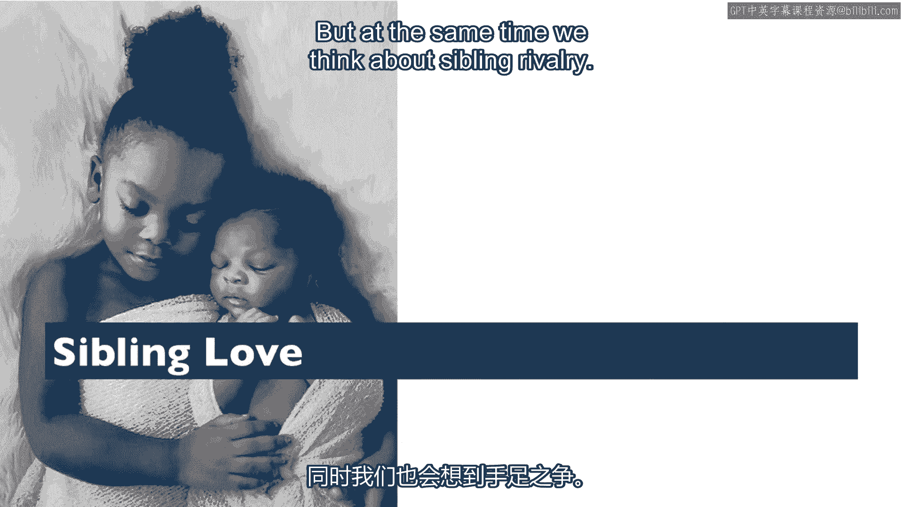
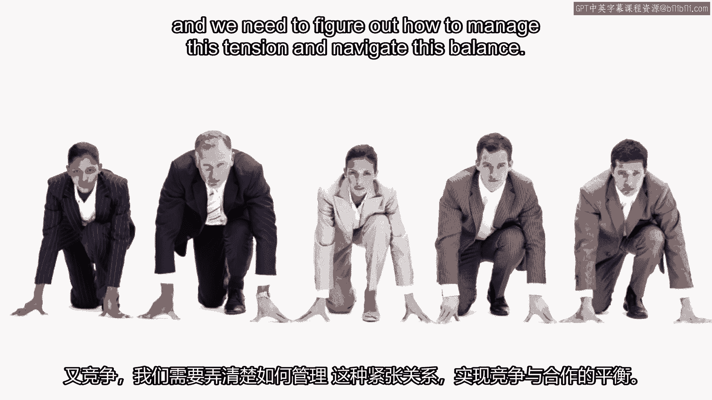

# 沃顿商学院《实现个人和职业成功》课程笔记 P29：合作与竞争的微妙界限 🤝⚔️

在本节课中，我们将探讨一个普遍存在于生活和工作中的核心议题：合作与竞争之间的动态关系。我们将看到，这两种看似对立的行为模式，其界限往往非常模糊，并且可以在同一段关系中同时存在。

## 概述：无处不在的张力

合作与竞争之间的界限出人意料地模糊。我们常常在同一场景、同一段关系中，同时体验到合作的需求与竞争的冲动。

## 从节日合作到购物竞争 🛍️

上一节我们提到了合作与竞争共存的普遍性，本节中我们来看看一个鲜明的节日案例。

感恩节在美国本是一个庆祝合作的节日，它纪念早期美洲殖民者与美洲原住民之间的历史性合作，也是一个家庭团聚、强调合作的时刻。

然而，紧随其后的“黑色星期五”购物季，却常常演变成激烈的竞争。人们为了抢购优惠商品，有时会引发冲突。例如在2008年，纽约州一家商店外，急于进店的顾客冲垮了员工组成的人链，甚至导致一人不幸死亡。

以下是“黑色星期五”期间可能出现的竞争行为示例：
*   人群拥挤推搡。
*   为争抢商品发生口角或肢体冲突。
*   在混乱中物品被偷窃。

这个例子清晰地展示了，在庆祝合作的节日氛围中，如何迅速滋生出激烈的竞争行为。

## 从战争对手到合作伙伴 🌏

如果说购物竞争是合作氛围中的小插曲，那么国际关系中的转变则更为戏剧性。上一节我们看到了节日中的转变，现在让我们将目光投向更大的舞台。

美国与日本在二战期间曾是激烈的竞争对手，冲突达到顶峰。但战争结束后，双方关系迅速转向合作。麦克阿瑟将军在日本推行了一系列促进合作的政策，例如禁止美国人殴打日本民众，甚至因日本食物短缺而禁止美国人食用日本食品。

双方通过合作重建工厂，关系持续发展，并在1960年签署了合作宣言。如今，日本民众对美国持有非常友好的态度。这完成了一个从**激烈竞争（战争）** 到**紧密合作（同盟）** 的显著转变。

## 亲密关系中的合作与竞争 👨‍👩‍👧

这种竞争与合作的动态不仅存在于国家或商场，也渗透在我们最亲密的关系中。上一节我们审视了宏观的国际关系，现在让我们回归微观的个人生活。

以养育子女为例。父母双方需要高度合作，共同抚养孩子。但与此同时，他们之间也可能存在竞争，例如竞争谁能多睡一会儿、谁去给孩子换尿布或喂奶。

即使在最需要合作的关系中，竞争也悄然存在。这说明了我们如何在合作与竞争之间不断切换和平衡。

## 兄弟姐妹：爱与 rivalry 👫

兄弟姐妹之间的关系是这种平衡的另一个绝佳例证。上一节探讨了伴侣关系，本节我们聚焦手足之情。

我们通常强调兄弟姐妹之间的爱。但与此同时，“手足竞争”也是一个广为人知的概念。

地松鼠的行为为我们提供了关于手足关系的深刻见解。当捕食者靠近时，地松鼠会发出尖叫声警告其他同类躲避。研究发现，当捕食者靠近自己的兄弟姐妹时，它们的叫声最为响亮。这展现了即使在动物界，也存在着深厚的“手足之爱”。

然而，手足之间的竞争也可能非常激烈。兄弟姐妹既是我们最亲密的朋友，有时也是我们争夺父母关注和资源时最直接的竞争对手。对于双胞胎而言，这种竞争甚至在子宫里就开始了，他们竞争养分和空间。

## 职场中的平衡艺术 💼

最后，我们将视角转向职场。在工作中，我们需要与同事合作，以实现共同的目标。

但同时，我们也在竞争认可、晋升和加薪的机会。

因此，无论是在家庭还是职场，我们都同时处于合作与竞争的状态中。关键在于学会管理这种张力，在两者之间找到平衡。

## 总结

本节课我们一起学习了合作与竞争之间微妙且动态的关系。我们看到，从节日购物、国际关系、家庭生活到职场环境，合作与竞争常常交织在一起，甚至在同一时刻、同一段关系中并存。理解这种普遍存在的张力，是有效管理人际关系、在个人和职业生活中取得成功的重要一步。核心在于认识到，**合作**与**竞争**并非永久对立，而是可以共存并需要智慧去平衡的两种基本互动模式。