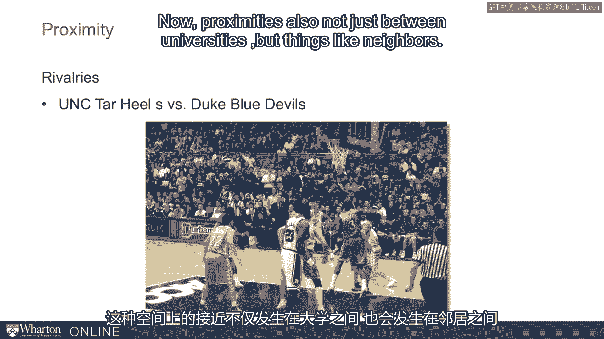
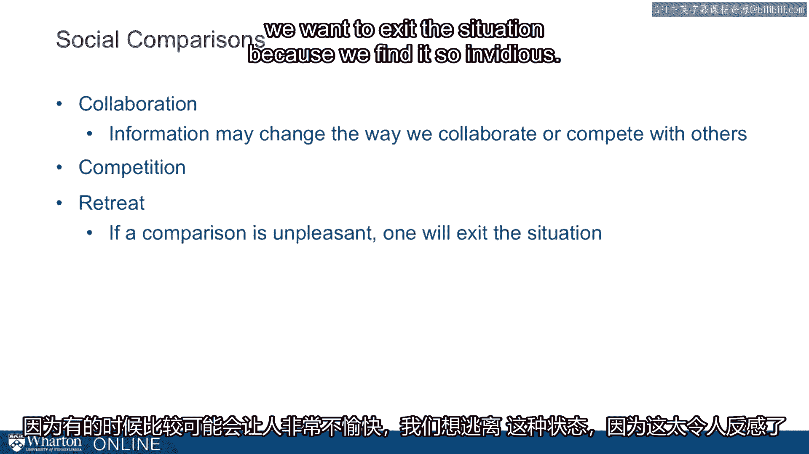

# 课程31：比较的机制 🔍

在本节课中，我们将探讨“比较”这一心理机制。我们将了解比较如何运作，它为何在我们的生活中如此重要，以及它如何影响我们的感受、动机和行为。通过理解比较的机制，我们能够解释一些有趣的社会现象。

---

上一节我们介绍了比较的主题，本节中我们来看看比较的具体运作方式。比较是我们理解世界的基本方式。它帮助我们判断一次假期是否愉快、一份薪水是否优厚、厨房是否需要翻新，或者是否需要购买新车。正是通过比较，我们为自己生活中的各种结果赋予意义。

以下是关于比较的几个关键特性。

首先，比较是不可避免的。所有人都会进行比较。虽然有些人可能比其他人更频繁地查看社交媒体，但所有人都倾向于进行比较。比较帮助我们理解事物，同时也驱动我们感觉更好、获得动力，或者感觉更糟。

比较的运作方式之一在于其方向性。我们有时会进行**向上比较**，即与那些比我们做得更好、拥有更豪华公寓或汽车的人比较。有时则会进行**向下比较**，即与那些成就不如我们的人比较。向上比较可以激励我们，也可能让我们痛苦。向下比较可以让我们感到满足和安心，但也可能削弱动力。

另一个关键点是，我们既可以与他人比较，也可以与自己比较。我们常常与他人比较，对象可能是邻居、姻亲或隔壁工位的同事。但我们也会进行**内部比较**，即思考自己过去的表现，或是与“本可以做到”的设想进行比较。因此，比较可分为**与他人比较**和**与自我比较**。

---

那么，在何时比较会变得最为强烈？研究发现，有三个维度会影响比较的强度。

第一个维度是**相似性**。我们指的是像兄弟姐妹这样的关系。最相似的兄弟姐妹是双胞胎，他们之间的比较会非常强烈。相似性越高，比较就越重要。这不仅仅限于兄弟姐妹，也可能是非常亲密的朋友，或是我们觉得与自己相似的同一群体的人，例如同班同学。相似性确实非常重要。

事实上，这种相似性有助于我们理解诸如肥胖传播等现象。准爸爸们即使没有生理原因也会增重，其中一个原因就是他们与身边最亲近的人进行比较。夫妻之间相互比较，这种比较影响了他们的动机。

从这些图表中我们可以看到，某些类型的比较影响最大。那些我们彼此都视对方为朋友的比较最为强烈。而且，我们倾向于与同性别的他人进行比较。**一个人与我们越相似，其比较产生的影响就越大**。实际上，我们可以通过社交网络中的友谊关系，看到这种比较机制如何解释肥胖的传播。当我们看到周围的人都去拿甜甜圈时，即使我认为自己不该吃更多，但如果其他人都这样做，或者这在我的比较圈子里看起来没问题，那么圈内每个人的行为都在影响我自己对“可接受行为”的判断。

出于某些原因，同学聚会或家庭聚会可能压力很大，因为在聚会上，我们会进行密集的比较。我们会见到那些很可能成为我们比较对象的人，他们来自相同的群体或家庭结构，起点可能相似，正是由于这种相似性，我们会进行比较。

第二个维度是**邻近性**。想想一些最激烈的竞争关系，例如北卡罗来纳大学教堂山分校和杜克大学之间的竞争。这两所学校仅相距九英里，都拥有强大的篮球队，这种激烈的竞争部分是由地理上的邻近性所激化的。

邻近性不仅存在于大学之间，也存在于像邻居这样的关系中。在电影《波拉特》的这句台词中，我们看到了激烈的邻里比较，人们来回攀比家中拥有的物品，直到他说：“哦，伟大的成功，当他终于得到邻居没有的东西时。” 这里我们看到了前两个维度：相似性和邻近性。

第三个使比较特别强烈的因素是**自我相关性**。自我相关性指的是我们关心的事物。如果我非常关心职业发展，那么谁获得了晋升就具有自我相关性。而我的邻居赢得了烘焙比赛，如果我不认为自己是个烘焙师，那就缺乏自我相关性，因此这种比较就不那么强烈。

所以，最强烈的比较发生在那些**相似**（如兄弟、同事、邻居、姻亲）、**邻近**（物理上非常接近我的人）以及**自我相关**（我真正关心的领域）的人之间。例如，如果我是音乐家，我会关心赢得音乐比赛；但如果我不是，我就不那么在意。

---

社会比较具有这些特征，并影响几种不同的行为。我们已经提到过其中一些。

首先是比较如何影响我们与他人的**合作**。当我们了解到某些信息时，可能会改变我们与他人合作或竞争的方式。如果我们发现别人赚得更多，可能会使合作变得更困难；或者我们发现别人的背景与我们截然不同，这可能使合作更容易，并缓解我们原本可能进行的激烈比较。因此，比较可以使我们合作或竞争。

但比较也可能导致我们完全**退出**。有时比较会令人非常不愉快，以至于我们想要退出当前情境，因为我们觉得它充满了恶意的攀比。

---

**本节课总结**

在本节课中，我们一起学习了比较的心理机制。我们了解到比较是帮助我们理解世界、评估自身处境的基本方式。比较具有方向性（向上/向下）和对象性（与他人/与自我）。比较的强度受**相似性**、**邻近性**和**自我相关性**三个维度的影响。最后，我们看到比较会影响我们的社会行为，包括合作、竞争，有时甚至会导致退出。理解这些机制，有助于我们更理性地看待自己与他人的关系，并管理比较带来的情绪影响。