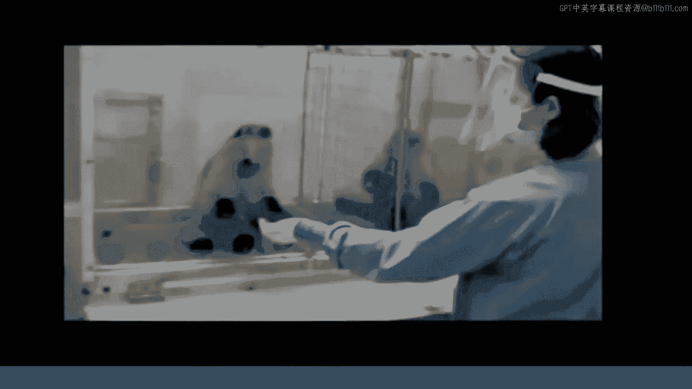
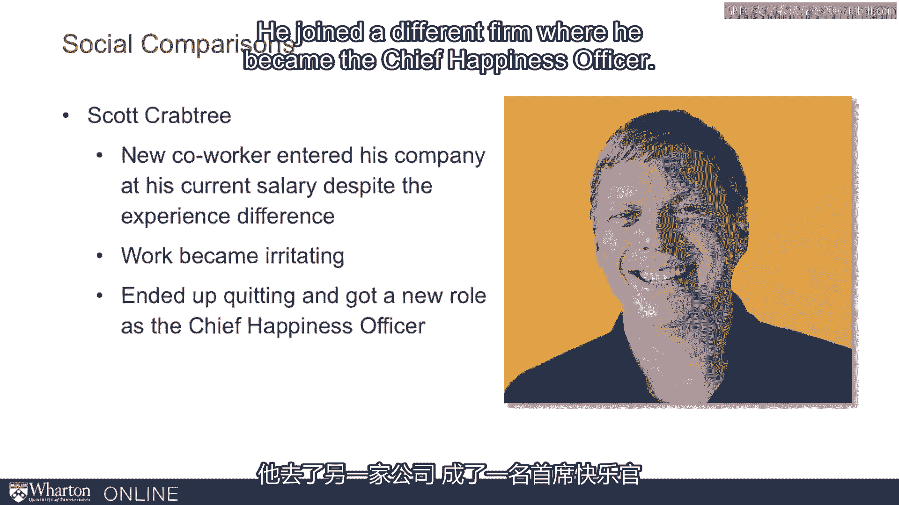
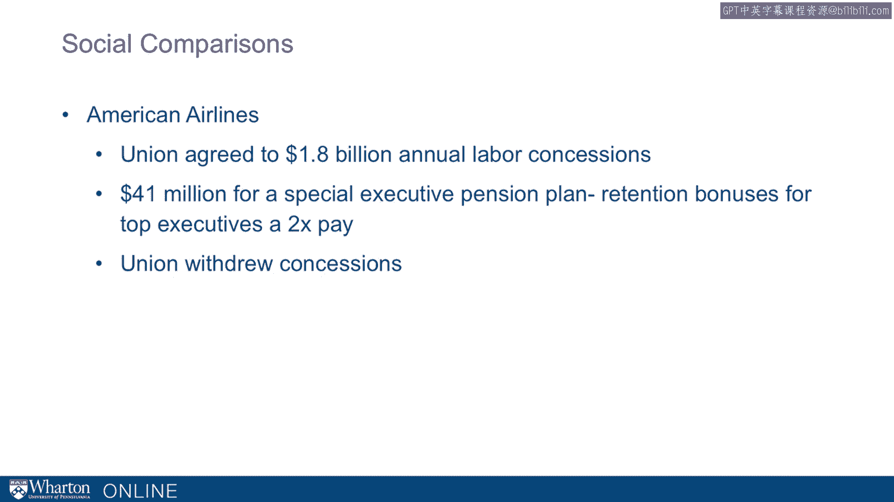
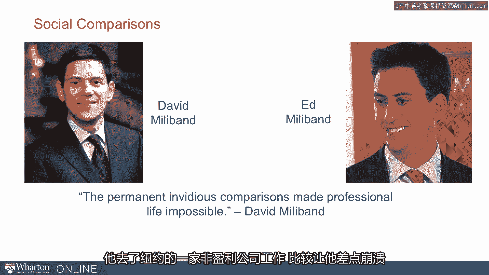
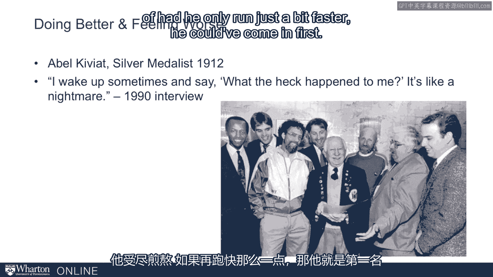
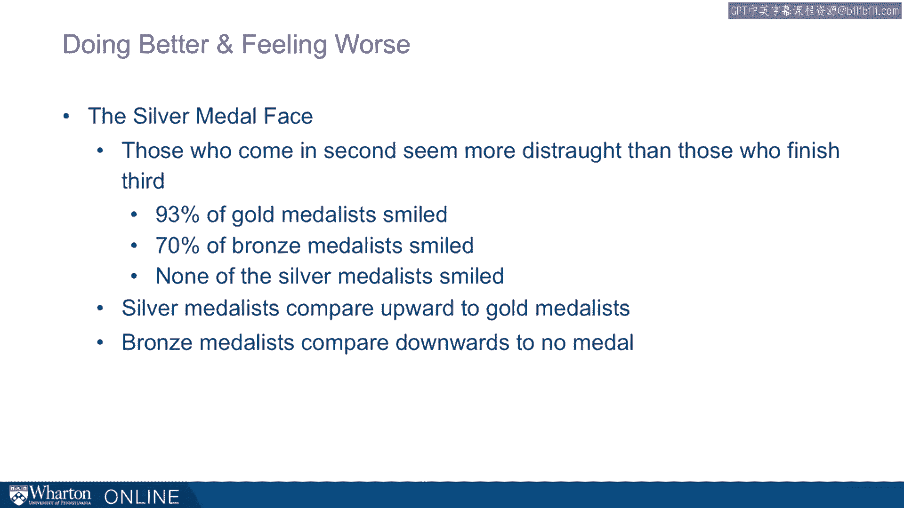

# 课程 P32：向上比较带来的痛苦 😖

在本节课中，我们将探讨社会比较的阴暗面。虽然比较有时能激励我们，但它也可能带来痛苦和不满。我们将通过动物实验、职场案例、政治竞争和体育赛事等多个例子，来理解“向上比较”如何影响我们的情绪与决策。

---

## 比较的负面影响

上一节我们讨论了比较的激励作用，本节中我们来看看比较可能带来的不良后果。研究表明，比较不仅限于人类，它深深植根于我们的生物本能中。

弗朗斯·德瓦尔进行了一项著名研究，他教会卷尾猴用石头作为“货币”来交换食物。

以下是实验的基本流程：
1.  实验人员伸出手，猴子递给他一块石头。
2.  作为回报，猴子得到一片黄瓜。
3.  猴子们起初很乐意进行这项交易。

然而，当一只猴子看到隔壁笼子的同伴用同样的石头换到了更美味的葡萄时，情况发生了变化。我们通过一段视频可以观察到三个关键点。

关于这段视频，我想强调三点：
*   第一，得到黄瓜的猴子会极度专注地观察隔壁获得葡萄的邻居。
*   第二，这只猴子会变得非常沮丧。
*   第三，这种情绪会驱使它退出交易，扔掉黄瓜，不再参与。

交易的价值变得完全相对。仅仅因为其他猴子得到了更好的待遇，原本可以接受的交易就变得无法忍受了。这不仅仅是猴子的特性，我认为我们天生就爱进行比较，而这些比较深刻地影响着我们。

---

## 职场中的比较痛苦

这种比较效应同样发生在人类职场中。以斯科特·克拉布特里为例，他在一家科技公司工作，原本对自己的工作非常满意并充满动力。

直到公司从市场上招聘了一位新的明星员工。这位新员工的起薪几乎与他多年奋斗才达到的薪资水平相同。突然间，他的工作变得令人烦躁，他为此感到非常沮丧。最终，他选择了辞职，加入另一家公司，并成为了那里的“首席幸福官”。

就像卷尾猴一样，当斯科特·克拉布特里意识到别人得到了看似更好的待遇时，他选择了离开，去别处寻找幸福。

---

## 组织层面的比较冲突

这种现象不仅发生在个人身上，也发生在群体中。多年前，美国航空公司面临严峻的财务危机，濒临破产。

公司管理层与飞行员、空乘人员、行李搬运工和机械师等工会进行了艰苦的谈判，并成功让工会同意了高达**18亿美元**的让步。

与此同时，为了留住可能跳槽到更稳定公司的高管，公司向他们提供了**4100万美元**的留任奖金。在证券交易委员会的文件披露截止日期后，这一信息被公之于众。

就在工会同意大幅让步后，他们得知管理团队将获得留任奖金。可以想象，就像卷尾猴一样，他们变得怒不可遏。

在得知有人获得奖金之前，让步是可以接受的。工会的第一反应是解雇了他们的谈判代表，并撤回了这些让步，迫使公司回到谈判桌重新协商。

那么问题来了：一块石头值一片黄瓜吗？18亿美元的让步合理吗？我的薪水公平吗？对于所有这些问题，答案都是：这取决于比较。我们的答案由我们所做的比较来决定。

---

## 亲密关系中的比较煎熬

让我们将目光转向英国，看看米利班德兄弟——大卫和埃德。他们是两兄弟，一起长大，后来都成为了英国国会议员。

当戈登·布朗卸任工党领袖时，两人都角逐这一职位。哥哥大卫首先宣布参选，并得到了15名议员的支持，他似乎是获胜的热门人选。

随着投票进行，大卫一直保持微弱优势。但要获胜，需要获得超过50%的绝对多数票。在只剩他们两人的第四轮投票中，埃德突然胜出。

关于此事有两点需要注意：一是胜选优势非常微弱，另一种结果的可能性非常明显；二是他们是兄弟，而对大卫更糟糕的是，获胜的是弟弟。

最终，他们的关系破裂。大卫谈到，这种持续不断的、令人反感的比较使他的职业生活无法继续。他不仅离开了议会，甚至离开了英国，前往纽约的一个非营利组织工作。这种比较把他逼疯了。

---

## “人造双胞胎”的警示

基于类似的原因，我们可以思考“双胞胎”的情况。有人可能会想，什么是“人造双胞胎”？“人造双胞胎”是指收养一个与亲生子女年龄相仿的孩子。

这样做的好处可能是有一个现成的玩伴，存在规模经济，比如共用一辆车接送，去同一所学校，参加同一个足球队。这听起来很棒。

然而，收养专家萨姆（后续会加入讨论）反对这种做法，因为它会引发具有腐蚀性的社会比较。这样做总会导致其中一个“双胞胎”在某些方面领先于另一个。

可能存在发育差异，而这种持续的比较会使“人造双胞胎”的关系变得非常有害。因此，许多收养机构不仅建议，甚至几乎禁止收养“人造双胞胎”。

---

## 表现更好，感觉更糟

现在让我们思考另一种现象：做得更好，但感觉更糟。这怎么可能发生？同样，比较将帮助我们解开这个谜题。

让我们想想阿贝尔·基维亚特。他是1912年奥运会的银牌得主。

那届奥运会首次使用终点摄影来判定获胜者。他以0.1秒之差获得了第二名。

在近80年后的1990年的一次采访中，他谈到自己醒来时还在想究竟发生了什么。他感到痛苦萎靡，并且强烈地反事实思考：如果他当时跑得再快一点点，他本可以……

……获得第一名。事实证明，这种强烈的感受并非阿贝尔独有。实际上，银牌得主普遍且持续地表达不满，这一现象非常显著。

几篇学术文章研究了这一点。研究发现，银牌得主看起来非常痛苦、不快乐。相比之下，铜牌得主最终看起来比银牌得主快乐得多。

在这类研究中，几乎所有的金牌得主都在微笑，铜牌得主微笑的频率稍低一些。但在这些研究中，**没有**一个银牌得主在微笑。

如果你思考这些比较：
*   像阿贝尔这样的银牌得主，是将自己与金牌得主比较，那本来可以好得多。
*   当比较银牌和铜牌时，它们有些相似。
*   但对于铜牌得主，银牌比较接近，这种向上比较的差距不大。但与第四名相比，那是一个鸿沟——那就只是运动员，而不是奖牌得主。因此，铜牌得主很高兴逃脱了那种命运。

于是，我们在这些奖牌得主身上看到了“做得更好，感觉更糟”的现象，银牌得主常常痛苦不堪。

---

## 总结

本节课中，我们一起学习了社会比较，特别是“向上比较”所带来的痛苦。我们从卷尾猴实验看到比较如何引发不公感；从职场案例看到它如何摧毁工作满意度；从组织谈判看到它如何破坏合作；从兄弟竞争看到它如何撕裂亲密关系；最后从奥运奖牌得主看到，即使取得了卓越成就，不当的比较也可能导致深深的失落感。

重要的启示在于：比较可以驱动和激励我们，但也可能让我们陷入痛苦。理解比较的力量，有助于我们更理性地看待自身处境，管理情绪，并做出更明智的决策。