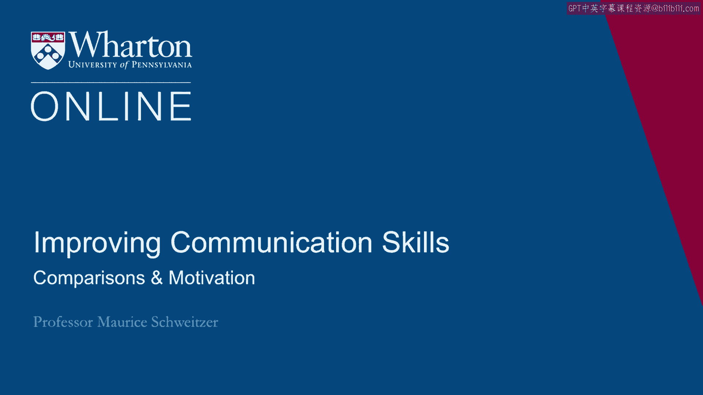
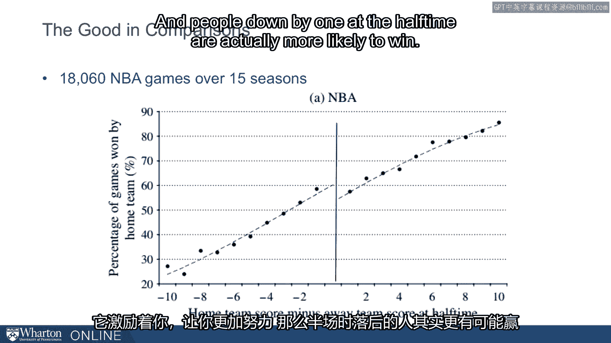
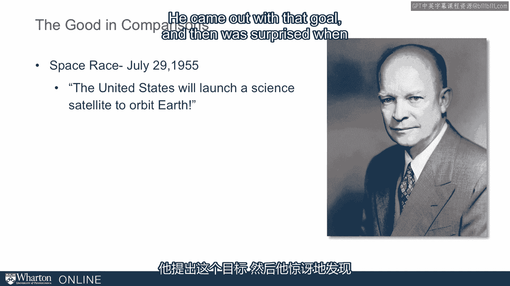
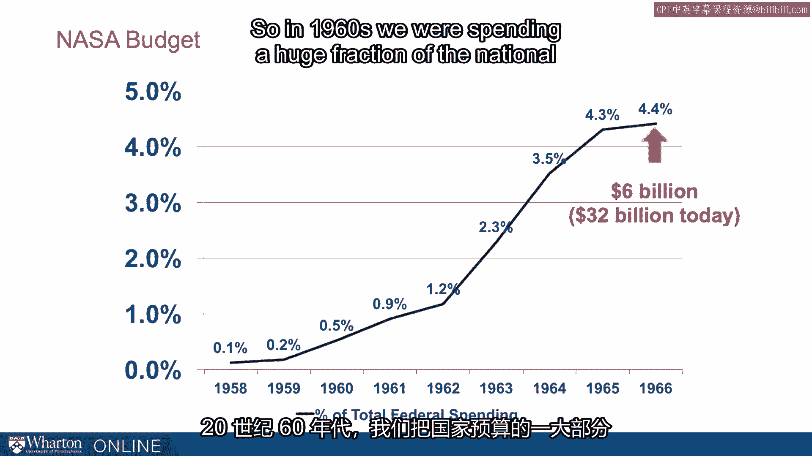
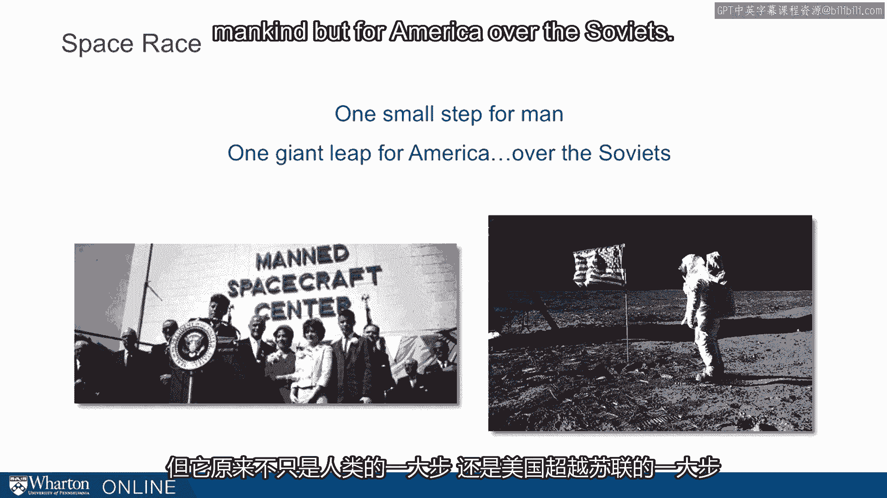
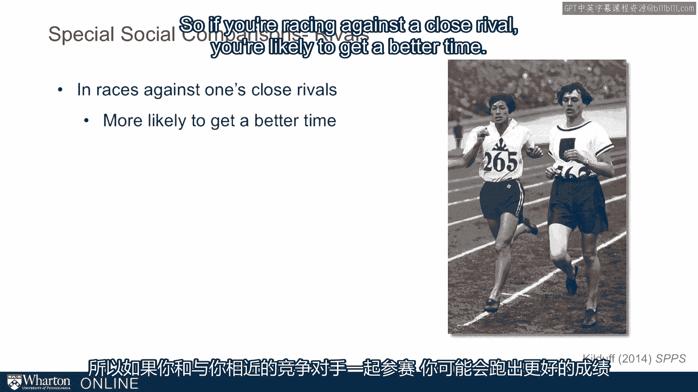
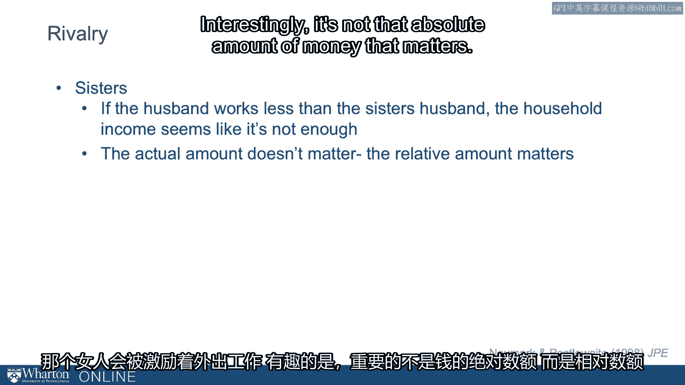

# 课程33：比较与动机 🆚🚀

在本节课中，我们将探讨社会比较如何影响我们的动机，并带来积极的结果。我们将通过体育竞赛、太空竞赛以及日常生活中的例子，来理解比较如何激发人们的努力和成就。

---

上一节我们介绍了社会比较的概念，本节中我们来看看比较如何成为强大的动力来源。

比较能带来积极和建设性的结果。从一个关于杜克大学对阵密歇根大学的篮球赛故事开始。杜克队在半场时落后一分。可以想象更衣室里发生的情景，以及教练可能进行的激励讲话。杜克队在下半场爆发，将一场势均力敌的比赛变成了一场大胜。

这种现象并非个例。乔纳·伯杰和德诺文特·波普分析了超过18,000场NBA比赛，发现了一个不连续点：半场时仅落后一分的球队，实际上更有可能赢得比赛。通常，如果一支球队半场时大比分领先，这能预测最终胜负。但当你仅落后一点点时，情况就不同了。这种微小的差距会通过比较激发你的动机，增加努力程度，从而使半场落后一分的球队更可能获胜。

---

我们发现，这种现象不仅存在于体育领域，在全球舞台上也能看到。回想20世纪50年代的太空竞赛。1955年7月，艾森豪威尔宣布美国将发射一颗科学卫星环绕地球。然而，美国惊讶地发现，自己并非第一个发射卫星的国家，苏联才是。美苏之间展开了太空竞赛，苏联率先发射了斯普特尼克号卫星。

这场“斯普特尼克危机”的影响持续了数十年。美国感觉自己落后了，需要迎头赶上。这种比较激发了一场惊人的政府行动：出台了《国防教育法案》，设立了奖学金，成立了高级研究计划局（ARPA）和美国国家航空航天局（NASA），并投入了巨额资金。仅NASA的预算就飞速增长，在当时达到60亿美元（相当于今天的320亿美元）。在20世纪60年代，国家预算中有很大一部分专门用于太空项目。

很难说投入多少资金才算合适，但我们当时明确知道自己落后了。与苏联的比较——他们先于我们发射了环绕地球的卫星——激励了我们，并在一场动机竞赛中挑战我们取得了伟大成就。因此，“个人的一小步，却是人类的一大步”也可以被重新解读为，这是美国在太空领域超越苏联的巨大飞跃。

---

社会比较在许多情况下都很重要，但在竞争对手关系中尤为突出。竞争对手是一种特殊的比较对象，我们与之存在额外的心理竞争。战胜竞争对手带来的满足感是战胜其他人无法比拟的。事实上，加文·基尔达夫研究了跑步比赛中的竞争对手关系，分析了大量案例，发现当跑者与竞争对手同场竞技时，他们会跑得更快。

以下是竞争对手关系激发动机的核心表现：
*   如果你与一个实力接近的对手比赛，你更有可能取得更好的成绩。

这种现象不仅存在于跑步中，也出现在许多不同情境。对于篮球迷来说，拉里·伯德与魔术师约翰逊的 rivalry（竞争关系）就是一个经典例子。拉里·伯德曾说：“我每天早上做的第一件事，就是查看魔术师的技术统计。我不关心别的。”这是一种对竞争对手的强烈关注。

我之前也提到过北卡罗来纳大学焦油踵队和杜克大学蓝魔队这对竞争对手。它们地理位置接近，都曾赢得全国冠军。要赢得全国冠军，需要很多条件：优秀的教练、出色的球员，还需要强大的动机。我们看到在1992年杜克夺冠，1993年北卡夺冠。如果只发生一次，可能只是巧合。但同样的情况在2009年再次上演：北卡夺冠，次年杜克夺冠。由此可见，竞争对手能极大地相互激励。

这种现象也出现在各种人际关系中。一项关于姐妹的研究发现，如果一对姐妹中，一人在外工作，另一人留守家庭，那么促使女性外出工作的一个驱动因素，是她们丈夫的收入与其姐妹丈夫收入的比较。研究发现，如果丈夫的收入低于姐妹的丈夫，这个家庭会感到收入不足，从而激励该女性外出工作。有趣的是，起作用的**不是收入的绝对数额，而是相对数额**。

---

**核心公式/概念**：
*   **动机激发**：`微小劣势 + 社会比较 → 努力增加 → 更高成功率`
*   **相对性驱动**：影响行为的往往**不是绝对水平**，而是**相对位置**。

---

本节课中我们一起学习了社会比较如何作为一种强大的建设性动机。我们看到，无论是在体育比赛、国家竞争还是个人生活中，意识到自己处于微小的劣势或与可比的对手竞争，都能显著激发努力，从而带来更好的表现和成就。然而，需要思考的是，并非所有由比较产生的动机都是有益的。我们将在下一节探讨比较可能带来的其他影响。

