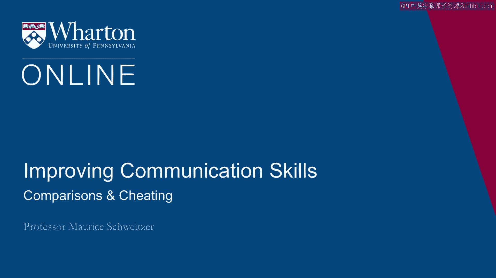

# 沃顿商学院《实现个人和职业成功》课程笔记 P34：比较与作弊 🆚🚫

在本节课中，我们将探讨社会比较可能带来的一个阴暗面：它不仅会影响我们的情绪，还可能诱使我们做出不道德的行为，即“作弊”。我们将通过多个领域的实例来理解这一现象。

---

上一节我们讨论了比较如何影响我们的幸福感。本节中我们来看看，比较如何可能驱使我们做出不当行为。

事实证明，比较不仅会让我们感到痛苦，还可能激励我们做出一些本不该做的行为。

让我们思考两位滑冰运动员的例子：南希·克里根（1992年奥运会铜牌得主）和坦雅·哈丁（唯一在比赛中完成三周半跳的美国选手）。两人为争夺美国奥运代表队席位而激烈竞争。她们都训练得非常刻苦，但一件可怕的事情发生了。

这件事被称为“响彻世界的一击”。一名男子在南希·克里根训练后接近她，用一根棍子猛击她的膝盖，导致她数周无法训练。后来发现，袭击者并非陌生人，而是坦雅·哈丁雇来伤害南希·克里根的人。

因此，她们的竞争不仅体现在更加努力训练上，还体现在试图将对手拉下马。这表明，比较可能激发不道德的行为。

---

让我们谈谈另一个领域的竞争。这是维珍航空和英国航空公司之间的竞争。英航投入巨资支持“伦敦眼”项目，而维珍的老板理查德·布兰森则花钱让一艘飞艇飞过伦敦上空，上面写着“BA can‘t get it up”（英航硬不起来），以此来嘲弄英航。

这场竞争最终不仅升级为口水战和破坏性竞争，英航甚至入侵维珍的电脑系统，查看其预订信息，试图通过不道德的手段挖走客户，这最终给英航带来了真正的麻烦。

这种现象广泛存在。亚当·加林斯基等人对职业足球 rivalry（竞争）的研究发现，在分析比赛时——包括在不同城市以及在同一城市（即两支球队都是主场球队）的比赛——同城德比由于地理位置接近，往往是最激烈的竞争。在这些比赛中，他们发现了更多黄牌和红牌，这是不道德行为的衡量指标。

---

以下是另一个更贴近学术界的例子。学术界人士努力发表论文，但发表过程漫长。在此期间，我们可以将论文上传到网络，有些网站会追踪论文的下载次数。高下载量通常意味着论文很重要。事实上，许多同行会查看论文的下载频率，以判断是否值得阅读和关注，并将其作为衡量重要性的指标。

但有趣的是，这个衡量标准有时可以被操纵。例如，你可以下载自己的论文。事实上，有些教授甚至编写程序来反复下载自己的文章。那么，谁会这么做呢？

比较心理帮助我们理解这一点。当你的同行拥有很高的下载量时，这实际上是一个重要因素，它决定了你下载自己论文的诱惑和可能性有多大。此外，一些参照点和目标也很重要：如果你接近进入“下载量前十”，这也更可能推动人们从事这种行为。

---

我们可以更广泛地思考这个问题。这是一个关于朗达的故事。她从公司一群看似很有前途的员工中被选中，一位经理安排她参加额外课程，发展她的计算机技能，她被培养以备晋升。这恰恰是公司应该做的：寻找有潜力的人并培养他们晋升。

但这里存在一个比较问题。她的同事们环顾四周，进行了社会比较，并且他们不喜欢这种比较结果。他们开始排挤她，不邀请她参加聚会，不向她传递信息。结果，朗达的工作受到了影响，这使她更难成功，也让她的处境更不愉快。

这就好比成为“月度最佳员工”，却没人愿意与之交谈。在某些情况下，像朗达这样的人可能会因此松懈下来，减少投入，因为他们不想成为那个“老师的宠儿”、“月度最佳员工”或被选中的员工。因此，当你思考这些比较过程时，它们实际上可能侵蚀我们原本希望达成的积极行为。

---

综上所述，本节课我们一起学习了社会比较的另一面。它告诉我们，比较不仅会让我们痛苦，还可能增加作弊和不道德行为的发生。无论是体育竞争、商业斗争、学术环境还是职场晋升，不当的比较都可能引发破坏性的后果，损害个人、团队乃至组织的利益。认识到这一点，对于管理个人心态和构建健康的竞争环境至关重要。