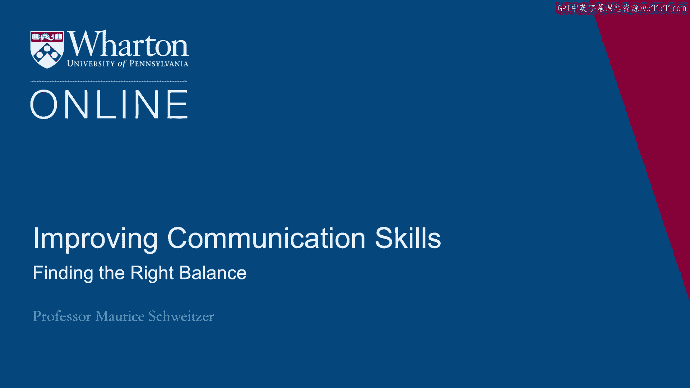
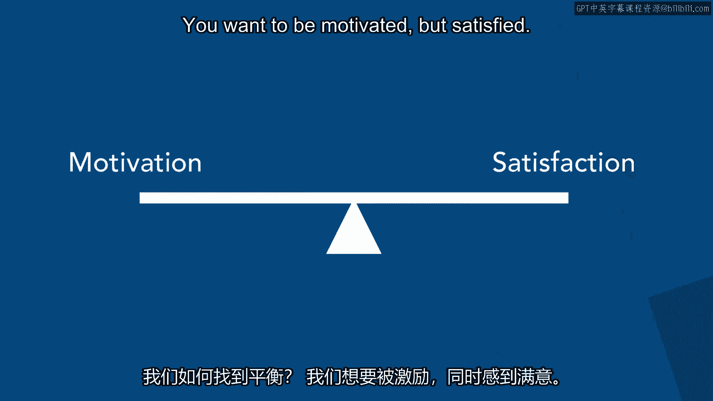
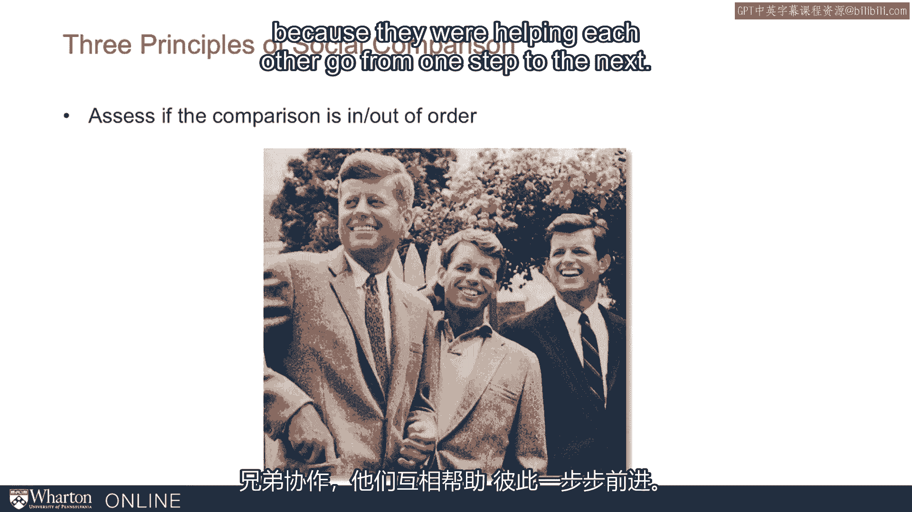
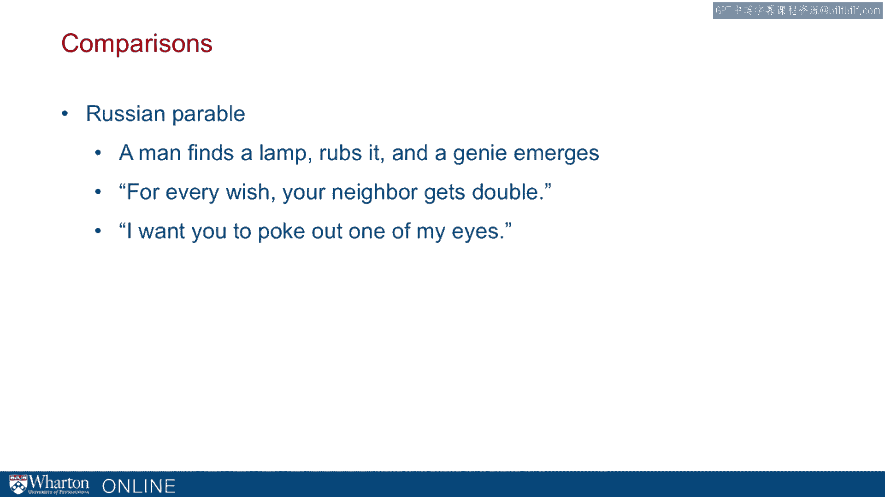

# 沃顿商学院《实现个人和职业成功》课程笔记 P35：7_找到比较的平衡点 👥⚖️

在本节课中，我们将探讨社会比较的“双刃剑”效应，并学习如何找到平衡点，使其既能激励我们前进，又不至于让我们陷入痛苦与不满。

我们已经思考了社会比较的一些机制，以及它带来的好处和坏处。现在的问题是，我们如何找到正确的平衡点？

我们知道，比较可以激励我们，这具有建设性，但它也可能滋生怨恨，让我们非常痛苦。我们如何找到平衡？我们既想被激励，又想感到满足。

以下是几个关键原则。

## 一、利用比较的两种方向

我们可以通过两种方向的比较来达到不同目的。

**1. 向下比较（有利比较）**
向下比较是指与那些成就不如我们的人进行比较。例如，通过志愿服务或帮助有需要的人，我们会感到更快乐。因此，进行向下比较是让自己更快乐的一种方式。

**2. 向上比较（不利比较）**
不利的比较可以激励我们。就像密歇根大学与杜克大学的篮球赛，半场落后一分可以极大地激励球队；或者像苏联发射斯普特尼克卫星的例子，这种不利的比较能推动我们付出巨大努力，达到新的高度。

因此，有利的比较让我们更快乐，不利的比较激励我们。但两者也可能带来负面影响，比如让我们不满或丧失动力。

## 二、谈判中的比较策略

在谈判过程中，比较既能激励我们，也影响我们的满意度。我们可以通过调整关注点来利用这一点。

在谈判中，你可能有**目标价**（你希望达到的理想价格）和**保留价**（你愿意接受的最低价格）。大多数时候，我们无法得到想要的一切。结果通常会落在目标价和保留价之间。

*   **关注目标价**：我们会更有动力去争取，但最终结果若未达标，满意度会较低。
*   **关注保留价**：我们动力可能不足，但最终结果只要优于保留价，就会更满意。

亚当·格林斯基及其同事的研究证实了这一点：关注目标价的人最终表现更好，但满意度更低；关注保留价的人表现稍逊，但满意度更高。

因此，我们可以策略性地运用比较：**在谈判过程中，关注目标价以保持动力；在谈判结束后，转而关注保留价以提高满意度。** 这样，我们就能同时获得高动力和高满意度，这需要我们主动转移注意力。

## 三、比较的广泛影响：以经济衰退期毕业为例

比较的影响不仅限于谈判，它更广泛地存在于生活中。这里有一个有趣的悖论：在经济衰退期毕业可能有好处。

在经济衰退期毕业，找工作更难，即使找到，薪酬也可能更低。研究表明，这种负面影响是长期的。但好处是什么？事实证明，在衰退期找到工作的人实际上更快乐，尽管他们的收入可能低15%。这是因为比较：他们为自己找到了工作而庆幸，并且意识到许多同龄人处境更糟。

这个例子说明，比较能帮助我们理解许多不寻常的现象，无论是在谈判、职场还是更广泛的生活中。

## 四、有效管理社会比较的三个核心原则

为了找到比较的平衡点，我们需要关注以下三个关键原则。

**1. 遵循“顺序”**
“顺序”是指比较结果是否符合预期的先后次序。例如，在兄弟姐妹或竞争对手之间，是否存在一个公认的“理应”领先的顺序？
*   **违反顺序**：例如，弟弟埃德·米利班德在政治上超越了哥哥戴维，这可能引发紧张关系。
*   **遵循顺序**：例如，肯尼迪家族的兄弟们按长幼顺序在政坛发展，相互协作。再如网球界的威廉姆斯姐妹，姐姐维纳斯先取得成功，随后妹妹塞雷娜才超越她。塞雷娜曾说，成长过程中一切以维纳斯为中心“本就该如此”。这种遵循顺序的比较，让她们即使后来成就悬殊，也能保持良好关系，并成为史上最成功的女双组合之一（双打决赛21胜1负，共享三枚奥运金牌）。

因此，让比较“按顺序”进行，是使其发挥积极作用的关键。

**2. 提供未来的竞争机会**
如果竞争是“一次性”的，没有未来翻盘的机会，那么失败带来的痛苦会特别强烈。例如，对许多奥运选手来说，四年一届的奥运会可能就是唯一的机会。短跑名将阿萨法·鲍威尔从未赢得奥运金牌，而那次失利后他可能再无机会。如果我们知道未来还有竞争机会，比较带来的压力就会减轻。

**3. 理解他人的视角**
当我们遇到好事时，我们通常很开心，周围的人也会祝贺我们。但他们内心真的为我们高兴吗？可能未必。比较心理非常普遍且强烈，甚至跨越文化。

一个俄罗斯寓言生动地说明了这一点：一个人发现神灯，灯神答应实现他任何愿望，但条件是**他的邻居会得到双倍**。这个人深思熟虑后说：“我知道要什么了——请你弄瞎我一只眼睛。”

这个寓言揭示了比较过程的强烈与有害性：此人如此担心邻居会通过比较过得更好，以至于宁愿自己受损也要破坏对方的优势。因此，即使好事发生在我们身上，也要认识到他人会进行比较，他们的真实感受可能不如表面上看起来那么愉快。

---

**本节课总结**
本节课我们一起学习了如何在社会比较中找到平衡点。我们了解到：
1.  向下比较能提升幸福感，向上比较能提供动力。
2.  在谈判等情境中，可以通过在过程中关注目标（以获得动力）、在结束后关注底线（以获得满足）来策略性地运用比较。
3.  比较广泛影响我们的感知，例如能解释“衰退期毕业悖论”。
4.  有效管理比较需遵循三个原则：尽量让比较“按顺序”发生、为自己和他人保留未来的竞争机会、以及理解并接纳他人因比较可能产生的复杂心理。

掌握这些原则，能帮助我们更好地驾驭社会比较，使其服务于我们的个人成长与幸福，而非成为痛苦的源泉。