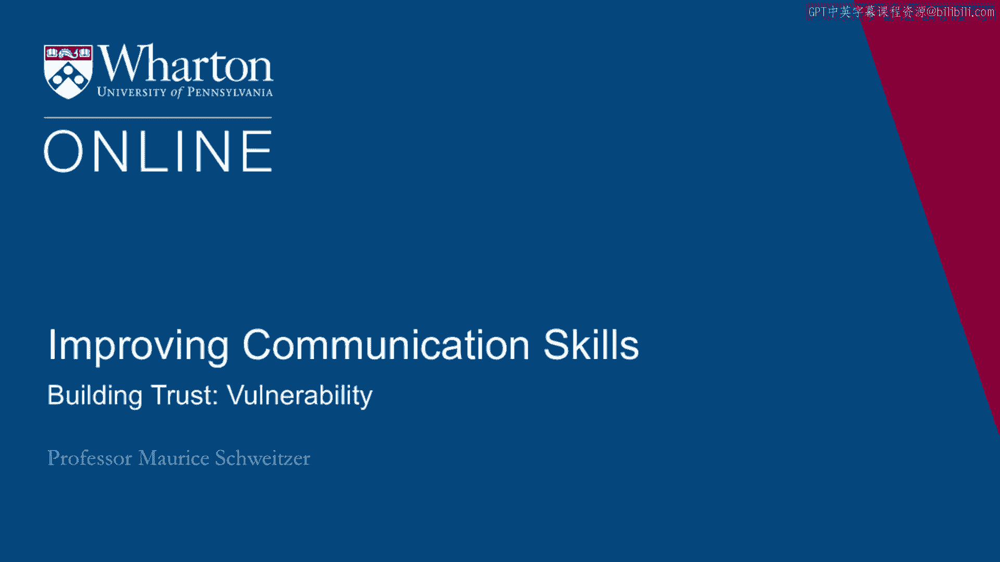
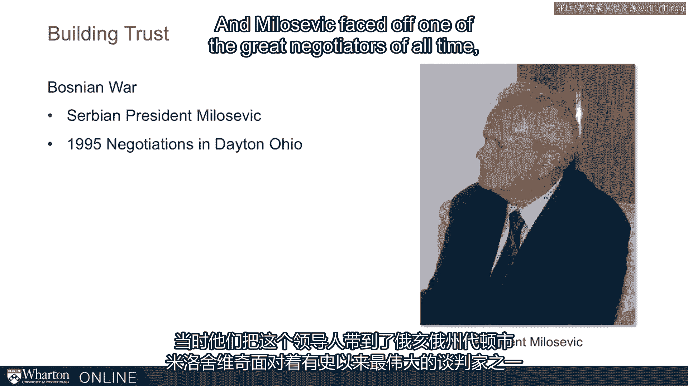
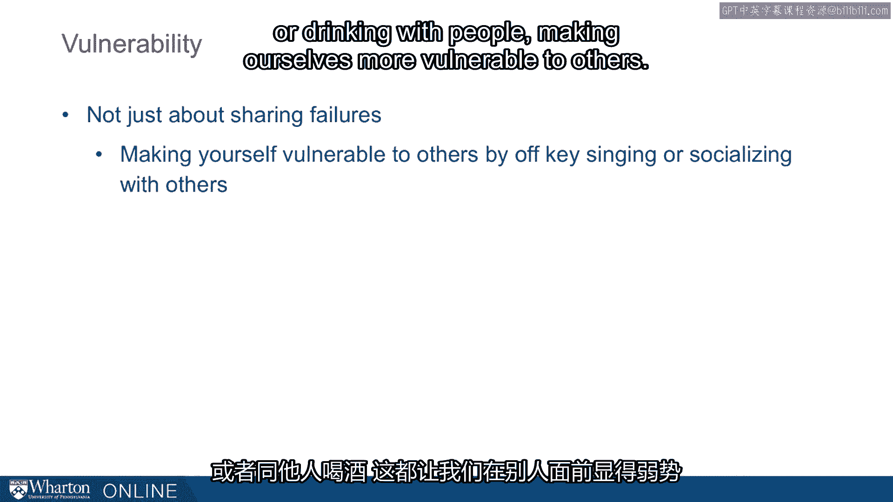
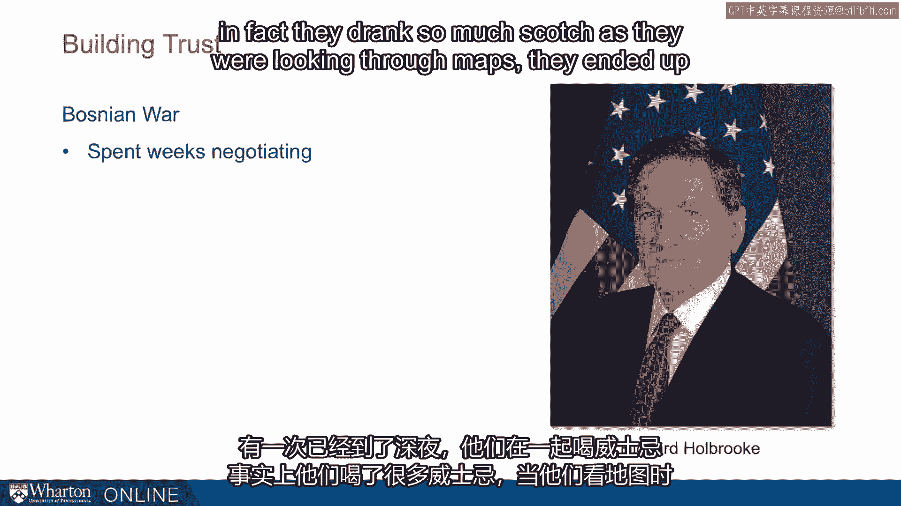
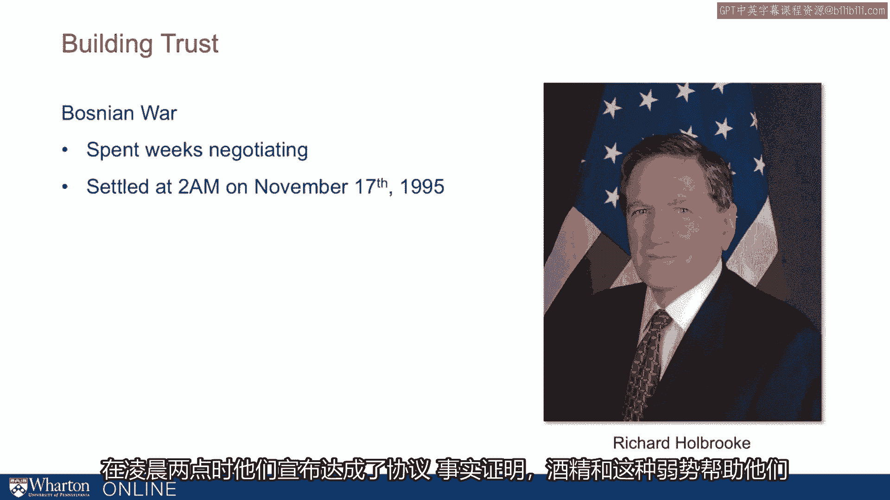
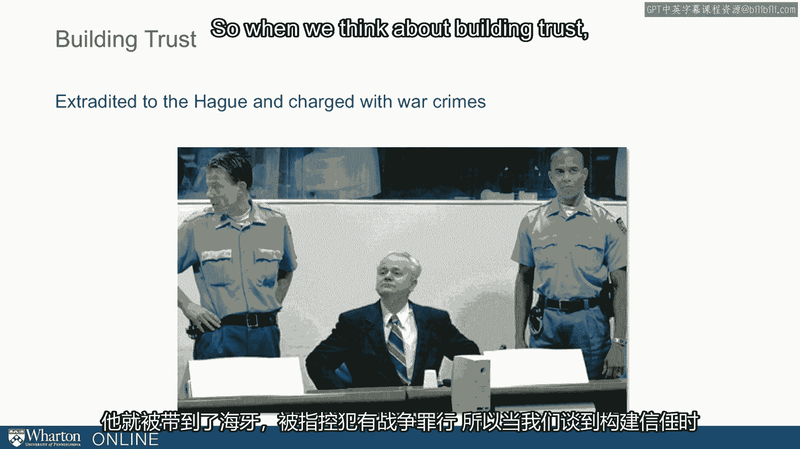
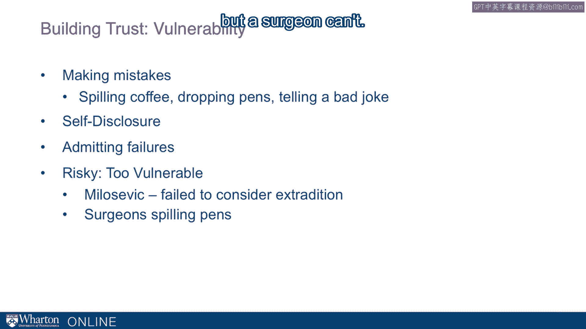
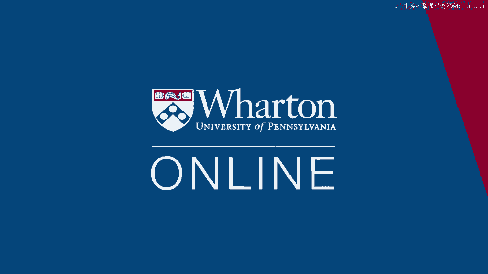

# 沃顿商学院《实现个人和职业成功》课程笔记 P37：9_建立信任-脆弱性 🧩

在本节课中，我们将要学习建立信任的一个关键要素：**脆弱性**。我们常常认为，信任是脆弱性的前提，但研究表明，主动展现脆弱性恰恰是**建立信任**的重要途径。我们将通过实例和心理学研究，探讨如何恰当地展现脆弱性以增强人际关系中的信任。

---

## 脆弱性与信任的关系

我们通常认为，只有在信任某人之后，我们才会愿意展现脆弱的一面。但事实恰恰相反。

**主动展现脆弱性，是实际建立信任的关键成分之一。**

我将从一个不被信任、且难以建立信任的例子开始。伊丽莎白·帕特拉基斯在婚礼前几天，被要求签署一份婚前协议。她的丈夫拥有大量房地产资产，而协议保证她婚后每年可获得2.5万美元。用她的话说，这份婚前协议如鲠在喉，这也是导致她离婚的原因之一。在这个案例中，婚前协议**展示了低信任度**，代表了一种**缺乏脆弱性**的状态，而这正是建立信任的障碍。

事实证明，我们可以主动让自己变得更脆弱，当我们这样做时，反而能够建立起信任。

---

## 通过“出丑效应”展现脆弱性

上一节我们介绍了脆弱性的概念，本节中我们来看看一种具体的实践方法：“出丑效应”。

一种实现方式是**通过“出丑”**。例如，不小心打翻咖啡或散落钢笔，这类小失误会让我们显得更温暖、更平易近人。当然，这需要与能力相平衡。这里有一个问题：你更信任谁？是打翻咖啡的人，还是从不打翻咖啡的人？

我们可能会想，为什么要信任一个表现出较低能力的人？研究表明，通过打翻咖啡，我们展现了一种人性、谦逊和脆弱，这能让我们更讨人喜欢。事实上，这正是几十年前针对准备知识竞赛的学生所做的一项研究。其中重要的转折点是：**那个表现出高能力（答对问题）、然后打翻咖啡的人，是最受欢迎的**。如果你能力一般，那么打翻咖啡并无太大帮助。

精神科医生就面临这个确切的问题。他们需要在极短的时间内走进房间，赢得他人的信任，让对方吐露内心最深处的秘密。而为了让他人吐露秘密，事实证明，如果医生在开始时打翻咖啡、散落钢笔或讲一个糟糕的笑话，会更有帮助。这种温暖的展示，正是人们试图做的事情，无论是奥巴马养狗、罗恩·克莱恩谈论他的儿子，还是我们普通人犯一些小错误或进行自我披露。

---

## 扩展脆弱性的形式

脆弱性不仅关乎分享失败，也可以通过其他方式实现。

例如，在卡拉OK中跑调唱歌，或与他人一起喝酒，都能让我们在他人面前变得更脆弱。接下来，我将在一个更严肃的背景下讨论喝酒。

这将把我们带到波黑战争时期，米洛舍维奇正处于战争之中，美国努力试图谈判达成和平。他们将主要领导人带到俄亥俄州代顿，米洛舍维奇面对的是有史以来最伟大的谈判者之一——理查德·霍尔布鲁克。

霍尔布鲁克进行了谈判，他们谈判了数周，直到深夜，他们喝着苏格兰威士忌。事实上，他们喝了如此多的威士忌，以至于在查看地图划分前南斯拉夫时，他们将其中一条走廊命名为“威士忌之路”。

他们宣布找到了这条路——“威士忌之路”，不久后的清晨，他们宣布达成了协议。

事实证明，这种酒精带来的脆弱性，帮助他们弥合了分歧，获得了信任，从而达成了协议。但这也有弊端。米洛舍维奇当时并未充分考虑所有后果，不久之后，他被带到海牙，因战争罪被起诉。

---

## 实践脆弱性的要点与风险

当我们思考如何建立信任时，脆弱性确实非常重要。

以下是展现脆弱性的几种方式及其核心要点：

*   **通过小失误展现**：例如打翻咖啡或散落钢笔，来展示脆弱性。
*   **通过自我披露或承认失败**：这也是一种有效方式。

然而，展现脆弱性也存在风险。当我们展示脆弱性时，可能会像米洛舍维奇一样，没有充分考虑所有应该考虑的后果。你需要注意，确保不以损害你信誉的方式展示脆弱性或进行自我披露。

因此，**一个精神科医生可以散落钢笔并说“我手一直不太巧”，但一个外科医生却不能这样做。**

---

## 总结

本节课中我们一起学习了**脆弱性在建立信任中的核心作用**。关键点在于：主动、恰当地展现脆弱性（如通过无伤大雅的小错误、适度的自我披露）可以显著增强你的亲和力与可信度，尤其是在你已具备一定能力的基础上。但同时必须注意平衡，避免因过度或不恰当的脆弱性展示而损害自身的专业信誉。建立信任是一个微妙的过程，而**有策略的脆弱性**是其中强大的工具之一。