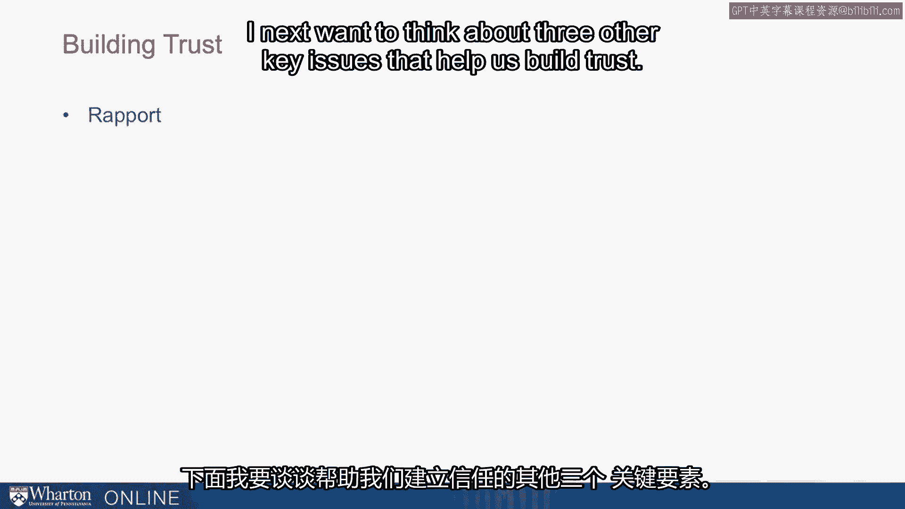
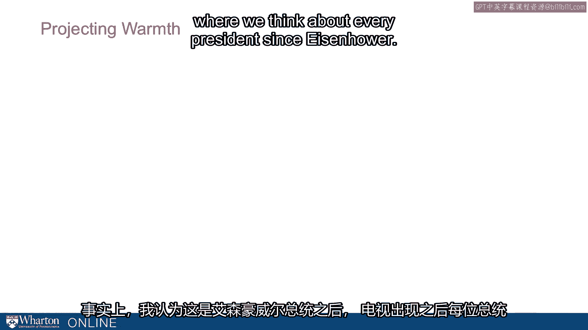
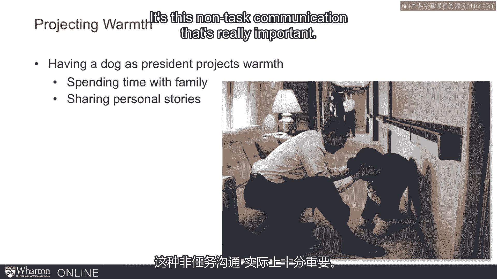
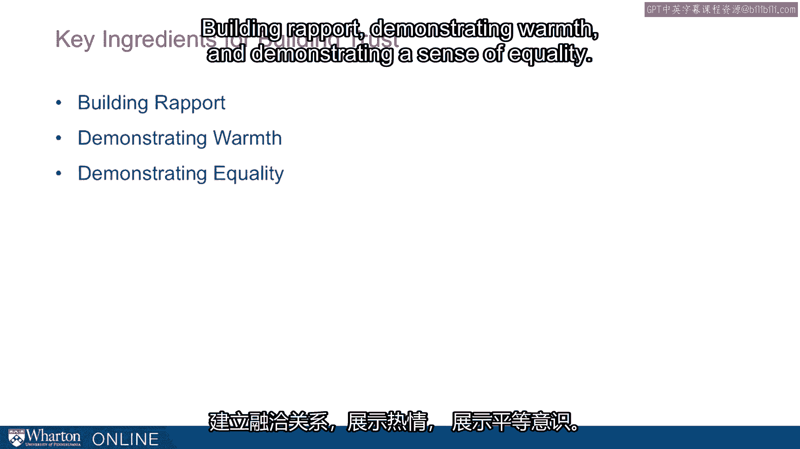

# 沃顿商学院《实现个人和职业成功》课程笔记 P38：建立信任的三大要素 🏗️

在本节课中，我们将要学习建立信任的三个关键要素：**和谐**、**温暖**和**平等**。信任是人际交往和职业成功的基石，理解并运用这些要素，能有效提升我们的沟通能力和影响力。

---

## 1. 建立和谐 🤝

上一节我们介绍了信任的重要性，本节中我们来看看如何通过建立和谐来培养信任。和谐是指通过非任务性的交流，与他人建立一种友好、融洽的关系。

马歇尔·弗兰克侦探曾面临一个挑战：他需要在30分钟内让谋杀嫌疑人保罗·罗尔斯认罪。他知道，认罪意味着漫长的监禁，嫌疑人绝不会轻易开口。然而，弗兰克侦探成功了。他的关键策略就是建立和谐。

他是如何做到的呢？他并没有直接审问谋杀案，而是像对待朋友一样对待嫌疑人。他坐得很近，身体前倾，在30分钟里大部分时间都在聊家庭生活等普通话题。这种“交朋友”式的非任务沟通，营造了一种友谊和信任感，最终促使罗尔斯吐露了所有信息。

以下是建立和谐的几个具体方法：
*   **进行非任务沟通**：在切入正题前，先聊聊本地新闻、家庭、朋友、爱好或最近的体育赛事。
*   **共享经历**：一起用餐，或共同参加活动（如观看体育比赛）。
*   **使用恰当的称呼**：正确使用对方的名字，甚至使用昵称。
*   **寻找共同点**：发现共同的兴趣爱好或经历。

这些行为能有效拉近彼此距离，为后续的任务沟通铺平道路。

---

## 2. 展现温暖 ❤️

建立了初步的和谐关系后，展现温暖是深化信任的下一步。温暖关乎情感连接，它向他人传递出关心和善意。

让我们看一个政治选举的例子。在佛罗里达州第22选区的竞选中，政治新人罗恩·克莱恩挑战已连任13届的克莱·肖。克莱恩精通政策，能力出众，但他面临一个挑战：选民认为他**能干但冷漠**。

他的顾问团队发现，当克莱恩谈论政策时显得能干，但缺乏温度，无法与选民建立情感连接。在一次模拟电视采访后，顾问指出他全程没有微笑。他们发现，只有当克莱恩谈论自己的儿子和家庭时，整个人才会“亮起来”。

因此，他们调整了策略：让克莱恩在公开演讲时，先从谈论家庭和儿子开始，再自然过渡到政策议题。这样一来，他既展现了能力，又传递了温暖，变得更具亲和力，也赢得了更多信任。

展现温暖的方式多种多样：
*   **分享个人故事**：谈论家人、朋友或宠物。
*   **表达关心**：对他人表现出善意和关怀。
*   **参与志愿活动**：将时间投入到公益事业中。
*   **注意非语言信号**：保持微笑和开放的姿态。

一个有趣的例子是，自艾森豪威尔以来，几乎每一位美国总统在入住白宫时都会养一只狗。这并非巧合，对于已经通过竞选证明能力的总统而言，养狗能有效投射出**温暖**和亲和力，弥补公众对高位者可能存在的“冷漠”印象。

---

## 3. 体现平等 ⚖️

在展现了温暖之后，体现平等是巩固信任的最后一个关键环节。平等意味着尊重对方，不强调地位差异，将彼此视为合作伙伴。

守时就是一个体现平等的简单而有力的行为。准时赴约表明“我的时间并不比你的时间更宝贵”，这传递出尊重和善意。

除此之外，我们还可以通过以下方式传达平等感：
*   **注意物理空间**：不坐在更高的椅子上，避免制造居高临下的感觉。
*   **淡化差异**：不刻意强调身份、地位或背景的不同。
*   **穿着得体**：在适当场合，穿着与对方或环境相似的服装。

当我们不仅关心他人，还能以平等的方式对待他们时，信任就更容易建立和维持。

---

## 总结 📝

本节课中我们一起学习了建立信任的三大核心要素。

首先，通过**非任务沟通**和寻找共同点来**建立和谐**，为互动创造友好氛围。

其次，通过分享个人故事、表达关怀来**展现温暖**，建立情感连接。

最后，通过守时、尊重对方来**体现平等**，将彼此视为伙伴。

将这三点结合起来——**和谐、温暖、平等**——就是构建坚实信任关系的关键配方。掌握并实践这些原则，将极大地助力你的个人与职业成功。