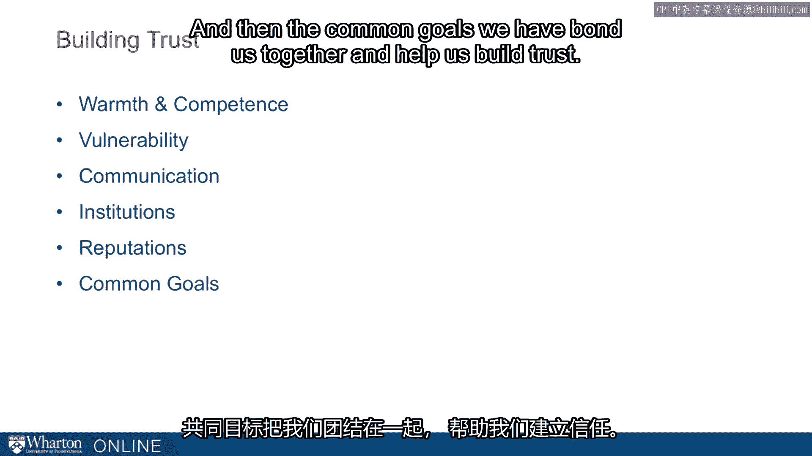

# 沃顿商学院课程《实现个人和职业成功》第39课：建立信任的基石 🧱

在本节课中，我们将探讨建立信任的几个核心要素，特别是相互依存、共同目标和共同敌人如何深刻地影响我们与他人之间的信任关系。理解这些概念，能帮助我们在个人和职业生活中更有效地建立和维护信任。

---

## 共同目标的深远影响 🎯

共同目标在建立信任的过程中扮演着极其重要的角色。它能够将人们紧密地联系在一起。

上一节我们提到了共同目标的重要性，本节中我们来看看这种影响的部分来源——相互依存。

### 相互依存的力量

这种影响部分源于**相互依存**。当我们彼此依赖时，最终会建立起信任。

以下是关于群体认同如何影响信任的研究发现：

*   在20世纪70年代，Tajfel 发现了一个有趣的现象：即使在实验中仅仅将人们**名义上**地分配到蓝组或红组，仅仅称呼他们为“红组”或“蓝组”，就会导致人们更偏爱自己的群体，并且比信任外群体成员更信任自己群体的成员。
*   这种现象的深刻之处在于：如果我们用这种**名义上的群体**（即你成为红组成员仅五分钟，且这个身份没有任何特殊意义）做实验都能产生如此效果，那么可以想象，当我们以**部落**、**宗教**或**国家**来思考群体归属时，其影响会有多深。
*   我们所属的群体深刻地影响着我们如何对待群体内成员和群体外的人。Tae Cohen 的一些杰出研究考察了群体内的忠诚度，结果发现，我们对群体成员越忠诚，就越能接受针对外群体的**战争和暴力行为**。

这揭示了我们对“自己人”和“外人”的划分与认同，其影响是根本性的。

---

## 共同敌人的凝聚作用 ⚔️

上一节我们探讨了群体认同，本节中我们来看看什么因素可以影响我们对群体成员身份的认知，其中一个关键因素是**共同敌人**。

一件事可以影响我们如何看待自己的群体成员身份，那就是**共同敌人**。当我们拥有共同目标时，它们会将我们绑定在一起，而在实现这一点上，没有什么比一个**共同敌人**的效果更显著。

以下是共同敌人如何重塑国际关系的例子：

*   我们看到在9/11事件后，巴基斯坦和美国的关系变得前所未有的紧密。这两个之前并未很好结盟的国家，之后在安全问题上开始了极其密切的协调。
*   不仅仅是这两个国家，想想俄罗斯和法国在中东遭遇袭击后，它们如何改变了互动动态。
*   我们在现代政治中看到这种现象，但它在历史上也长期存在。

---

## 历史案例：动态变化的联盟 🤝

为了更具体地说明共同敌人如何塑造联盟，让我们来看一个历史案例。

例如，美国的成立就深受这种群体意识的影响。最初在**法国-印第安人战争**中，英国人与法国人作战，英国利用殖民者来对抗法国。这是殖民者第一次真正协同行动，而英国人最终训练了所有殖民者，包括一个名叫**乔治·华盛顿**的人。在这里，乔治·华盛顿实际上是在与法国人作战。

然而，动态在短短几年后的**美国独立战争**中完全改变。乔治·华盛顿再次将殖民者作为一个集体（那个殖民者群体）凝聚起来，他们共同对抗英国人。那么是谁帮助了他们呢？法国人立刻加入了，因为法国人非常渴望与英国人作战。

因此，我们看到了竞争的流沙性质，我们思考群体以及群体间不断变化的联盟，其中一个深刻的观点是：**共同敌人**可以帮助我们找到**超级目标**，而这些**超级目标**正是将我们驱动到一起的力量。

---

## 超级目标与信任建设 🏆

所以，我们可以思考与某个外部竞争者、某个外部敌人竞争，或者思考我们需要共同应对的事情，比如为我们的组织解决一个问题，或者共同解决一个环境问题。这些**超级目标**在帮助我们建立信任方面被证明是极其重要的。

---

## 本章总结：信任的构建模块 📦

总而言之，我想回顾一下信任的构建模块。在整个这个模块中，我们思考了：

1.  **温暖与能力**：我们希望展现出高度的温暖和高的能力。
2.  **展现脆弱性**：如果我们已经展示了能力，那么展现脆弱性可以帮助我们展示温暖。
3.  **沟通过程**：沟通过程非常重要。
4.  **对制度的信任**：我们可以信任制度，这在某些情况下可以替代对个人的信任。例如，如果我们不那么信任某个人，我们可能会更信任我们签署的**合同**。
5.  **声誉的作用**：声誉帮助我们解决了许多关键问题。我们过去认为**流言**是建立声誉的工具，但现在我们认为**在线声誉**极其重要。
6.  **共同目标**：我们拥有的共同目标将我们联结在一起，并帮助我们建立信任。

[空白音频]

---

**本节课中，我们一起学习了**建立信任的多个维度。我们了解到，除了个人特质如温暖与能力，相互依存的关系、能够凝聚群体的共同目标与共同敌人，以及制度、声誉等外部因素，都是构建稳固信任关系不可或缺的基石。理解并运用这些原理，将极大地助力你的人际关系与职业发展。