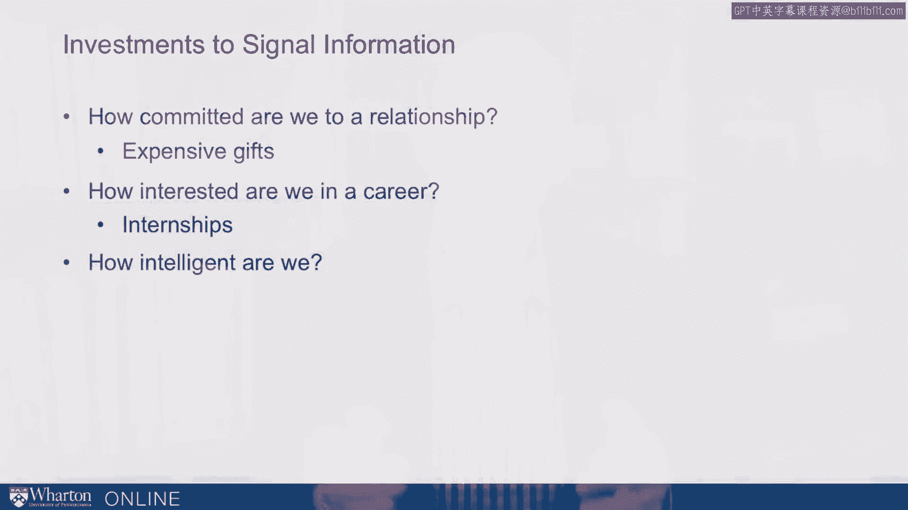

# 课程13：传递信任的信号 📡

在本节课中，我们将探讨一个核心问题：我们是否应该信任他人发出的信号？我们将学习如何识别可信的信号，以及如何向他人传递值得信任的信号。

人们经常互相传递信息。我们为何有时不信任他人发出的信息？我们又该如何发出让他人信任的信息？关键在于，我们需要传递那些**无法直接观察的信息**，例如：
*   你对这段关系的承诺度有多高？
*   这位求职者对该职业的兴趣有多大？
*   这位合作伙伴是否真的确信产品会成功？

我们试图做出这些判断，试图信任他人，因此常常需要依赖这些不可观察特质的**信号**。

---

## 理解信号的两个关键维度

上一节我们提出了核心问题，本节中我们来看看如何分析信号。我认为可以从两个关键维度来思考信号：**清晰度**与**效力**。

*   **清晰度**：信号可以非常明确，让人一目了然。
*   **效力**：指传递这种不可观察信息的方式，对某些人来说是否**成本过高**，而对另一些人来说是否**相对容易**。

例如，用一打红玫瑰来表达关心，这个信号很**清晰**，大家都明白其含义。但它的**效力**如何？假设我并非真正在意这段关系，只是追求短期目标，我仍然买得起一打红玫瑰。答案是：通常可以。有时这些信号的成本并不高。因此，在检验信号时，我们需要仔细思考其**效力**。

---

## 信号的效力：成本是关键

以下是关于如何通过高成本信号来建立信任的一些思路。

### 1. 承诺于关系 💍
要表明对一段关系的承诺，**昂贵的礼物**可以解决这个问题。在人际关系中，我们似乎也解决了这个问题。玫瑰不错，但珠宝更好。如果我们真的致力于一段关系，我们有一个绝佳的选择：**钻石戒指**。

请注意其中的精妙之处：我们花费大量金钱，并且有一些经验法则来决定应该花多少钱。通常，某人赚得越多，就应该在那枚戒指上花费更多。这意味着，它应该“足够让人心疼”。它昂贵且有成本，并且资源越多的人，其成本应该越高。

因此，昂贵的礼物可以帮助我们解决“是否应该信任某人的意图”和“他们是否真的对这段关系投入”的问题。请注意，**成本**才是真正重要的，因为我们把钱花在了钻石戒指那些难以观察的特性上。例如，钻石的切割完美度未经训练很难用肉眼评估，但我们关心这些，正是因为其成本。

### 2. 承诺于职业 🎓
如何判断一个人对某个职业的投入程度？如何判断他们是否有兴趣在我的公司工作？

如果他们愿意接受**无薪实习**，或者愿意在研究生阶段（本就没几个暑假）花费一个暑假，他们就是在以一种昂贵的方式投资于那段职业关系——如果他们并非真正投入，这样做成本就太高了。

请注意，有时人们为面试做准备，比如阅读五篇关于公司的文章，为面试做好充分准备。这是一个**清晰**的兴趣信号，但不是一个**强有力**的信号。花费时间实习才是一个强有力的信号。

### 3. 证明智力 🧠
我们如何证明自己聪明？事实证明，有一个成本高昂的信号：**高等教育**。

我们投资于教育，以此作为我们聪明的信号。如果我们不够聪明，进行这样的投资（观看所有视频、阅读所有书籍、参加所有考试）将会非常困难。这对某些类型的人来说成本太高，而对那些能够负担并从中获益发送此信号的人来说，成本则相对较低。

### 4. 确信产品成功 ✅
如何表示对产品成功的信心？**担保或保修**有助于传递这种信号。

---

## 发送与接收信号的指南

当我们发送信息时，应专注于**清晰度**：这条信息是否传递了正确的意图？例如，你出现时带着一打廉价玫瑰，这可能无法传递非常明确的信息。我们需要仔细思考信息的清晰度：接收者是否能理解其含义？

其次，要关注**效力**。当人们向我们发送信息时，他们发送的是昂贵的信号吗？举个例子，我的一位朋友在公司工作周年纪念日时，收到了一篮鲜花，附言写道：“我们关心你和你的贡献，我们真的重视你所做的一切。”一周后，他被解雇了。这家公司负担得起发送像花篮附言那样的信息吗？我的答案是：当然，即使他们并非真心实意，他们也负担得起。

因此，有时我们可以发送效力不强的信息，而作为接收者，我们应该检验其效力。

以下是具体指南：

*   **作为发送者**：发送**清晰**的信号。
*   **作为接收者**：信任**强有力**的信号。

效力可以体现在**时间**和**金钱**上。如果某人时间有限（例如CEO的午餐邀约次数有限），那么与你共进午餐或在圣诞节给你打电话，都是在消耗有限的**时间预算**。我们可以从时间和金钱两个方面来思考信号的效力。

但**清晰度**和**效力**是两个最关键维度：发送信号时尤其要关注**清晰度**，接收信号时尤其要关注**效力**。

---

## 总结

本节课中，我们一起学习了如何理解和运用“信任的信号”。我们了解到，可信的信号需要具备**清晰度**与**效力**两个维度。作为信息的发送方，我们应努力使信号明确易懂；作为接收方，我们则应重点考察信号背后的成本（如时间、金钱投入），以判断其真实性和可信度。掌握这两个维度，能帮助我们在个人与职业交往中更有效地建立信任。