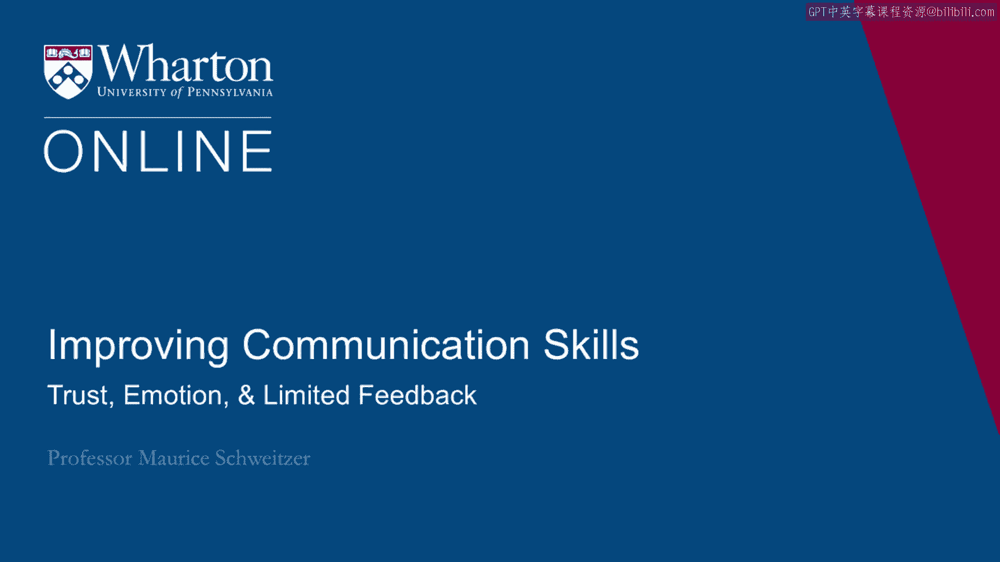

# 沃顿商学院课程笔记 P42：信任、情感与有限反馈 👥💡

在本节课中，我们将探讨信任建立过程中的两个关键因素：情感的作用与有限反馈的挑战。我们将了解情感如何影响我们的信任判断，以及为何在信息不完整时，我们的评估可能产生偏差。

---

## 情感对信任的影响 😊😠

上一节我们讨论了信任的基础。本节中，我们来看看情感如何塑造我们对他人可信度的判断。

我们的感受通常是一个复杂的“总结性统计量”，它整合了多方面的信息。例如，当评估一位候选人时，我们会综合考量其能力、技能匹配度、团队融合度等多个维度，最终常归结为一个感觉：“我对这个人感觉如何？” 信任决策也高度依赖这种感受。

研究表明，影响信任的情感可分为两类：
*   **相关情感**：由信任情境本身直接引发。例如，对方的背叛行为导致你感到愤怒，从而不再信任他。这种情感对信任的影响是直接且合理的。
*   **附带情感**：由与当前情境无关的事件引发。例如，上班前收到罚单或与伴侣争吵，随后在与同事的互动中，这种愤怒情绪可能会“渗透”进来，使你更不信任对方。反之，来自其他事情的好心情也可能让你过度信任。

关键在于，我们的即时感受不仅受当下事件影响，也受先前经历左右。因此，对于不熟悉的新伙伴或潜在客户，我们的信任判断是即时构建的，相对不稳定，容易受到附带情感的干扰。

**核心概念**：`信任判断 = f(相关情感， 附带情感)`

这意味着我们需要警惕：当自己情绪波动时（无论是好是坏），对陌生人的信任判断可能不够客观。

---

## 如何管理情感对信任判断的干扰 🧘‍♂️

既然我们知道了情感的影响，那么如何应对呢？以下是两个策略：

1.  **最佳策略：择时沟通**
    如果你察觉到对方（如老板或新客户）正因为其他事情心烦意乱，最好的办法是让时间过去，另择时机再进行重要讨论。

2.  **次优策略：引导归因**
    如果无法推迟，可以尝试引导对方正确归因。你可以说：“我知道您对（某件其他事）的结果感到失望，我希望这不会影响我们对当前情况的判断。” 明确承认并指出这种附带情感的存在，可以有效削弱它对当前判断的影响。

---

## 应该信任谁？内疚倾向是关键 🔍

上一部分我们探讨了情感如何影响“我们是否信任”。现在，我们转向另一个问题：**“我们应该信任谁？”** 这里涉及一种特定的情感——内疚感。

研究表明，最值得信任的人是那些**内疚倾向高**的人。即，那些在犯错（即使无人知晓）时，会感到强烈内疚、对他人有高度责任感、并因让他人失望而难受的人。

评估内疚倾向，可以询问类似问题：
*   描述一次你在工作中犯错的经历。
*   发生时你感觉如何？
*   你采取了什么行动？
*   你从中学到了什么？

通过回答，你可以判断对方是否具备内疚倾向的特质。**内疚倾向高的人最值得信赖，而内疚倾向低的人则需要谨慎对待。**

---

## 有限反馈的陷阱与策略性行为 🕵️♂️

在信任他人时，我们常面临一个挑战：无法时刻监督对方。这就引出了“有限反馈”的问题。

人们的行为往往具有策略性：
*   当知道被观察或评估时，他们会表现出模范行为。
*   当确信不会被观察时，则可能松懈怠慢（内疚倾向低者尤其如此）。

问题在于，作为观察者，我们容易过分依赖自己亲眼所见的行为片段。例如，一位老板每次回到办公室都看到员工在努力工作，他便会越来越相信他们是勤奋的。但他可能忽略了当他不在时员工的表现。

**核心概念**：`观察到的行为 = 真实行为 × 策略性调整因子`

如果我们的观察是有限的、且能被对方预知的，那么据此建立的信任可能严重偏离事实。我们可能会错误地高度信任那些善于在关键时刻“表演”的策略型人士。

因此，在依据有限反馈做判断时，我们必须考虑到他人行为的策略性，并意识到有限的观察可能将我们引向错误的方向。

---

## 总结 📝

本节课我们一起学习了信任构建中两个深层议题：
1.  **情感的作用**：我们的信任判断深受相关情感和附带情感的影响，对于新建立的关系尤其需要警惕情绪干扰。
2.  **有限反馈的挑战**：由于人们会根据是否被观察而调整行为，仅依靠有限的、可被预知的观察片段来建立信任，可能导致误判。识别并信任内疚倾向高的人，是应对这一挑战的更可靠方法。

理解这些机制，能帮助我们在个人与职业关系中，做出更明智、更稳健的信任决策。