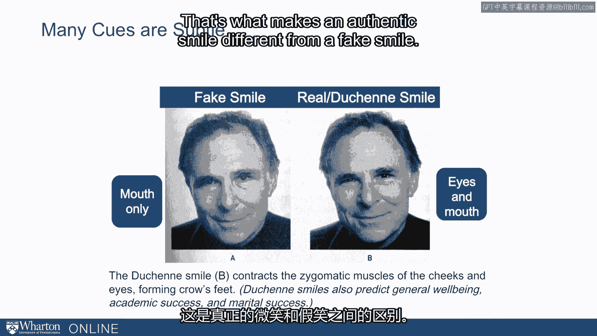
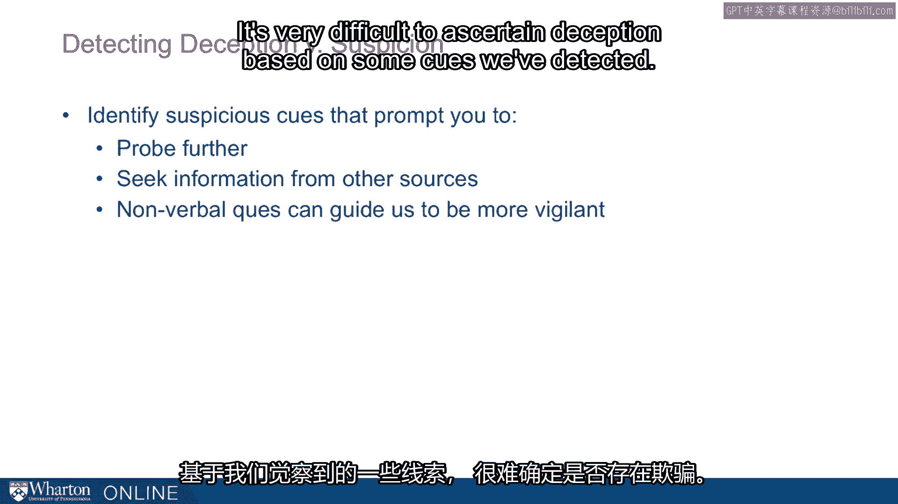

# 课程44：侦测欺骗的挑战 🕵️

在本节课中，我们将探讨侦测欺骗行为所面临的现实挑战。我们会了解为何人们通常不擅长识别谎言，分析导致这种情况的心理原因，并学习一些有助于提高我们警觉性的策略。

---

## 概述

侦测欺骗行为是一个真正的挑战。这个挑战之所以存在，主要是因为我们在大多数情况下并不擅长识别谎言。

## 我们为何不擅长识破谎言？

上一节我们提到了侦测欺骗的总体挑战，本节中我们来看看导致我们不擅长的两个核心心理原因。

首先，我们最初采取的是高度信任的立场。大多数人相信我们被告知的事情。这是功能性的，因为我们需要从他人那里收集大量信息。我们会提问，会倾听他人的讲述。总体上，这些信息大多是真实、有用的。因此，我们开始的立场是开放的、接纳的，并且信任我们获得的大部分信息。所以，当欺骗性信息流入时，我们通常将其当作真实的来接受。

其次，我们往往对自己的欺骗侦测能力**过度自信**。我们以为，如果有人对我们撒谎，我们一定会知道。例如：“如果我的孩子对我撒谎，我会知道。”“如果我的配偶对我撒谎，我会知道。”“如果我的同事对我撒谎，我会知道。”这是我们持有的假设。然而，大量证据表明这并不正确。研究这一问题的实验表明这不正确，经验事实也证明这不正确。我们知道有许多配偶被误导，却从未察觉。这种过度自信在专业人士身上尤为明显，例如警察或法官，他们相信自己比实际更擅长识破谎言。关系亲密的伙伴也特别容易过度自信。

## 提高警觉性的方向

鉴于上述挑战，我们能做些什么？事实证明，确实存在一些线索，但其中大多数都非常微妙，微妙到我们常常无法察觉。

例如，我们可以观察微笑的人的脸。我可以问你：谁在真诚地微笑？谁真的开心？谁在假装开心？事实证明，这其中存在重要差异。我们可以引导自己的注意力和焦点去关注这些差异，但我们不会自然而然地做到这一点。

以下是区分真假微笑的一个关键点：

*   **真实微笑（杜乡微笑）**：不仅嘴角上扬，眼睛周围也会出现鱼尾纹。本质上，我们的眼睛也在笑。
*   **假装微笑**：通常只有嘴部的动作，缺乏眼周的参与。

`真实微笑 = 嘴角上扬 + 眼周鱼尾纹（眼部肌肉活动）`

所以，我们面临的一个问题是：应该把焦点放在哪里？

## 侦测欺骗的三个焦点领域

上一节我们了解了微笑这个具体例子，本节中我们系统地看看侦测欺骗时可以关注的三个主要方向。

我们可以从以下三个方面入手，来评估信息的真实性。

**1. 关注信息内容**
检查信息中是否有不合理、不一致、奇怪或不寻常的地方。这应该促使我们进一步探究，更仔细地调查某事。

**2. 关注信息传递方式**
观察伴随信息的非语言线索。某事是在何时、何地被说出的？

**3. 关注内容与传递方式是否匹配**
这条信息以其被传递的方式来看，是否合理？如果我在说某件事很重要，我的行为是否也表现得它很重要？如果存在不匹配，同样应该促使我们进一步探究。

## 从“侦测欺骗”到“觉察怀疑”

这与“侦测欺骗”和“产生怀疑”的概念相关。这里的观点是，我们常常会感到怀疑。这可能是我们捕捉到的一些无意识的、非常微妙的线索，但我们并不确定。

核心观点是：**当我们感到怀疑时，这应该促使我们进行更深入的探究。** 我们应该收集更多信息，从其他来源寻求信息。也就是说，我们应该关注自己可能产生的怀疑感。仅凭我们察觉到的一些线索来确证欺骗是非常困难的。

因此，我的论点是，我们应该感受或衡量自己的怀疑感。如果我们感到怀疑，这就构成了深入挖掘、进一步探究和更仔细调查某事的理由。

---

## 总结

本节课中，我们一起学习了侦测欺骗行为所面临的主要挑战。我们了解到，由于初始的信任立场和对自身能力的过度自信，人们通常不擅长识别谎言。为了提高警觉性，我们可以将注意力集中在信息的内容、传递方式以及两者之间的匹配度上。最重要的是，我们要学会关注自身产生的“怀疑感”，并将其作为信号，促使我们进行更深入的调查和核实，而不是试图仅凭细微线索就武断地判定欺骗。