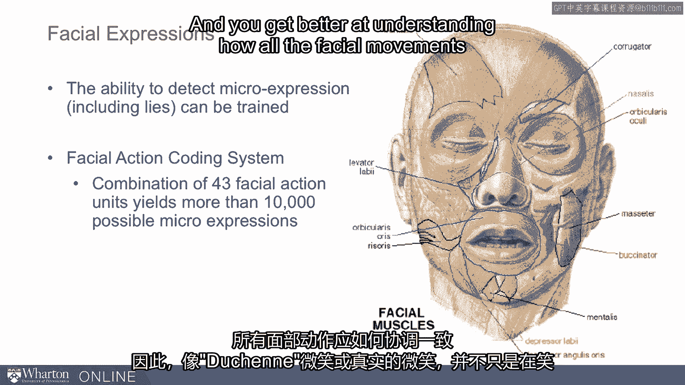

# 课程45：侦测欺骗的线索 🔍

在本节课中，我们将学习如何识别他人可能说谎时的行为线索。我们将探讨情绪变化、认知负荷增加以及非语言行为不一致等关键信号，帮助你更有效地察觉欺骗。

---

上一节我们介绍了欺骗可能涉及的心理变化，本节中我们来看看具体有哪些可观察的线索。

当人们开始说谎时，一些事情会发生变化。我们可以尝试侦测这些变化。

事实证明，最重要的变化之一是我们的感受。当我们进行欺骗时，情绪会发生变化。我们会产生一些情绪，如恐惧、内疚，有时甚至会有一种被称为“欺骗快感”的愉悦。说谎时的情绪与说实话时不同，有时我们可以注意到这些差异。

其次，我们面临所谓的“认知负荷”。我们需要思考更多事情，脑子里装的东西更多。正如马克·吐温所说，说谎的困难在于你必须同时记住真相和谎言。因此，我们脑子里装的东西更多。我们必须理清两个版本的故事，必须控制自己的行为，还必须观察他人以判断他们有多轻信或多怀疑。因此，我们投入了更多的认知努力，而正因为如此，也会产生一些有助于我们侦测欺骗的线索。

**一个关键的情绪变化是焦虑**。当我们说谎时，通常感到更大的焦虑。事实上，测谎仪的设计很大程度上就是为了测试这一点。测谎仪被称为“谎言侦测机”，但它实际上是一台“焦虑侦测机”。例如，我们用血压袖带测量心率。当我们说谎时心率上升，是因为我们感到焦虑。手指上的电极测量出汗情况，而出汗是焦虑的另一个迹象。胸部的呼吸管测量呼吸，当我们呼吸加快时，是因为感到焦虑。因此，人们说谎时常常感到更大的焦虑，这正是测谎仪可以帮助我们侦测的，我们也可以在自然交流中尝试寻找一些焦虑线索。

例如，面部会释放出一些焦虑线索。人们倾向于抿紧嘴唇、更快地眨眼、音调变高，并且我们经常做出一些反映焦虑的动作。我们可能会揉额头、挤脸或揉脖子，可能会做出某种“瞬间冻结”的表情，即一种僵住的表情，可能会咬嘴唇。这些都是焦虑的线索。我们可以自问：为什么某人在讲述这个故事或提供这个信息时会如此焦虑？一个可能的原因是：这不是真的。因此，焦虑是帮助我们侦测欺骗的一个观察点。

事实证明，说谎常常伴随着巨大的焦虑，以至于如果我们稍微吓唬一下人们，他们实际上更可能坦白并变得更诚实。因此，测谎测试，仅仅是其前景，往往就足以让人们招供。有些人会因为害怕参与而拒绝测谎，他们非常害怕测谎会诊断出他们的欺骗行为。虽然测谎仪检测的只是焦虑，但它实际上是一个有用的工具，不仅因为它能检测焦虑，还因为它常常能吓唬人们招供。

接下来我们考虑“不尊重”。当人们对你说谎时，这通常是一种不尊重的表现。因此，说谎的人有时也会使用讽刺的回应，他们会居高临下地对目标说话，或者在实施欺骗时表现出某种轻蔑，或者做出一些显示对目标漠不关心的行为。例如，他们会从衣服上摘线头、翻白眼、表现出不尊重，这常常伴随着欺骗。

欺骗是一种自我中心的行为。我认为我比你强，我认为我可以对你隐瞒真相。而不尊重有时就伴随着这种欺骗，我们可以寻找这些线索，作为促使我们更深入探究的信号。

我们常常就情绪本身说谎。例如，“我很高兴你能加入我们。”或者“哦，我很高兴你问我这些棘手的问题。”有时，我们会泄露真实或本真的情绪。因此，当你在告诉我某事时，我需要观察你是如何说的。我可能会觉得：嘿，等等，你说你很高兴见到我，但你看起来并不像很高兴见到我，或者我瞥见了一个鬼脸或不舒服的表情。我建议我们应该注意这一点。有时，这些情绪不匹配的线索，甚至是情绪的快速闪现，可以引导我们对真实情况进行更仔细的审视。

因此，人们常常会泄露情绪。有时也会有错误的强调。当我们非常仔细地思考要说什么时，我可能会把重音放在错误的词上。例如，“我**真的**很高兴见到你。”重音不应该放在“真的”上。这可能是欺骗的迹象，因为我们认知负荷过重，并且在说话时没有把情绪表达得很到位。

另一个相关的线索是“缺乏同步性”。这与认知负荷的概念相关。我可能会说：“哦，我以前从没做过那件事。”然后才摇头。而不是边说“我以前从没做过那件事”边摇头。当我们异步地做事时，即我先说了什么，然后才做相应的身体动作，那个非语言线索可能会晚到，因为我认知负荷过重，无法同时处理所有事情。我必须控制自己不要点头，比如“哦，我经常那样做”，而我告诉你的是我从不那样做。因此，缺乏同步性是欺骗的另一个线索。

事实证明，“泄露”是其中的一部分。“微表情”是持续时间少于二十分之一秒的表情，有时长达五分之一秒，但非常快。同样，通过视频，我们可以看得很清楚，但在自然交流中，我们常常完全错过它们。但潜意识里，我们可能会处理并说：嘿，你知道吗？我知道莫里斯告诉了我这个，但我感觉不太对劲。他看起来不完全真实，这可能是因为在我说话时有一瞬间的闪现。比如我说：“哦，我真的很高兴你来了。”但如果用慢动作看，我们会发现其中可能有一个持续二十分之一秒的鬼脸，传达了我对你真的来了的真实感受——高兴或不高兴。

有时，“泄露”仅仅意味着我们的表情不完整。例如，我的微笑不是完整的微笑，只是部分到位。因此，有时我们会泄露一些情绪，这些情绪传达了我们对自己真实感受的某种不确定性，而我们应该注意这些。

面部表情有很多种。人们已经相当仔细地记录了这些。因此，有一个“面部动作编码系统”，并且有方法可以接受培训来实际侦测这些微表情，并更好地理解所有面部动作应该如何协调运动。例如，真实的或本真的微笑，不仅仅是微笑，还包括眼睛周围的运动。因此，我们可以做很多事情来尝试找出如何集中注意力，从而更有效地引导我们侦测欺骗。

---

本节课中，我们一起学习了侦测欺骗的多种线索。我们了解到，说谎常伴随**焦虑情绪**（表现为抿嘴、眨眼快、音调高、小动作多），并导致**认知负荷增加**（表现为言行不同步、错误强调）。同时，欺骗行为可能伴随着**不尊重**的肢体语言（如翻白眼、整理衣物），以及**情绪泄露**（如微表情、不完整的表情）。通过关注这些信号，我们可以更敏锐地察觉对话中的不一致，从而更有效地识别潜在的欺骗。