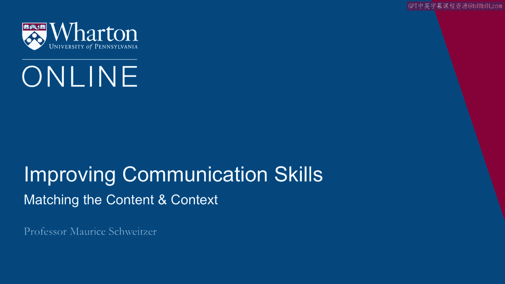
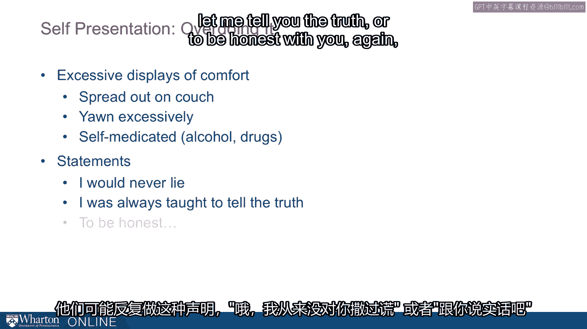
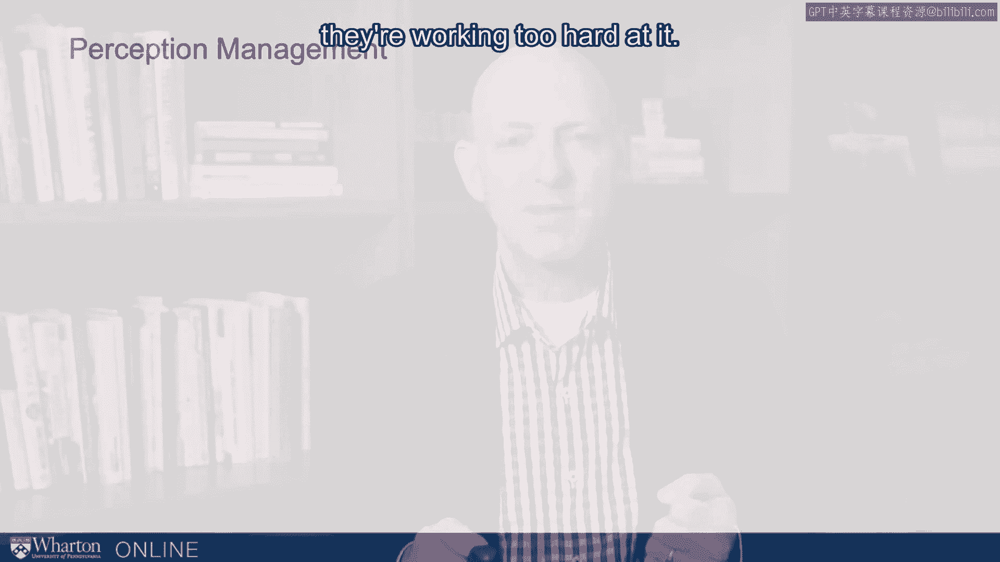

# 课程名称：沃顿商学院《实现个人和职业成功》第46课：匹配内容与背景 🕵️

在本节课中，我们将要学习如何通过分析信息内容与背景的匹配度来识别欺骗行为。我们将探讨言语与非言语线索之间的同步性、欺骗者的不适感表现、印象管理策略以及认知负荷如何暴露谎言。

---

## 匹配内容与背景：识别欺骗的线索

上一节我们介绍了欺骗的基本概念，本节中我们来看看如何通过观察信息内容与背景是否匹配来发现欺骗。

言语（内容）与非言语行为（背景）之间应保持一致。当两者不同步或不一致时，就可能存在欺骗。

以下是几种常见的内容与背景不匹配的情况：

*   **言行不一**：例如，嘴上说“不”，却点头表示“是”。
*   **自我纠正**：例如，说“不……我的意思是，是”。这种中途的自我纠正通常是识别欺骗的重要线索。
*   **延迟反应**：言语表达在先，相应的非言语线索（如摇头否定）延迟出现。这种异步性提示我们情况可能不对。

当情绪与行为不匹配时，我们就获得了重要信息，应该对相关问题进行更深入的探究。

---

## 不适感的表现

欺骗行为常常伴随着心理上的不适感，这种不适会通过行为表现出来。

欺骗者通常希望尽快结束对话，因此会表现出一些特定的行为。

以下是欺骗者因不适而可能表现出的行为：

*   **寻求距离**：身体向后倾、远离对话者，或进行所谓的“眼神阻断”（闭上眼睛，仿佛自己不在现场）。
*   **制造人工屏障**：在双方之间放置背包、交叉手臂或摆放笔筒等物品，构筑一道心理上的“墙”。
*   **欢迎干扰**：频繁看钟、谈论结束会议，或对意外干扰表示欢迎，并借机转换话题。

这些行为都是不适感的信号，我们应该思考对方为何会感到不适。

---

## 过度的印象管理

人们总是试图给他人留下好印象，而欺骗者在这方面会表现得尤为刻意和过度。

他们极力塑造诚实、可信的形象，有时反而会弄巧成拙。

以下是欺骗者可能使用的过度印象管理策略：

*   **过度补偿**：为了掩饰焦虑，故意做出完全相反的行为，如伸懒腰、打哈欠以显得放松，甚至通过饮酒或服药来降低焦虑感。
*   **强调性语言**：使用如“我从不骗你”、“说实话”或“坦白讲”这类强调诚实的语句。如果这与某人平时的说话方式不同，就值得警惕。
*   **借助他人或改变外表**：带着朋友、家人或社区显赫人物一同出现以提升可信度，或者突然改变发型、衣着等外在形象。例如，在妻子失踪后立刻改变自己外表的丈夫，其行为后来被证实与谋杀罪有关。

当一个人过分努力地塑造某种印象时，往往是因为他们需要掩盖某些事实。

---

## 认知负荷的泄露

说谎需要更多的脑力思考，这种增加的“认知负荷”会通过多种方式泄露出来。

欺骗者需要时间编造和回忆谎言，这会影响他们的表达方式。

以下是高认知负荷可能表现出的线索：

*   **填充词与延迟**：使用更多的“嗯”、“啊”等填充词来争取思考时间；回答问题前有更长的停顿。
*   **无关细节**：在叙述中添加更多无关紧要的细节，以拖延时间并让故事显得更复杂。
*   **回答速度异常**：有时，对于预先准备好的问题，欺骗者回答得异常迅速，快得不自然。
*   **表达流畅度下降**：可能出现更多口吃，或专注于言语内容而减少正常的手势（比划）。

关键在于建立对方正常状态下的行为基线，然后观察其当前行为是否有显著差异，这种差异是识别欺骗的重要线索。

---

## 总结与提醒

本节课中我们一起学习了通过匹配内容与背景来识别欺骗的多种线索。我们探讨了言行不一的异步性、由不适感引发的距离行为、过度刻意的印象管理以及因认知负荷增加而导致的表达异常。

需要记住的是，**单一线索不足以断定欺骗**，且许多线索在正常交流中也难以察觉。这些知识是帮助我们提高警惕、提出更深层问题的工具，而非简单粗暴的“测谎仪”。