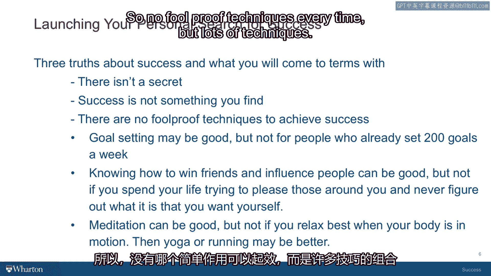

# 沃顿商学院课程笔记 P5：关于成功的三个真理 🧭


在本节课中，我们将探讨关于成功的三个核心真理。这些真理旨在帮助你更清晰地理解成功的本质，并为你未来的个人与职业发展提供稳固的基石。

---

## 真理一：成功没有单一秘诀 🔑

许多人通过书籍或电影获得一种印象，认为存在某个**单一的、神秘的“成功秘诀”**。他们相信，只要找到这个秘诀，所有问题都会迎刃而解，人生从此一帆风顺。

然而，关于成功的真相要复杂得多。它并非一个有待发现的秘密。其复杂性在于，这些问题的答案**存在于你自身内部，而非外部世界**。人类总是倾向于设定一个追寻目标，然后去寻找最高的山或最奇异的植物，并认为“找到了它，我们就成功了”。

但遗憾的是，成功是你随身携带的东西。有一本名为《无论你去哪里，你都在那里》的书很好地诠释了这一点。对于成功而言，真相更接近于“它就在你身上”，而不是“它在某个遥远的地方”。

**核心公式：**
```
成功 ≠ 外部发现的单一秘密
成功 = 内在的自我探索与认知
```

因此，没有所谓的秘诀。本课程将帮助你从自身内部发现那些能赋予你更高自信的东西，让你更坚定地朝着目标努力。

---

## 真理二：成功是认知，而非发现 🔍

承接上文，成功的追寻与其说是一个“发现”新事物的过程，不如说是一个“认知”已有事物的旅程。

你需要去**认知**你内心已有的模式，**认知**你正在努力实现的价值。这些价值观可能源于你的家庭、文化或宗教信仰。认知意味着理解和找回那些熟悉的东西，例如“对他人抱有同情心”的价值。

你可能曾被教导过这个价值观，但在攀登职业阶梯或追求某个具体目标（如治愈某种疾病）的过程中暂时遗忘了它。现在，你有了一个机会去思考并意识到：“我看到了自己内心的这个价值观，我现在可以用不同的方式去尊崇它。”

这并不意味着你必须停止寻找治愈疾病的方法，它只是意味着你**将这个价值观（例如同情心）融入你的追求中**。这样做并不会占用更多时间，反而能为你的人际关系带来更深层次的理解。

**核心概念：**
```
成功的追寻 = 认知内在已有的价值观与模式
```

所以，这是关于认知，而不是寻找你从未想过的新事物。

---

## 真理三：没有放之四海皆准的技巧 🛠️

我希望随着课程的深入，你能认识到的第三个真理是：**不存在每次都能奏效、确保成功的单一技巧**。

在“如何成功”的市场中，无论是书店还是网络搜索，你都会找到海量书籍，它们几乎都提供一种“唯一真道”的模板。这条“真道”可能是目标设定，可能是社交技巧，也可能是心智力量、可视化想象等。

这些方法本身可能非常相关，对你非常有用。但极有可能的是，你将结合自己独特的经历和能力，**形成一套独一无二的组合方法**。

对你隔壁那位需要学习如何设定目标的邻居有效的方法，对你可能无效，因为你可能每天已经设定了200个目标，你真正需要学习的是如何放松并专注于三个目标。

**核心代码：**
```python
# 没有适用于所有人的“成功函数”
def universal_success_formula(person):
    # 不存在这样的函数
    return None

# 你需要构建自己的“成功工具箱”
def build_your_success_toolkit(your_values, your_experiences, available_techniques):
    toolkit = []
    for technique in available_techniques:
        if technique.aligns_with(your_values) and technique.builds_on(your_experiences):
            toolkit.append(adapt(technique, for_person=you))
    return toolkit
```

因此，没有每次都灵验的万能技巧，但存在许多技巧。你的目标是尝试**调整并适配那些对你个人达成成功目标（无论是内在目标、外在目标还是两者结合）特别有效的工具**。随着课程的推进，你会更深入地理解这两类目标如何相互作用、交织与融合。



---

## 总结 📝

本节课我们一起学习了关于成功的三个基本真理：
1.  **成功没有单一秘诀**，答案在于内在的自我探索。
2.  **成功是一个认知内在已有价值观与模式的过程**，而非对外部新事物的发现。
3.  **不存在普遍适用的成功技巧**，关键在于结合自身情况，构建个性化的方法工具箱。


理解这些真理，能帮助我们以更踏实、更个性化的方式，走向属于自己的成功。在接下来的课程中，我们将继续探讨这些议题。