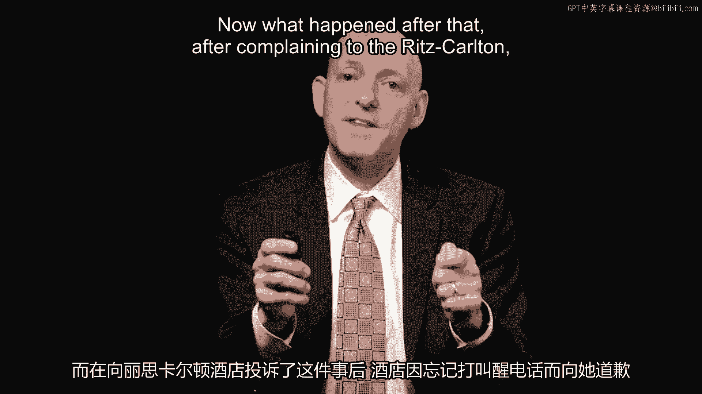
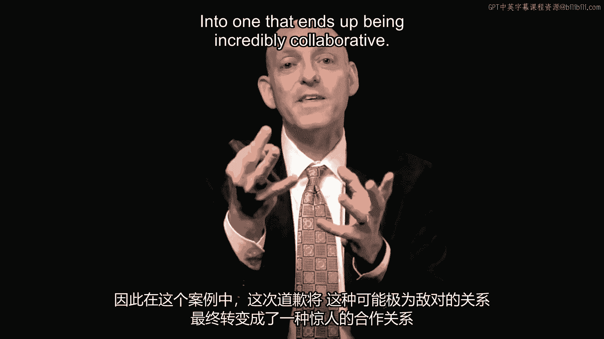

# 沃顿商学院课程《实现个人和职业成功》第51课：准备道歉 🛡️


在本节课中，我们将学习如何为道歉做好准备。有效的道歉不仅是说“对不起”，更是一种需要提前规划和练习的技能。我们将探讨为何要准备道歉、如何克服道歉的障碍，并通过实例了解准备充分与准备不足的道歉所带来的不同结果。


---

上一节我们讨论了道歉的核心要素，本节中我们来看看如何为道歉这一行为本身做好准备。


道歉前的准备至关重要。其核心理念是：就像进行消防演习一样，我们需要为可能发生的事情做好准备，即使我们认为它不太可能发生。

某些行业已经为道歉做好了充分准备。例如，在**交通运输、酒店服务和医疗行业**，服务失误时有发生，因此道歉是常规流程的一部分。然而，在其他行业中，人们对此准备不足，这一点在我们之前分析的好与坏的道歉案例对比中显而易见。


---


以下是一个关于充分准备如何扭转局面的有趣故事。



这个故事发生在丽思卡尔顿酒店，该酒店在服务补救方面做得非常出色。客人斯泰西入住时要求了叫醒服务，但叫醒电话并未响起，导致她睡过头并错过了一场会议。


在斯泰西投诉之后，丽思卡尔顿酒店为遗漏叫醒电话一事道了歉。他们的道歉方式包括赠送一个果篮和巧克力，并附上一封手写的道歉信。


结果，斯泰西没有继续抱怨或抨击酒店，反而在网上给出了五星好评，并大力赞扬了酒店卓越的服务。


这个案例表明，一次准备充分的道歉可以将原本可能对立的关系，转变为高度协作的关系。其转化公式可以概括为：



**服务失误 + 真诚且得体的道歉 = 修复甚至提升客户关系**


---

我们需要迅速道歉，之前也强调过速度的重要性，但速度也不能过快。

这里有一个因过快而导致问题的例子：我们不能让道歉自动化。

多米诺披萨曾收到一条在线评论：“史上最好吃的披萨，继续努力！” 然而，多米诺的自动回复系统却迅速回应：“对此非常抱歉。请向我们提供更多信息，并提及此参考编号。”

这看起来像是一个自动化系统，误将任何在线提及都视为投诉，从而过早地进行了道歉。外界推测他们可能有一个过于“热心”的自动回复机器人。

随后，他们试图补救，解释说：“我们的意思是，很抱歉让您（詹妮弗）等了这么久才吃到这‘史上最好吃的披萨’。”

这个例子告诉我们，道歉要迅速，但绝不能过度自动化或草率。关键代码逻辑应该是：

```python
if 需要道歉:
    启动道歉流程()
else:
    分析情况() # 避免自动化误判
```

---

那么，如何为道歉做好准备呢？我们需要思考准备与经验。

一些行业已为此做好准备，而其他行业也应该做好准备。我们看到那些准备不足的行业会面临挣扎。

这里的建议是：我们必须做好准备。就像为火警做准备一样，我们也需要为道歉做好准备。我们需要设法克服一些障碍。

常见的道歉障碍包括：
*   **对示弱的恐惧**：担心道歉会使自己处于劣势，显得不够自信。这类似于我们害怕问路或求助的心理，但有时主动求助反而会显得更自信，道歉也是如此。
*   **对责任或罪责的恐惧**：事实上，过去医疗专业人员曾因此被训练不要道歉。但现在，像 Baptist Hospital 这样的机构引入了新规程，训练专业人员道歉，结果实际看到的诉讼案件反而减少了。
*   **自尊与防御心理**：我们常常难以进行之前讨论过的“换位思考”。

要打破这些障碍，在制度层面，我们可以创建规则或指南来帮助员工达到应有的状态。

---

以下是本课的核心要点总结：

在本节课中，我们一起学习了为道歉做好准备的重要性与方法。

1.  **应当提前准备道歉**：就像丽思卡尔顿酒店和 Baptist Hospital 所做的那样，效果显著。我们需要培训员工，并制定相应的流程与政策。
2.  **建立可信度**：我们必须确保我们使用的言辞能被对方有意义地接收。就像多米诺的例子，不能过快且流于形式。
3.  **管理预期**：要确保我们所传达的期望，是我们真正能够跟进和做到的。
4.  **始终保持以对方为中心**：这一点贯穿始终。当我们考虑对方的观点、感受他们的体验时，我们才能以展现对他人关切的方式进行沟通。


通过充分的准备和以对方为中心的真诚态度，道歉可以从一个艰难的补救行为，转化为巩固信任、深化关系的契机。