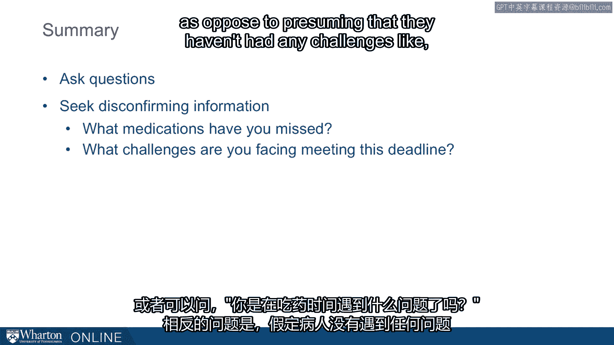

# 沃顿商学院课程《实现个人和职业成功》第27课：深入探讨提问 🔍

在本节课中，我们将深入探讨“提问”这一沟通工具。我们将了解问题如何不仅用于收集信息，还能引导回答、传递信息，甚至塑造他人的记忆与认知。通过理解提问的深层机制，我们可以学会如何提出更有效、更能获取真实信息的问题。

---

## 问题的传统功能

上一节我们介绍了课程主题，本节中我们来看看语言学家对提问功能的研究。专家们长期研究问题，发现它们在对话中扮演着核心角色。

以下是问题在对话中的几个主要作用：

*   **构建对话结构**：问题为对话提供了框架和方向。
*   **聚焦特定话题**：问题能将讨论引导至特定的主题上。
*   **推动叙事发展**：例如，“接下来发生了什么？”这类问题能推动故事或描述的进程。
*   **暂停以确认理解**：例如，“你明白我的意思吗？”这类问题用于确保信息被正确接收。

传统上，我们认为提问的主要目的是**获取信息**。

---

## 问题的引导与暗示作用

然而，问题的作用远不止于此。它们不仅能**索取信息**，还能**引导回答**，有时甚至能**传递信息**。

这一点在“诱导性问题”上体现得尤为明显。洛夫特斯教授在这一领域做出了重要研究。

在一个经典实验中，她让参与者观看两车相撞的视频，然后询问车速。

以下是实验中使用的不同提问方式：

*   **猛烈撞击版**：当两车**猛烈撞击**时，车速是多少？
*   **轻微碰撞版**：当两车**轻微碰撞**时，车速是多少？
*   **相互接触版**：当两车**相互接触**时，车速是多少？

尽管核心问题都是“车速是多少”，但使用的动词不同。结果发现，听到“猛烈撞击”的参与者估计的车速最高（约41英里/小时），而听到“相互接触”的参与者估计的车速最低（约32英里/小时）。

这表明，我们提出的问题可以显著影响得到的答案，尤其是在答案本身模糊或不确定的情况下。

---

## 提问方式如何塑造答案

以下是更多例子，说明提问的措辞如何引导出不同的答案：

*   **问题A**：你经常头痛吗？如果是，频率如何？
*   **问题B**：你偶尔头痛吗？如果是，频率如何？

同样，两个问题都在询问头痛频率，但使用“经常”一词时，人们报告的频率（平均每周超过2次）显著高于使用“偶尔”时（平均每周少于1次）。

在法律语境中，律师向潜在陪审员提问的方式也受到限制。例如，提问“如果你知道被告是帮派成员，你还能保持公正吗？”，这个问题本身就植入了“被告可能是帮派成员”的想法，无论这是否属实。

另一个例子是问“你什么时候停止拿钱？”，这个问题预设了“你曾经拿过钱”这一前提。

这些例子都说明，提问的方式可以引导人们，并在他们脑海中植入难以消除的想法。

---

## 提问如何植入错误记忆

洛夫特斯教授还有一个我非常喜欢的实验，它展示了提问如何创造虚假记忆。

参与者观看了一段汽车在乡间道路行驶的视频，视频中**没有谷仓**。一周后，研究人员将他们召回并提问。

关键在于一周前的车速提问方式被分为两种：

1.  **中性提问**：那辆白色跑车在乡间道路上行驶时的车速是多少？
2.  **植入“谷仓”的提问**：那辆白色跑车在乡间道路**经过谷仓时**的车速是多少？

一周后，当所有参与者被问及“你在视频中看到谷仓了吗？”时，结果令人惊讶：

*   在最初被以**植入“谷仓”的方式**提问的组中，约**17%** 的人报告他们看到了谷仓。
*   而在最初被**中性提问**的组中，只有不到**3%** 的人声称看到了谷仓。

这个实验戏剧性地表明，提问不仅能收集信息，还能**揭示信息**（例如提问者的所知所想）并**引导答案**，甚至创造本不存在的记忆。

---

## 一项关于提问策略的实验

接下来，我将解释我进行的一项简短实验，它反映了我的系列研究，旨在探索不同问题如何引发不同类型的信息。

在实验中，我告诉参与者他们正在出售一个有频繁死机问题的二手iPod，并且他们掌握这个iPod的许多其他信息。然后，我让研究助理（扮演买家）联系参与者，并提出以下三种问题之一：

1.  **一般性问题**：你能告诉我关于它的一些情况吗？
2.  **正面假设性问题**：它没有任何问题，对吧？
3.  **负面假设性问题**：它有什么问题？

分析如下：
*   **一般性问题**：不透露任何具体知识。
*   **正面/负面假设性问题**：都暗示存在问题，尤其是**负面假设性问题**（“它有什么问题？”）直接假定存在问题，是最直接的问法。

我们观察了参与者的反应。他们普遍认为：
*   提出**负面假设性问题**的买家知识最渊博，提出**一般性问题**的买家知识最不渊博。
*   提出**负面假设性问题**的买家最果断。

但最关键的是**回答的内容**。如果买家想了解负面信息（如死机问题），结果发现：
*   当被问及**正面或负面假设性问题**时，卖家会透露更多关于“死机”的可靠信息。
*   当被问及**一般性问题**时，卖家会透露大量无关的通用信息，却很少提及核心问题。

这项研究的核心结论是：当你提出**更直接的问题**（尤其是**负面假设性问题**）时，你得到的答案**更可靠、更真实**。独立评分员也认为，对负面或正面假设性问题的回答听起来最诚实。

---

## 实践建议：如何提出有效问题

基于以上研究，当我们想要提问时，应确保做到以下几点：

以下是具体的提问策略：

*   **仔细倾听答案**：不仅要问，更要听。
*   **寻求否定性信息**：主动挑战自己的假设。
*   **采用负面假设句式**：预设可能存在问题的提问方式，更能获得准确、真实的信息。

**应用示例**：
*   **医疗依从性**：问病人“**你漏服了哪些药？**”，而不是“你没漏服任何药，对吧？”
*   **项目进度**：问团队成员“**在截止日期前你遇到了哪些挑战？**”，而不是“我们进展顺利，对吧？”

通过预设问题，我们更有可能收集到准确和真实的信息。

---

本节课中我们一起学习了提问的深层功能。我们了解到，问题不仅是获取信息的工具，更是能够引导思维、传递暗示甚至塑造记忆的强大沟通手段。通过有策略地使用直接提问，特别是负面假设性提问，我们可以在沟通中更有效地触及核心，获取更真实、可靠的信息。掌握提问的艺术，是提升沟通能力与影响力的关键一步。