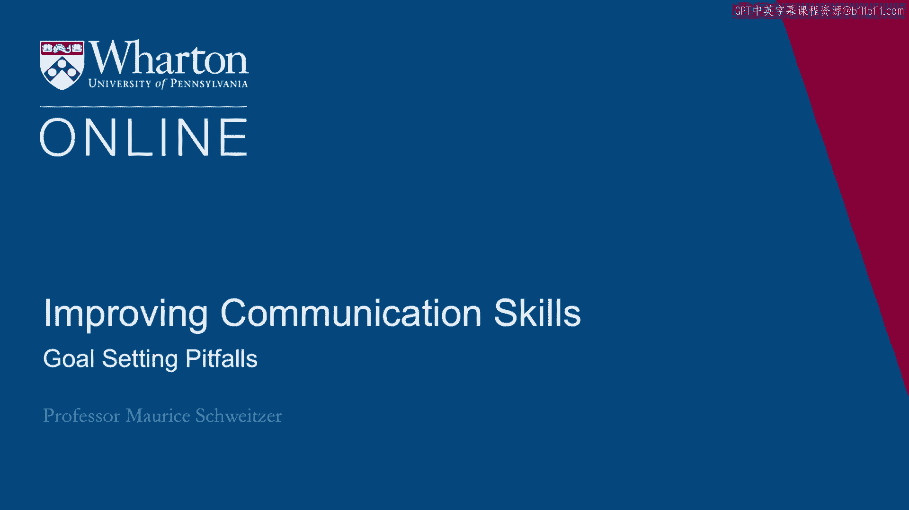
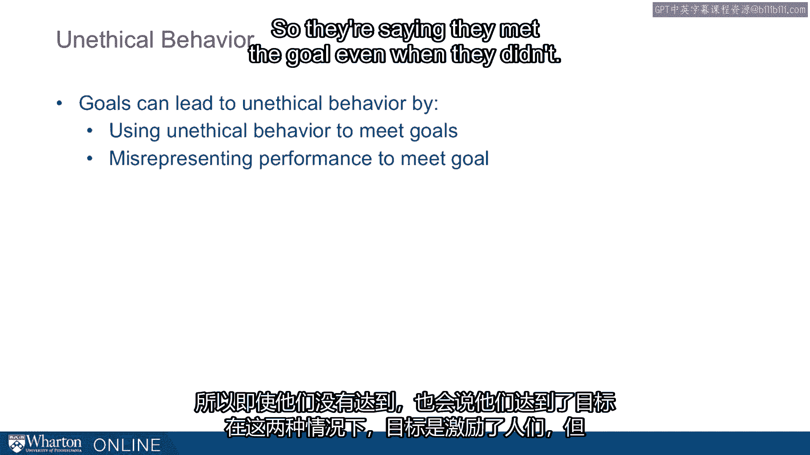

# 🎯 课程33：设定目标的陷阱

在本节课中，我们将探讨目标设定过程中可能出现的负面效应与潜在风险。目标设定在提升动力和绩效方面有积极作用，但若使用不当，也可能导致注意力狭隘、风险行为增加甚至不道德行为。

上一节我们介绍了目标设定的积极意义，本节中我们来看看目标设定可能带来的“阴暗面”。

## 🏦 目标设定的负面案例：富国银行

富国银行在2016年发起了一项名为“GR-8”的计划，为员工设定了目标：向每位客户销售至少8种金融产品（如支票账户、借记卡、信用卡）。这被称为交叉销售。

我们知道，目标设定能提升动力和绩效。但问题在于：如果员工难以达成目标，会发生什么？心理上，未能达成目标会让人感觉糟糕，这使员工陷入两难境地。

结果往往是人们开始走捷径。在富国银行的案例中，员工未经客户授权，开设了200万个虚假账户以达成销售目标。最终，富国银行解雇了5300名员工，并支付了1.85亿美元的罚款。

时任CEO约翰·斯坦普表示：“我们正在取消产品销售目标，以确保客户对我们充满信心……我们的银行家始终专注于客户的最大利益。”他们认识到，问题出在目标本身上。

## ⚠️ 目标失控的三大风险

我们的研究将这种现象称为“目标失控”。除了积极作用，目标也可能带来以下负面后果：

以下是目标可能引发的三个主要问题：

1.  **注意力过度狭隘**：目标会使我们过度聚焦于单一指标，而忽略更广阔的图景。例如，一名跑步者只专注于达成时间目标，可能忽视了膝盖的疼痛。
2.  **风险行为增加**：为了达成目标，特别是当接近目标时，我们可能愿意承担更高的风险。因为“差一点失败”和“差很多失败”对我们而言区别不大。
3.  **引发不道德行为**：富国银行的案例并非孤例。目标压力可能驱使人们采取不道德的手段。

## 🚗 案例剖析：狭隘目标的代价

通用汽车公司曾设定目标，要求占据美国市场29%的份额。为此，他们为高管制作了印有“29”字样的徽章。为了达成这个市场份额目标，通用汽车扩大了免息贷款和零首付激励措施的提供范围。

然而，他们每卖出一辆车都在亏损。目标设定过程使他们狭隘地聚焦于“29%的市场份额”，却忽略了“同时实现盈利”这个更根本的目标。最终，这种对狭隘目标的执着被《福布斯》杂志认为是将公司拖向破产边缘的一系列灾难性决策的推手。

## 🏥 跨行业的普遍问题

这种现象在不同行业和时期均有出现。

以下是其他领域的案例：

*   **英国医疗系统**：斯塔福德医院因过度关注某些特定指标，被报告导致了400例死亡。
*   **房地美与房利美**：这两家机构设定了向极低收入家庭提供20%抵押贷款的目标（此前为14%）。为了达成目标，他们发放了大量高风险的不良贷款，最终在2008年需要政府救助并申请破产。
*   **“绿巨人”食品公司**：公司设定了从蔬菜中剔除昆虫数量的目标。结果，员工开始随身携带昆虫，在检查时放入蔬菜再取出，以“达成”剔除昆虫的目标。
*   **西尔斯汽车中心**：在20世纪90年代，设定了每小时147美元的可计费销售额目标。调查发现，员工普遍存在超额收费和进行不必要维修的行为，严重损害了公司声誉多年。

## 🔬 研究证实的目标副作用

我们与同事进行的实验也证明，当人们拥有具体而富有挑战性的目标却未能达成时，他们常常会作弊——例如在实验中篡改自己的成绩。

在谈判研究中，我们也发现，追求目标的参与者达成的协议利润更低，提出的要求更极端。这被称为“破坏性目标追求”。

1996年的珠穆朗玛峰灾难也是一个例证：登山者为了达成登顶的目标，承担了过高的风险，导致了灾难性后果。

## 🏆 另一个发人深省的案例：亚特兰大教育系统

亚特兰大学区总监贝弗利·霍尔在2009年被誉为“年度全国总监”，成为他人效仿的榜样。自2001年起，该学区有5万名学生参加标准化测试，她在任期内显著提升了成绩。

然而，州调查人员后来发现，超过一半的学区存在作弊行为，180多名教师卷入丑闻。教师们为了达成绩效目标，代表学生在标准化考试中作弊。

## 📝 总结与启示

本节课中我们一起学习了目标设定的潜在陷阱。

综合来看，目标可能通过两种方式引发不道德行为：
1.  引导人们使用不道德的手段来达成目标（如富国银行员工开设虚假账户）。
2.  促使人们谎报绩效以假装达成目标（如亚特兰大的教师作弊）。

在这两种情况下，目标都在激励人们，但激励的方式是“走捷径”，这可能对个人、团队和组织造成灾难性的后果。

因此，设定目标时，必须谨慎考虑其可能引发的行为导向，确保目标与更广泛的道德准则和长期利益保持一致，避免“目标失控”。