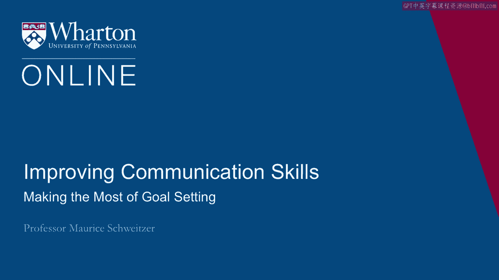
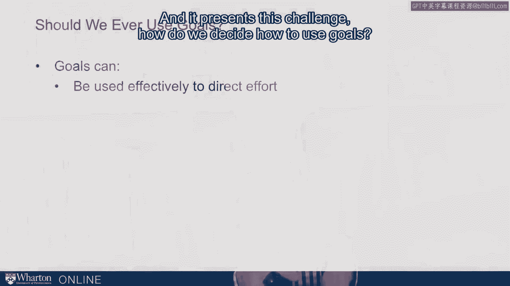
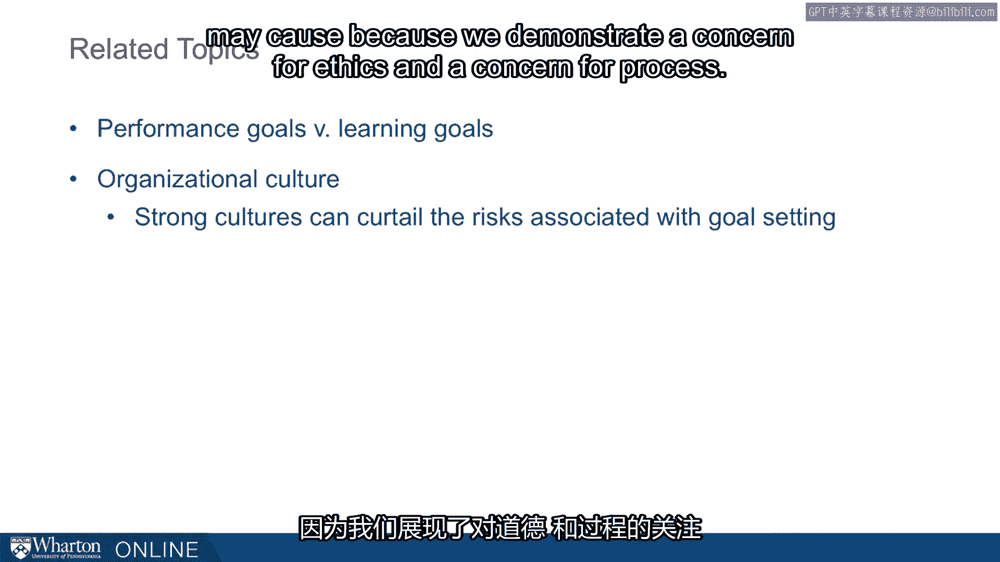
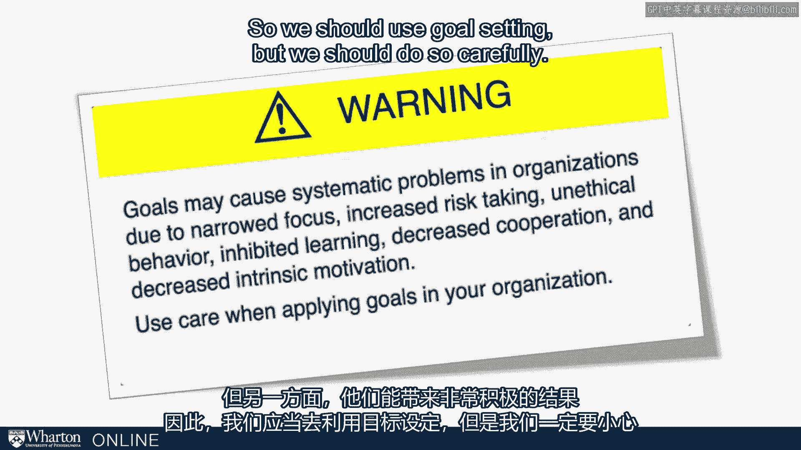

# 课程 P62：如何充分利用目标设定 🎯

在本节课中，我们将探讨如何有效利用目标设定这一工具。目标设定能激励我们取得成就，但也可能带来风险。我们将学习如何平衡其利弊，并介绍一些关键概念，帮助你在个人和职业生活中更安全、更有效地设定目标。

---

## 目标设定的双重性

上一节我们介绍了目标设定的基本概念，本节中我们来看看它的双重性。目标有时能激励我们取得伟大成就，但目标也可能误导我们，导致不道德或糟糕的行为。因此，我们是否应该使用目标？

在一些先前提到的案例中，高管们选择直接取消目标设定流程，例如西尔斯公司就曾面临这样的挑战。这引出了核心问题：我们应如何决定如何使用目标？

---

## 目标的有效应用场景

我们知道，目标在引导努力方面非常有效，尤其是在**基于努力的任务**中。当任务参数清晰，并且我们能准确纳入关键维度时，目标的作用尤为明显。目标在传达我们关注的重点方面也非常有力，并且对**简单的任务**非常有用。

因此，在许多情况下，目标确实非常重要，是激励机制的**基础部分**。它们是沟通和促使人们朝着共同方向努力的关键机制之一。

---

## 谨慎使用目标与过程监控

然而，目标应谨慎使用。我认为，我们应当**关注过程**，并监控人们在追求目标过程中的行为。当人们接近目标时，这一点尤其重要。

例如，如果是一个销售目标，在月底时我们就应非常留意并警惕人们的行为。当人们接近目标时，目标的激励作用可能最强，我们需要小心人们的行为。我们需要表明我们关心过程。

就像亚特兰大的教师们一样，我们关心考试过程的**诚信度**。如果这是我们衡量目标绩效的方式，我们就需要非常小心地关注这个过程。

---

## 绩效目标 vs. 学习目标

以下是两种不同的目标导向：

*   **绩效目标**：关注最终结果。例如，打网球时的目标是赢得比赛。
*   **学习目标**：关注进步与提升。例如，打网球时的目标是不断改进，使反手击球达到最佳水平。

在任何领域，无论是教育还是工作中的项目，都存在这个问题：目标是绩效导向还是学习导向？

结论是，我们越能转向**学习目标**——即我们不断尝试改进，努力让事情变得更好——从长远来看，我们的处境就会越好。研究发现，拥有学习目标的人表现更好，对反馈的反应更积极，最终确实能学得更多，长期绩效也更优。

因此，我们希望从绩效思维模式转向学习目标思维模式。

---

## 组织文化的作用

另一个关键理念是**组织文化**。组织内的文化至关重要，这与我们关注过程的理念相关。注重道德的强大文化，能有效遏制由目标设定驱动的不道德行为风险。

这里的理念是，如果我们拥有一种组织文化，表明我们对道德和过程的关切，就能限制目标设定可能造成的损害。

---

## 总结与平衡之道

总而言之，我想提出一个警告：目标可能在组织中引发系统性问题，因为它们会**缩小关注范围**、**增加冒险行为**、**助长不道德行为**、**损害学习与合作**，并**降低追求我们真正期望之事的内在动机**。

但另一方面，目标也能产生非常积极的后果。

因此，我们应当使用目标设定，但必须谨慎为之。

本节课中我们一起学习了目标设定的力量与风险，了解了绩效目标与学习目标的区别，以及组织文化在其中的关键作用。关键在于平衡：利用目标指引方向，同时密切关注实现目标的过程与行为，以最大化其益处，最小化其潜在危害。