# 沃顿商学院《实现个人和职业成功》课程笔记 P63：35_实现目标 🎯

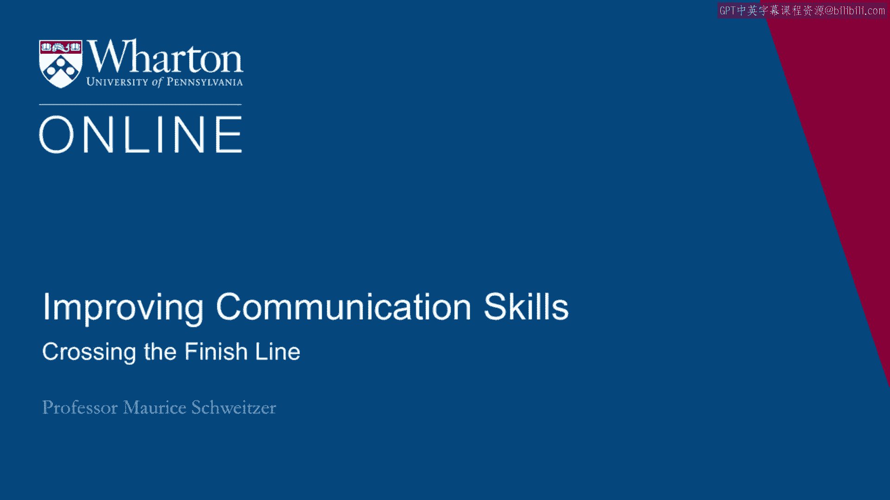

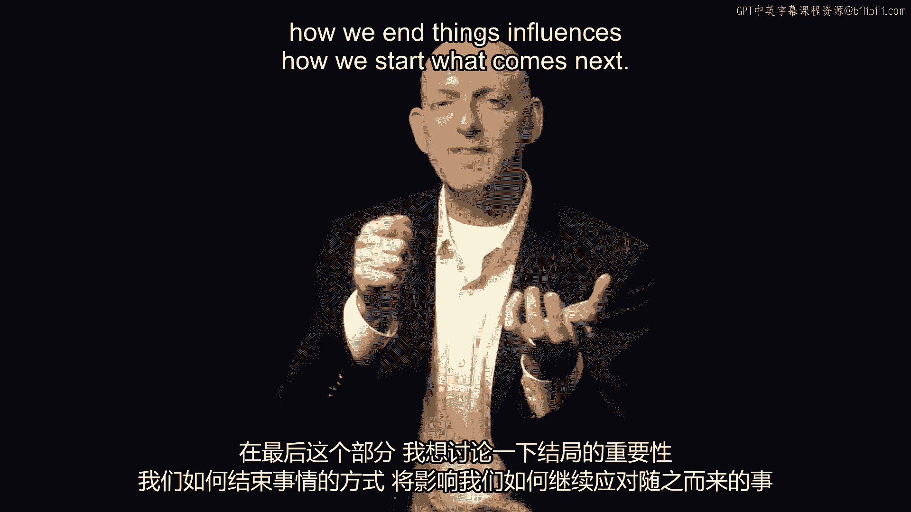

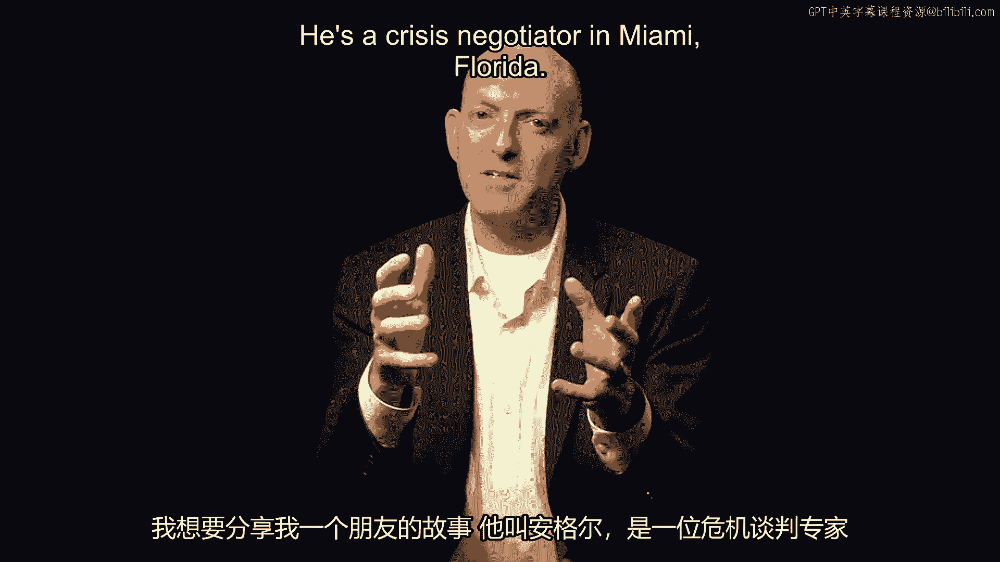

在本节课中，我们将探讨“结束”的重要性。我们将通过一个真实的故事和一个历史案例，来理解如何妥善地结束一件事，以及这种结束方式如何深刻地影响未来的开始。

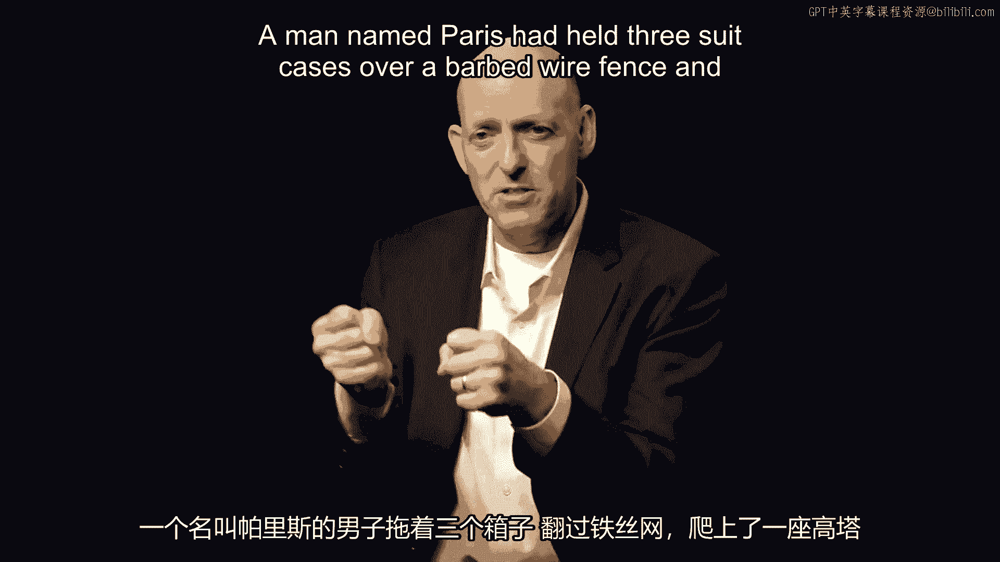

---

上一节我们讨论了目标设定与执行，本节中我们来看看如何为一个目标或一段关系画上句号。我们如何结束一件事，会直接影响我们如何开始下一件事。

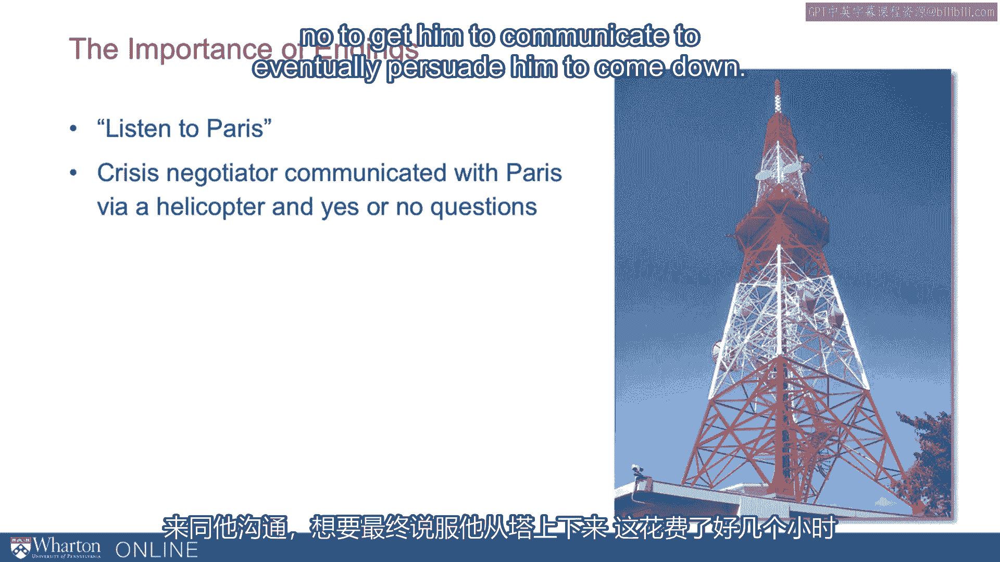

为了说明这一点，我想分享一个关于我朋友安吉尔·卡尔萨迪拉的故事。他是一名危机谈判专家，在佛罗里达州迈阿密工作。

有一天，他接到一个任务。一个名叫帕里斯的男子拖着三个手提箱，翻过带刺的铁丝网，爬上了一座无线电塔。在塔顶，他向下抛撒传单，上面写着“听帕里斯说”。塔下聚集了人群，交通因此堵塞。特警队被召集过来，需要一位危机谈判专家去说服这个人下来，停止这场骚乱。

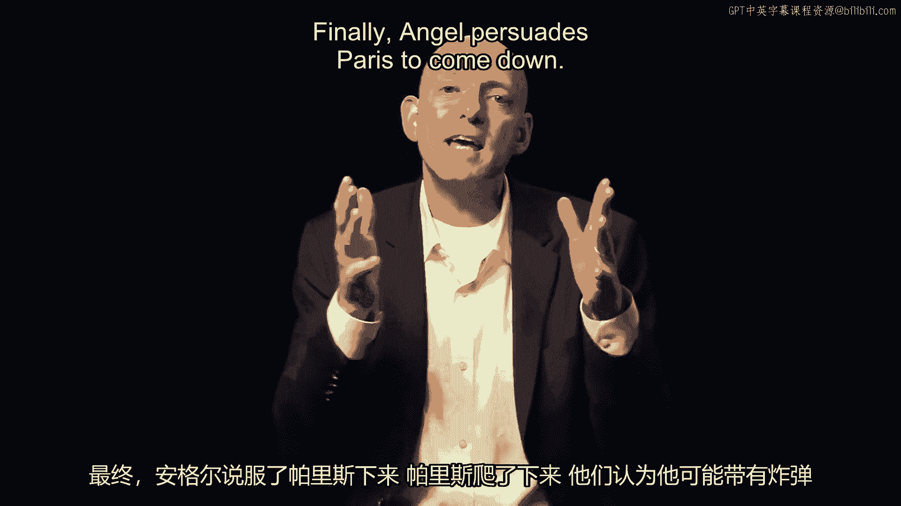

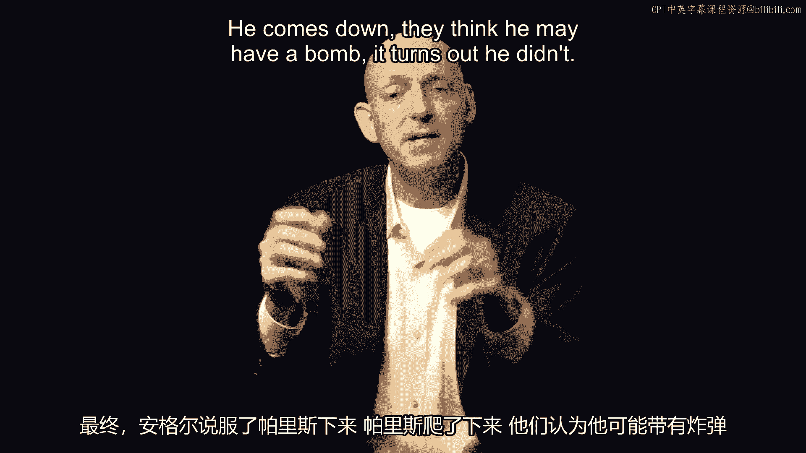

他们到达现场后，起初不知道如何与他沟通，直到最后想到：“我们可以用直升机沟通。”于是，安吉尔登上直升机，用大纸板写字，让帕里斯通过点头或摇头来回应，最终目的是说服他下来。

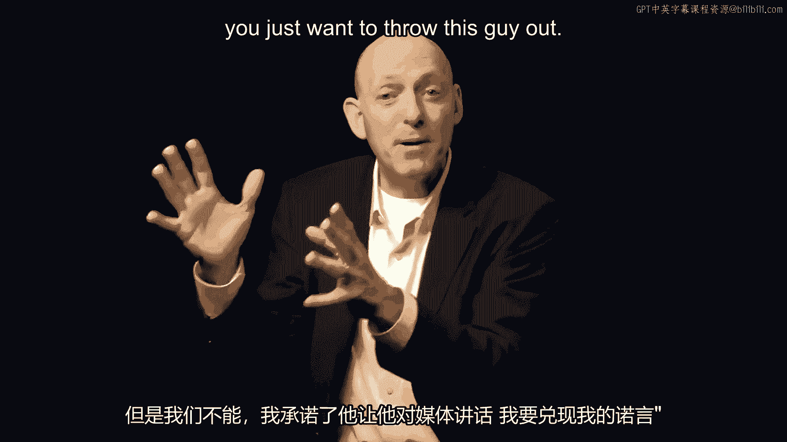

这个过程持续了数小时，甚至久到直升机需要中途加油。最终，安吉尔说服了他。安吉尔提出的条件是：如果你现在下来，我会让你对媒体讲话。谁知道呢，也许马上会有其他新闻，你可能就失去这个机会了。你有一个信息要传达，现在正是时候。

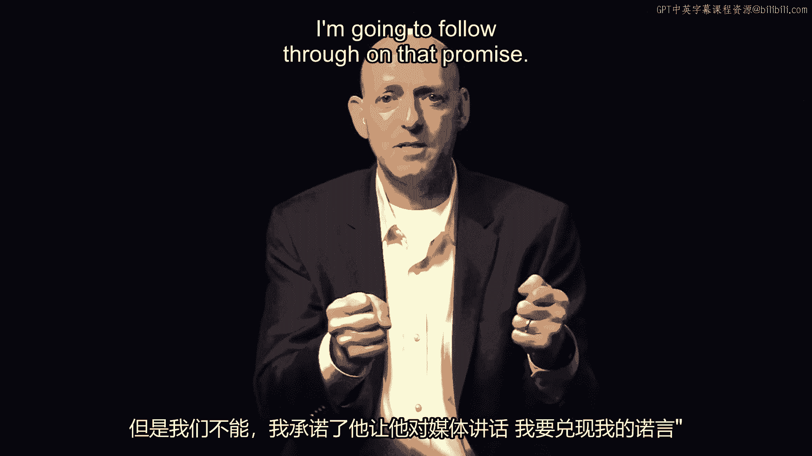

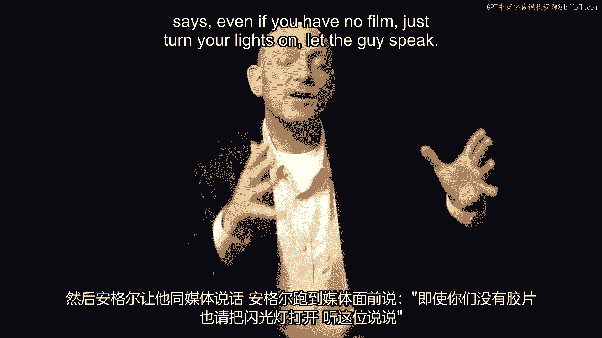

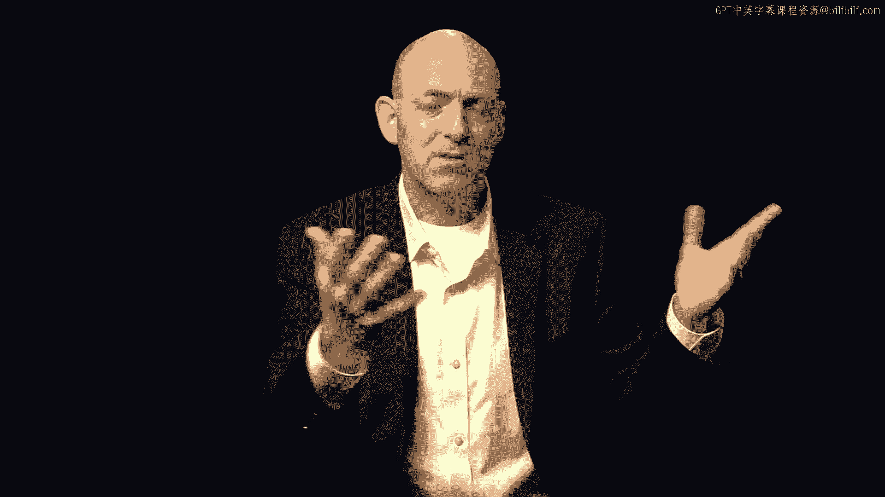

最终，安吉尔说服了帕里斯下来。帕里斯下来后，大家担心他可能有炸弹。结果证明他没有。特警队员们疲惫不堪，只想把帕里斯塞进警车带走。但安吉尔介入并说：“不，我知道你们很累、很烦，只想把这家伙处理掉。但我承诺过他可以和媒体对话，我要履行这个承诺。”

于是，安吉尔让他对媒体讲话。他跑过去对媒体说：“即使你们没有胶片，也请把灯打开，让这个人说话。”他们让帕里斯发言了。结果，他提出了一些非常不寻常的要求：他想要更少的沥青路面，想要更多的马和自行车（这是1996年）。他想成为鲍勃·多尔的竞选搭档。而最有趣的要求是：他并非要求终结所有色情内容，而是要求终结俄罗斯的色情内容。不知为何，这个特定种类的内容让他非常困扰。

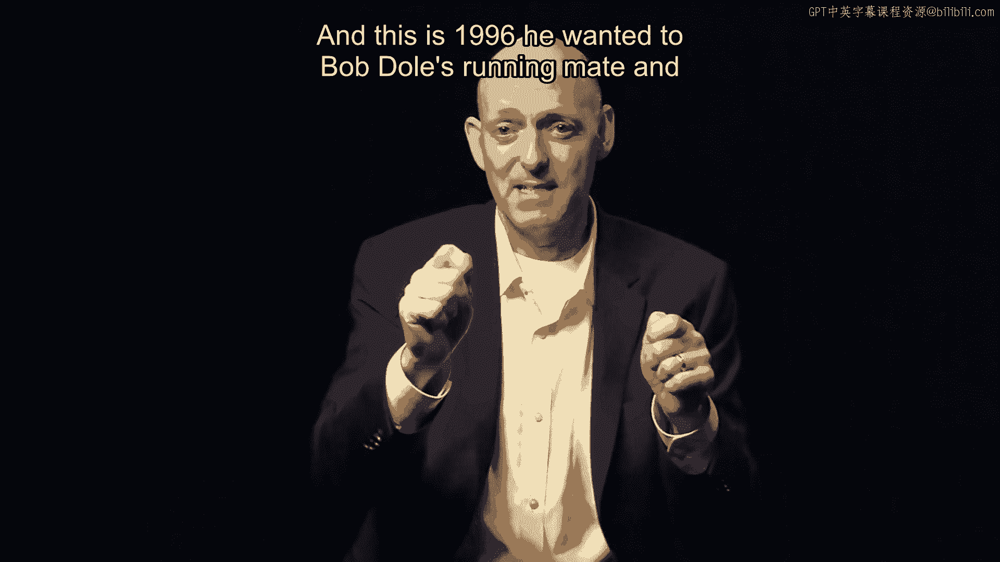

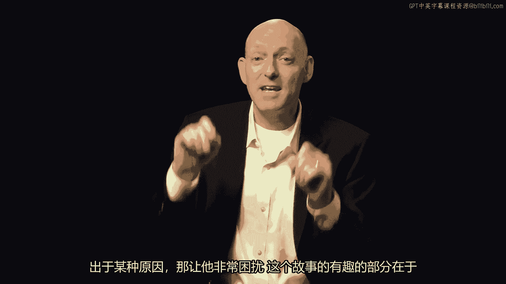

这个故事有趣的地方在于两点。第一，安吉尔确实履行了这个“结束”的承诺。但第二部分是，故事并未就此结束。几个月后，帕里斯在被监禁后又获释了（他毕竟没有炸弹，未被视为社会威胁）。在一个复活节星期天，安吉尔正与家人在一起，他收到了一个传呼。他低头一看，心想：“哦，传呼，真不敢相信，这可是复活节星期天。”他赶到现场，发现又是帕里斯。他们说：“看，安吉尔，这里有个人想和你谈谈。”果然，帕里斯又爬上了一座塔，提出了类似的要求。

这第二次谈判进行得非常迅速和顺利。因为他们已经建立了一种关系。帕里斯信任安吉尔会信守承诺。所以，安吉尔如何结束第一次互动，直接影响了第二次互动的进行方式。

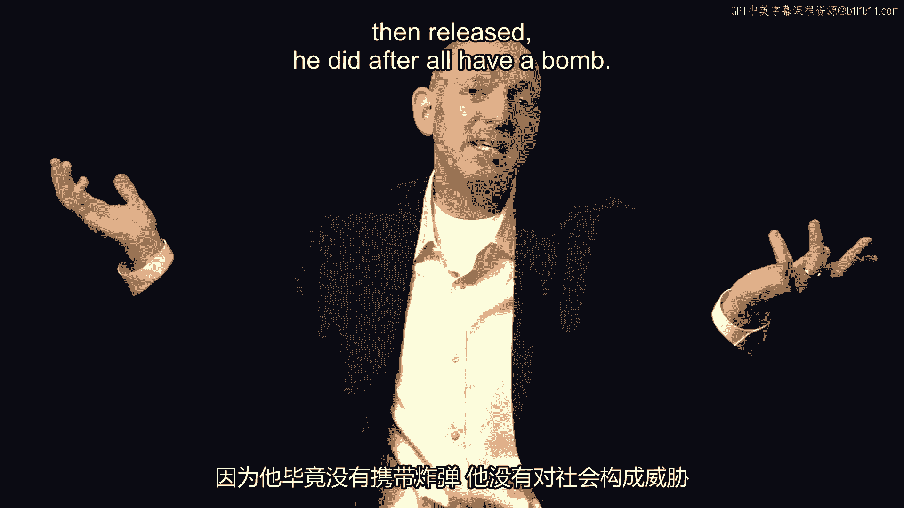

这里还有一点非常有趣：我们常常认为危机谈判是“一次性事件”。安吉尔本可以轻易地说：“你知道吗？这是一锤子买卖。我们把这家伙弄下来塞进车里就完了。”但安吉尔选择了信守承诺，因为他认识到，即使在看似不寻常、奇怪的情况下，有时看似一次性的事件也可能变成重复的互动。也就是说，在危机谈判中，我们通常不期待“回头客”，但有时我们可能会感到意外。

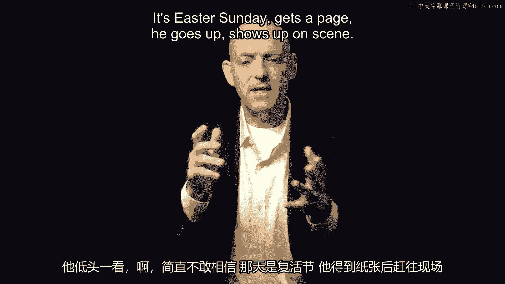

---

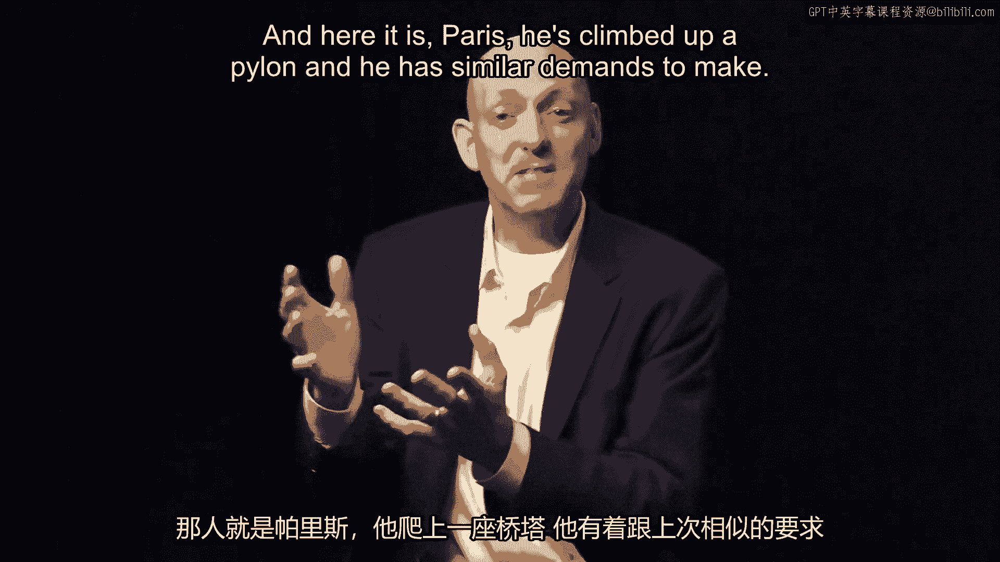

接下来，我想在更大的尺度上思考“结束”。在世界舞台上，我们可以思考冷战的结束。这是一场在苏联和美国之间持续了数十年的战争。最终，柏林墙倒塌了。随着墙的倒塌，人们涌过边境，这被宣扬为西方国家（美国和西欧）的伟大胜利。它为德国的统一创造了机会，并标志着苏联解体的开始。

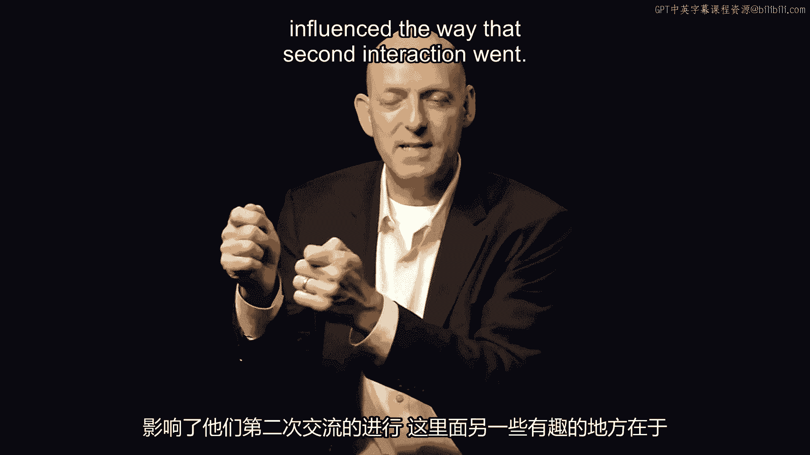

对美国来说，这似乎是一场伟大的胜利。但当时的总统乔治·布什并没有得意洋洋。他甚至没有对此大做文章。他的态度极其低调，因为他知道，要与苏联领导人戈尔巴乔夫合作，他需要促成合作。他也明白，如果他为这场胜利沾沾自喜，将会使他未来与戈尔巴乔夫的合作变得困难得多。

---

关于“结束”的研究在许多不同领域都适用。

想想谈判。当然，我们可以在达成协议后感到高兴，甚至可能是一个对我们非常有利的协议。然而，就像在柏林墙倒塌时不宜得意忘形一样，在谈判中获得一个好结果时，也不宜得意忘形。

但在这里，你甚至需要小心，在达成谈判协议后，连微笑都不能太过分。

---

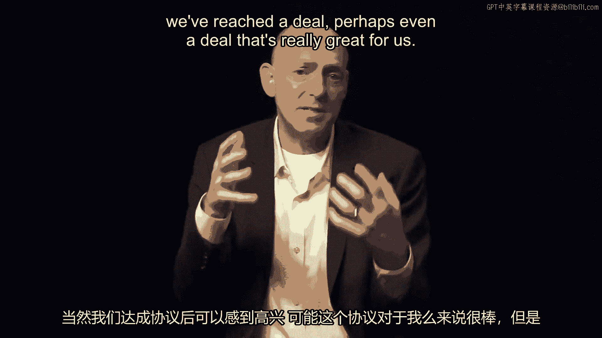

**本节课总结**

本节课中，我们一起学习了“结束”的艺术及其深远影响。通过危机谈判专家安吉尔的故事，我们看到了信守承诺、妥善结束一次互动，能够为未来的关系建立宝贵的信任。通过冷战结束的历史案例，我们理解了在重大胜利面前保持谦逊和远见的重要性。无论是在个人交往还是国际关系中，一个深思熟虑的“结束”，往往是下一个成功“开始”的基石。核心在于：**结束的方式 = 未来关系的基础**。