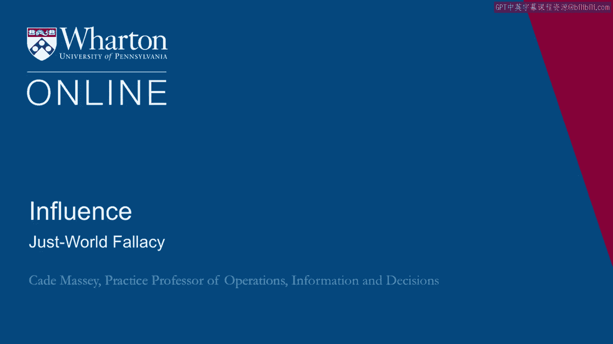

# 沃顿商学院《实现个人和职业成功》课程笔记 P66：2_公平世界谬论 🌍➡️❌

在本节课中，我们将探讨“公平世界谬论”这一概念，并分析它对个人职业发展的影响。我们将通过一个真实案例，理解权力认知如何塑造我们的职场行为与结果。

---

## 概述：权力认知与职业成败

理解权力及其维度如何真正影响一个人的职业生涯和生活？为了初步感知这一点，让我们从一个前学生的例子开始。

---

## 案例研究：诺亚的故事

诺亚于2005年从一所顶尖商学院毕业，本科是机械工程背景。他在商学院深受同学喜爱，评价包括“最聪明的孩子之一”、“优秀的队友”、“好人”。

毕业后，他加入了一家约百人规模的加州科技初创公司，担任产品经理——这是当时商学院毕业生最向往的职位之一。

### 充满挑战的工作环境

他进入的公司正面临巨大压力，需要达成风险投资设定的里程碑。他的直属上司并非经验最丰富的管理者，并且像许多初创公司的情况一样，工作过度饱和。公司的创始人CEO仍参与运营，但在做艰难决策时存在困难。这是一个令人兴奋但同样充满挑战的局面。

### 早期表现：喜忧参半

起初，他取得了一些成功。他与业务端的同事（市场与销售人员）建立了良好的关系，这些人很像他在商学院的同学，因此合作顺畅。

然而，作为产品经理，他还需要与技术端打交道，而他在这一侧的关系建立得并不顺利。他以努力工作著称，很早就树立了这一声誉，但持续面临挑战。

### 面临的挑战

以下是诺亚遇到的具体困难：
*   他与首席工程师就产品规格发生争执，可能过于依赖自己的机械工程背景。
*   他对一些高层提出的问题感到畏惧。特别是，一位在董事会中颇有声望的首席风险投资人，诺亚难以与之互动，似乎不知道如何应对此人的关切。
*   他屡次因管理层不愿承诺行动方案而受挫。在过度忙碌的上司和优柔寡断的老板之间，他常感到孤立无援，不清楚该采取何种行动。

### 情况恶化与最终失败

进入下半年后，他的挑战似乎成倍增加。他开始更加努力地工作，并希望老板们能注意到。他忙到无法参加投资者为其投资组合公司举办的定期聚会。

最终，他甚至失去了业务端重要盟友的支持，因为他无法推动和说服技术/工程端的人员。就在他工作满一周年前夕，他的产品连续第二次错过截止日期。一天早上，他走进公司，被毫不客气地解雇了。

从一年前充满希望的开端，到这个激动人心的环境，他彻底失败了。

---

## 从故事中发现的模式

我们不常听到这样的故事，但确实时有发生。最有才华的学生进入新环境后遭遇失败。其他人则有更温和的版本：他们进入环境后只是原地踏步，似乎永远无法取得进展。

多年来，我开始注意到这些故事中的一些模式：

**1. 开局不利**
许多人都拿到了一手难打的牌。偶然事件会发生，糟糕的老板会出现。这就是政治能力和理解权力与影响力的意义所在——有时你需要这种能力仅仅是为了完成工作。它可能无关升职或管理公司，在某些情况下，你仅仅需要它来完成本职工作。

**2. 第一印象至关重要**
许多遇到麻烦的人，麻烦始于最初阶段。公司在早期发生的事情具有极高的溢价。

**3. 建立良好关系困难**
这是我们看到的最核心的模式之一。我们所做的大部分事情都是通过他人完成的，这意味著那些善于通过他人开展工作的人将获得真正的优势。

**4. 被动的高昂代价**
在这个案例以及许多类似情况中，我们看到前学生不理解被动付出的代价。愿意改变环境、不将现状视为既定事实，会带来高回报。

**5. 信念体系的阻碍**
最后，一些人受到其信念体系的阻碍，特别是“公平世界”的观念——认为世界奖励努力工作，奖励善意。认为如果你是个好员工，埋头苦干，一切都会顺利。

---

## 深入探讨：公平世界谬论

在遇到此类麻烦的人群中，这是一个异常顽固的模式。自勒纳1982年的研究以来，心理学文献中已有记载。

关于“公平世界假说”的研究表明，许多人相信“人们得到他们应得的”，即好人可能得到奖赏，坏人受到惩罚。我们在儿童身上能看到这种心态，发展心理学中也有研究。但令人惊讶的是，许多成年人也持有这种信念。

我可以花相当多的时间来收集证据证明事实并非如此，但这本应是一种不需要证据的前提。根本没有证据表明世界是公平的。

问题在于，这种信念阻碍了人们从所有情境中学习的能力，尤其是向那些他们可能不喜欢或不尊重的人学习。它也使人对积极建立权力基础的必要性变得麻木。

---

## 本课程的目标

我们在这门课程中，正是试图为你提供建立权力基础的工具。我们希望以摒弃“公平世界”的信念作为起点，因为正是“公平世界”的**缺失**，才激发了人们对这些工具的需求。

---

## 总结

本节课中，我们一起学习了“公平世界谬论”的概念及其危害。通过诺亚的案例，我们看到：
*   仅凭努力工作、良好意愿和技术能力并不足以保证职业成功。
*   理解组织中的权力动态、主动建立关系、并积极影响他人和环境至关重要。
*   摒弃“世界是公平的”这一错误信念，是学习运用权力与影响力工具的第一步，它帮助我们更清醒、更主动地规划和管理自己的职业生涯。