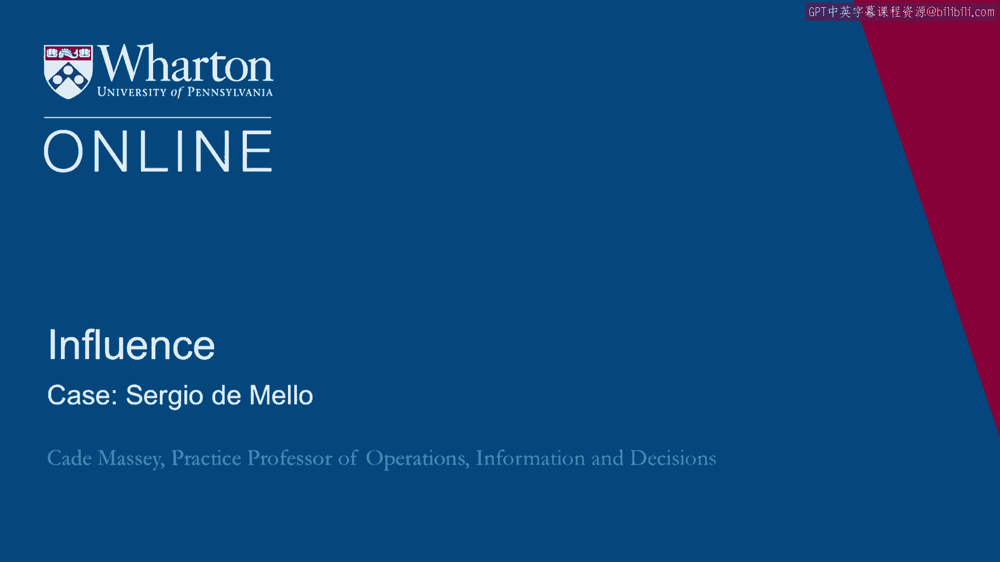
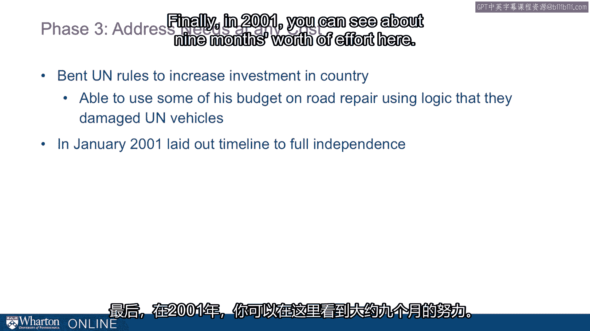
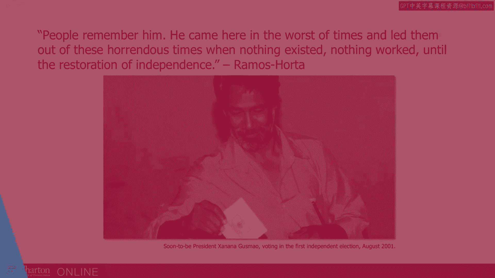

# 沃顿商学院《实现个人和职业成功》课程笔记 - P67：塞尔吉奥·德梅洛案例 📚

在本节课中，我们将通过分析联合国高级外交官塞尔吉奥·德梅洛在东帝汶危机中的行动，学习如何在极端困难和复杂的环境中运用领导力、沟通能力和影响力来应对挑战。我们将把他的应对过程分为三个阶段，并总结其核心策略。

---

上一节我们讨论了NOA等人在新环境中遇到的困境。本节我们将观察一个截然不同的成功案例——塞尔吉奥·德梅洛，看他如何在东帝汶这个近乎被摧毁的国家中，运用其外交智慧与领导力扭转局面。

德梅洛是一位资深外交官，来自巴西，职业生涯几乎全部奉献给联合国。他被广泛认为是下任联合国秘书长的最有力候选人。2003年，他在担任联合国驻伊拉克特使时不幸遇难。而他职业生涯中一次关键的考验，发生在1999年的东帝汶。

## 背景：东帝汶危机 🏝️

东帝汶原为葡萄牙殖民地，后被印度尼西亚占领。1999年，在联合国斡旋下，东帝汶举行独立公投并以压倒性多数通过。随后，印尼军方支持的当地民兵在撤离前对该国进行了系统性破坏：约75%的财产被毁，上千人丧生，国家基础设施几乎荡然无存。

联合国因此接管了东帝汶，并负有重建该国的责任。他们选择了德梅洛来领导这项几乎不可能完成的任务。选择他的原因包括：他来自巴西，会说葡萄牙语（东帝汶的官方语言之一）；他被认为具备完成此项任务的卓越能力；并且他得到了美国的大力支持。

## 第一阶段：抵达与初步行动 🚀

当德梅洛抵达时，东帝汶几乎是一片废墟，除了当地人民的意志，一切都需要从零开始。以下是他在最初几周（约六周）采取的关键行动：

*   **组建顾问委员会**：他迅速组建了一个包含联合国代表、东帝汶各主要及小型政党代表以及天主教会的顾问委员会，确保各方声音都被听到。
*   **重建司法系统**：全国仅有约60名律师。德梅洛团队立即着手招募和培训人员，任命法官，从头开始重建法律机构。
*   **注重象征意义与国家自尊**：他非常敏感于自身行为所传递的信号，努力表明自己并非“统治者”。例如，他学习当地语言德顿语，并在业余时间加紧练习。
*   **身先士卒，勤奋工作**：他以勤奋著称，在东帝汶期间每天工作长达19小时，这种工作态度也感染了整个团队。

## 第二阶段：危机加剧与困境 😰

然而，蜜月期很快结束，危机进一步恶化。德梅洛团队面临了前所未有的挑战：

*   **失业率高达80%**，联合国在降低失业方面进展缓慢。
*   **联合国缺乏实际重建技能**。正如一位工作人员所说：“联合国职员擅长外交电报，而非铺设电缆。”他们缺乏物理重建一个国家所需的各种专业技能。
*   **处理历史遗留武装力量失误**：对抵抗印尼24年的游击队，德梅洛最初采取严格限制措施，这引发了该群体的不满，因为他们曾是国家抵抗运动的领导力量。
*   **僵化的联合国规章阻碍工作**：联合国经费使用规定极其严格且常常不合时宜。例如，联合国工作人员拥有数亿美元的庞大预算，却几乎无法直接用于东帝汶人民（其全国预算仅约6000万美元）。有500辆联合国车辆在东帝汶，德梅洛却要费尽周折才能为东帝汶领导人争取到10辆。
*   **信任危机**：到2000年春天，经济依然凋敝，安全局势恶化，东帝汶人开始将联合国视为“第二次占领”，这是对当初促成独立的联合国最大的侮辱。

## 第三阶段：调整策略与突破僵局 🔄

面对濒临失败的境地，德梅洛不得不彻底重新设定优先事项，加倍努力。他进入了关键的第三阶段：

1.  **将安全置于首位**：他修订了维和部队的交战规则，允许他们从被动防御转为主动出击，并组织了几次大型清剿行动以驱散民兵。尽管他毕生倡导人道主义，但此时他判断安全是压倒一切的首要任务。
2.  **建立“联合政府”**：他做出了一个违反联合国规定的决定：在正式政府、选举和宪法产生之前，就将一半的政府部门领导职位（共8个部长级职位中的4个）分配给东帝汶人，赋予他们实权，而非虚职。为此，他召集全体700名联合国工作人员，当众宣布这四位东帝汶部门负责人是他们的新上司，并强硬表示：“要么服从他们，要么离开。”
3.  **巧妙绕过官僚体系**：他寻找联合国规章的“漏洞”为当地经济注入资源。例如，他以“路况太差损坏联合国车辆”为由，动用预算修复道路，从而间接帮助了当地建设和经济。
4.  **制定清晰的独立时间表**：为了消除东帝汶人对独立进程的焦虑，他制定并公布了一个明确的、步骤清晰的时间表，包括夏季选举、起草宪法、决定总统产生方式等，最终实现权力移交。

通过这些打破常规、灵活务实且充满魄力的措施，德梅洛最终带领东帝汶走出了最黑暗的时期。正如东帝汶独立运动领袖、后来长期担任外交部长的拉莫斯-奥尔塔所说：“人们铭记他。他在最糟糕的时刻来到这里，带领他们走出那段可怕的岁月——那时一无所有，一切瘫痪，直到恢复独立。”

---

本节课中，我们一起学习了塞尔吉奥·德梅洛在东帝汶危机中的领导实践。他的案例告诉我们，在极端复杂和资源受限的环境中取得成功，需要：
*   **敏锐的洞察与象征性行动**（如学习当地语言）。
*   **根据现实情况果断调整核心优先级**（将安全置于人道主义之上）。
*   **敢于打破僵化规则，进行制度创新**（建立联合政府）。
*   **灵活运用现有体系为实际目标服务**（寻找规章漏洞）。
*   **通过清晰沟通建立信任与期望管理**（公布独立时间表）。
德梅洛展现了一种将原则性、灵活性与坚定执行力相结合的高超领导艺术。