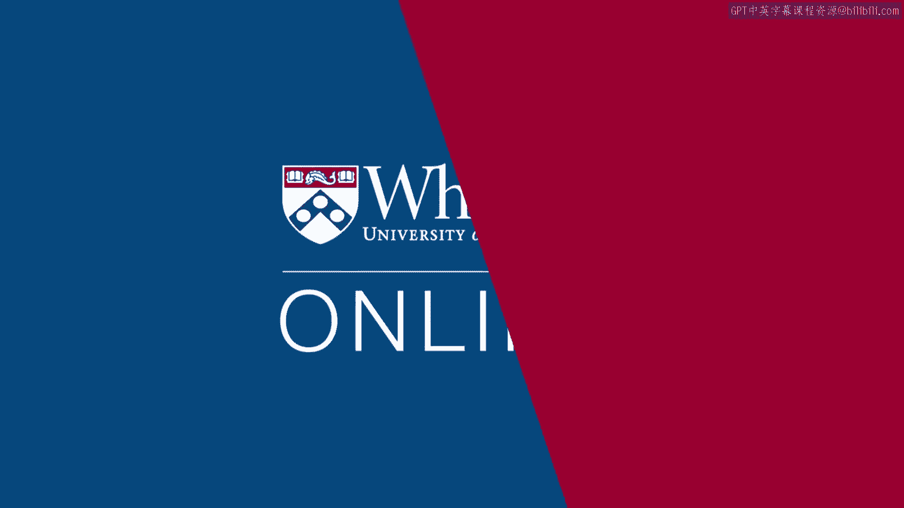

# 课程名称：沃顿商学院《实现个人和职业成功》第70课：你的看法 🧠

在本节课中，我们将探讨是什么将顶尖绩效者与普通绩效者区分开来。我们将了解到，这种差异并非源于天赋或性格，而是源于可学习和调整的行为策略。课程将引导你反思自身的影响力优势与不足，并设定需要运用影响力去实现的目标。

---

上一节我们探讨了绩效差异的普遍假设，本节中我们来看看罗伯特·凯利的研究发现。

罗伯特·凯利在1998年写了一本名为《如何成为明星》的书。这个书名有点俗气，但这本书非常出色，强烈推荐。他开展这项研究是为了理解顶尖绩效者与普通绩效者的区别。

他的假设或多或少是一种传统智慧。人们认为他们会在某些根本方面有所不同，比如更聪明、头脑更好，或者更善于交际、更努力工作，也许是工作狂。研究测试了所有这些因素，发现这些根本特质并不能区分明星与普通绩效者。

于是他们加倍努力，更仔细地观察，发现区别在于工作中的行为模式。事实上，顶尖绩效者和普通绩效者运用了许多相同的策略，但他们**对这些策略的重要性排序不同，优先级不同，描述也不同**。

这项研究最重要的启示之一是：区分顶尖绩效者与普通绩效者的不是DNA测试，而是他们的策略。并且，这些策略本质上对每个人都是可用的。

杰夫·费佛对此有如下表述：
> “我们研究权力与影响力的目标，我们这门课的目标，是让你相信，你确实可以获得权力，不是通过变成一个全新的人，而是通过**更战略性地、略有不同地做一些事情**。”

---

上一节我们明确了策略的核心地位，本节中我们将焦点转回你自身。

这会将焦点重新放回你身上，这也是本课程的一个重要主题。这是一门非常个人化的课程，我们希望你能停下来反思：这对你意味着什么？你因此想要做出什么改变？

以下是几个引导性问题，帮助你开始反思：

*   **你的一个优势是什么？** 在这个领域（影响力），你的一种有效影响他人的方法是什么？你影响他人时最常用的手段是什么？这是一个起点，你可以从这里获得一些进展。
*   **你的一个弱点是什么？** 你看到别人使用的哪种影响力方法是你难以应对的？你可以从哪些方面开始尝试并改进？这一点或许更重要。
*   **你想实现的一件事是什么？** 你想要创造、改变或完成哪一件事，需要你竭尽所能地运用影响力？这可以说是学习本课程的动机。你想在外界达成什么目标？有哪些抱负需要你运用权力和影响力来实现？

---

最后，我们用凯利的另一个观点作为结尾，这里用塞尔吉奥·德梅洛的例子来说明。

**让这些明星脱颖而出的，不是他们头脑中有什么，而是他们如何运用他们所拥有的。**

---

本节课中我们一起学习了：区分顶尖与普通绩效者的关键在于行为策略而非先天特质；这些策略是可习得和调整的；提升影响力的起点在于真诚地反思自身的优势、弱点以及渴望达成的目标。记住，核心在于你如何运用已有的资源。