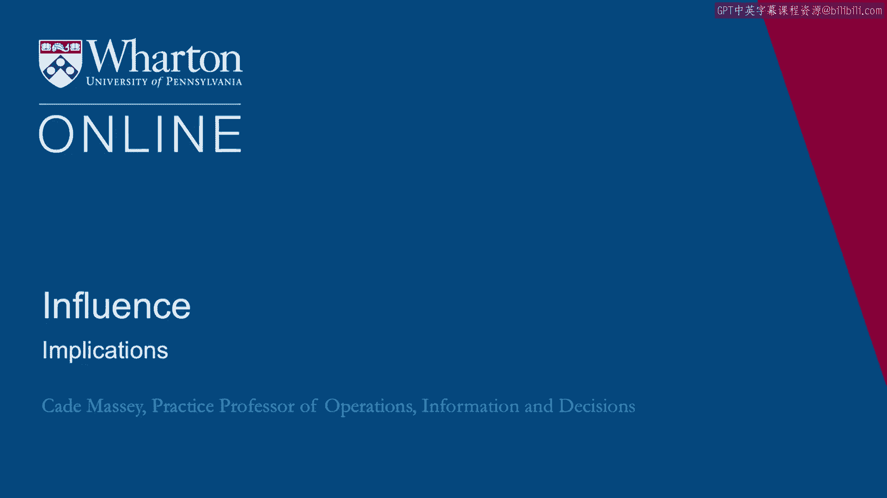
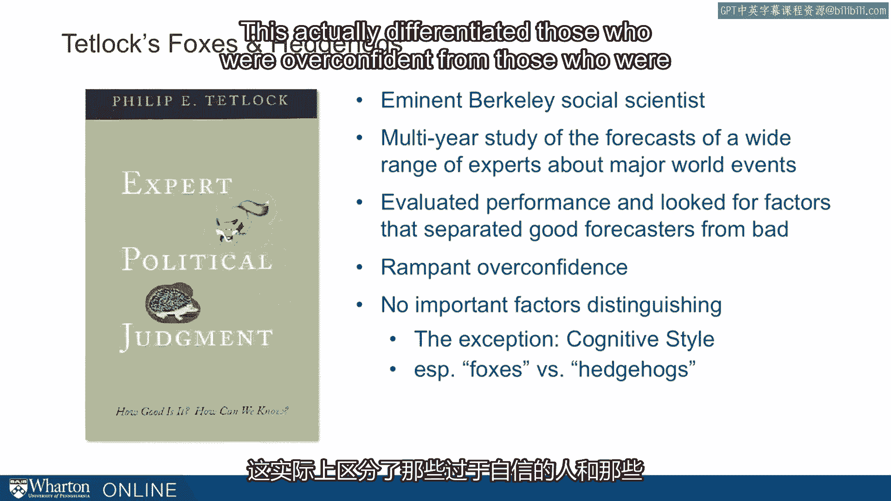
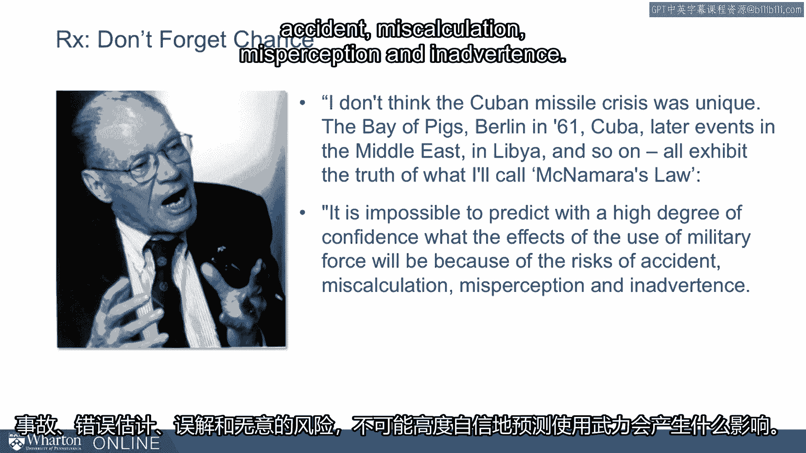

# 🧠 课程 P74：组织行为模型的应用与启示

在本节课中，我们将探讨艾利森模型对个人及组织的实际意义，学习如何运用多重视角分析组织行为，并理解偶然因素在决策中的关键作用。

---

## 🔍 模型揭示的权力来源与限制

上一节我们介绍了艾利森的三个组织行为模型。本节中我们来看看这些模型如何帮助我们理解组织中的权力动态。

该模型揭示了权力的来源与限制。每个模型都指出了决策形成的方式。这些方式既是机会，也是限制。因此，精明的分析需要运用多重视角。

我们倾向于用特定的视角看待情境，即我们拥有惯性的思维方式。艾利森的整个动机就是推动政治学领域摆脱他们惯用的理性分析视角。你的惯性视角是什么？你是否倾向于将组织和行动视为理性行为？有些人可能持有官僚政治的惯性视角，认为一切都是由基层达成的个别交易决定的。很少有人——我们将更加强调这一点——会采用中间模型，即认为许多组织行为仅仅是惯性和例行程序。但这通常不引人注目，我们也不倾向于用这种方式解释行为。

艾利森的观点是，如果我们运用多重视角，在试图理解已发生之事或预测未来之事时在不同视角间切换，我们就能更好地理解组织。

---

## 🦊 狐狸与刺猬：认知风格的重要性

这与菲利普·泰特洛克近期的一些研究略有联系。泰特洛克目前在宾夕法尼亚大学。这本书是他在伯克利时写的。这是心理学领域一项独特的判断力研究。通常心理学中的判断力研究，尤其是历史上的研究，都是通过实验研究进行的，经常使用学生作为被试，且刺激材料简短。泰特洛克做了一些相当不寻常的事。他决定研究现实世界专家——经济学家、政治评论员、政治科学家——对现实世界问题的判断。问题包括南非会发生什么、苏联解体后会发生什么、未来选举会发生什么、经济将走向何方。

在长达十年的时间里——在当时以这种方式研究判断力是闻所未闻的——泰特洛克记录了人们的预测，然后追踪世界上实际发生的情况，以确定他们做出这些预测的能力如何。他发现普遍存在过度自信的现象。我们在实验室中观察到的过度自信，在现实世界中也同样存在。重要的是，他试图理解是什么区分了过度自信的人和那些校准良好的人。他找不到任何东西。任何你可能认为能预测这一点的因素——教育、政治倾向、性别——都与这无关。不过，他确实发现了一个差异，他称之为认知风格。他区分了他所谓的“狐狸”与“刺猬”。这实际上区分了过度自信的人和那些校准更好的人。

他这是什么意思？泰特洛克说，刺猬是那些“只知一件大事”的思想者。他们积极地将那一件大事的解释力扩展到新的领域。他们对那些不理解的人表现出不耐烦，并对自己已经是相当熟练的预测者——至少在长期内——表达了相当大的信心。另一方面，狐狸，泰特洛克说，是那些“知道许多小事”、行业技巧的思想者。他们对宏大方案持怀疑态度。他们将解释和预测不是看作演绎练习，而是看作需要将不同信息来源缝合起来的灵活、临机应变的练习。这些判断者对自己的预测能力相当谦虚。

这是一个巨大的区别，也是他发现的唯一能预测在这些现实世界、有意义的情境中做出良好判断的区别。我们现在提出这一点，是因为狐狸正是那种会使用艾利森模型中所有三个层次的人。狐狸是那些不会只带着模型1或模型3的信念去看待问题的人。他们会想：“嗯，我需要从多重视角来看待这些情况。如果我运用多种视角来分析这个情境，我就能更好地判断接下来会发生什么。”

---

## ⚙️ 被忽视的模型：组织过程

关于艾利森模型的启示，并非所有模型都受到同等重视。我的假设是，虽然模型1在政治分析中长期占主导地位，我们中的许多人痴迷于模型3——尤其是在我们自己的组织中，我们对那些持续进行的官僚谈判再熟悉不过了。我们有时可能会忽视其他组织中发生的事情，但我们往往会考虑一些模型3。真正被忽视的是模型2，即这些组织过程。

为了让这一点更真实，你可以想想在你的组织中有哪些例子是例行程序在驱动你们所做的事情？例行程序将是解释某些结果发生或某些决策做出的最佳原因。随着时间的推移，我从学生那里收集了一些这类例子。

以下是学生们提到的一些组织过程驱动行为的例子：
*   **英国石油公司墨西哥湾漏油事件**：几年前英国石油公司如何应对，以及最初导致此事的一些矿产管理局许可问题。
*   **卡特里娜飓风后的政府响应**：2005年卡特里娜飓风后，许多行为只是例行程序，未能很好地适应当时发生的情况。
*   **9/11前后的情报收集**：这些都是政府方面的例子，但也有非政府的例子。
*   **医院中的许多例行程序**：医院中有许多例行程序，有时是为了防范风险，但结果导致太多事情变得例行化。
*   **校园招聘**：几年前一些学生举的例子。当时我在耶鲁，一些学生说：“我愿意认为这些组织来耶鲁招聘是因为我们是最好的学校，但可能实际上——我确信在某些情况下——只是因为他们一直这么做。”或者有人说，10年前因为地理位置近或认识某人而开始，现在就成了做事的方式。
*   **报纸运营**：学生举的例子，报纸的运营有多少是围绕着每天生产报纸的周期建立的。

再次强调，推动你们关注组织中这种未被充分重视的方面。这是一个解释组织为何如此行事的未被充分重视的模型。哪些组织过程在驱动你的组织？如果你想影响组织中发生的事情，你可能需要关注哪些组织过程？

---

## 🎲 最后一个启示：不要忘记偶然性

我们还有一个启示，它并非直接源自艾利森，而是源自艾利森之后的所有心理学研究，那就是：不要忘记偶然性。艾利森提出的框架有一个危险，即你可以完全解释发生了什么，但如果你完全解释发生了什么，你就会忽略偶然性的作用，这将使你成为预测未来事件的糟糕预测者，因为未来总是存在很多不确定性和偶然性。

所以最后一个告诫：不要忘记偶然性。事实证明，即使是当时的政府官员也在考虑偶然性。有一个团体——我之前提到过“鹰派”和“鸽派”这两个术语的由来——但在后续分析中，人们谈到有一种“猫头鹰派”，既非鹰派也非鸽派。这包括麦克纳马拉、邦迪和鲍尔，它源于他们对“绝望的非理性苏联行动”或“意外升级”的风险所赋予的权重。

换句话说，他们知道事情可能不会完全按计划发生。他们知道存在导致灾难或引发核战争的意外风险，而这种对偶然性的考虑影响了他们的决策。

麦克纳马拉晚年，有人为他制作了一部纪录片，他谈到了这次危机。这是在事情发生50年、40年、45年之后，他说：“我不认为古巴导弹危机是独一无二的。猪湾事件、1961年的柏林危机、古巴以及后来在中东和利比亚等地的事件，都展现了我称之为‘麦克纳马拉定律’的真理。麦克纳马拉定律是：**不可能高度自信地预测使用军事力量的效果，因为存在意外、误判、误解和疏忽的风险。**”

“在我看来，这条定律应该刻在白宫和五角大楼所有门廊的上方，它是古巴导弹危机最重要的教训。” 他谈论的是军事，但我们知道偶然性也适用于非军事情境。最后一个启示是：我们有了这些视角，我们有了这些模型，但我们也需要考虑偶然性。

[空白音频]

---

## 📝 总结

本节课中我们一起学习了艾利森组织行为模型的实际应用与启示。我们了解到，精明的组织分析需要运用多重视角，避免陷入单一的“惯性视角”。我们探讨了“狐狸”式多视角思维相对于“刺猬”式单一思维在预测判断上的优势。我们认识到，组织例行过程（模型2）常常是驱动行为的关键但被忽视的因素。最后，我们强调了在任何分析框架中都必须为“偶然性”和不确定性留出空间，因为现实世界充满了意外和风险。掌握这些要点，将帮助你更全面、更灵活地理解和应对复杂的组织环境。