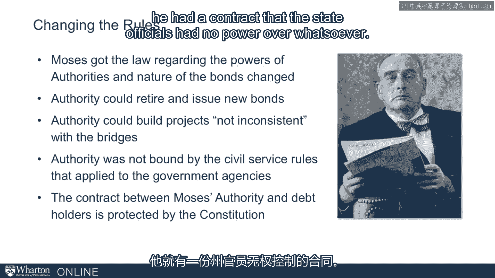
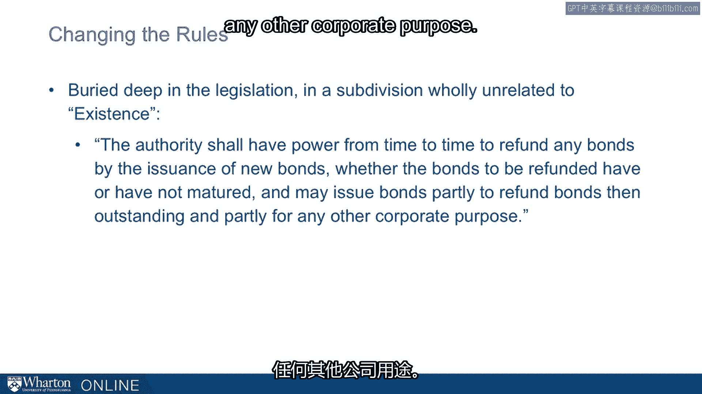

# 沃顿商学院课程《实现个人和职业成功》第75讲：罗伯特·摩西案例 🏗️

在本节课中，我们将通过罗伯特·摩西的案例，深入探讨组织流程作为权力与影响力来源的重要性。我们将看到他如何巧妙地运用规则和制度，为自己创造了长期且稳固的权力基础。

---

在本模块的前期内容中，我们强调了**组织流程**的重要性。

这个模型是格雷厄姆·艾利森向我们介绍的。

而罗伯特·摩西正是精通组织流程的大师。

他在权力与影响力领域是一个重要人物，这有充分的理由。

随着我们深入探讨，我们会更清楚地理解这一点。

从古巴导弹危机的讨论过渡到这里非常合适，因为他最大的权力来源之一，正是对组织流程的精通。

我想讲述一个关于他的简短故事。这个故事出自《权力掮客》一书。

我们对罗伯特·摩西的许多了解，都来自罗伯特·卡罗在70年代初为他写的书。

这是卡罗的第一本书。卡罗后来继续撰写了四卷（即将出版第五卷）关于林登·约翰逊的传记。

他基本上每十年写一本千页巨著。他的第一本就是关于罗伯特·摩西的。

摩西曾是纽约的交通专员。

实际上，在30年代、40年代、50年代和60年代，他担任了纽约地区许多不同机构的专员。

直到70年代初，罗伯特·摩西在纽约都掌握着权力。这是一段惊人的历程。

有人称他为20世纪纽约市最具影响力的人物。

在美国其他城市，也找不到任何人能像他那样长期掌权。

那么，他是如何做到长期掌权的？通过观察罗伯特·摩西的所作所为，我们能对权力有什么理解？

以下是《权力掮客》中的一个简短故事，特别涉及组织流程这个议题。

摩西的职责之一包括管理特里博罗桥梁与隧道管理局。

当时是30年代初。这是美国开始使用“管理局”这种形式的初期。

当时的管理局非常专注于特定的目的和需求。

你需要建一座新桥？好，我们就成立一个管理局。

他们可以收取过桥费。一旦桥梁的成本收回，管理局就解散。

所以它是一个独立的借贷机构。和其他管理局一样，它的目的是为建造和管理的桥梁收取通行费。

它独立于州政府机构之外。

它是一个独立的实体，但受纽约州法律管辖。

摩西很高兴能用这种方式建桥，但他是一个野心勃勃的人。

摩西想要建造许多桥梁、道路和公园大道。

他想要改变纽约地区的基础设施，而且他非常擅长于此。

因此，这个管理局的专注性和时限性（完成后即解散）对他形成了限制。

他面临几个问题。他还受到州法律的约束。

他只能以特定方式聘用人员。例如，他不能雇佣人员进行长期规划工作。

随着时间的推移，他必须遵守这些州法律，但这些法律不符合他想要的工作方式。

他还被限制只能建造桥梁以及通往桥梁的道路。

所以它的重点非常明确，就是桥梁。这基本上是当时美国“管理局”概念的核心理念，至少在早期是围绕桥梁的。纽约港有一个例外，但除此之外，都是围绕非常具体的基础设施项目。

最后一个问题是，桥梁赚的钱太多了。

通行费很快就能偿清桥梁的成本。而桥梁所需的维护费用相当低。

因此，管理局建成桥梁后就会解散。

而他能够产生的所有收入也随之消失。

所以他没有资源去做他想做的事情。

那么，他是如何应对这些问题的？他如何驾驭这些难题？

摩西并非民选官员。事实上，他早年曾竞选公职，但意识到自己无法获胜，于是选择了另一条施加影响力的道路。

他培养了起草法律的专业知识。

他在奥尔巴尼（纽约州首府）很有名。他有良好的业绩记录，已经完成了很多建设项目。

因此，他赢得了奥尔巴尼立法者的信任。

所以，他的诀窍本质上是改变规则。

他修改了关于管理局权力和债券性质的法律。

他通过亲自在奥尔巴尼起草立法来实现这一点。根据他撰写的新规则：

*   **规则一**：管理局可以偿还旧债券并发行新债券。
*   **规则二**：管理局可以建造**与桥梁不矛盾**的项目。记住，之前他们仅限于桥梁和通往桥梁的道路，现在只要不与桥梁矛盾，他们可以做任何想做的事。这是尽可能宽泛的写法。
*   **规则三**：管理局不受适用于政府机构的公务员规则约束。

那么，他是如何做到这一点的？如何成功实现？

卡罗向我们讲述了这个精彩的故事：如果立法者和公职人员知道他在做什么，他们绝不会允许。那么他是怎么做的？

他做了几件事。主要是他**偷偷地将措辞塞进法案的末尾**。

或者，他会在法案后面使用一个条款，直接与法案前面明确方向的条款相矛盾。

部分因为他能力强，部分因为他们信任他，他得以做到这一点。

但如果事情曝光后他们可以修改，这还不够。这才是真正的诀窍。他如何防止规则被修改？

他做到了，因为他不仅把这些写进了立法，还写进了与债券相关的**合同**里。

这是他看到的一种能力，一种无人察觉的、属于管理局的能力：**一旦债券发行，它就是债券发行人与持有人之间的合同**。这是一份契约。

而合同受到美国宪法的保护。没有人可以凌驾于合同之上。任何州级权力机构，任何低于宪法级别的力量，都不能违背合同。

因此，一旦他将这些法规变更写进与债券相关的合同里，他就拥有了一份州政府官员**完全无权干涉**的合同。

这是一个妙招。但还有最后一个问题需要解决：资金怎么办？桥梁成本偿还太快了。因此，你发行债券，没问题，但一旦项目完成，你就得偿还债券。

这是他的最后一个妙招。他在立法深处写入了完全违背表面条款的术语。

在立法开头，关于管理局存在的条款和以往一样写着：一旦债务偿清，管理局即解散。

但在深处，他写道：
> **“管理局应有权随时通过发行新债券来偿还任何债券，无论待偿还的债券是否已到期，并且可以发行债券，部分用于偿还当时未偿付的债券，部分用于任何其他公司目的。”**

基本上，他可以做任何他想做的事。他可以随时发行债券。

并且记住，这些债券中包含赋予他这些权利的合同，这些权利不能被地方或州当局推翻，它们受到宪法保护。

这是一次非凡的权力攫取，并且保护了他。

这实质上赋予了他毕生做自己想做的事的权力。

毫不夸张地说，他通过精通管理管理局的**组织流程**，确保了自己毕生的权力。

人们有一段时间没有意识到这一点，但一旦他完成这些，他就毫无顾忌了。

当时的纽约市长是菲奥雷洛·拉瓜迪亚。他一直与拉瓜迪亚合作，并打算继续合作。拉瓜迪亚当然是一位非常受欢迎的市长。

但当拉瓜迪亚听说摩西开始以非常不同的方式雇佣人员，按照与市政指导方针冲突的方式管理他们时，拉瓜迪亚写信给他。

拉瓜迪亚基本上提出了抗议。摩西说：“我会和我的律师以及债券持有人商量。”

拉瓜迪亚回应道：“债券持有人？市长制定了政策。那是城市的政策，管理局的债券持有人绝对没有发言权。”

摩西的回答非常简洁。他说：“**我想你最好读一下协议和合同。**”

他将死了拉瓜迪亚。他毕生都将死了拉瓜迪亚。

凭借这种权力，他继续对纽约地区施加了非凡的影响力。

谢谢。

---

**本节课总结**

在本节课中，我们一起学习了罗伯特·摩西的经典案例。通过这个案例，我们看到了**组织流程**如何成为权力的核心来源。摩西通过以下关键步骤构建并巩固了自己的长期影响力：

1.  **识别限制**：他清楚看到了现有法律和规则（如管理局的权限、债券规则、人事制度）对其抱负的限制。
2.  **改变规则**：利用其专业知识和信誉，他亲自起草立法，巧妙地修改了游戏规则，极大地扩展了自己的权力范围。
3.  **固化权力**：他将关键规则写入具有宪法保护的**债券合同**中，使得后续的政府官员无法轻易推翻，从而将临时性权力转变为永久性权力。
4.  **运用权力**：当权者（如拉瓜迪亚市长）挑战他时，他利用合同条款作为无可辩驳的盾牌，巩固了自己的独立王国。

这个案例深刻地说明，真正的权力往往不在于职位本身，而在于对塑造和运行组织的**规则、流程和系统**的理解与掌控。对于希望提升影响力的个人而言，理解并善于运用组织内的正式与非正式流程，是一项至关重要的能力。