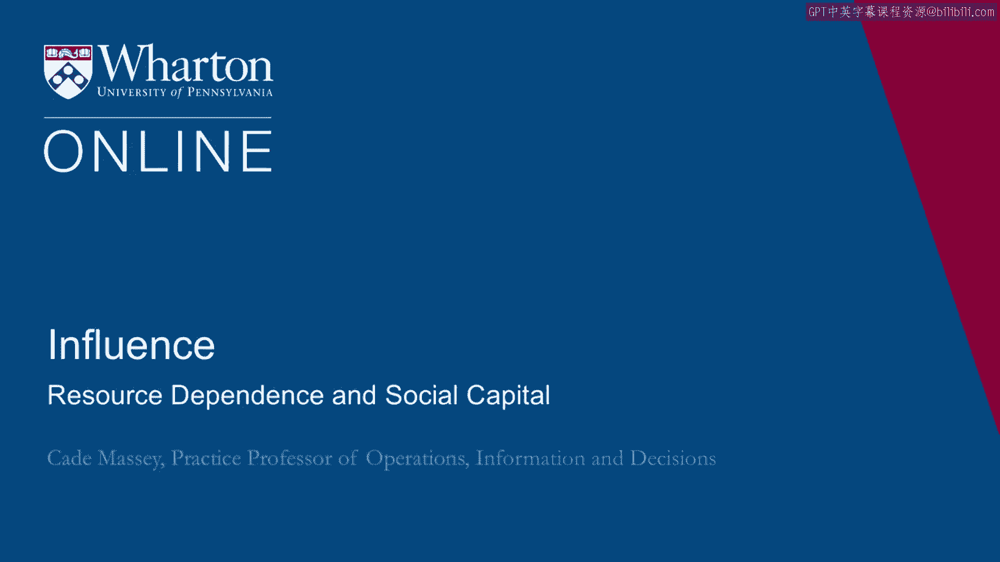
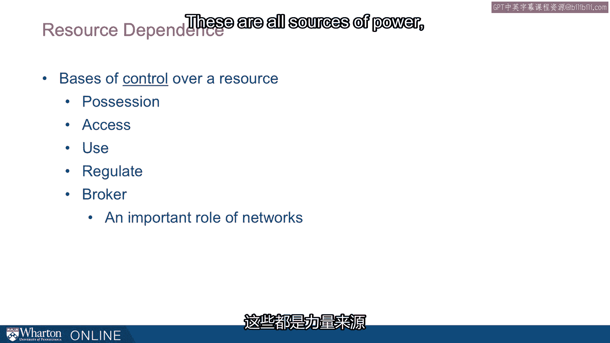
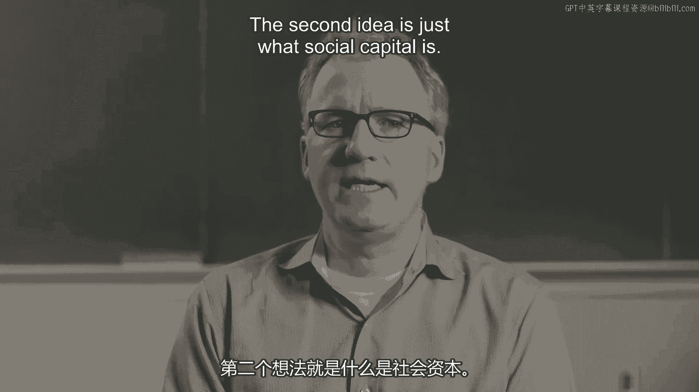

# 沃顿商学院《实现个人和职业成功》课程笔记 P80：资源依赖与社会资本 📚

在本节课中，我们将学习两个关于非正式网络的核心基础概念：资源依赖与社会资本。理解这两个概念，是深入分析人际网络如何影响个人权力与组织绩效的关键。

在深入探讨非正式网络的细节之前，我们先来了解两个基本概念。

## 资源依赖理论 ⚖️

第一个概念是资源依赖理论。这个理论真正开启了杰夫·埃弗斯的职业生涯。

杰夫是我们将在课程中多次提及和引用的人物。

他最初的研究工作就是着眼于资源依赖这一概念。他对此的总结是：

**“权力源于他人对我们的依赖。”**

这种依赖程度取决于两个因素：他人对我们所控制资源的需求程度，以及该资源的可替代来源有多少。

因此，权力的核心在于他人需要我们什么，以及我们控制了哪些他们无法从别处轻易获得的东西。

杰夫进一步阐述道，这并不意味着你必须**拥有**该资源，你只需要对其拥有**有效的控制权**即可。

所以，所有权和控制权并不总是完全一致的。

可能存在不涉及所有权，却能获得控制权乃至权力的其他方式。

这些方式包括**占有**，也包括**访问权**。

如果你能控制对某个资源的访问，你就对其拥有了权力。如果你能控制其使用方式，如果你能进行监管，那么在我们的网络讨论中，一个非常重要的概念是：如果你能充当**中间人**，将需要资源的人与真正拥有资源的人联系起来，这些都是权力的来源。

这些概念在我们讨论网络时将非常相关。

## 社会资本 💡

第二个概念是社会资本。

历史上，人们曾将网络视为一种获取影响力的非正统方式，是绩效的替代品。你可以把工作做好，或者你可以拥有一个关系网。

你可以这样理解：

**绩效 → 影响力** 或者 **关系网 → 影响力**。这是历史上的看法。

换句话说，网络和社会资本曾名声不佳。

这种旧观点已被新观点取代。新观点认为，网络实际上**驱动**着绩效。

我们是通过网络来取得绩效的。网络成为了实现绩效的一种**手段**，而非替代品。

你可以将其理解为：**网络 → 绩效 → 影响力**。这是非常不同的看法。

这表明，网络并非替代品。我们知道你必须是一个优秀的执行者，但事实上，成为一个优秀执行者的一部分，就是拥有那样的网络。

我们可以从两个大的范畴来思考：**人力资本**和**社会资本**。

我们习惯于从人力资本的角度来思考和管理我们的员工或人才。人力资本通常被认为是个人内在的能力。

有些人比其他人更聪明，有些人受过更好的教育，有些人经验更丰富。

如今，我们越来越认识到，人们为组织或团队带来的，还有他们的**社会资本**。

事实上，人们的社会资本是不同的。他们在通过他人进行协调和创造价值的能力上存在差异。

拥有更多社会资本的管理者，实际上能从其人力资本中获得更高的回报。

某些人拥有的网络比其他网络具有更高的社会资本。总的来说，拥有良好的社交网络和高社会资本，能增强管理者在组织内外发现和利用机会的能力。

这是当前关于网络和社会资本的更主流观点。

它促使我们更深入地探究：“这很有趣。那么，网络的哪些特质、社会资本的哪些方面，使得某些网络比另一些更有价值？”

---

**本节课总结**：我们一起学习了资源依赖与社会资本这两个核心概念。资源依赖理论指出，权力源于他人对你所控制资源的依赖程度。社会资本则强调，个人的关系网络本身就是一种能驱动绩效、创造价值的资本，而非绩效的替代品。理解这两点，是分析非正式网络影响力的基础。