# 课程17：网络结构 🕸️

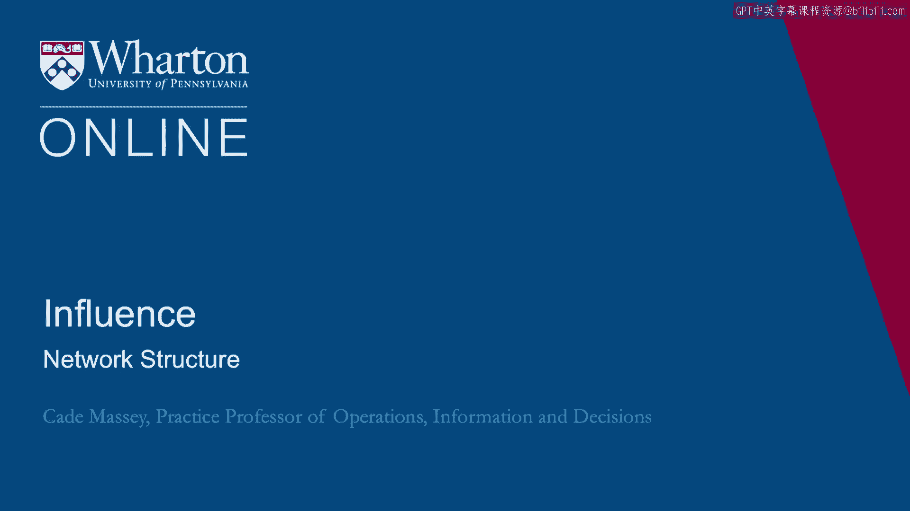

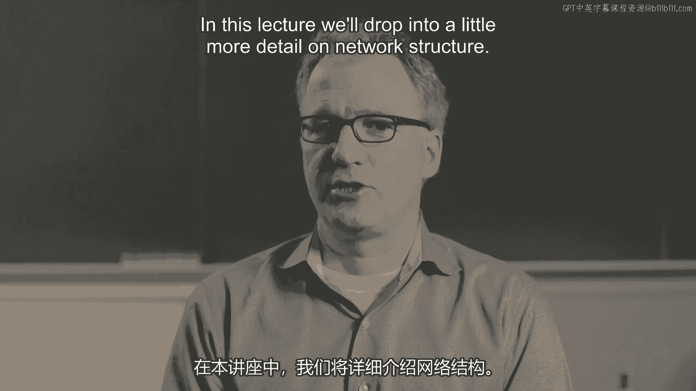

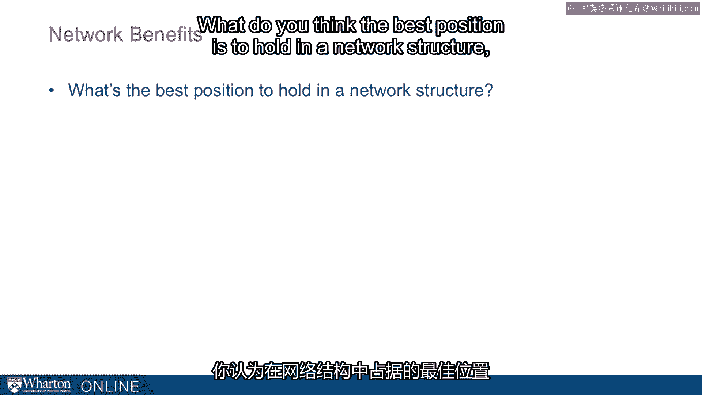

在本节课中，我们将更深入地探讨网络结构，理解个人在社交网络中的位置如何影响其获取信息和机会的能力。我们将介绍核心概念，如结构洞、网络密度和效率，并通过实例分析不同网络结构的利弊。

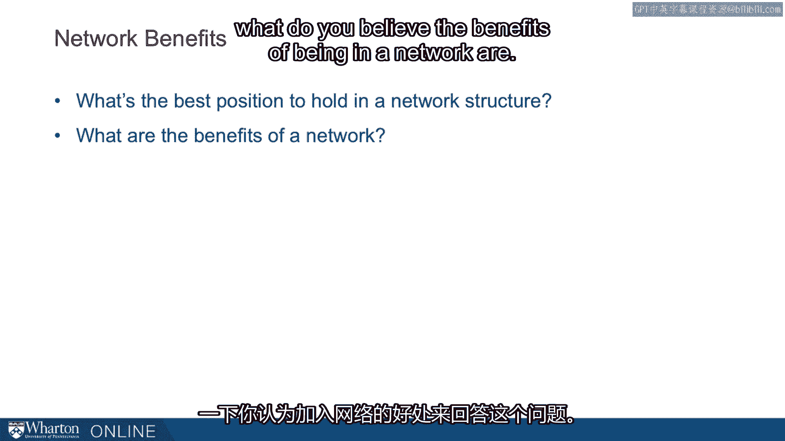

---

## 概述：网络中的位置与价值

我们首先思考一个问题：在网络结构中，你认为最佳的位置是什么？

你的直觉可能会引导你思考，身处网络能带来哪些好处。

人们对此有各种各样的看法，但显而易见的好处包括：归属感、温暖、陪伴、娱乐等。从职业角度，我们考虑机会、资源和信息。

我们将重点关注最后一个好处：信息。那么，成本呢？你认为身处网络的成本是什么？这个问题有些模糊，但大多数人，尤其是时间紧张的学生，都能理解并认同一个主要成本：维护网络所需的时间。

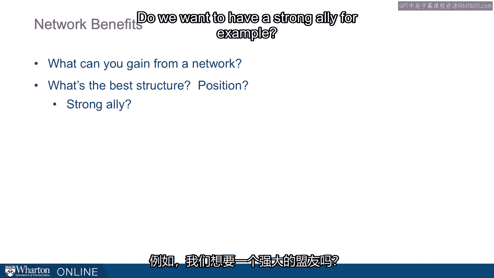

我们的时间是稀缺资源。为了理解这个领域的基本思想，我们在此简化模型：**将收益视为信息，将成本视为时间**。

基于这个设定，我们想处于网络中的什么位置？以下是几种常见的思考方向：

以下是几种常见的网络定位策略：

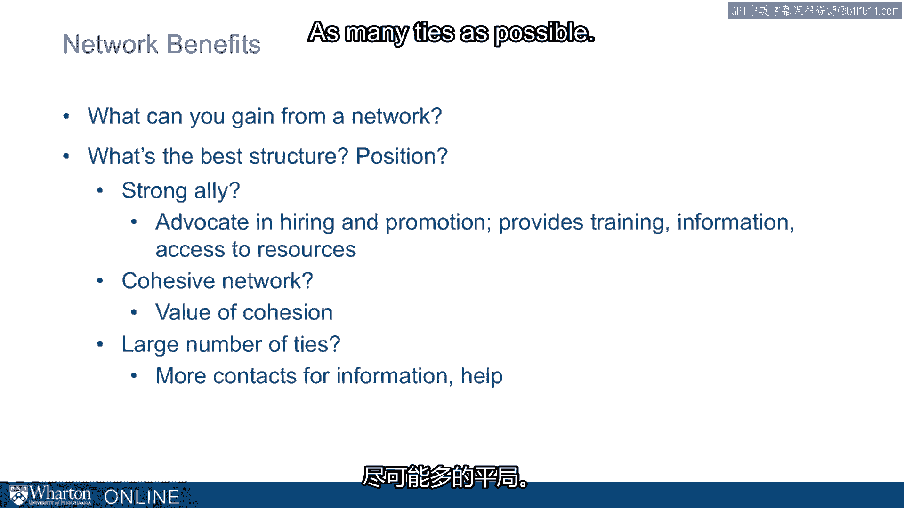

*   **依附强者**：与网络中最强大的人建立联系。这能为你提供招聘和晋升的倡导者、培训、指导和支持。
*   **融入紧密网络**：身处一个人际关系紧密、彼此熟识、易于协调的群体中。
*   **扩大网络规模**：建立尽可能多的联系。这是最常见、最直观的答案。
*   **占据中心位置**：处于网络的中心，让信息流必须经过你。

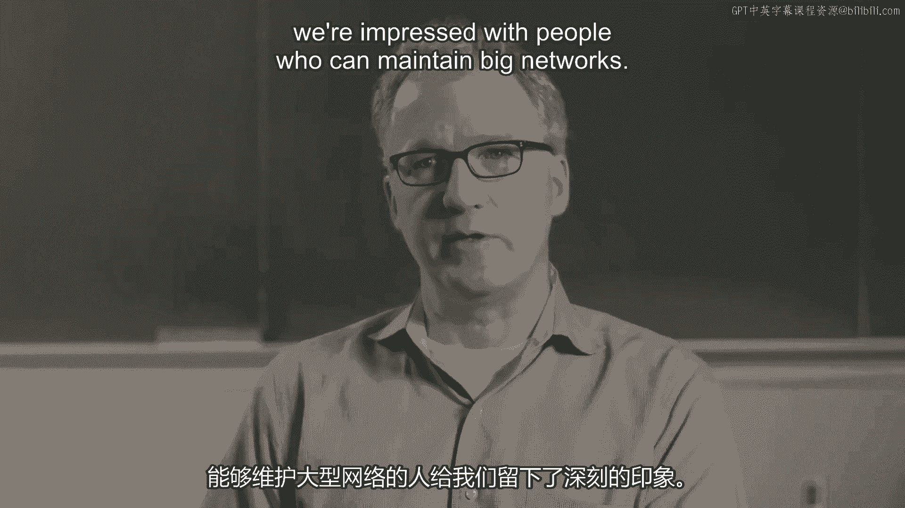

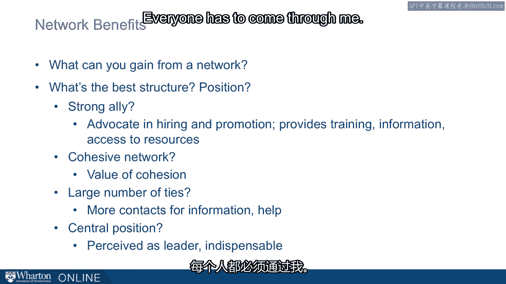

这些想法都相对直观。因此，我想重点强调另一个不同的概念：**结构洞**。

---

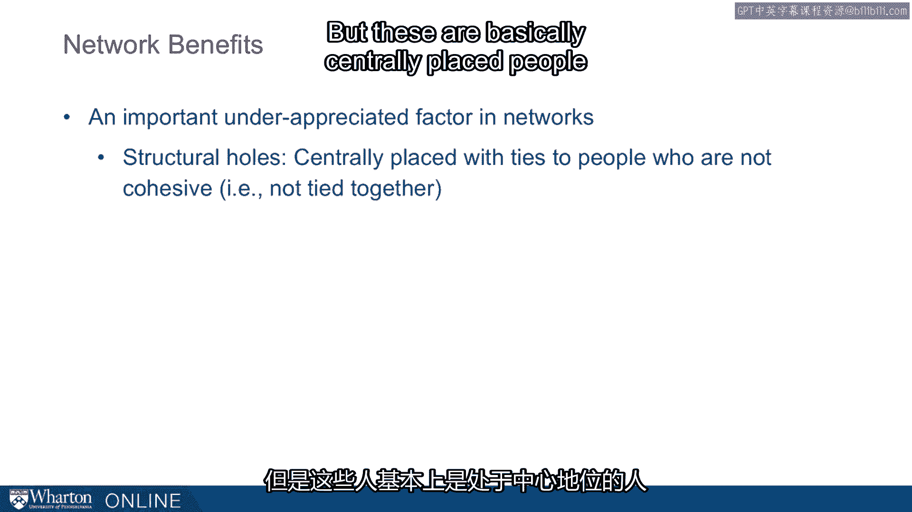

## 核心概念：结构洞

结构洞指的是网络中那些联系着互不关联群体的中心人物所占据的位置。

其核心思想是：在网络中，并非每个人都彼此相连。如果你能位于互不关联的群体之间，你就跨越了一个“结构洞”，这可能带来巨大的价值。

让我们通过一张图来更清楚地说明。

假设有一个六人网络。特别关注图中红点代表的人。

左侧是一个**紧密网络**，所有人都彼此相连。右侧是一个**断裂网络**，人数更多，但其与左侧的主要区别在于：左侧网络密集，右侧网络断裂。

如果你移除红点代表的人，在紧密结构中，其他人仍然彼此相连，信息流动方式不变，整体变化不大。然而，在断裂网络中，如果你移除红点代表的人，这些群体之间就完全失去了联系，组织将处于截然不同的状态，信息无法流动，功能将大不相同。

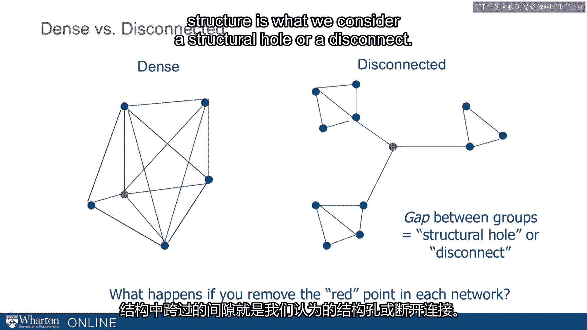

显然，红点位置的人在紧密结构和断裂结构中所扮演的角色会非常不同。在断裂结构中，红点所跨越的那个缺口，就是我们所说的**结构洞**或**断裂**。

---

## 紧密网络 vs. 断裂网络

我们将重点讨论结构洞带来的好处，这几乎决定了后续的一切。

*   **紧密网络**：结构洞相对较少，人们高度连接，相互影响。这通常是一个凝聚力强、同质性高的群体。他们紧密合作，想法可能相似，拥有经济学家或社会学家所称的**冗余信息**，并且通常利用有限的资源。
*   **断裂网络**：存在许多结构洞。这通常反映了一个非凝聚的、异质性的群体。他们提供了**差异化的、非冗余的信息**机会，并能获取更广泛的资源。

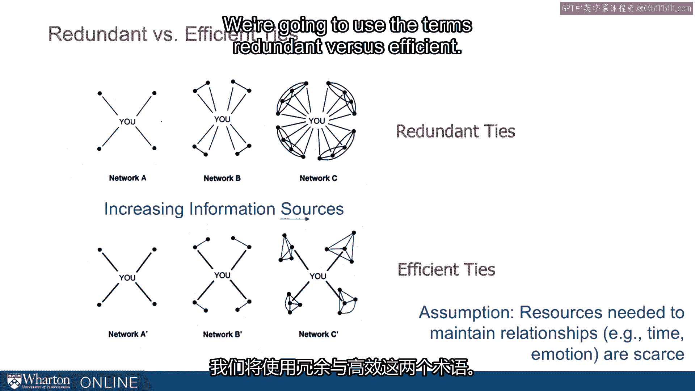

这个概念最初源于马克·格兰诺维特关于“弱连接”的研究，后由社会学家罗恩·伯特深入发展。我们来更详细地探讨一下。

---

## 网络效率：冗余 vs. 高效

设想你的网络从4人扩展到8人再到16人，如果以断裂方式（高效）和紧密方式（冗余）构建，会是什么样子。

以下是两种网络构建方式的对比：

*   **冗余网络（上图A, B, C）**：每次增加新人，都建立新的直接联系。从4个关系到8个再到16个关系。虽然联系人多了，但维护成本也随之增加。社会学家称之为**冗余联系**。
*   **高效网络（下图A‘, B’, C‘）**：联系人从4人到8人再到16人，但始终只维持4个直接关系。在每个阶段，他们都拥有**完美高效**的网络。他们跨越了结构洞，这是一个断裂的网络。通过同样的4个关系，他们就能触及16个人，因为他们以特定的方式构建了网络。

社会学家认为底部网络**高效**，顶部网络**冗余**，因为前者以低得多的成本获取了相同的信息。

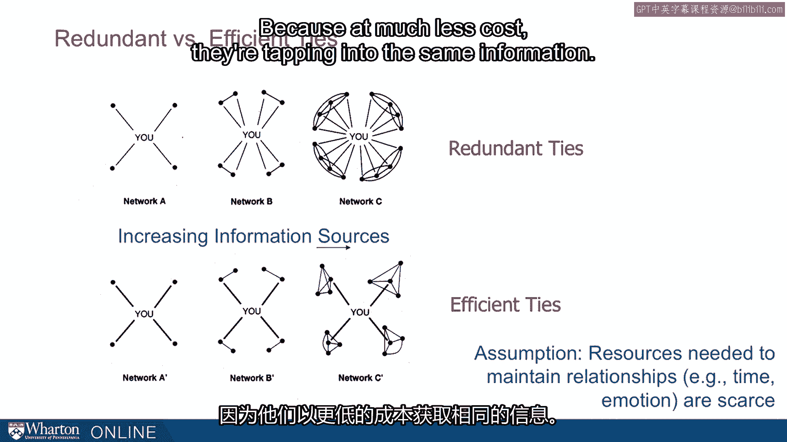

这里的假设是，维护关系所需的资源（时间和情感）是稀缺的。这是一个非常合理的假设。基于此，研究者们将其推向极致并提出：既然资源稀缺，或许你应该考虑构建一个更高效的网络。

---

## 网络多样化

有了这些概念，让我们开始探讨，如果你认真对待这些理论，考虑使你的网络多样化，网络会有何不同。

在这张图中，我们从一个非常紧密的网络开始。一个人有5个关系，触及大约10-12个人，其中大多数人与网络中的其他人相连。经过多样化之后，同样是5个关系，现在却触及了更广泛的、可能超过20个人，其中许多人彼此并不相连。因此，你触及了更多样化的资源。

这就是社会学家所声称的、更断裂的网络结构的好处。他们甚至主张追求更高效的网络，而避免在紧密网络中看到的冗余。

当然，好处很多。处于断裂网络中的人会最先知道每个小圈子之外的信息。如果他们愿意，可以挑动对立派系相互竞争。他们也可能被寻求作为中间人，为组织中不同部分的人牵线搭桥。

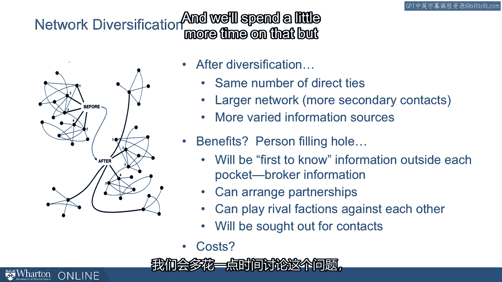

好处显而易见。但我们也不能忽视成本。你认为这其中的成本可能是什么？我们稍后会花更多时间讨论。

---

## 实证研究与启示

我认为公平地说，虽然极端，但这些理论很大程度上只是把我们许多人凭直觉在做的事情明确化了。事实上，我鼓励你反思一下：你是如何决定把时间花在哪里、投资于谁、培养哪些关系、又让哪些关系顺其自然的？很多人想避免思考这个问题，因为这有点令人不适。

但经济和社会学模型为我们提供了一个起点：我们拥有稀缺资源，我们从关系等事物中获得效用，我们本质上是效用最大化者。我们将尝试从稀缺资源中获得最大效用。将这个模型应用于人际关系，就会得出我们刚才讨论的结论。

我并不主张你们都这样思考，或完全照此行事，追求网络效率最大化。但我喜欢展开这样的讨论，并将其摆在桌面上。至少因为我认为我们都在某种程度上做着类似的事情。让我们更明确地讨论其中的权衡，然后看看如何运用这些理念，以不冒犯我们自身的方式使用这些工具。

再提供一点考虑此理论的动机。罗恩·伯特进行了一项实证研究。他考察了一家大型组织中员工晋升的速度，并将其与他们入职时的网络结构进行比较。

他发现了一个很强的相关性：那些拥有更多断裂（即相对断裂的网络结构）的人，与那些拥有较少断裂（即更紧密、更正式结构）的人相比，在组织内随时间推移显示出**更高的晋升率**。

这开启了学术界关于不同网络结构实证后果的大量研究。这也提供了一点动力：也许这不仅仅是理论，也许这些因素确实能产生影响。通过触及更多样化的网络，我们能获得在更同质、更紧密的网络中无法获得的信息和机会。

---

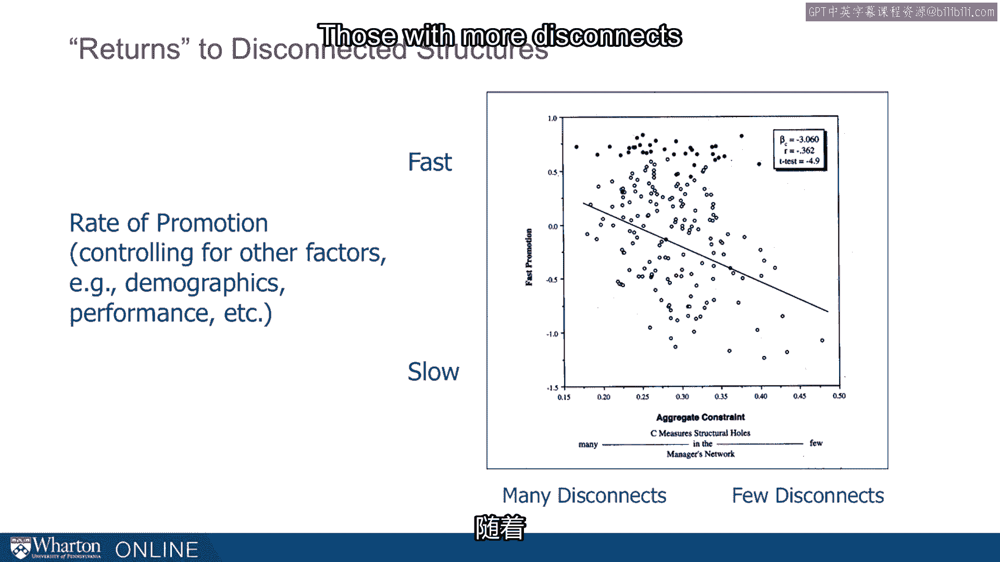

## 局限性与风险

当然存在局限性。我们已经提到了一些，但我们需要牢记这些局限，并在课程的其他部分更明确地展开。

但如果你思考一下：我要最大化我的组织或网络的效率，风险是什么？如果你处于右侧那种用4个关系触及16个人的位置，最大的风险之一显然是：如果你在某个4人群体中的唯一联系人离开了怎么办？如果那个人调动了，或者那段关系出了问题，那么你通往那个群体的唯一桥梁就消失了。

社会学家对此有解决办法。他们会说：看，我们仍然可以处理。如果你有一个特别重要的群体，那么你需要在其中建立不止一个关系。你需要一些冗余，以防万一出现问题。他们可以把这个条件直接放入模型，再次运行效用最大化计算，就会得出那种答案：群体越重要，你就越需要一些冗余的联系来接入它。

---

## 案例：政治中的网络风险

让我举一个美国政治中的小例子，并以一句我很喜欢、能很好概括这一点的引语结束。

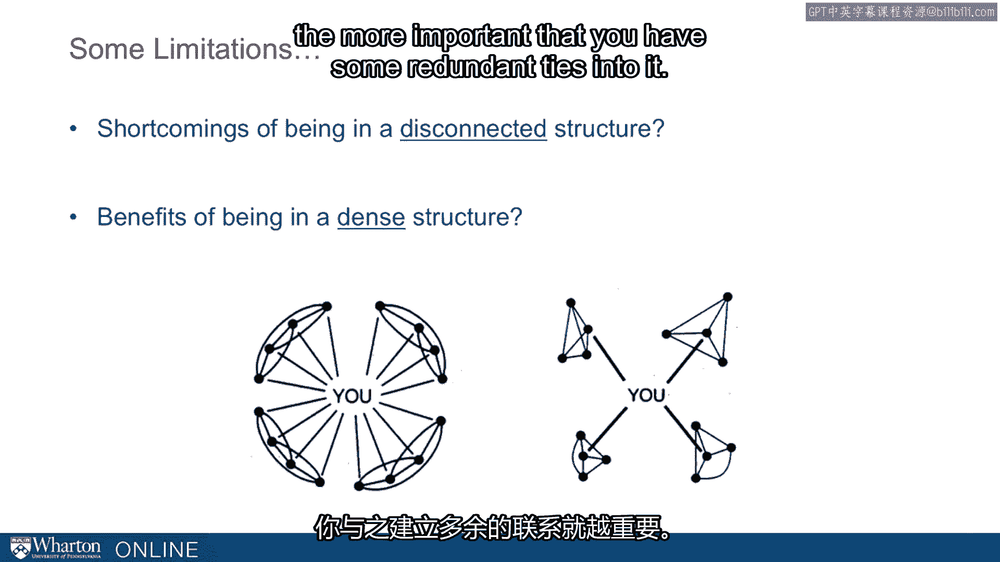

“吉姆·赖特是来自德克萨斯州达拉斯-沃斯堡地区的长期国会议员，在国会任职34年，最终在职业生涯末期接替了著名议长蒂普·奥尼尔，成为众议院议长。但这位可怜的先生在国会干了34年，却在担任议长仅两年后遭到起诉并被迫辞职。为什么会这样？”

“这是纽特·金里奇崛起的开始。金里奇决心要把他赶下台。他想获得更多权力，想削弱民主党，因此找到了办法排挤他。关于此事的细节很多，但此刻不那么重要。然而，金里奇对赖特的评价与我们今天的话题非常相关。”

“金里奇说，当他开始对赖特发起正式调查时（这是在1987年底），他说：‘我观察了同事们对我的肢体语言。实际上改善了。如果我当初这样猛烈地攻击蒂普·奥尼尔，我早就成为社交弃儿了。’”

“赖特在权力技术方面应该得A。他做得很好。缺点是，他仍然是个独行者。人们对他没有深厚的感情。**作为一个独行者，消除了信息和善意的安全网。**”

这句话说明了很多问题。这就是我们讲这个故事的原因。金里奇的这句话——“作为一个独行者，消除了信息和善意的安全网”——适用于我们所有人。这不仅仅是关于众议院议长。他以一种完美的方式概括了这一点：**信息和善意**。当然，这甚至也过于简化了，但这是对我们从非正式网络中寻求什么的一个很好的两分法总结。

---

## 总结与提醒

在本节课中，我们一起深入探讨了网络结构，特别是**结构洞**的概念。我们比较了**紧密网络**与**断裂网络**的差异，理解了**冗余联系**与**高效网络**的权衡。通过实证案例，我们看到了占据结构洞位置可能带来的职业优势，例如更快的晋升速度。

然而，伯特的方法很大程度上以成本效益计算、意图性和策略性为特征。其中存在固有的权衡，这是传统社会学网络模型的核心。我们快速介绍了一个相对极端的版本，目的是引发思考、推动讨论，并提供一个简单的思考框架。

我们希望你能反思自己已经在多大程度上无意识地实践着这些理念。这个理论模型更像一个基准，促使我们思考构建人际关系和在组织中行事方式所带来的**机会成本**。

最后，请记住金里奇的深刻观察：避免成为“独行者”，因为那会消除**信息**和**善意**这两重安全网。在追求网络效率的同时，维系必要的情感纽带和冗余联系，对于长期成功同样至关重要。

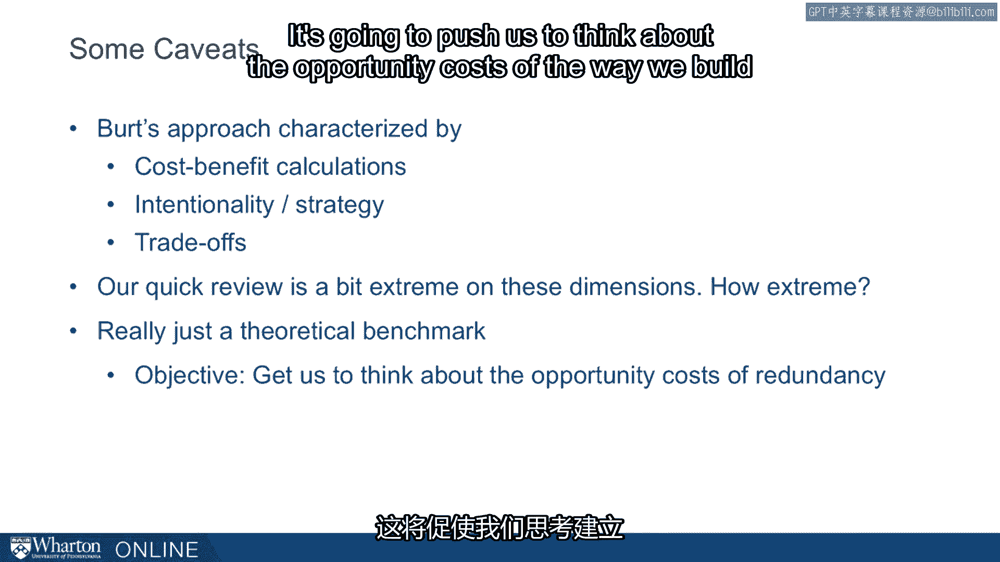

---
**本节课总结**：我们一起学习了网络结构的核心概念，包括结构洞、网络密度与效率，并通过理论与案例分析了不同网络位置的利弊。关键在于理解信息获取与关系维护成本之间的平衡，并意识到在构建高效网络的同时，维护必要的情感与冗余联系的重要性。