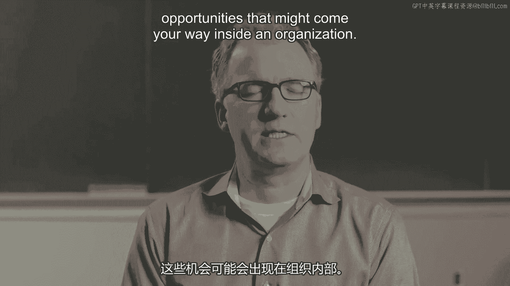
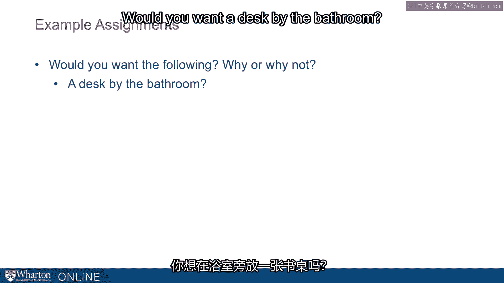
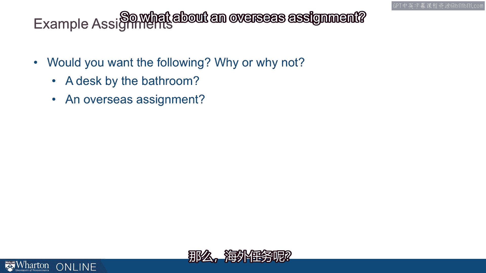
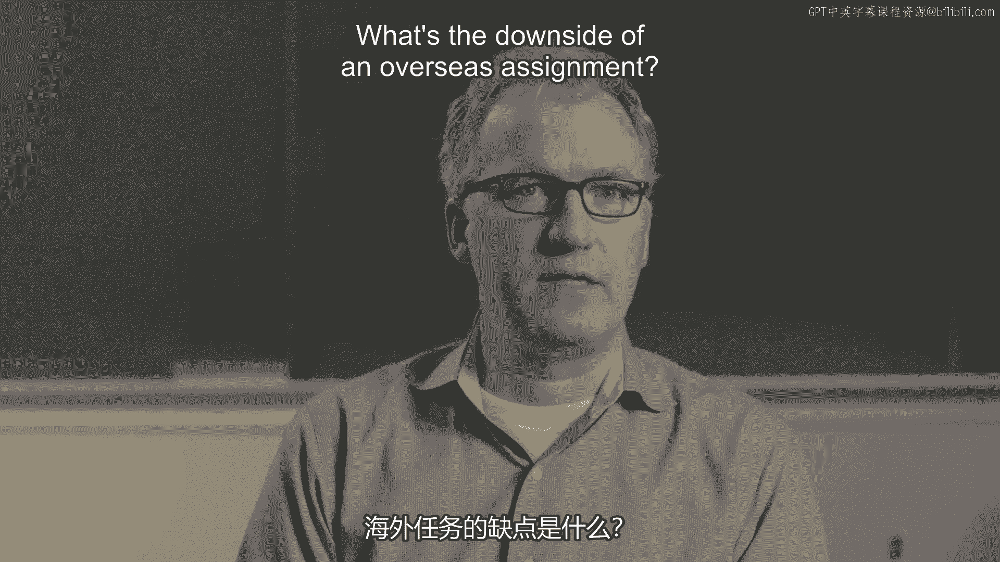
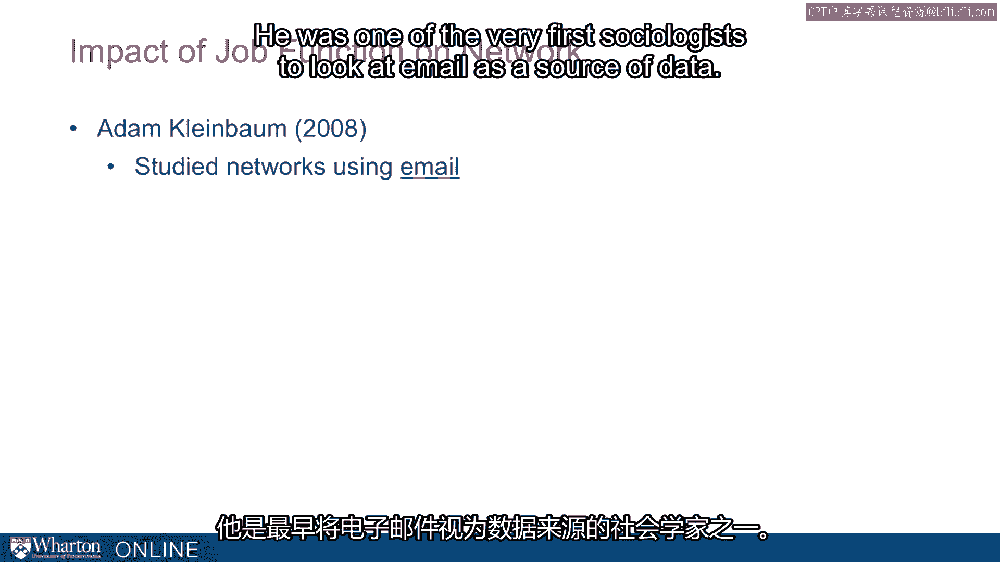
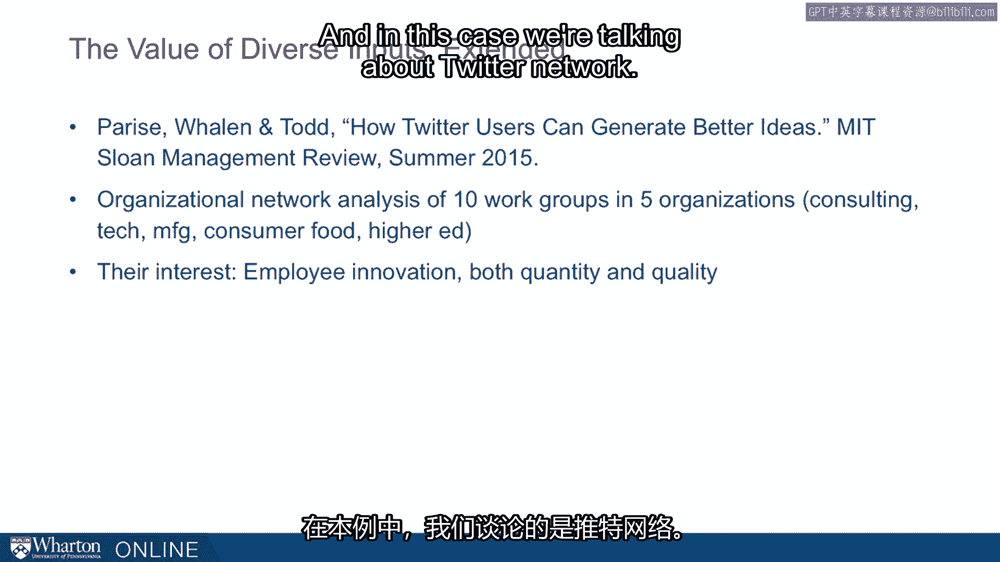
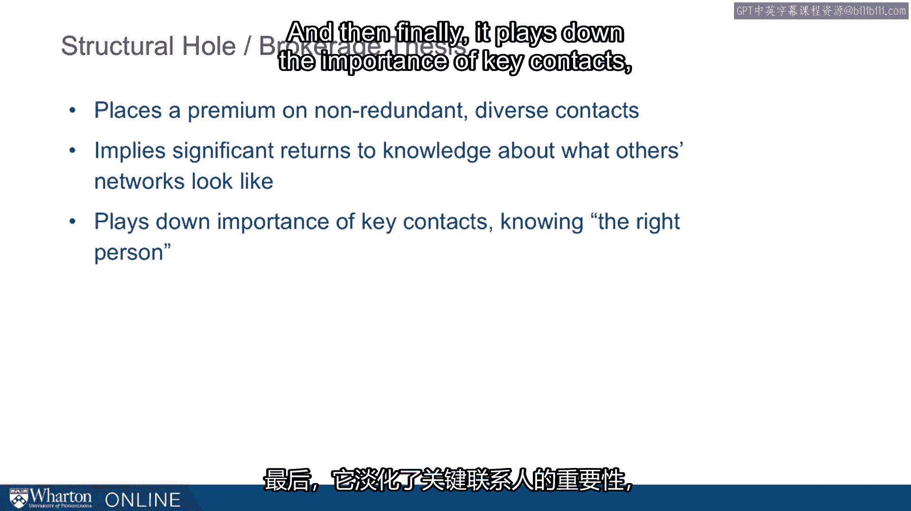

# 沃顿商学院《实现个人和职业成功》课程 P82：18_应用 🧩

在本节课中，我们将探讨如何将“结构洞”和“多样化网络”的理论应用于实际工作与生活场景。我们将通过几个具体的例子，帮助你理解如何通过有意识地选择位置、任务和社交方式，来构建更具优势的社会网络。

---

## 从理论到实践

上一节我们介绍了社会网络理论的核心概念。本节中，我们来看看如何将这些理论付诸行动。具体而言，我们将思考在组织内部可能遇到的一些机会或任务分配，并分析如何利用网络思维做出更优选择。

以下是几个常见的职场情境，我们可以用新的视角来审视它们。

### 1. 选择工位：靠近洗手间的座位

大多数人会本能地拒绝靠近洗手间的工位，原因显而易见。但根据我们讨论过的理论，值得更深入地思考一下。

为什么你可能想要一个靠近洗手间的工位？好处是什么？显然，每个人都会经过那里。这意味着你将有机会与那些平时可能没有交集的人进行互动。

我们可以将这个想法推广：无论是靠近洗手间的工位、繁忙区域的工位，还是人们经常经过的工位，其核心逻辑是相通的。例如，有些实习生因为恰好坐在大老板旁边，从而获得了接触高管的机会，并最终因此获得了全职工作。

多年来，我观察过不同院系的同事。有些人选择坐在走廊尽头更安静、空间更大、视野更绿化的地方；另一些人则选择坐在主走廊上。后者需要忍受更多噪音，但他们更多地处于信息流之中。研究表明，这将使他们与更多同事建立更深厚的关系，处于更有利的位置。

这是一种重新思考机会的方式。

### 2. 接受海外派遣任务

对某些人来说，海外派遣听起来很新奇有趣。但它的潜在缺点是什么？你可能会被遗忘。当你从总部调到一线，总部的人忙于工作，可能会忘记你。这始终存在风险。

那么，海外派遣的好处是什么？你可以开始弥合那些在总部办公室无法触及的“结构洞”。你会结识全新的一群人，并有机会建立那种仅靠一天访问或邮件往来无法形成的关系。

海外派遣的另一个作用是，当你任期结束时，它保证你会被重新考虑安置。他们必须为你安排一个新位置。因此，在你结束派遣后，你会被再次考虑担任其他职位。

这其中存在权衡，但如果你运用“结构洞”和多样化网络的思想，你可能会倾向于做出不同的选择。

### 3. 加入专项工作组或委员会

老板或上级可能会问你是否愿意加入某个委员会。这通常不是我们期待的事情，因为我们手头已经有足够多的工作，不需要更多的委员会了。

但根据我的经验，没有比加入一个委员会更能让你深入了解组织中不同部门、新部门人员的方式了。这并不意味着你需要同时参加三四个委员会。例如，我与本部门之外人员建立的最佳关系，通常来自两个地方：要么是像“靠近洗手间的工位”那样偶然地与他们办公室相邻，要么就是通过某个跨学科专项工作组与他们共事。

无论是为期一个月还是一年，这种共同工作的机会都是平时难以获得的。我主持一个商业广播节目，团队四人分别来自市场部、人事部和我的运营信息与决策部。节目开始前我只认识其中一人。三年后的今天，其中有三位是我在学院里最亲密的同事。如果不是因为这个“委员会”或“专项工作组”让我们共事，我永远不会有那么多时间与他们相处。

这同样值得思考。希望这个理论框架能让你以不同的方式思考这些决定。

---

## 实证观察与延伸应用

伯特、格兰诺维特以及整个社会学领域为我们提供的这个框架非常简洁（有时甚至过于简洁），但如果你认真对待它，它可能会推动你做出不同的决策。我们承认其中存在权衡，我们只是推动你多考虑一下那些“不舒服”的选择。

我们天生倾向于做“舒服”的事。回顾本模块开头关于座位选择的讨论：当你走进一个房间决定晚餐座位或为会议晚宴签到选座时，舒服的做法是找到你的朋友然后坐下。这很人性化，也可以理解。

但是，如果你理解了包含多样化、连接不那么紧密、密度较低的社会网络所能带来的回报，你就会开始抗拒那种“舒服”的选择。这正是我们今天真正想做的：推动你在决定坐在哪里、接受什么任务时，少一点舒适感，少一点自动和直觉。

以下是一些实证观察。

**观察一：企业内部的电子邮件网络研究**

一项巧妙的研究来自亚当·克莱因鲍姆，这是他研究生毕业论文的一部分。他是最早将电子邮件作为数据来源的社会学家之一（现在很多人做这类研究，这已成为非常有趣且常见的研究方向）。

他进入一家大型信息技术公司，该公司有30个产品部门，业务遍布全球。他抽样分析了30,000名员工在三个月内的所有电子邮件活动。你猜他发现了什么？

一张图表显示了部门间的电子邮件流量。这张图本质上表明，几乎所有的流量（95%到98%）都集中在对角线上，意味着是从一个部门到同一个部门。这全是部门内部的通信。几乎没有人与其他部门的人交流。

**这对你来说是一个巨大的机会，也是一种脱颖而出的方式。** 如果你是组织中那个真正与其他部门有联系、与他人沟通的人，你将拥有他人所没有的信息优势。

**观察二：推特网络与创新性的关系**

另一种看待这个问题的方式，是越来越多的人将这个理念扩展到传统网络之外，在其他类型的网络中寻找多样性的好处。最近，几位研究人员在《MIT斯隆管理评论》上发表了一项研究，他们研究了推特用户，比较了他们与非推特用户的创新性，最有趣的是，研究了他们的创新性如何作为其推特网络类型的函数。

具体来说，他们使用了组织网络分析（即我们在前几讲中看到的那种结构），研究了五个不同组织（咨询公司、制造企业、消费品集团和高等教育机构）中的十个工作组，并询问：我们能否看到员工的创新性因其拥有的网络类型不同而存在差异？这里指的是推特网络。

他们观察了两名员工不同的推特网络。左边的员工A拥有一个相对“断开连接”的推特网络：他关注的大多数人彼此之间并不互相关注。与之形成对比的是员工B，他的推特网络密度很高、连接紧密：他关注的这些人实际上彼此互相关注。

那么，这会导致什么结果？根据我们讨论过的“结构洞”以及伯特和格兰诺维特的理论，你如何解释这一点？

显然，员工A正在获取更多、更多样化的信息。有趣的是，研究发现，当考察员工在工作中的创新性时，那些拥有更多样化推特网络的员工，提交了更多有趣、被评定为更高质量（本质上更创新）的想法，超过了那些推特网络更密集、内部连接更紧密的员工。

像这样的例子越来越多，表明“网络多样性有益”这一原则在越来越多有趣的领域得到验证和发现。它正在超越传统的组织分析。

---

## 核心总结与行动启示

本节课中，我们一起学习了如何将社会网络理论应用于实际决策。

总而言之，这个“结构洞”与“中介”理论说明了什么？

1.  **我们高度重视非冗余、多样化的联系。** 其公式可以概括为：**网络价值 ∝ 联系的非冗余性与多样性**。
2.  **了解他人网络结构能带来显著回报。** 如果你理解并感知他人的网络，你就拥有优势，因为你可以战略性地选择与那些能提供新的、更多样化信息的人建立联系。
3.  **它淡化了“认识关键人物”的重要性。** 传统智慧认为你必须认识“对的人”。但如果你将自己置于网络中更好的位置，你将增加信息流通、结识更多人、遇见原本不会遇见的人的可能性。

最后，再次强调，这一切的核心在于：在你整个职业生涯中构建的各种网络里，**追求非冗余、多样化的联系人**。

---

**本节课总结**：我们探讨了如何将社会网络理论（特别是结构洞和多样化网络的概念）应用于实际职场选择，例如工位选择、任务接受和社交媒体使用。通过实证研究，我们看到了多样化网络在信息获取和创新方面的优势。关键在于，要有意识地跳出舒适区，主动构建并维护一个广泛而非冗余的联系人网络，这将为你的个人和职业成功带来长期回报。