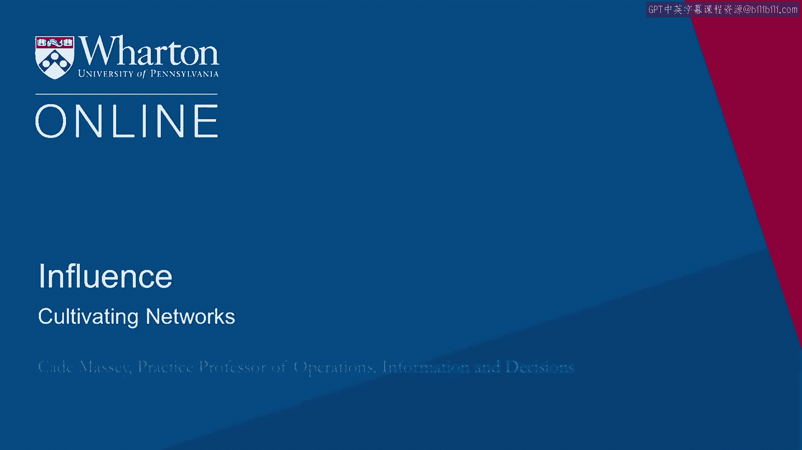

# 沃顿商学院《实现个人和职业成功》课程 P83：19_培养网络 🌐

在本节课中，我们将要学习如何实际地建立和维护人脉网络。我们将从理论转向实践，探讨具体的行动步骤，并理解互惠原则在构建真诚、持久关系中的核心作用。

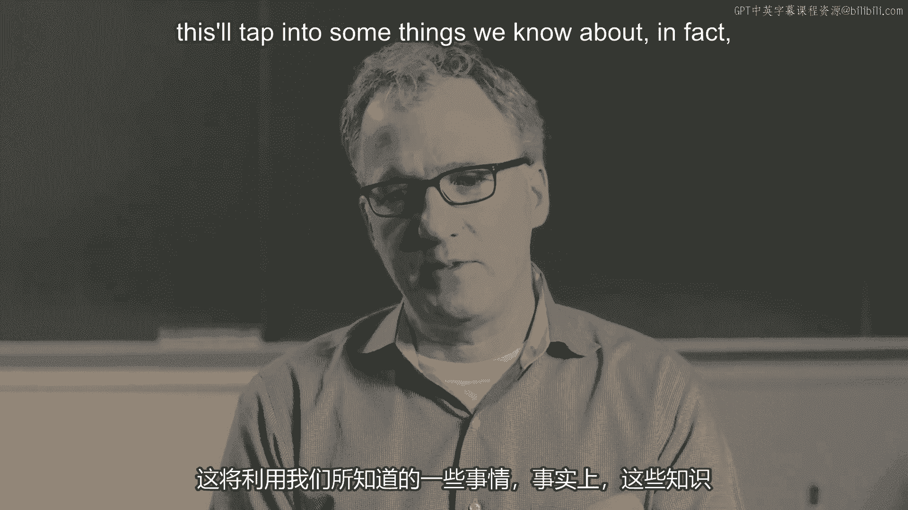

---

上一节我们介绍了人脉网络的理论和最优结构。本节中我们来看看如何具体地构建这些网络。我们将更详细地讨论实际操作，即如何脚踏实地地建立人脉。某种程度上，这可以平衡之前理论中可能显得过于权谋和战略的部分，因为大多数人并不想把这种算计带入人际关系中。本节内容将起到平衡作用，因为它关注的是真实地经营关系。

那么，如何培养人脉网络？我们常常认为建立人脉是单方面的行动，即“我主动出去做，我去创造”。但实际上，正如其关系本质所揭示的，这是一个**双边交换的过程**。既然是双边过程，就会涉及到一些我们已知的心理学和社会学原理。

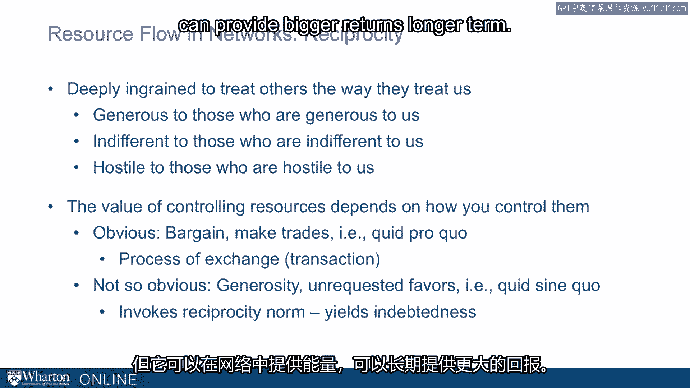

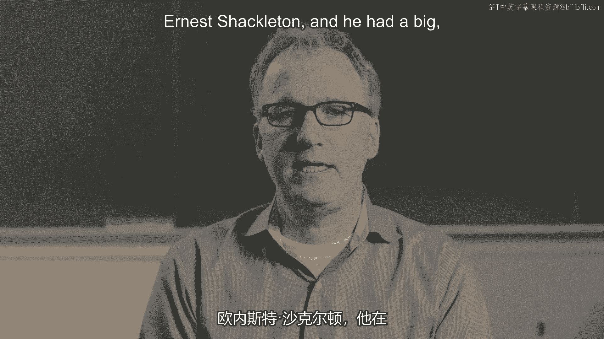

事实上，心理学和社会学对此已有数十年的研究。其中，**互惠原则**成为你在培养人脉时需要运用和牢记的最重要工具之一。数十年的研究证实，我们根深蒂固地倾向于“以其人之道还治其人之身”。我们倾向于对慷慨待我们的人报以慷慨，对冷漠待我们的人报以冷漠，对敌视我们的人报以敌视。这几乎是一种本能反应。我们从人类研究中得知这一点，甚至从黑猩猩身上也能观察到类似行为，这说明了其基础性。

这意味着，掌控资源的价值不仅在于控制本身，还在于你如何控制它们。如果你以更慷慨的方式控制资源，你将得到更多慷慨的回报。如果你以敌对的方式控制，你或许能控制资源，但同时也会滋生敌意。

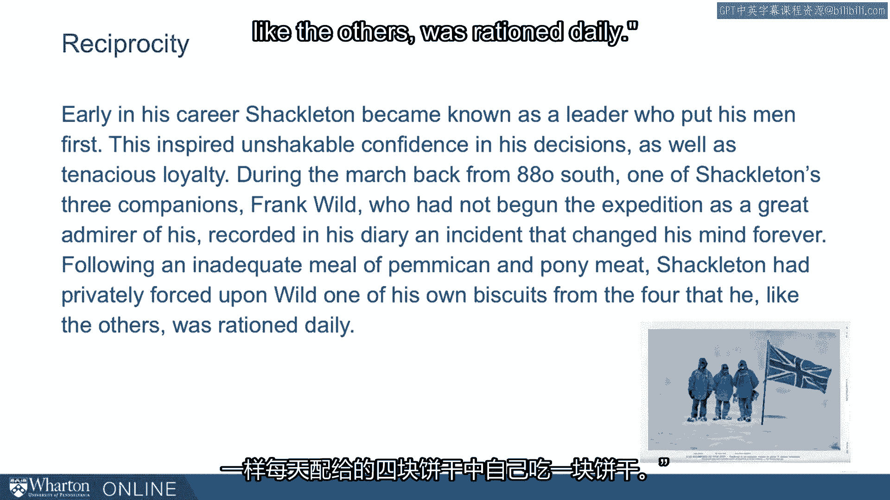

一个显而易见的启示是进行交易、提供等价交换。这种交换在某些组织中是有益的，甚至是做生意的常态。但更好且不那么明显的方法是**慷慨**，即主动提供未经请求的帮助。这超越了简单的“投桃报李”。这是在激发互惠原则，它会产生一种“人情债”。虽然这存在风险，因为债务可能永远无法偿还，但它能为网络注入活力，并在长期带来更大的回报。

让我举一个简短的例子，这来自1916年前后的南极探险时代，即第一次世界大战时期。你们有些人可能读过或看过关于欧内斯特·沙克尔顿的电影。他因“坚忍号”的著名探险而闻名。但在此之前，沙克尔顿就以“队员优先”的领导者形象著称。根据一本关于沙克尔顿的书所述，这为他赢得了部下对其决策的不可动摇的信心以及坚韧的忠诚。在一次从南纬88度（未抵达南极点）返回的行军中，沙克尔顿的三位同伴之一——弗兰克·怀尔德（起初并不十分钦佩沙克尔顿）在日记中记录了一件永远改变他看法的事。在一顿不足量的马肉和饼干餐后，沙克尔顿私下里把自己每日配给的四块饼干中的一块硬塞给了怀尔德。怀尔德写道：“我想世界上没有其他人能完全体会这其中包含了多少慷慨和同情。上帝作证，我永远不会忘记。几千英镑也买不来那一块饼干。”这就是沙克尔顿，这次探险的领导者。他通过这种方式赢得了怀尔德无法以其他方式获得的忠诚。怀尔德后来成为他下一次“坚忍号”探险的副手之一。这虽然只是一个轶事，但它绝佳地展示了**真正的慷慨能在他人心中激发的互惠精神**。

那么，具体方法是什么？心理学家对此有研究，确实存在一些“配方”。互惠之所以不同，是因为它更具情感性，因此能成为忠诚的来源。要达成这一点，你所提供的帮助、礼物或任何资源**必须是有代价的**。换句话说，给予者必须做出可信的牺牲。它必须是**无私的**，不明确或默示地要求回报。理想情况下，它是**意料之外的**（怀尔德没料到沙克尔顿会给他饼干）。理想情况下，它**难以用同类方式偿还**，无法通过一次简单的反向交易就结清人情。当然，被视为慷慨的最佳方式是什么？那就是**真正地做到慷慨**。这里虽有“配方”，但遵循“配方”的最佳方式，就是在你的交往中真正地**心怀慷慨**。

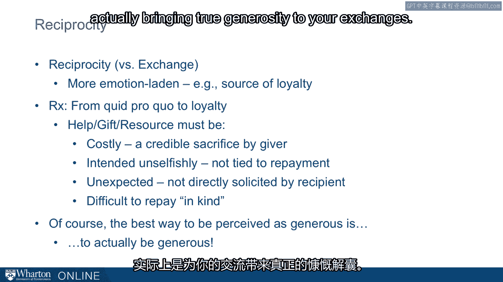

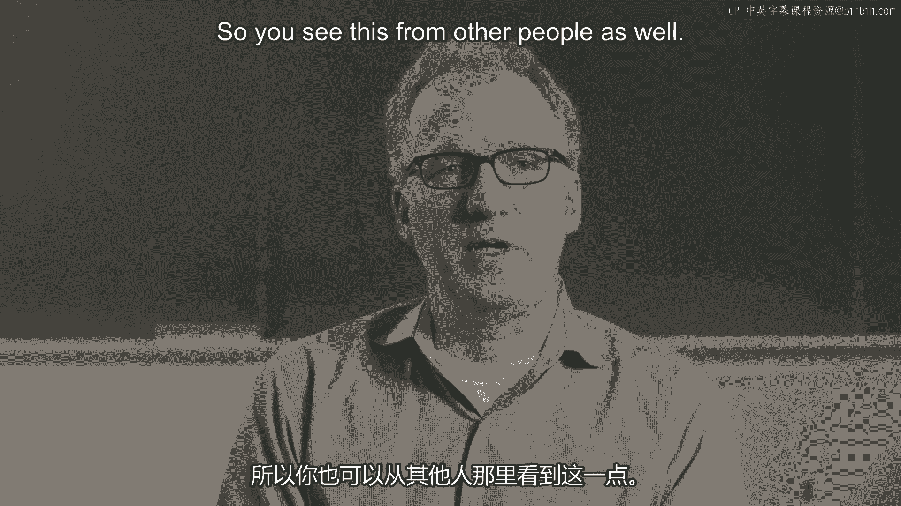

你也能从其他人身上看到这一点。最近，演员兼喜剧演员阿兹·安萨里发了一条推文。一位粉丝问他：“阿兹，我是一个有抱负的节目制作人、演员和即兴表演者。你能给我一些建议，告诉我如何达到你现在的成就吗？”安萨里回答说：“嗯，努力工作，做出好东西，然后努力做出更好的东西，并且**对人友善**。”我喜欢看到这类强调“友善”部分的建议，因为虽然友善并不总能立即带来回报，但它是一项能为你带来优势的宝贵资产。你希望世界向你倾斜。这是一位演员的建议。

学术界也对此有过研究。米格尔·洛博和他的同事进行了一项研究，将网络分析引入一个组织，同时也评估了“受欢迎度”。在这项发表于《哈佛商业评论》的测试中，他们根据两个维度对组织中的员工进行了分类：**能力**（高/低）和**受欢迎度**（高/低）。他们由此创建了四个象限：从“能干的混蛋”（大多被回避）到“可爱的傻瓜”（稍受欢迎）。当然，在对角线上是“可爱的明星”，这并不令人意外，每个人都想成为或与之共事。而“无能的混蛋”也无需多言，没人想成为那样，也没人想与之相处。但“能干的混蛋”和“可爱的傻瓜”之间如何权衡？这里存在一个取舍：你是接受能力稍差但亲和力强的人，还是能力稍强但你不愿与之相处的人？研究发现，人们在这两者之间更倾向于选择“可爱的傻瓜”。平均而言，如果需要取舍，组织会倾向于“可爱的傻瓜”。这再次与互惠的概念联系在一起。

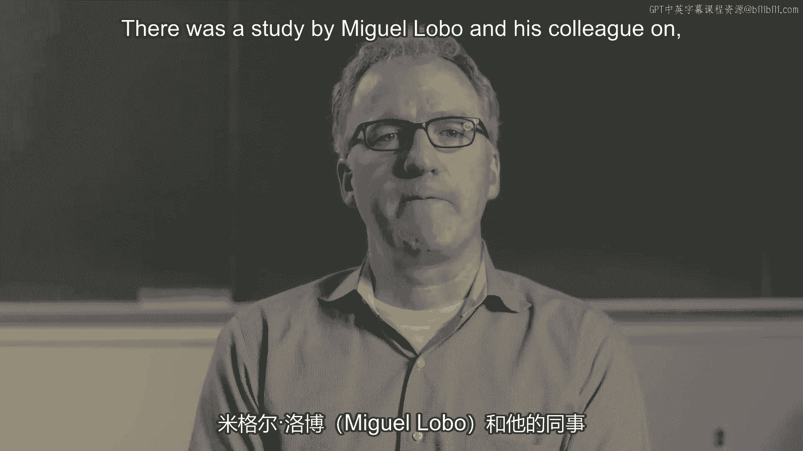

---

让我们转向一些实用技巧。

当你阅读足够多的案例、例子和自传时，你能从中获得的一个收获就是人们提供的一些具体技巧，即他们在培养人脉网络中发现有用的一些小方法。

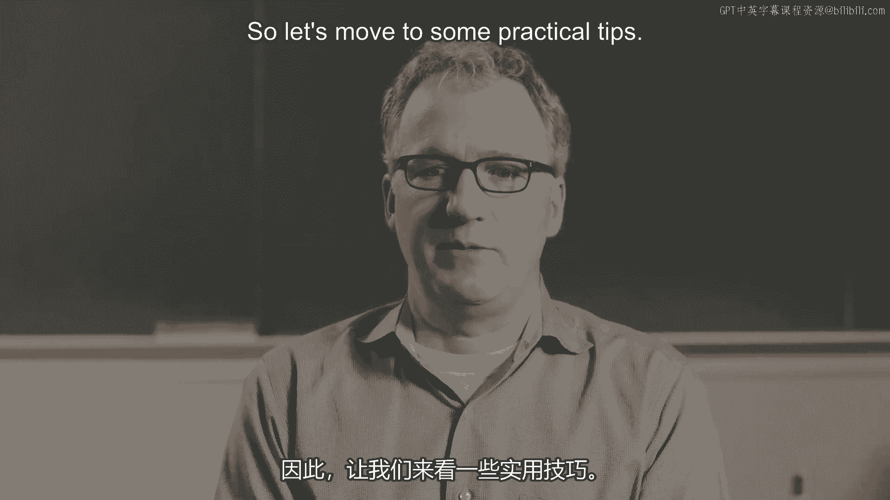

以下是几个实用技巧：

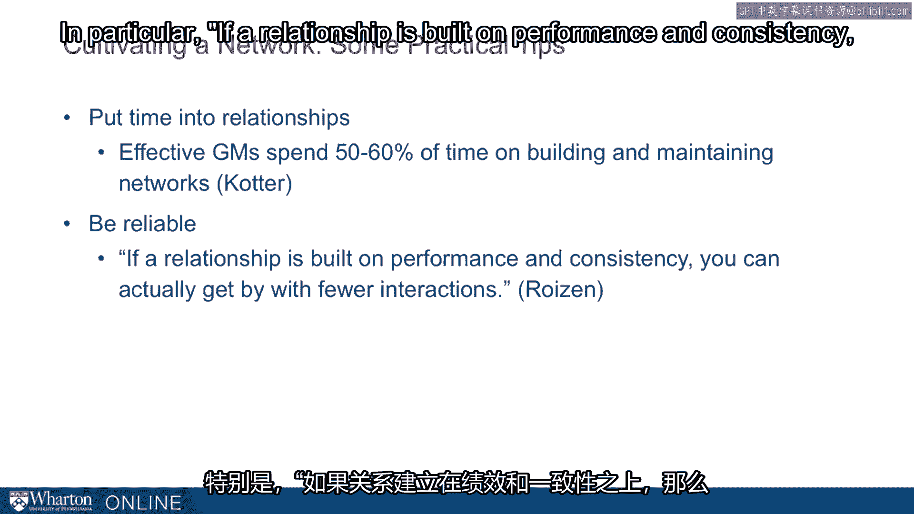

*   **投入时间**：一项关于高效总经理的研究发现，他们花费**50%到60%** 的时间来建立和维护人脉网络。这对最有效的人来说是一项惊人的投资。
*   **保持可靠**：来自硅谷著名人脉专家海蒂·罗伊森的建议：要可靠。她特别指出：“**如果一段关系建立在表现和一致性之上，你实际上可以通过更少的互动来维持它。**”这对我们大多数人来说是极好的建议，因为我们时间有限。她的意思是，只要你每次互动都保持可靠和一致，即使没有定期的频繁互动，关系也能维持。
*   **次日跟进**：从一些知名人脉专家那里学到的另一个技巧是：**在认识新朋友的第二天就给他们发邮件**。我们常常认识新朋友后就把这事搁置了，让关系在行动前就萎缩了。有人建议，作为一种承诺，我打算在认识新朋友的第二天就以某种方式跟进。这既是一种确保完成的承诺机制，也能确保你在需要他们之前就已经建立了联系。你在向他们索取任何东西之前，就先与他们进行了一次小小的交流。
*   **学会优雅地说“不”**：这是我们从海蒂·罗伊森那里学到的另一点，她近年来成为一名风险投资家，经常需要拒绝许多投资机会，有时是来自她认识并希望保持关系的人。她花费了惊人的时间来说“不”。机会成本通常很高，但声誉成本也很高。你不知道被拒绝的人之后会去哪里，会和谁谈论此事。总的来说，人们没有花足够的时间来好好且优雅地管理他们的“拒绝”。
*   **超越等价交换**：很多人想到交换和“投桃报李”。在本讲中，我们一直倡导考虑互惠，并超越简单的互惠。无论是因为你想为世界做贡献，还是想投资未来，请将你为他人提供的大小服务视为一个**投资组合**。有些会得到回报，有些不会，但它就是一个组合。本质上，这是你随身携带的**社会资本**。

---

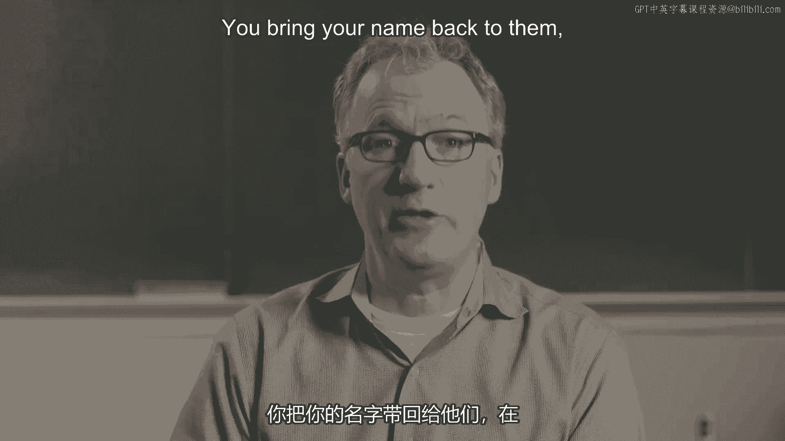

在结束本讲之前，最后给你一个框架来思考人脉构建者的不同层次：我们看到新手（初级）、中级者和真正的专家在培养网络时分别做什么。

以下是不同层次人脉构建者的特点：

*   **初级（新手）**：利用眼前出现的机会。例如，我们之前讨论过的委员会任命。这至少需要识别机会，并非每个人都能做到。这是一个起点。
*   **中级**：创造能提供这些机会的情境。例如，他们举办晚宴，甚至是创造性的晚宴，比如“加一”晚宴，邀请你认识的人，并请他们带一位其他客人不认识的人来。这需要精力、思考和意图。这是向更高级人脉构建迈进的一步，并非每个人都愿意或能够做到。
*   **高级（专家）**：这些人既会识别和创造机会，还会**将自己置身于机会可能出现也可能不出现的情境中**。这回到了我们之前关于座位选择的讨论。你坐在哪里？坐在桌子开头和末尾的风险是什么？你是在将自己暴露于**偶然的机遇**中。它可能成功，也可能不成功，但除此之外，你无法接触到这样的可能性：某人坐下来，带给你一些你甚至不知道其存在的东西。

---

关于培养人脉网络的最后一点思考是：人脉网络不能纯粹为了某个目的而建立。它需要时间。这些事情是逐步完成的，你必须避免显得过于功利。当然，避免显得过于功利的最佳方式就是**不要那么功利**。但我们在此分享的建议和技巧，最好是作为一种**生活方式**来采纳。让这些原则影响你的日常决策，其益处将在数周、数月、数年中逐渐累积。

就我个人而言，整个课程中最好的建议之一就是：**在你需要别人之前就去认识他们**。许多人对我们讨论的一些话题（如认识人、思考结构洞）感到不安，因为这毕竟是关系。管理这种不安的最佳方法之一，就是在你需要他们之前就去认识他们。

以上就是关于“培养网络”的内容，目前我们一直在个人层面进行讨论。在我们深入之前，我们需要停下来思考一下：“从组织的角度来看，情况又是怎样的呢？”

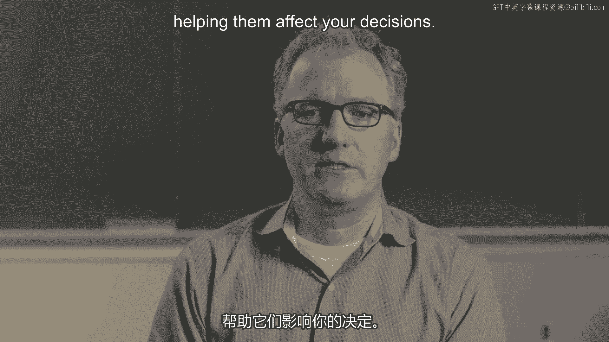

---

本节课中我们一起学习了如何实际构建人脉网络。我们探讨了互惠原则的核心作用，理解了真正的慷慨如何激发忠诚。我们还学习了一系列从识别机会到创造情境、再到拥抱偶然性的实用技巧和分层框架。最后，我们认识到建立人脉是一个需要时间、真诚和长期投入的生活方式，最佳策略之一就是在你需要帮助之前就主动建立联系。