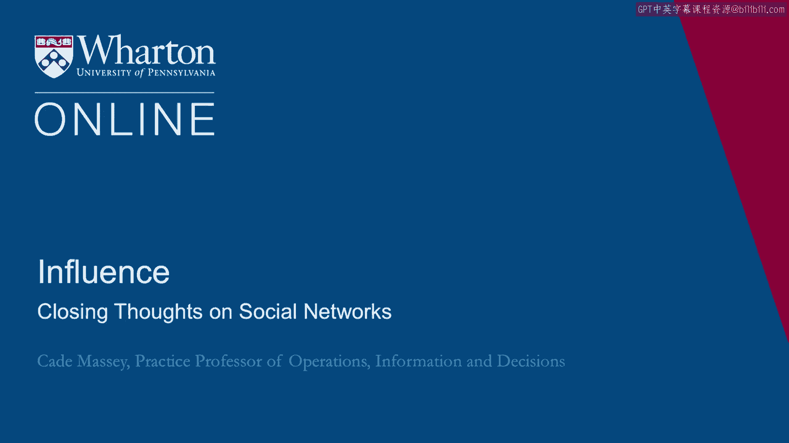
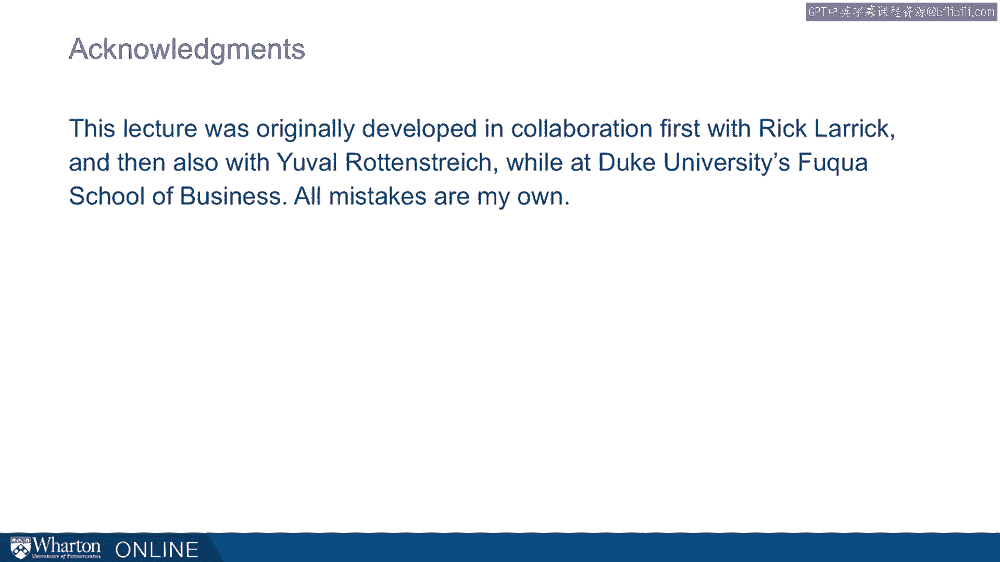

# 课程名称：沃顿商学院《实现个人和职业成功》第22课：关于社会网络的总结 📚

在本节课中，我们将总结关于非正式社交网络的核心要点。我们将探讨社交网络作为社会资本的价值、其效率的关键来源，以及如何以正确的方式构建和维护网络。

---

## 核心要点总结

从我们关于非正式网络的讨论中，可以得出几个关键结论。

以下是本次讨论的核心要点：

1.  **网络即社会资本。** 网络是你的人力资本的类比物。它们是你带入任何情境、任何组织时所拥有的“资产组合”的一部分。
2.  **网络效能高度依赖于结构洞。** 这是一个新观点，一个不同寻常、有违直觉且颇具启发性的观点。这是网络理论中最重要的观点之一：一个网络的效率和效能，即社会资本的力量，取决于结构洞，也就是网络的**不连通程度**。
3.  **网络是赢得的，而非刻意建造的。** 你无法像我们希望的那样，以现成的、刻意的方式去“建造”网络。这需要成为一种生活方式。你需要通过思考互惠、超越常规的互惠来创造能量。你应该将社交网络视为日常、每周都在进行的事情，而不是因为它能立刻满足某个具体目标才去做。

---

## 与课程其他部分的联系

上一节我们总结了社交网络的核心概念，本节中我们来看看这些概念如何与课程的其他部分相联系。

我们在这个话题上讨论的观点，与课程的其他内容是相通的。

*   **理解对方**：这是我们贯穿整个课程都在讨论的观点。这对于创造有价值的资源、产生互惠、战略性地管理你的网络以及认识到权衡取舍至关重要。
*   **认识到权衡取舍**：这是我们几乎在每一步都会谈到的事情。如果这些策略可以随意使用而无需担心过度，或者能在所有情况下使用，那当然很好。但现实生活更为复杂，影响力也更为复杂。你做出的每一个选择都会伴随相应的权衡。
*   **保持战略性意图**：以最大化其效能的方式构建网络，需要更多的策略。这种策略性可能比你习惯带入人际关系中的程度要更高。

关于这一点，可以这样思考：我们建议你对你的**网络**保持战略性意图，而对你的**人际关系**则保持非刻意的自然状态。我们理解这种谨慎感。事实上，我们主张在对待具体的人际关系和个体时，应谨慎避免带入过多的目的性。但我们认为，可以对更广泛的网络、以及我们关于工作、所处位置、如何分配时间的决策保持战略性，同时在我们建立的个体人际关系中保持非刻意和更人性化的方式。

---

## 影响力与网络的重要性

远离令人反感的层面，提升你网络的影响力，是发挥你能力的关键方式之一。权力的发展与运用需要成就，而在当今时代，成就几乎总是需要通过与他人合作来实现。如果你无法通过他人开展工作，你就无法达成他人所能达成的成就。

正如杰弗瑞·菲佛所言：“执行的失败，几乎无一例外都是构建成功联盟的失败。”

---

## 课程总结

本节课中，我们一起学习了社交网络的本质。我们明确了网络是重要的社会资本，其力量源于**结构洞**带来的信息优势和控制优势。我们认识到，有效的网络是**通过日常互惠行为“赢得”的**，而非机械建造的。最后，我们探讨了将战略性意图应用于整体网络管理，同时在具体人际关系中保持真诚自然的重要性。掌握这些原则，将帮助你更有效地通过他人达成目标，提升个人与职业影响力。

---

[空白音频]

