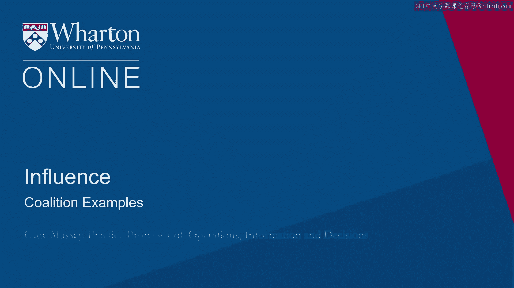
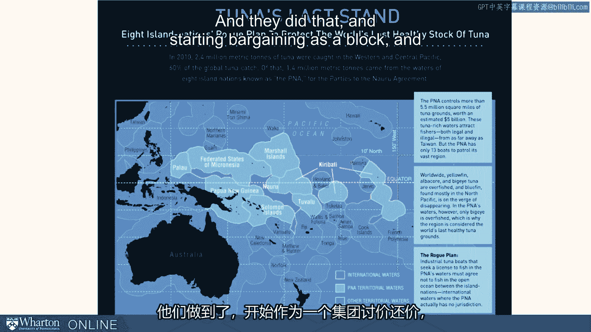

# 沃顿商学院课程《实现个人和职业成功》第25讲：联盟的力量案例解析 🤝

在本节课中，我们将通过两个来自不同领域的案例，深入探讨“联盟”这一策略如何在谈判中创造巨大价值。我们将看到，无论是娱乐产业还是国际渔业，集体行动都能彻底改变谈判桌上的力量平衡。

---

## 案例一：电视剧《老友记》的集体谈判

上一节我们介绍了联盟的基本概念，本节中我们来看看它在现实中的具体应用。首先，我们分析美国情景喜剧《老友记》中六位主演的薪酬谈判策略。

这部电视剧在90年代取得了巨大成功。然而在开拍前，六位演员都籍籍无名。按照电视行业的惯例，他们最初是**各自单独**与制片方谈判合约的。

随着剧集爆红，情况发生了有趣的变化。他们开始**集体谈判**，作为一个整体与制片公司交涉，而非六个独立的个体。更值得注意的是，他们最终达成了**同工同酬**的协议。

这意味着，尽管像詹妮弗·安妮斯顿这样的演员知名度更高，但六人的片酬完全相同。在剧集的第三到第十季，他们一直维持着这种安排。到剧集结束时，每位演员每集的片酬高达**100万美元**。按每年拍摄20到24集计算，通过联盟，他们每人每年能赚取约**2000万美元**。

以下是他们采取联盟策略可能带来的好处：

*   **维持剧组动态平衡**：平等的薪酬有助于保护演员之间的关系，可能正是这种安排让剧组和谐地走到了第十季。
*   **实现公平结果**：如果没有结成联盟，像马特·勒布朗这样的演员几乎不可能获得与詹妮弗·安妮斯顿同等的报酬。联盟确保了结果的公平性。

---

## 案例二：南太平洋金枪鱼渔业的联盟

看完了娱乐产业的例子，我们再将目光转向一个截然不同的领域——国际渔业，看看联盟策略如何帮助弱势方扭转乾坤。

这个案例来源于《Slate》杂志的一篇文章。历史上，来自日本、英国或美国的大型渔船队会进入南太平洋岛国的领海捕鱼。

捕鱼需要支付费用，而船队惯用的策略是**让这些岛屿相互竞标**，看谁收取的费用最低。对于这些将渔业作为重要收入来源的岛国来说，它们几乎没有议价能力，捕鱼权费用被压得很低。这种状况持续了很多年。

后来，岛国们意识到必须**联合起来**。它们组成了一个联盟，开始作为一个整体进行谈判，这完全**扭转了谈判局面**。

现在，变成岛国联盟**让各个渔船队相互竞标**，看谁愿意支付最高的费用以获得在其领海捕鱼的权利。

联盟带来的巨大议价能力还产生了更深远的影响：

*   **提升渔业健康**：渔船队在公海捕鱼不受限制，但这会损害整个金枪鱼种群（因为鱼群不会区分领海和公海）。为了渔业健康，需要在一定程度上限制公海活动。
*   **扩展管辖权影响**：通过组建联盟，这些国家获得了足够的议价权力，甚至能够对渔船队在**公海**的活动施加限制。

这是一个展现联盟力量的绝佳案例，它证明了弱势方如何通过团结一致，最终彻底颠覆谈判的局势。

---

## 总结

本节课中我们一起学习了两个关于“联盟”策略的核心案例。从《老友记》六位主演的集体谈判到南太平洋岛国的渔业联盟，我们可以看到，无论背景如何，将个体利益整合为集体力量，都能显著增强议价能力，改变权力动态，并最终达成更优、更公平的结果。关键在于认识到共同利益，并采取一致行动。