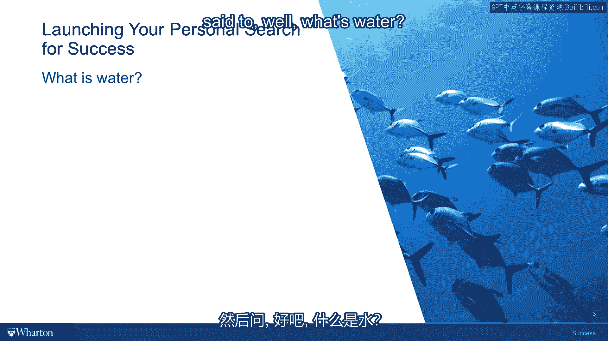

# 课程9：文化与家庭如何塑造你的成功价值观？🌊🏠

在本节课中，我们将探讨成功价值观的来源，特别是文化和家庭这两个关键因素如何潜移默化地塑造我们对成功的定义。理解这些外部影响，是审视并定义个人成功观的重要一步。

---

上一节我们讨论了成功的“盒子”模型，其中包含内在生活的幸福满足与外在生活的职业成就。但你可能会问：这个盒子里的内容是如何被填满的？是谁放进去的？

要深入思考成功对你的真正意义，接下来必须穿透的、最重要的一层，就是这些价值观的来源。你立刻会面对一个非常重要的文化来源。而在任何特定文化中，你的家庭就像一个棱镜，它会聚焦文化价值观中某些特定的方面，将这些被家庭接纳的价值观，折射成你的一系列假设：关于你应该做什么、什么重要、什么不重要、什么会赢得赞扬、什么会招致失望。

因此，文化和家庭是两个极其重要、却又非常难以把握的因素。

---

为了更好地理解为何这个主题如此难以把握，我们可以参考一个故事。小说家大卫·福斯特·华莱士在2005年凯尼恩学院的毕业典礼演讲中，讲述了一个故事。

故事是这样的：有一条老鱼在水里游着，两条年轻的鱼从对面游过来，经过它身边。当两条年轻的鱼游过时，老鱼对它们说：“水怎么样啊？”两条年轻的鱼被陌生人搭话有点不高兴，也不知道该作何反应，就继续往前游。但游出大约十码后，其中一条年轻的鱼转向另一条问道：“呃，水是什么？”

---

当然，年轻的鱼更难回答“水是什么”这个问题。因为随着年龄增长，经历越多，经历的不同生活事件越多，你就越能意识到自己正游弋在自身的文化中，带着自身的文化假设，并且你被驱动、被推动、甚至近乎痴迷地在你一生所处的文化和家庭价值观中寻求认可。它们已成为你的一部分，就像心脏是你身体的一部分一样。

因此，将自己从中分离出来，获得一个审视的视角，以便你能拥抱、修改或拒绝那些为你定义了成功的文化和家庭价值观，这是学习成功这门课程、思考成功意义时，旅程中非常重要的一部分。

---

**本节课总结**：本节课我们一起探讨了成功价值观的外部来源。我们了解到，文化和家庭如同我们身处其中的“水”，无形却深刻地塑造着我们对成功的认知。认识到这一点，是主动审视、并最终自主定义属于个人成功观的关键第一步。