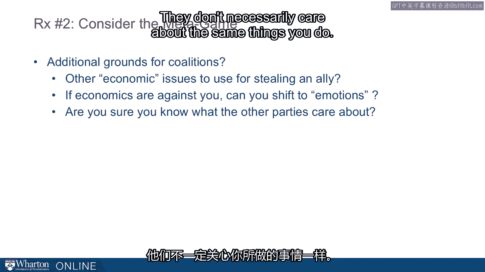

# 课程26：联盟的处方 🤝

在本节课中，我们将探讨建立和维持联盟的最佳实践。我们将学习四个核心策略，帮助你更有效地构建合作关系，从而在个人和职业领域取得成功。

---

上一节我们介绍了联盟的重要性，本节中我们来看看构建联盟的具体方法。以下是四个关键处方。

**1. 广泛撒网 (Cast a Wide Net)**

纽约大学教授布鲁斯·布埃诺·德·梅斯基塔在其著作中指出，他的模型会寻找所有可能的玩家组合，这些玩家如果认为彼此靠拢有利，就会愿意调整立场。该模型不仅预测显而易见的联盟，也揭示那些我们看不见的潜在联盟。

关键在于，我们需要**创造性地、广泛地思考潜在的联盟伙伴**。哈佛大学的拉克斯和西贝尼乌斯在2006年关于谈判的著作中，建议我们考虑以下类型的参与者：
*   **决策影响者**：那些能影响正式决策者的人。
*   **高价值受益者**：最看重你所提供价值的人（这对向组织销售产品或服务的企业家尤为重要）。
*   **决策阻碍者**：有能力阻止决定的人。
*   **激励错位者**：其利益与你或对方不完全一致的人。
*   **协议执行者**：负责落实谈判结果的人。

这些人都可能是关键的联盟成员，能帮助你克服障碍或确保事情得以完成。

**2. 考虑元博弈 (Consider the Metagame)**

如果将谈判或影响的范围定义得太窄，就会错失机会。如果你只关注某个具体问题，而忽略了与之相关的、对方可能正在考虑的更大范围的利益和联盟，你就会处于劣势。

因此，寻找额外的联盟基础至关重要。除了经济利益，还应考虑**情感和身份认同**因素，例如：
*   忠诚度
*   身份认同
*   怨恨或愤怒（在某些情况下）
*   仁慈

了解对方真正关心什么，而不仅仅是你所关心的经济层面，才能发现潜在的联盟机会，避免被对手利用。

**3. 会前会 (Have the Meeting Before the Meeting)**

这是一个非常基础但或许是最重要的策略。谈判往往在正式会谈开始前就已被影响、限制，甚至有时已经定局。

在会前会中，你可以进行**情报收集、试探态度、建立信誉、奠定基础，并创建联盟**。会前会的形式多样，可以是非正式的，例如：
*   顺道拜访某人的办公室
*   在茶水间偶遇交谈
*   发送短信、打电话或写邮件

正如丘吉尔所说：“**与盟友并肩作战有一件糟糕的事，那就是没有盟友独自作战。**” 你需要在进入正式会议前就知道自己是否有盟友。

**4. 有予才有取 (Give to Get)**

这与心理学和社会学中研究数十年的主题相关：人性倾向于以恩报恩，以怨报怨。亚当·格兰特在其著作《给予与索取》中也很好地阐述了这一点。

无论是积极行为（如帮助、礼物、尊重、谈判让步）还是消极行为，我们都倾向于做出对等的回应。这为**建立联盟提供了机会**，但如果你使用消极行为，也会成为组建联盟的障碍。

让我们回到弗兰斯·德·瓦尔对黑猩猩的研究，这揭示了联盟和互惠行为的根本性。他指出：“黑猩猩的群体生活就像一个市场，交易着权力、性、感情、支持、宽容和敌意。两条基本规则是：**以善报善，以眼还眼，以牙还牙。**”

德·瓦尔还提到一个例子：马哈勒山脉的一只雄性首领黑猩猩，通过一套复杂的“贿赂”系统——有选择性地向那些能用来对抗潜在挑战者的支持者分配肉食——将其统治地位维持了异常长的十多年。这表明，**承担短期成本可能换来更稳定、持久的联盟和长期优势**。

一个生动的例子是美国大学体育联盟的电视收入分配：
*   **阿拉巴马大学（东南联盟）**：联盟将电视收入（主要收入来源）**平等分配**给每所成员学校，甚至包括联盟办公室。这巩固了强大的联盟，使其成为过去一二十年最稳定、最成功的联盟之一。
*   **德克萨斯大学（十二大联盟）**：作为旗舰学校，它一直要求并获得远多于其他学校的电视收入。这种不平等的分配被认为是该联盟不稳定、有学校陆续退出的原因之一。

这个例子说明，作为强势方，**短期内接受看似较低或不公平的回报，可能有助于建立一个更强大、更可持续的联盟，从而获得更大的长期收益**。

---

本节课中我们一起学习了构建有效联盟的四个核心处方：**广泛撒网、考虑元博弈、举行会前会，以及有予才有取**。掌握这些策略，将帮助你更好地建立和维护合作关系，提升你的影响力与成功概率。