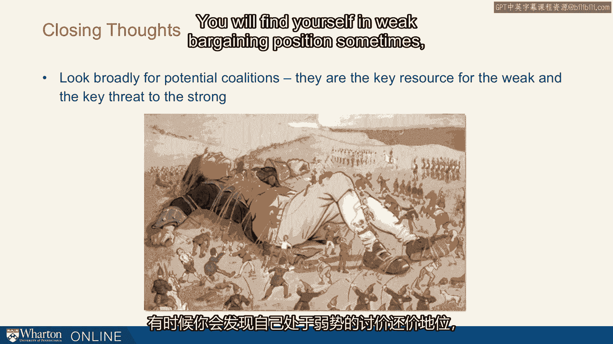

# 沃顿商学院《实现个人和职业成功》课程 P91：27_华盛顿广场案例 🏛️

在本节课中，我们将通过一个真实世界的案例研究，学习如何构建联盟。我们将分析纽约市华盛顿广场公园的一场历史性冲突，了解当个人或团体处于弱势地位时，如何通过策略性地建立联盟来对抗强大的对手，并最终取得成功。

---

## 案例背景：华盛顿广场公园之争

上一节我们介绍了联盟的概念，本节中我们来看看一个著名的历史案例。

这个例子来自纽约市，位于格林威治村中心的华盛顿广场公园。一场斗争持续了数十年，并在20世纪50年代达到白热化。

## 关键人物：罗伯特·摩西与简·雅各布斯

这里的核心人物是罗伯特·摩西。我们在课程早期的另一讲中听说过他。他是纽约市数十年的交通局长，被认为是纽约历史上最有影响力的人物之一。他掌权约45年，在此之前，他提出的项目从未失败过。

他遇到了谁？他遇到了简·雅各布斯。这是简晚年的一张照片，拍摄于21世纪初，也就是他们的斗争结束约40-50年后。让我们看看发生了什么。

## 冲突的起因

背景是摩西想要让第五大道穿过公园。第五大道从北向南延伸，在著名的华盛顿广场公园拱门处终止。摩西想让它穿过公园。他想分割公园，这不仅会极大地改变公园本身，还会因为增加该区域的交通流量而改变整个社区。

这是一个高度拥挤的休闲区，当地居民对此有很多反对意见。简·雅各布斯住在该地区，她不是第一个组建联盟的人，但她是联盟的早期成员，并且被证明对联盟至关重要。

试想一下，如果你在20世纪50年代住在华盛顿广场公园附近，而摩西想在你的社区修建这条大道——一条繁忙的四车道大街，你会怎么做？你面对的是纽约最有影响力的人。你如何阻止他？你会如何着手阻止他？思考一下你希望如何组建一个联盟。

## 联盟的构建策略

我们相信联盟的原因之一是，当你没有权力，处于相对缺乏影响力的位置时，它是你拥有的最佳资源之一。你会怎么做？

以下是他们采取的策略步骤，展示了如何层层递进地构建联盟：

**第一步：动员邻里社区**
你可能会想到的一个地方当然是你的邻居。发起请愿，收集签名。这当然是他们开始的方式。这取决于提案背后的力量有多强大，可能足够，也可能不够。事实证明，这并不足够。

**第二步：引入媒体关注**
他们接下来开始尝试引入媒体，并且采用了创造性的方式。例如，他们举行抗议活动，并且深谙媒体之道，他们让儿童参与，并真正强调了对儿童的影响。最终，人们开始报道这件事。顺便说一下，这是《村声》周刊的诞生时期。《村声》是美国第一份另类周报，始于纽约，始于这个时代，他们当然热爱这项事业。他们还招募了一些为大型日报撰写建筑专栏的人，也为他们的事业撰文。他们在这里引入了媒体。

**第三步：联合年轻政客**
他们开始与年轻的政治家合作。那些资深的、地位稳固的政治家不想与摩西对抗，但也许一些年轻人会。例如，后来成为纽约市长的埃德·科赫参与进来，因为他需要一个事业来提升自己的知名度。

**第四步：争取名人支持**
他们开始考虑名人。事实证明，当时全国最著名的女性之一，埃莉诺·罗斯福，就住在格林威治村，她非常乐意用她的名人身份支持这项事业。

随着这些步骤的推进，随着联盟中每一次新增的力量，他们的权力都在增加。

## 最终胜利

最终，经过数年努力，他们拥有了足够强大的联盟和足够的关注度，得以去见该地区可能唯一能真正阻止摩西的政治家——州务卿德·萨皮奥。德·萨皮奥能够施加足够的影响力。他看到了这些人想要什么，以及他们多年来积聚的力量，并最终阻止了摩西将第五大道延伸穿过公园的计划。

因此，在斗争最激烈的时候，摩西在最后一次绝望且未成功的尝试中，试图阻止估算委员会对交通关闭该路段，他说：“没有人反对这个。没有人，没有人，没有人，除了一群母亲。” 然而事实证明，如果母亲们能够组成联盟，她们可以非常有影响力。

他们已经超越了母亲和儿童，联合了像科赫这样的政治家、埃莉诺·罗斯福，最终联合了州务卿德·萨皮奥。

## 案例启示与联盟构建原则

简·雅各布斯后来获得了更大的名声。她写了一本书叫《美国大城市的死与生》。她甚至没有受过城市政策或城市发展的专业训练，但她写的这本书被全美国的公共政策学院用作教材。

我们从中学到了什么？以下是来自雅各布斯的一些思考：

**1. 多层次运作**
她的联盟如此有效的一个原因是它在多个层面运作。她有个体参与的街头抗议。她有报纸报道和社论，不止一家报纸，而是多家。她有来自多个办公室和候选人的政治压力，她还有名人代言。你可以看到这其中有多少不同的层次。最好的联盟确实是在多个层面运作的。摩斯当然也在尝试做同样的事情。摩斯有各种各样的杠杆，他会在媒体上说一套，在幕后也有秘密会议，所以他们面对的是强大的对手。他们需要那种复杂的联盟才能成功。

**2. 战略性构建**
这也是一个极具战略性的联盟。她是有意的。他们是有意地构建这个联盟。他们赢得了每一层新的支持。他们必须在一个层面上建立基础，然后才能扩展到下一个层面。联盟背后的一个重要理念是，你通常无法直接接触你的目标。

**3. 迂回路径**
你必须迂回地、间接地进行。这些人无法直接去找德·萨皮奥。他们不可能在第一天就去敲德·萨皮奥的门。他不会听他们的，他也不会在意。但他们积累了足够的支持，直到他某种程度上不得不听他们的。

## 关于联盟的总结思考

以下是对联盟的一些最终思考：

**第一，也是主要的教训：广泛寻找潜在的联盟。**
> 联盟是弱者的关键资源，也是强者的主要威胁。

**第二，识别情境。**
你有时会发现自己处于弱势的谈判地位。

> 在这些情况下，首要的杠杆将是联盟。另一方面，你有时会处于强势地位。最大的风险是什么？最大的风险是有人组建联盟来反对你。因此，我们都需要从双方的角度警惕这些联盟。

**第三，重视执行。**
最后，执行的失败几乎总是未能成功建立联盟的失败。

> 它是你影响力工具箱中的一个关键工具。

---

本节课中，我们一起学习了通过华盛顿广场公园的案例，深入理解了构建有效联盟的策略与原则。我们看到了简·雅各布斯如何通过动员社区、借助媒体、联合政治力量以及争取名人支持，多层次、战略性地构建起一个强大的联盟，最终战胜了看似不可战胜的对手罗伯特·摩西。这个案例生动地证明了，**联盟是放大影响力、实现目标的核心手段**，无论对于强者还是弱者，理解和运用联盟都至关重要。

