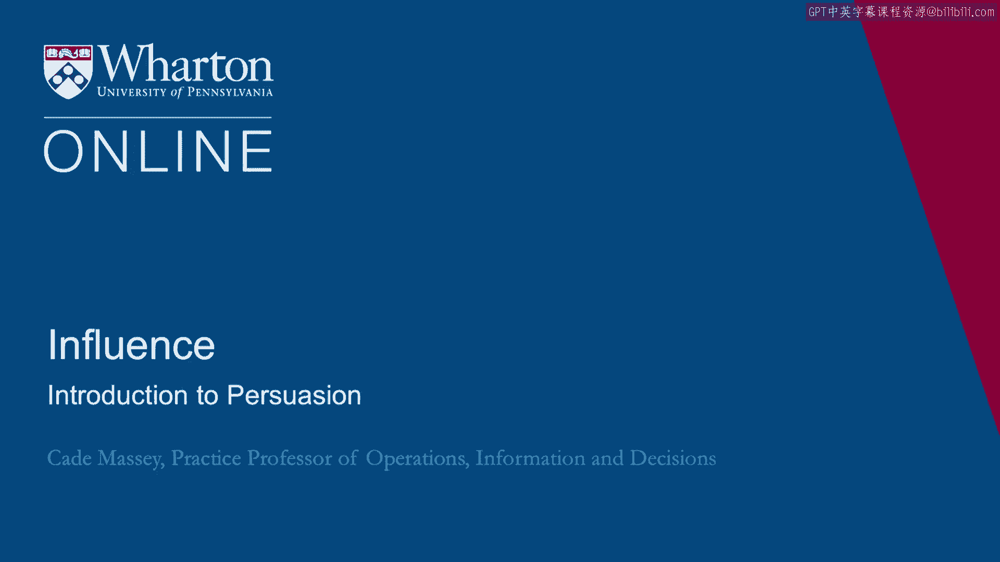
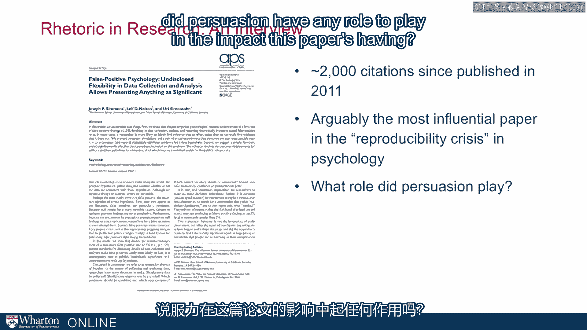

# 课程名称：沃顿商学院《实现个人和职业成功》第29课：说服力简介 🎯

## 概述
在本节课中，我们将要学习说服力的基本概念，并探讨它如何在一个意想不到的领域——学术研究中——发挥关键作用。我们将通过分析一篇极具影响力的心理学论文的诞生过程，来理解说服力的核心要素。

---

## 说服力在学术研究中的角色
我们通常认为，学术研究是一个纯粹依靠数据和逻辑的领域，说服力似乎无关紧要。然而，事实并非如此。为了改变整个心理学领域的研究方式，研究者们必须精心设计他们的沟通策略，以确保他们的观点能被听到、被理解、并被采纳。

上一节我们介绍了说服力在学术领域的潜在重要性，本节中我们来看看一个具体的案例。

## 案例研究：一篇改变领域的论文
沃顿商学院的尤里·西蒙森和乔·西蒙斯教授进行了一项关于研究方法论的研究。他们发表了一篇题为《虚假阳性心理学》的论文。这篇论文自2011年发表以来，已被引用超过2000次，被认为是引发心理学“可重复性危机”讨论的最具影响力的论文之一。

这篇论文的核心目标是说服同行改变他们进行和报告研究的方式。

## 核心问题与研究者的自由度
论文指出了一个关键的方法论问题：**研究者的自由度**。这指的是研究者在设计实验、收集和分析数据时拥有的众多选择。

例如，在一项研究中，你可能会测量参与者的情绪、努力程度或购买意愿等多个指标。如果你测量了所有指标，但只选择报告那个显示出“显著”结果的指标，那么你报告的结果就会存在偏差。

**公式化描述**： 这类似于多次抛硬币。如果你抛足够多次，总会出现连续几次都是正面的情况。如果你只报告这几次“成功”的抛掷，而忽略其他所有尝试，就会错误地得出“这枚硬币总是正面朝上”的结论。

## 说服策略一：制造引人入胜的例证
研究者意识到，一篇纯粹的方法论论文很难吸引广大读者。因此，他们决定创造一个生动、甚至有些“滑稽”的例证来展示问题的严重性。

以下是他们采取的关键步骤：
*   **设计荒谬假设**：他们提出了一个明显荒谬的假设——听一首特定的歌曲可以改变一个人的生理年龄。
*   **遵循现有规范**：他们严格按照当时心理学界普遍采用（但存在缺陷）的研究方法进行实验。
*   **展示问题**：实验“成功”地找到了支持这个荒谬假设的“统计学显著证据”。这个例子极具冲击力，清晰地表明，如果沿用旧方法，科学家可以为任何观点找到“证据”。

这个有趣的例证是论文得以广泛传播的关键，它让复杂的方法论问题变得通俗易懂。

## 说服策略二：提供切实可行的解决方案
仅仅指出问题是远远不够的，这只会让人们停留在抱怨阶段。成功的说服必须提供解决方案。

以下是他们解决方案的特点：
*   **可操作性**：他们提出的建议是期刊编辑和研究者“明天”就可以开始实施的微小步骤，而不是遥不可及的“乌托邦”式改革。
*   **难以反驳**：这些建议（如预先注册研究假设、报告所有测量指标）逻辑严密，旨在减少偏见，让人很难从道理上反对。

## 说服策略三：精心雕琢语言与姿态
在沟通中，研究者的姿态和用词同样至关重要。

以下是他们注意的关键点：
*   **使用“我们”而非“你们”**：在论文和演讲中，他们强调“我们作为一个领域”都曾这样做过，包括他们自己。这避免了高高在上的指责姿态，更容易让人接受。
*   **创造有效的术语**：他们创造了“**P值操纵**”这个简洁有力的术语，替代了冗长的“研究者自由度”。一个好的术语能极大地方便讨论和传播。
*   **保持开放与冷静**：面对批评时，他们学会了不急于进行情绪化的反击。他们意识到，保持冷静、就事论事是更有效的长期策略。

## 团队合作的价值
三位研究者的团队合作对他们的成功至关重要。团队提供了一个“冷静头脑”的检查机制。

当其中两人因遭受批评而感到愤怒，想要撰写激烈的回应时，第三个人往往能阻止这种冲动。这种内部制衡帮助他们避免了许多可能损害其信誉和说服力的公开失误。

## 总结
本节课中我们一起学习了，说服力并不仅仅是营销或政治的专利，它在严谨的学术领域同样扮演着核心角色。通过《虚假阳性心理学》论文的案例，我们看到有效的说服需要：
1.  **吸引注意**：通过生动、有趣的例证让受众愿意倾听。
2.  **提供方案**：不仅指出问题，更要提供具体、可行、难以反驳的解决方案。
3.  **注意姿态**：使用包容的语言，保持开放和冷静的态度。
4.  **借助团队**：利用团队合作来平衡情绪，做出更理性的沟通决策。

掌握这些原则，可以帮助我们在任何需要影响他人、推动变革的场合中，更有效地进行沟通。