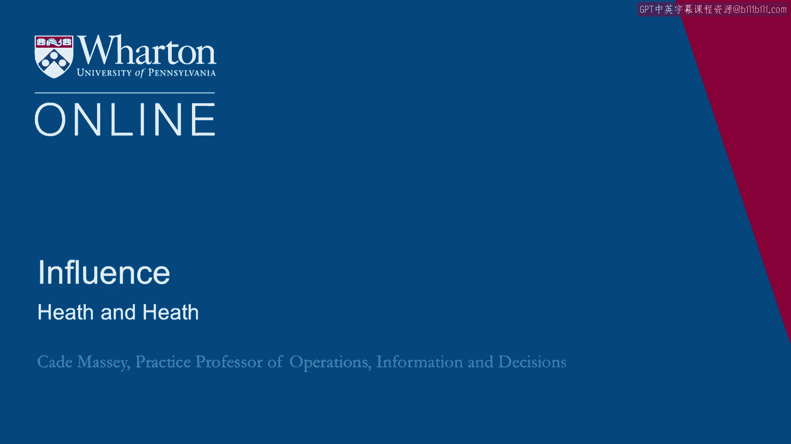
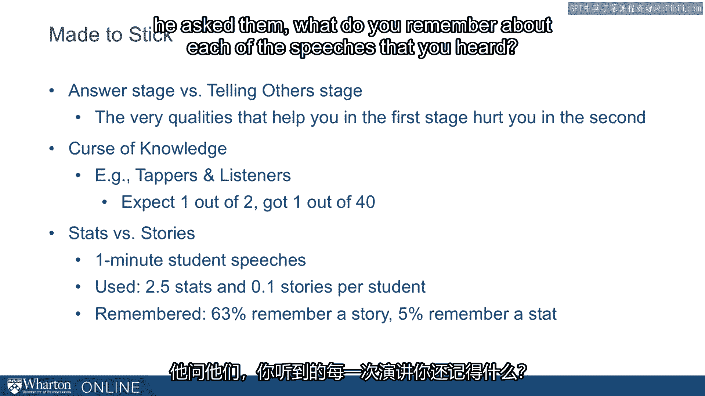
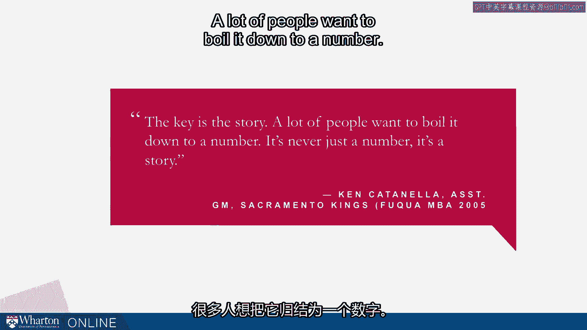

# 课程 30：希思兄弟的说服力框架 🧠

在本节课中，我们将学习希思兄弟（Chip Heath 和 Dan Heath）在《让创意更有黏性》一书中提出的核心说服力框架。我们将探讨如何使信息更易于理解和记忆，从而更有效地影响他人。

---

我们以与几位学术研究者的讨论开启了关于说服力的话题，旨在通过一个现实世界的具体例子——或许令人惊讶地来自学术研究领域——来展示修辞的运用。我们从中听到了一些主题，以及他们在试图让世界相信其观点重要性时所秉持的优先原则。当我们深入探讨说服力文献时，你会发现，这与专门研究说服力的学者们强调的一些核心理念是相通的。

为了开始这部分内容，我想先介绍希思兄弟（Chip Heath 和 Dan Heath）的研究。他们至今已出版了三本书，但他们的第一本书《让创意更有黏性》（2007年出版）正是关于说服力的。这本书源于奇普·希思对理解都市传说的研究：是什么让都市传说经久不衰、广为流传？是什么元素让它们特别具有“黏性”？这对学术研究者而言是个奇特的起点，当时人们并不清楚他的研究方向。但正是从这个问题和研究中，诞生了这本非常重要的书，它为我们如何更具说服力提供了深刻的见解。

他们使用一个缩写词来总结其研究成果。这个缩写词是 **SUCCESS**，在他们的框架中代表：
*   **简单性**
*   **意外性**
*   **具体性**
*   **可信性**
*   **情感**
*   **故事**

关于希思兄弟以及其他相关文献，有一点需要注意：这并非高深莫测的脑外科手术。这些理念并不真的需要我坐在这里向你详细解释。你可以阅读这些观点，甚至可以深入阅读整本书，仅仅阅读引言或结论部分也能帮助你理解他们的出发点。真正的挑战在于实际应用。这本书的美妙之处在于，它通过一个又一个的例子，不断提醒我们这些理念的重要性和所能产生的巨大影响。

因此，尽可能保持信息**简单**，提出**意外**的元素（告诉人们他们不知道的事情），使用**具体**的例子（避免纯粹的抽象概念），融入**情感**，最后——这也是他们工作中最普遍的主题之一——**讲故事**。接下来，我们将更详细地探讨他们的研究，但以上是他们的总体框架。他们指出的一点是，你并不需要同时具备所有这些特质。他们将其比作谈论一位伟大篮球球员的属性：如果一名球员在篮板、助攻、得分和防守上都出类拔萃，那当然很棒，但要成为一名成功的篮球运动员，你并不需要在所有方面都出类拔萃。当然，你在越多方面表现出色，你就会越优秀。说服性信息也是如此。

希思兄弟谈到，他们从有效的广告中提炼出了一个包含六种不同方法的模板。最终他们说，所有有创意的广告都彼此相似，但每个失败的广告都以各自的方式缺乏创意。这里的论点是，确实存在一种让信息更具说服力的“配方”，存在系统性的方法来产生有创意、有创新性、有黏性的想法。

他们传达的一个重要信息——你甚至可能认为这是说服力的基本原则——是：知识渊博最糟糕的一点在于，我们倾向于分享所有知识。一旦你在一个项目上投入了大量精力，或者成为了某个领域的专家，你往往会想要分享你的专业知识，分享你所知道的一切。而这几乎与构建一个有说服力的信息的方式完全相反。信息应该从受众出发，而不是从你所知出发。因此，从一开始就存在一种试图做太多的偏见，我们需要努力克服这种偏见。

这张图片是耶鲁法学院门楣上的浮雕。法学院能有如此谦逊将此置于门上，让我感到惊讶和有趣。我认为这对学者们是一个很好的提醒——不仅是耶鲁法学院的学者，也包括其他地方——我们有时会忍不住分享过多，而最有效的教育方式并非分享你所知道的一切。

希思兄弟的研究中，还有一些其他故事和细节我认为对我们尤其重要，需要记住。

第一个是“寻找答案阶段”和“告知他人阶段”之间的区别。我记得自己年轻时做顾问，疯狂地为客户演示准备项目，基本上在演示当天醒来时，经理走进来问：“那么，我们打算如何传达这个信息？我们要对他们说什么？”我根本没想过这个问题，我只是在努力寻找答案。我所有的时间都集中在获取答案上，却没有分配任何时间来思考如何将这个答案传达给这次合作中最重要的人——客户。这是我们经常遇到的问题：我们过于关注“寻找答案阶段”，而忘记了“告知他人阶段”的重要性。希思兄弟指出，那些帮助你在第一阶段取得成功的品质，可能会在第二阶段伤害你。如果你非常擅长找到答案，有时这反而会直接妨碍你有效地传达这些答案。我们需要重视并为“告知他人阶段”预留时间。

他们提供的第二个概念是“知识的诅咒”。这实际上借鉴了几十年的心理学研究，但他们讨论了一个领域内的实验：实验对象被分配扮演“敲击者”或“倾听者”的角色。任务是，敲击者被告知一首歌或一段音乐的名字，然后他们需要在桌子或台面上敲击出这段音乐的节奏，让另一个人理解他们在敲击什么。另一个人当然要努力猜出是哪首音乐。一个有趣的细节是，他们会问敲击者：“你认为对方猜中你敲击内容的可能性有多大？你预测他们能猜出来吗？”敲击者认为他们大约有一半的几率能被猜中，而实际上倾听者猜中的几率只有四十分之一。基本上不可能通过听别人在桌子上敲击来猜出歌曲，这并不奇怪。令人惊讶的是，敲击者自己很难理解这一点。敲击者无法将脑海中的音乐旋律抹去，正因为他们无法摆脱脑海中的旋律，他们也就无法设身处地为倾听者着想，很难把握对方的视角。优秀的沟通者能够将脑海中的“音乐”清空，将自己置于第一次听到这个信息的倾听者的情境中。这是你在准备一个有说服力的演示时能做的最重要的事情之一。

一项关于“统计数据与故事”的研究非常有趣。研究者让学生们进行一分钟演讲，他们事先并不知道之后会被问及对每个演讲的记忆。在学生们演讲时，研究者记录了他们在演讲中是否使用了统计数据，是否使用了故事。他发现，在这些一分钟演讲中，学生平均每次演讲使用2.5个统计数据，而只有十分之一的学生使用了故事。然而，当他在所有学生演讲完毕后询问他们“你记得你听到的每个演讲的什么内容？”时，**63%的人记住了一个故事，而只有5%的人记住了一个统计数据**。请记住，他们听到的统计数据大约是故事的25倍，但记住故事的频率却是记住统计数据的12倍。

这让我想起我的一位前学生、持续的朋友兼同事肯·卡托内拉的话，他目前是萨克拉门托国王队的助理总经理。他是福库商学院的MBA，2005年毕业。多年来，他为多支NBA球队工作。他说他打过篮球，后来他的专业领域首先是统计和分析。但他说，尽管有分析背景，**关键还是故事**。很多人想把它归结为一个数字，但它从来不仅仅是一个数字，它是一个故事。这话来自一个以数字为导向的领域，来自一个非常认同联盟统计数据价值的人。他说，最终总是要归结为一个故事。

有一个来自我们课程早期研究过的罗伯特·摩西的引述。他多年来最亲密的助手之一名叫杰克·马迪根，马迪根谈到摩西是多么有说服力。当我们讨论摩西时，我们谈到了他所拥有的各种权力来源。他也是一位说服大师。马迪根说：“你永远无法停止惊讶，你可以就你心中的某个想法对某人说啊说啊说，而他并不怎么感兴趣。然后他拿出一张漂亮的图片，或者更好的是一个比例模型，桥是纯白色的，水是漂亮的蓝色，你就能看到他的眼睛亮起来。”摩西知道立体模型的力量。摩西知道，如果你能让某件事对某人来说具体而令人兴奋，说服力会有多强。这是你在准备演示时需要牢记的一个很好的修辞技巧。你的“立体模型”在哪里？你通常不会真的有一个立体模型，但你需要在你具有说服力的信息中加入一些能起到“立体模型”作用的东西。你的“立体模型”在哪里？

让我们以亚伯拉罕·林肯总统的一段话作为结束，他不仅以其大型公开演讲，也以其人际层面的交流而闻名，是一位有说服力的演说家。林肯说：“即使事业本身是赤裸裸的真理，被锻造成最沉重的长矛，比钢铁还坚硬，那位道貌岸然的改革者也无法用它刺穿酒徒或奴隶主的心脏，就像无法用一根稻草刺穿乌龟的心脏外壳一样。这样的人必须被理解，那些想要领导他的人也必须这样理解他。”林肯解释说，为了赢得一个人支持你的事业，你必须首先触及他的内心，这是通往他理智的康庄大道。林肯在这里基本上是说，无论你的事业多么正义，无论你的意图多么坚定，你必须先打动人心。如果你无法打动人心，你就永远无法触及他的头脑。林肯遵循了这个建议，他是我们最伟大的总统之一，他成功的部分原因就在于懂得如何说服他人。

---

**总结**：本节课我们一起学习了希思兄弟的SUCCESS说服力框架，该框架强调**简单性、意外性、具体性、可信性、情感和故事**这六大原则。我们探讨了克服“知识的诅咒”、重视“告知他人阶段”以及用故事和具体形象（如“立体模型”）打动人心的重要性。记住林肯的智慧：要说服他人，必须先触及内心，再通往理智。