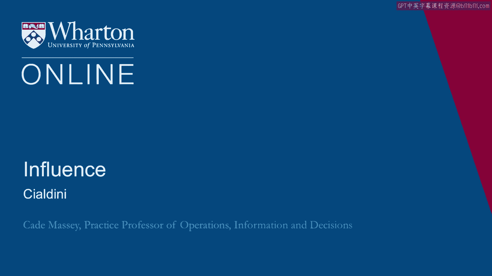

# 课程名称：影响力与说服力原理（第31课）🎓

## 概述

在本节课中，我们将学习罗伯特·西尔迪尼（Robert Cialdini）提出的六大说服力原则。西尔迪尼是影响力研究领域的重要学者，他的理论源于对销售技巧的深入研究，并提炼为六个核心原则。掌握这些原则，能帮助我们更有效地进行沟通和施加影响。

## 西尔迪尼的影响力研究背景

在希思兄弟（Heath and Heath）之前，西尔迪尼就已经是影响力研究领域最重要的当代学者之一。他的研究成果可以在许多地方找到，例如大约15年前的一篇《哈佛商业评论》文章。他的原著《影响力》（"Influence: The Psychology of Persuasion"）已经发行了多个版本。

许多人在本科或研究生阶段的课程中接触过他的理论。西尔迪尼最初的研究动机，是试图理解上门推销员的工作机制。他想知道，那些在推销情境中取得成功的人，究竟做对了什么。为此，他进行了亲身实践研究：他亲自注册成为上门推销员，接受相关培训，以探究其中的奥秘。

经过数十年的研究，他将这些发现提炼为六大原则。与希思兄弟的理论以及该领域的许多其他研究一样，这些原则本身并不令人惊讶或难以理解。真正的挑战在于，我们需要先了解它们，然后在尝试传递说服性信息时，时刻牢记并运用这些原则。

## 六大说服力原则详解

简而言之，西尔迪尼的六大原则是：**互惠**、**社会认同**、**承诺与一致性**、**权威**、**稀缺性**和**喜好**。

以下是每个原则的具体说明：

### 1. 互惠原则

互惠原则在本课程的其他部分也有提及。这是一个在社会学和心理学中早已确立的概念：我们倾向于以别人对待我们的方式来对待别人。

*   **核心逻辑**：如果你想让他人与你合作，你先与他们合作。如果你想让他人对你友善，你先对他们友善。如果你想从他人那里获得某些东西，先给予他们一些东西会更有帮助。
*   **应用**：这已成为一种在许多地方使用的销售技巧。

### 2. 社会认同原则

社会认同原则是指，通过展示他人正在做你希望人们做的事情，来影响他人的行为。

*   **核心逻辑**：向他人证明，已经有其他人认同、承诺或参与了某项行动，以此作为行为榜样，来引发他人的跟随。

### 3. 承诺与一致性原则

这是西尔迪尼原则中较为微妙的一个。它利用了心理学中关于减少认知失调的研究。

*   **核心逻辑**：一旦一个人公开承诺了某种行动方针，尤其是以自愿和公开的方式做出的承诺，他们就会倾向于坚持这一方针。
*   **应用**：如果你能引导某人做出承诺，特别是自愿且公开的承诺，那么随着时间的推移，他们更有可能保持与该承诺一致的行为。

### 4. 权威原则

权威原则是指，借助那些拥有资历、信誉和历史的人或机构的公信力。

*   **核心逻辑**：本质上，是利用他人的可信度来支持你提出的主张，以及你试图从他人那里引发的行动。

### 5. 稀缺性原则

人们通常认为越稀缺的资源越有价值。西尔迪尼讨论的比这更微妙：**对稀缺性的感知**会驱使人们增加对它的需求。

*   **核心逻辑**：如果人们相信一个机会只在有限时间内存在，并且他们确实相信这一点，他们就会更有紧迫感地去采取行动。

### 6. 喜好原则

喜好原则再次基于心理学中一个早已确立的“相似性”理论：我们更容易被与我们更相似的人说服。

*   **核心逻辑**：这一原则非常普遍且易于理解，我想通过一个对比的例子来快速说明。

## 喜好原则的例证分析

这个例子引用了芭芭拉·金索尔弗（Barbara Kingsolver）的小说《纵情夏日》（"Prodigal Summer"）中的一句话，几年前艾米·克拉克（Amy Clark）在《纽约时报》的一篇文章中用它来阐明观点。

> **原文引用**：“Bite，” he had said, with the northerners clipped “I”， an outsider intruding on this place like a kudzu vine.

这句话描述了一个观察者注意到某人说话带有与当地方言略有不同的口音。结果，这个人就被归类为一种他们熟悉的、外来的、有害的藤蔓植物（葛藤）。

艾米·克拉克对此评论道：“一个元音瞬间就将说话者标记为外来者，导致人们对其政治立场、宗教信仰和可信度产生一系列假设。这是一个与葛藤（一种19世纪末从日本引入的窒息性杂草，能吞没整个山丘和树木）的绝妙类比。”

她在这里强调的是，一旦一个人被标记为“外来者”，与该类别相关的所有假设——政治、宗教、可信度（在这里因为是外来者，所以都是负面的）——都会随之而来，而这仅仅是因为他们说话方式不同。

我们可以将这种情况完全反转过来。西尔迪尼理论的一个要点就是，当你想说服他人时，你需要在某些方面与对方建立共同点。

*   **核心应用**：你需要与听众建立某种共同性。因为一旦你做到了这一点，他们会觉得你更有说服力，更愿意向你敞开心扉。他们不会再将你编码为“外来者”，而是视为“自己人”，并随之赋予你所有有益的属性。

## 总结

本节课我们一起学习了西尔迪尼的六大说服力原则：**互惠**、**社会认同**、**承诺与一致性**、**权威**、**稀缺性**和**喜好**。这些原则根植于人类心理，理解并恰当运用它们，可以显著提升我们在个人和职业场景中的沟通效果与影响力。关键在于，不仅要了解这些概念，更要在实践中主动、有意识地运用它们。