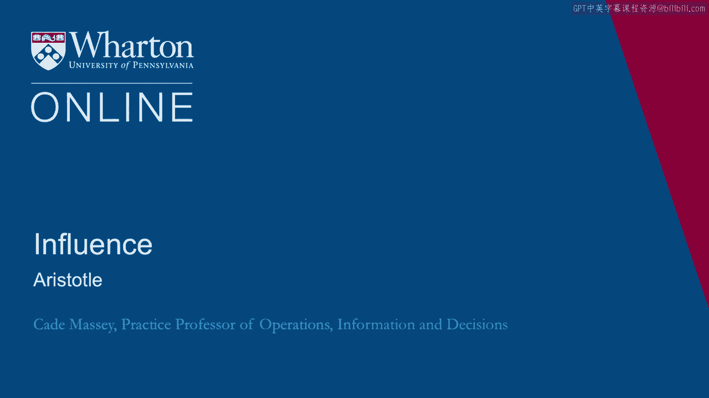
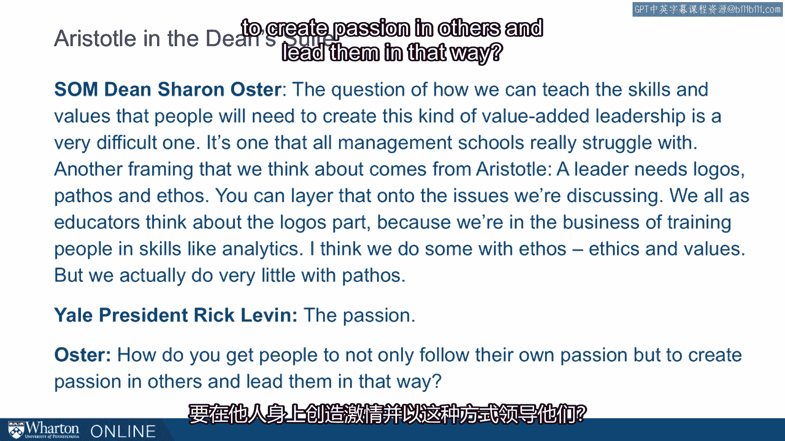
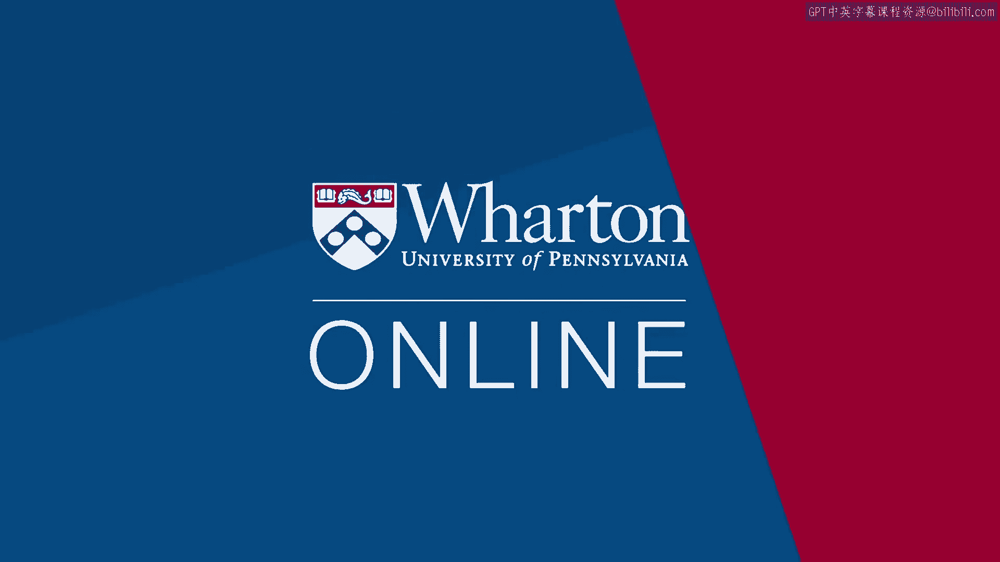

# 课程 32：亚里士多德的古典说服框架 🏛️

在本节课中，我们将学习亚里士多德提出的古典修辞学框架。这个框架将说服力分解为三个核心要素：理性、情感和品格。我们将探讨这个框架如何与现代说服理论相联系，并通过本杰明·富兰克林的演讲实例，学习如何在沟通中有效运用这些原则。

---

## 从现代理论回溯到古典智慧

上一节我们讨论了希思兄弟和罗伯特·西奥迪尼的现代说服理论。本节中，我们将目光投向更久远的时代，探讨亚里士多德在古典修辞学中提出的框架。

亚里士多德的理论在某些方面比现代理论更简洁，却几乎涵盖了所有现代研究强调的要素。我们可以将其视为另一个独立框架，也可以将其看作一个能容纳其他现代理念的“总括性”概念框架。这两种视角都很有用。

---

## 亚里士多德的三种说服方式

根据古典修辞学，说服有三种方式：**Logos**、**Pathos** 和 **Ethos**。

*   **Logos** 指观点的逻辑。
*   **Pathos** 指听众的情感。
*   **Ethos** 指演讲者的品格。

可以看出，这三种方式聚焦于说服动态中的三个不同要素：观点的发起者（演讲者）、观点本身（需要逻辑），以及说服信息的目标（听众，强调调动其情感）。

这些概念与我们之前讨论的内容相呼应。许多学生，尤其是商学院的学生，通常在 **Logos** 方面不需要太多帮助。事实上，他们可能非常擅长逻辑，却相对忽视了另外两个方面。人们在构思说服性信息时，通常首先想到的是自己观点的逻辑力量，这是很典型的。

我们讨论的希思兄弟的研究，以及西奥迪尼理论中的许多内容，都侧重于 **Pathos**。这些研究提醒我们，让说服性信息“粘住”人心的，是它们能在他人心中激起的情感。因此，我们之前讨论的很多内容都强调了 **Logos** 和 **Pathos**。

而 **Ethos** 在亚里士多德的框架中，常常是被忽视的一环。它在希思兄弟和西奥迪尼的理论中有所体现，但人们谈论得不多，理解得也不深，执行起来也更困难。

---

## Ethos 的实践案例：本杰明·富兰克林

接下来，我将给出一个关于 **Ethos** 的例子。这个例子来自本杰明·富兰克林在制宪会议上的一次演讲。

富兰克林不仅是一位杰出的思想家和发明家，也是一位外交家，以擅长说服和修辞而闻名。以下是他演讲的开场：

> “我极不情愿起身表达对计划中任何条款的不赞同，因为我们非常感激提出此计划的尊敬的先生。从第一次宣读起，我就对它抱有好感，并总体上希望它成功。但在行政官员薪俸这一具体问题上，我恰好持不同意见。由于我的观点可能显得新奇且不切实际，我仅仅是出于确信它是正确的，以及出于责任感，才冒险提出。委员会在听取我的理由后将做出判断，而他们的判断或许会改变我的看法。我认为我看到设定薪俸带来的不便，而拒绝它们我看不到任何不便，相反，却能看到巨大的好处。”

那么，你看到他在那里做了什么？富兰克林做了什么？

修辞学中 **Ethos** 的理念在于，我们必须通过自己的言谈来传达品格。我们不能只是站起来宣称自己是谁，而必须在试图说服他人的过程中，通过自己的方式来展现品格。

富兰克林在演讲开头似乎达成了几件事：
1.  他表示自己基本上是持赞同态度的，这在某种意义上恭维了对方，让对方知道他不是原则上的反对者，事实上他很感激对方。
2.  他在言辞中声称自己的“公正无私”，他对这个问题持中立态度，反对这些提议并非出于某种偏见。
3.  最后，他做了一个非常巧妙的表述：“请评判我的观点。事实上，基于你们的反应，我可能会改变主意。” 他并没有说自己立场坚定、是个狂热分子，或是来自某种永久不变的立场。相反，他表明“这是我的看法，我是理性的、开放的”。

我们不知道这些是否都是他的真实想法，但他的目的并非准确反映自己的实际信念。他在这里试图做的是**有效**。在说服和修辞中，“正确”和“有效”是有区别的。富兰克林在这里试图做到有效。在这样做的时候，他为我们提供了一个在说服性演讲中运用 **Ethos** 的绝佳范例。

---

## 将古典框架与现代理论结合

回到亚里士多德。这里的一个观点是，修辞学的三部分框架是承载这些说服理念的一种更简单的方式。

我喜欢希思兄弟及其后续研究者的工作，也喜欢西奥迪尼及其产生的所有成果，但有时要同时记住西奥迪尼的六个原则和希思兄弟的“SUCCESs”缩略词，信息量很大。亚里士多德给了我们三个要素。有些时候和地方，你真的需要同时运用这三者。例如，当你坐下来构思一封非常重要的信息或邮件时，亚里士多德的框架是一个很好的提醒：我的信息中 **Pathos** 在哪里？我的 **Ethos** 在哪里？我如何传达它？我的信息在哪些方面体现了 **Logos**？

这是一个非常简单的框架，在这个框架下，我们可以挂载许多从西奥迪尼和希思兄弟那里看到的内容。

以下是具体对应关系：

*   **Logos**：观点内在的逻辑。
    *   例如：一致性、稀缺性、社会认同、简洁性，这些都归于 **Logos** 的范畴。
*   **Pathos**：听众的情感。
    *   显然，希思兄弟特别谈到了情感。他们谈到的故事性、意外性、具体性，这些都是 **Pathos** 的要素，是通往 **Pathos** 的途径。
*   **Ethos**：演讲者的品格。
    *   我们看到西奥迪尼和希思兄弟也谈到了这一点，尤其是西奥迪尼理论中的可信度、喜好度、相似性、权威性，这些都是 **Ethos** 的要素。

这表明，亚里士多德的框架是一种更简单的方式，可以将许多这些更宏大、更新的理念挂载到一个更广泛的框架上。这尤其重要，因为说服的挑战往往不在于理解，而在于**记住并运用**。你需要找到一个对你有用、你真正会去实施和使用的框架。

---

## 框架在现实领导力中的应用

耶鲁大学管理学院的一位院长几年前接受采访时，谈到了亚里士多德修辞学在她自己信息传递中的作用。

这位院长是莎伦·奥斯特，她是耶鲁大学的经济学家。她在两任常任院长之间暂时接任了院长职务。她谈到，她经常将亚里士多德的框架运用到她的演讲中。商学院的院长们经常在世界各地飞行，向校友们汇报学校的最新情况，并发表大量演讲。她发现用亚里士多德的三部分框架——**Ethos**、**Pathos**、**Logos**——来思考非常有用。

她在采访中说道：
> “如何教授人们创造这种增值型领导力所需的技能和价值观，是一个难题。这是所有管理学院都在努力解决的问题。我们思考的另一个框架来自亚里士多德：一位领导者需要 **Logos**、**Pathos** 和 **Ethos**。你可以将这个框架叠加到我们正在讨论的问题上。我们作为教育者都会思考 **Logos** 部分，因为我们从事的是培训人们掌握分析等技能的行业。我认为我们在 **Ethos**，即道德和价值观方面也做了一些，但我们在 **Pathos** 方面实际上做得很少。”

当时的那鲁大学校长里克·莱文补充说：“激情。” 奥斯特回应道：“是的，你如何让人们不仅追随自己的激情，还能在他人心中创造激情，并以此方式领导他们？”

---

## 总结

本节课中，我们一起学习了亚里士多德的古典说服框架。这个框架将有效的说服力分解为三个核心支柱：**Logos**（观点的逻辑）、**Pathos**（听众的情感）和 **Ethos**（演讲者的品格）。我们探讨了这个简洁框架如何与现代说服理论相融合，并通过本杰明·富兰克林的演讲实例，学习了如何在沟通中具体展现 **Ethos**。最后，我们看到即使是当代商学院的领导者也发现这个历经千年的框架极具实用价值，能够帮助我们在构思重要信息时进行全面的自我检视，从而提升沟通的影响力和说服力。