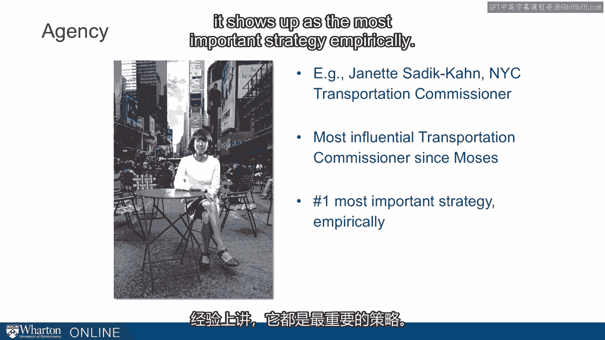
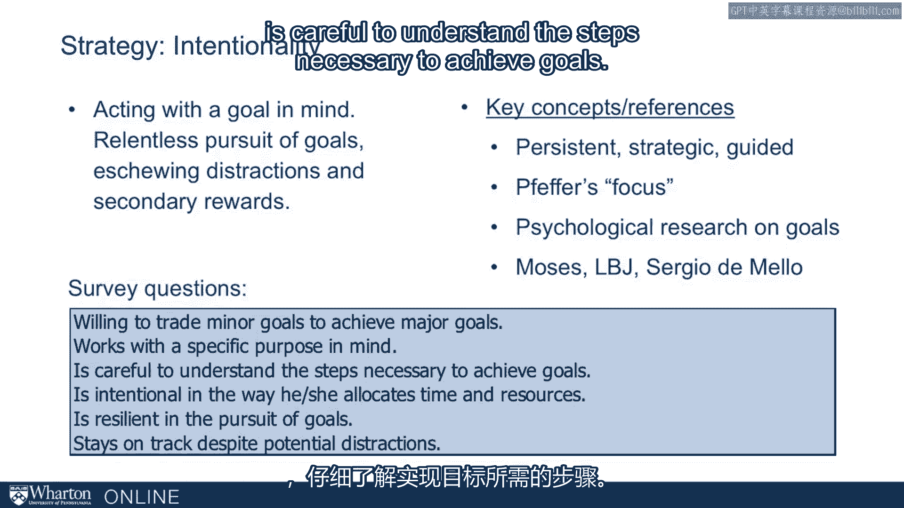
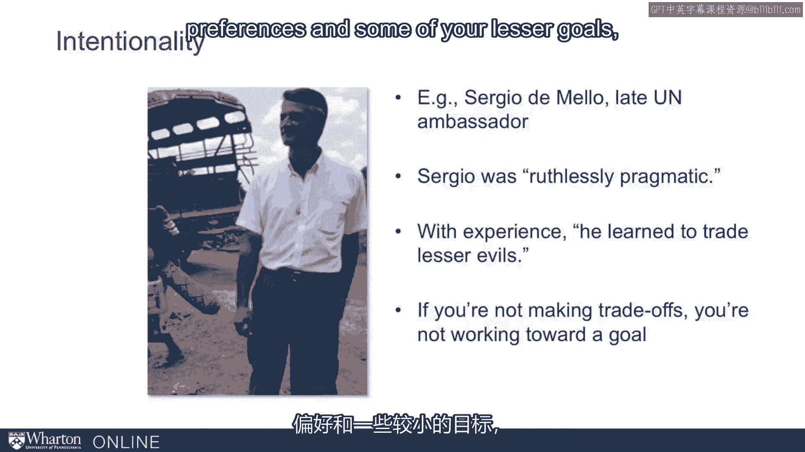
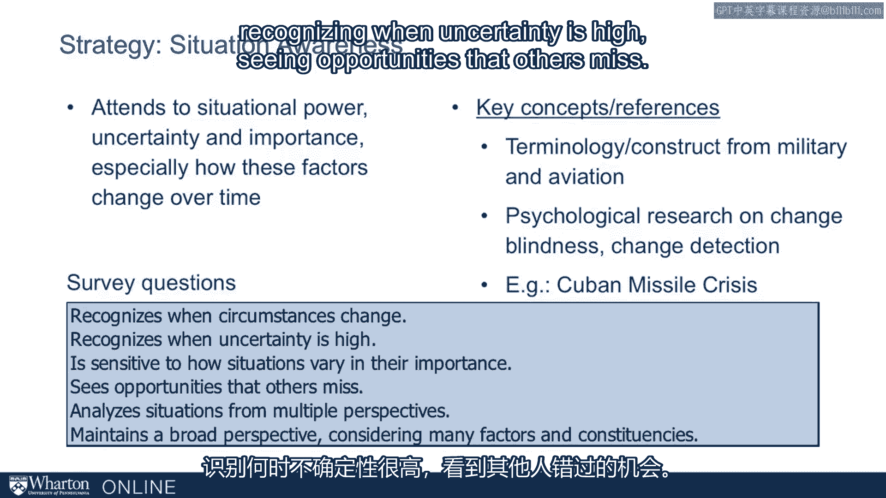
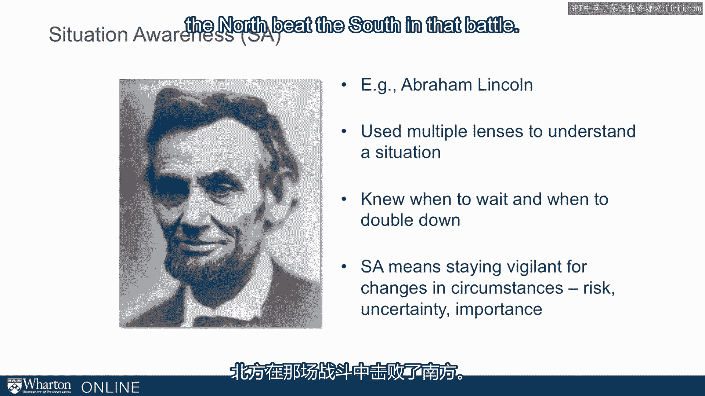

# 沃顿商学院《实现个人和职业成功》课程笔记 P99：35_评估内容 📊

在本节课中，我们将学习如何评估个人影响力策略。我们将深入探讨一个名为“影响力清单”的工具，它旨在帮助你评估自己在多种影响力策略上的表现。课程将详细介绍这些策略的分类、具体含义以及如何通过调查问题来衡量它们。

---

## 影响力策略概览

影响力清单旨在帮助你评估自己在广泛影响力策略上的表现。

我们可以将影响力策略分为几个不同的类别。

以下是这些策略的分类。

*   **第一类是说服类**。包括**逻辑诉求**、**情感诉求**和**人品诉求**。这些是亚里士多德修辞学的组成部分。我们在之前的说服章节中见过它们，在介绍具体工具时我们会更详细地讨论。
*   **第二类是关系类**，即**二元关系**。你可以将它们视为谈判关系。这类策略包括**交换**、**强力**和**他者中心**。
*   **第三类可以看作是关系结构类**，即从宏观角度看待你的关系网络。这类策略包括**网络构建**、**联盟建立**和**团队建设**。

这九种策略来源于一个常见的框架，几乎是关于什么是关键影响力策略的普遍共识。我们在这里将它们列成三列：一列是我们的影响力清单，另一列是“Hey Groups”工具（一个早期的行业影响力策略评估工具），第三列是咨询公司麦肯锡（他们培训顾问的影响力策略）。我们将它们对齐，以便你能看到每一行基本上都指向了相同的概念。因此，只需要十行就能涵盖这三个群体都在讨论的九个主题。这里的重点是，关于关键影响力策略，存在一个几乎公认的“经典”或普遍共识。

我们将超越这个框架，但这是我们的起点。这是最初的九种策略。

接下来，我将逐一介绍这九种策略，提供一个简要总结，并指出与每种策略相关的调查问题，以便你能将你的评估结果与这些概念联系起来。

---

## 九种经典影响力策略详解

### 1. 他者中心

这是自我中心的反面。这是一种**以他人为导向**的思维。指积极寻求他人利益并考虑其偏好的人。它与**赋权**、**协作**相关，也与杰夫·普费弗所说的“对他人的敏感性”相关，还关联到由罗杰·费舍尔在《谈判力》中首次提出的谈判框架。

我们用来衡量这一概念的调查问题包括：
*   寻找能使所有相关方受益的解决方案。
*   当他人讲话时专注倾听。
*   试图理解对方的立场和出发点。

### 2. 交换

这是一种**愿意进行互惠交换**的意愿，但更倾向于超越简单的交换。它与我们之前讲座中讨论过的**互惠原则**高度相关，也与鲍勃·阿克塞尔罗德博弈论中的“**以牙还牙**”概念高度相关。

相关的调查问题包括：
*   为获得他人配合而提供奖励。
*   理解需要帮助他人才能获得他们的帮助。

### 3. 强力

这是一种**愿意使用强制力**的意愿。更广义地说，是处理棘手问题和容忍冲突的能力。这与我们在课程开始时提到的弗伦奇和雷文的**强制权力**概念紧密相连。

我们通过以下调查问题来衡量：
*   坚持自己的观点。
*   能够容忍冲突。
*   让他人知道他们的表现未达预期。

根据我的课堂经验，有些学生在这方面确实存在困难，他们需要更自如地运用这种策略，即使不是每天如此。而另一些处于另一端的学生，则可能需要稍微收敛一些，因为他们可能过于习惯使用强力。

### 4. 网络构建

这里的理念是**培养广泛且多样化的非正式关系网络**。这与**结构洞**的概念相关，源于伯特以及更早的格兰诺维特的研究（我们在课程前期讨论过）。

相关的调查问题包括：
*   维持跨越不同群体的关系。
*   努力与工作中的同事成为朋友。

### 5. 联盟建立

我们有一整天的课程讨论联盟，所以你现在应该对此很熟悉了。即**识别并获得关键人物的支持**。它在某些方面与西奥迪尼的**社会影响力**概念相关，也与动物行为学相关（我们从灵长类动物学家弗兰斯·德瓦尔那里看到了多个例子）。我们还讨论过“会前会”的做法。

我们通过以下问题来衡量：
*   为了给一个想法争取支持，逐一列出并争取个人的支持。

### 6. 团队建设

即**建立团队，优先考虑凝聚力**。这与**组织文化**和**社会化**的概念高度相关。

我们使用的问题包括：
*   优先考虑团队凝聚力。
*   帮助阐明团队的鼓舞人心的愿景。
*   呼吁团队共享的价值观或原则。

### 7. 逻辑诉求

这又回到了亚里士多德的说服概念。即**使用逻辑理由、专业知识或数据来说服他人**。

我们通过五个简洁有力的方式来衡量：
*   寻找尽可能简单的方式阐明观点。
*   收集数据支持自己的立场。
*   使用推理充分的论据。

我们的MBA学生通常很自然地擅长这一点，所以这对许多人来说不是说服中最难的部分，但仍需关注。

### 8. 情感诉求

即以**能引起情感共鸣的方式传达信息**。这同样源于亚里士多德和西塞罗。它与我们阅读的希思兄弟的著作相关。

我们的一些衡量方式包括：
*   使用故事来帮助阐明观点。（这是许多人可以添加到他们修辞中的东西。）
*   根据特定受众调整沟通内容和风格。

### 9. 人品诉求

这是亚里士多德修辞学的第三个也是最后一个组成部分。即**通过资历、共同点和得体举止建立个人可信度**。你符合他人对你角色的期望。因此，它与西奥迪尼的一些概念（相似性和权威性）相关，也与弗伦奇和雷文的**专家权力**概念相连。

我们通过几个问题来衡量，例如：
*   自信地提出想法。
*   让他人了解自己的努力和成就。

这是为这一特定概念增添色彩的一点。许多人在此方面有困难。我们知道，如果听众了解你的资历和可信度，你会更有说服力。但挑战在于，我们不喜欢听别人告诉我们他们的资历和可信度。那么，你如何在不惹人厌烦的情况下传达这些信息，从而更具说服力？这是影响力中一个奇妙的小挑战。

---

## 三种元策略：超越经典框架

以上是对最初九种策略的概述，它们代表了该领域的普遍共识和经典框架。这也是我们多年前开始构建这个工具时的起点。但在与EMBA学员合作并研究文献后，我们认为还缺少几个组成部分，因此我们添加了三种策略。我们将它们视为**元工具**，或者说是用来弄清楚如何使用其他工具的工具。它们是：**能动性**、**目的性**和**情境意识**。

让我们花一点时间来理解这三个概念的含义。

### 1. 能动性

指**塑造情境、影响环境以满足需求，挑战现状，不接受任何事物是固定不变的**。它与**主动性**和**控制力**的概念相关，也与社会学中关于“规则打破者”的研究相关。我们在本课程中看到了许多例子，如罗伯特·摩西、珍妮特·萨迪-汗，他们都阐释了这一点。

我们通过一些问题来评估相关行为：
*   创造新的替代方案。
*   在被要求之前就采取行动。

珍妮特·萨迪-汗是一个很好的例证。她是纽约市近年来的交通专员，因在纽约创建步行区而备受赞誉。她以极大的能动性，在很大程度上克服了官僚障碍，以一种无人认为可能的方式改变了纽约的城市景观。她做了其他伟大的事情，但她不愿意接受任何既定事实。大多数人认为她是自摩西（罗伯特·摩西）以来最有影响力的交通专员。

如果你看一下我们的数据（我们稍后会看到），这一策略总是显现出来。在我们测试过的每一个群体中，从经验数据上看，它都是最重要的策略。

### 2. 目的性

指**心中有目标地行动，不懈追求目标，避开干扰和次要回报**。这与杰夫·普费弗所说的“专注”相关。显然，关于目标的研究已有数十年。我们在本课程中从罗伯特·摩西和塞尔吉奥·维埃拉·德梅洛那里看到了例子，我稍后会详细阐述。

我们用来评估这一点的调查问题包括：
*   仔细理解实现目标所需的步骤。
*   在追求目标时具有韧性。

塞尔吉奥·维埃拉·德梅洛再次为我们阐释了这一点。我们在本课程的第一讲中就见过他。他是已故的联合国大使，去世时被认为是世界上顶级的外交官之一。我们研究了他管理东帝汶的时期。萨曼莎·鲍尔在关于他的书中写道，他“**冷酷地务实**”，随着职业生涯的经验积累，他学会了“**权衡较小的恶**”。这一切意味着他在做权衡取舍。他为了追求更大的目标而牺牲了次要目标。一种思考方式是：如果你没有牺牲一些偏好和次要目标，你可能没有足够的目的性地朝着你最大的目标努力。

### 3. 情境意识

指**关注情境中的权力、不确定性和重要性，尤其是这些因素如何随时间变化**。这个概念来自军事领域。那些有过军旅经历的人（至少美军如此）知道你们接受过多少关于“SA”（情境意识）的训练和演练。航空业采纳了它，其他行业也将其添加到培训体系中。它也与心理学中关于**变化盲视**和**变化检测**的研究相关。我们在课程早期讨论古巴导弹危机时提到过一些。

相关调查问题包括：
*   识别情况何时发生变化。
*   识别不确定性何时很高。
*   看到他人错过的机会。

我们最喜欢的一个例子来自亚伯拉罕·林肯总统（1861-1865年任美国总统）。我们可以用林肯来说明影响力清单中的任何概念。他是那种极其精通全部策略范围的人。他运用了全部策略，但他为我们提供了一个关于情境意识的绝佳例证，尤其是在知道何时等待和何时加倍努力方面。

当他即将发布《解放奴隶宣言》解放美国奴隶时，即使在他所在的北方地区，甚至在与他交战的南方作战的共和党人内部，也存在巨大争议。并非所有人都支持《解放奴隶宣言》。他本人也为此辩论了很长时间，最终认为发布此宣言的时机已到。那是1862年夏天，内战进行了一年。他向内阁成员提出：“是时候做这件事了。我辩论过了。你们怎么看？”他们轮流发表了意见。据说他考虑到了所有人的意见，除了一条。他的国务卿西沃德说：“我喜欢这个想法，但时机不好。我们目前正在输掉战争。如果我们现在这样做，会看起来像一个软弱政府的绝望之举。”他鼓励林肯将其搁置，直到战局扭转，那样会得到更好的接受。林肯看到了这个建议的智慧，事实上将其放进了抽屉，搁置了大约六个月。随后，在安提塔姆战役（美国历史上最血腥的一天）之后，北方在那场战役中击败了南方，扭转了战争局势，他发布了《解放奴隶宣言》。

这个故事让我感到 remarkable 的是：林肯即将做出一个政府有史以来最宏大的姿态之一，但他决定时机不对。他意识到重要的是这件事的有效性。为了有效，他道德上多么正确并不重要。时机很重要。情境很重要。他愿意推迟这个宏大的姿态——一个总统所能做出的最宏大的姿态之一——以等待合适的时机。

---

## 课程总结

本节课中，我们一起学习了影响力评估的框架。我们首先介绍了九种经典的影响力策略，包括说服类的逻辑、情感、人品诉求，关系类的交换、强力、他者中心，以及结构类的网络、联盟和团队建设。随后，我们探讨了三种超越经典的元策略：能动性、目的性和情境意识。这十二种策略共同构成了“影响力清单”的评估基础。在下一讲中，我们将详细探讨评估数据的具体样貌和分析方法。

