# 沃顿商学院《商务基础》｜Business Foundations Specialization｜（中英字幕） - P100：23_管理人员.zh_en - GPT中英字幕课程资源 - BV1R34y1c74c

 When we look at the dictionary definition of manage or management for that matter， it's。

 all about getting the people below us， maybe in some of the unit to do well。

 We promote them if they have succeeded。 But management in my view is a kind of a 360 in reverse。

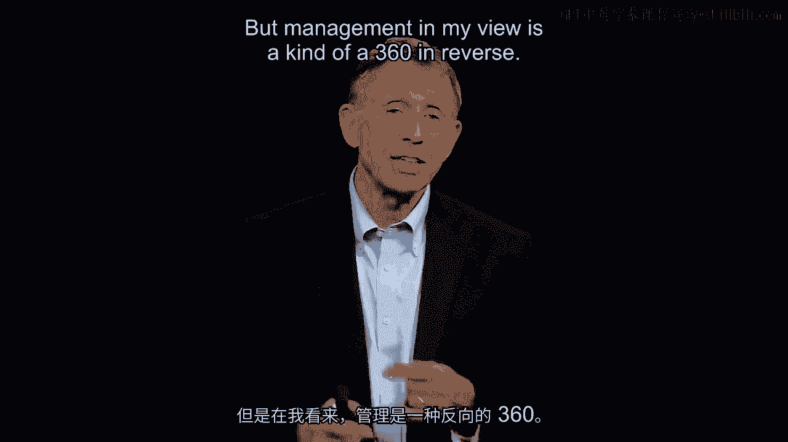

 We've got to manage people below。 Of course， we've got to manage partners。

 joint venture people that we're working with。

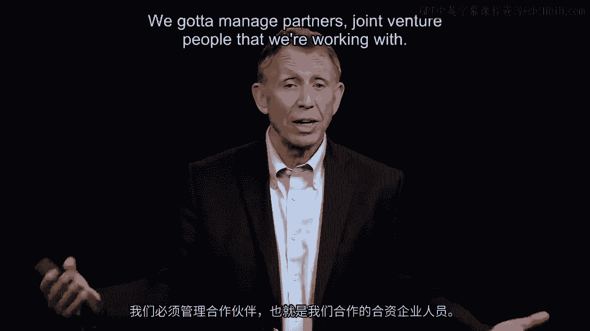

 There's out here that may have， on our part， picked up some of the outsource functions。

 that they can do better than we can do。

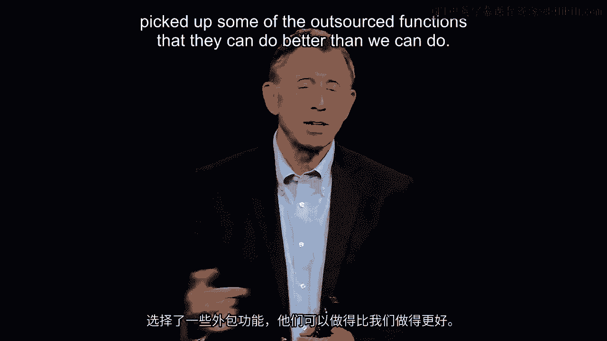

 And today， we also have to be able to manage our boss， manage with our boss。

 That's not about currying favor。 It is about making certain that Chuck Schwab is going to be on board。

 We've got to manage that if we're actually going to do it。

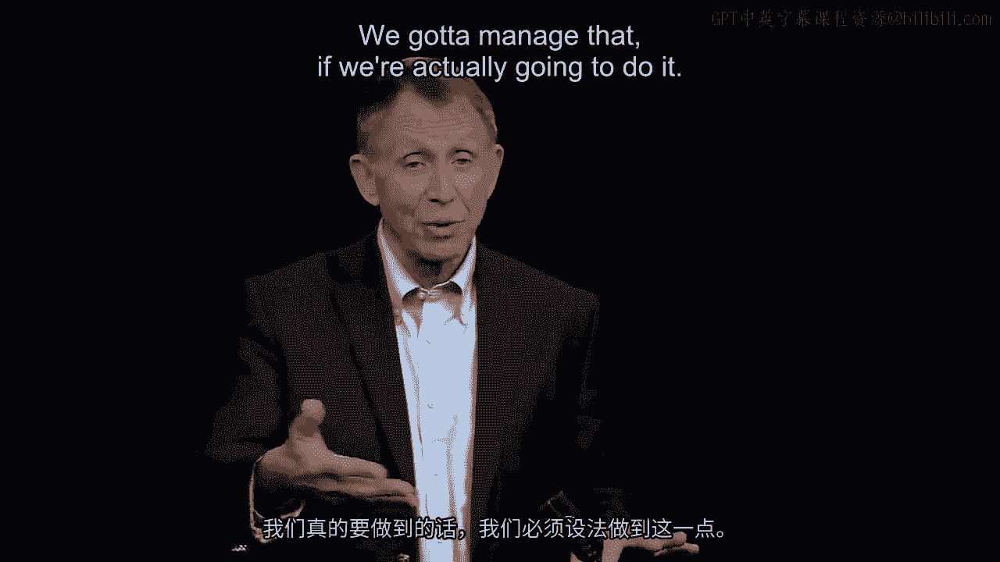

 If he gets in a way， it's not going to happen。 Thus， David。

 look at the photograph there at the bottom， sits down with Charles Schwab。

 They talk for a couple weeks knowing your boss that you can manage。

 Charles Schwab is a very analytic guy along with all the other ways we think。 Of course。

 the intuition is very powerful。 But he says to David， David knew it。 Show me the numbers。

 If we cut our revenue by 70% with that price cut， are we indeed？

 What's the evidence that we're going to make up for that in a huge new flow of new customers？

 We'll make up for price cut in radically rising volume。

 The two of them talk about that for two and a half weeks。 Lots of going back and forth。

 It is pointed out that a 20% or 25% loss of stock price by the company Charles Schwab。

 may cost Chuck Schwab himself close to $500 million， maybe even $1 billion because so。

 much of his own net worth and net of his family is in Charles Schwab's stock。

 Probably not a billion， but maybe at least a couple hundred million。 That loss， by the way。

 might happen in just a couple days when the stock price plummets。

 maybe by 22% in line with the drop in pre-tax profits。 At this point， the question for Chuck Schwab。

 an obvious one， David， you're asking me to。

 kind of bet my family fortune， should I trust you？ And the answer is， well， you should。

 I've been working with you for quite a while。 You've seen me make management decisions before。

 I've explained them to you。 Unlike our firefighter and man Gulch。

 who didn't explain almost anything， David Potruk， of a school that he had an opportunity to think through。

 has been explaining to people， below， outside and above， in this case， Charles Schwab。

 how he makes decisions。 With that， Chuck says， let's do it。

 Now we're not quite done as we begin now to push this through though because we got two。

 areas of people that we still have to manage， not yet articulated or identified。

 The first is the board of directors itself。 They tend to think if you're in a big company。

 it's way up there。 But this is a kind of bet the company decision。 Do they want to know about it？

 Of course。 And we have to not only take it to them。

 We actually have to manage how they think about it in the best sense of management， not。

 to manipulate， but to put the facts out so they can make their own independent， reasoned。

 judgment call。 At the next board meeting， thus Chuck says to Charles Schwab says to David Potruk。

 "David。

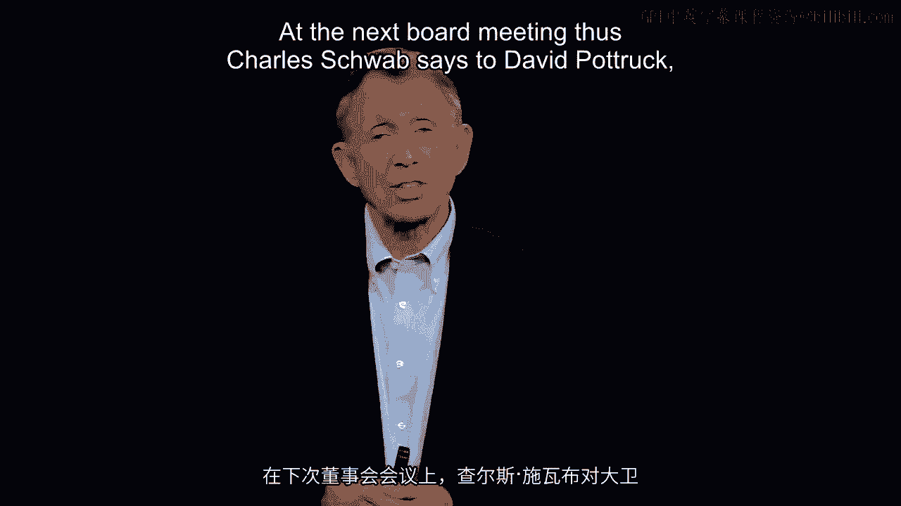

 the board has to look at this， of course， has to approve it， for sure， and I'd like you。

 to take it into the next board meeting。"。

 David walks in and in about two and a half hours at the next Charles Schwab board of directors。

 meeting， lots of non-executive directors， people from the outside there， it takes David。

 only a couple hours to make the case and to find approval。 And that quick。

 talking good and timely here， of course， yet again， that quick decision。

 came in part because David had earlier， won't go into it now， but had earlier forced himself。

 to master the art of managing up， not only in the direction of the chief executive， "I。

 got to get better managing my relationship with Charles Schwab， I've got to get really。

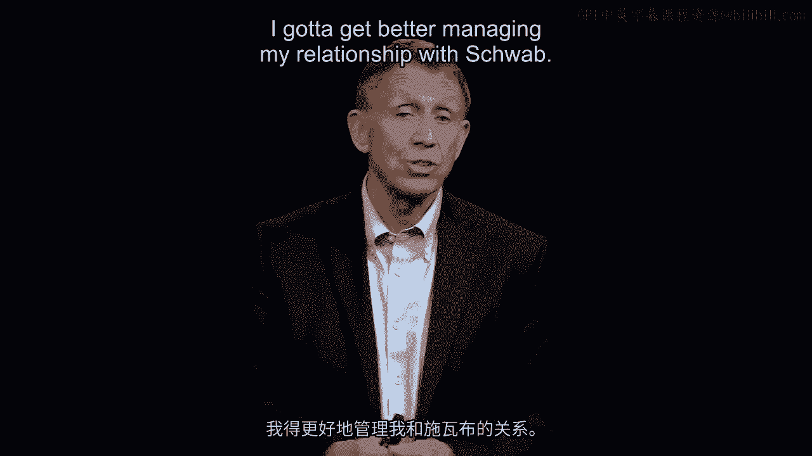

 good at managing all these non-managing with all these non-executive directors。"。

 By the time he got to that meeting， thus it went extremely well， two and a half hours， it's a go。

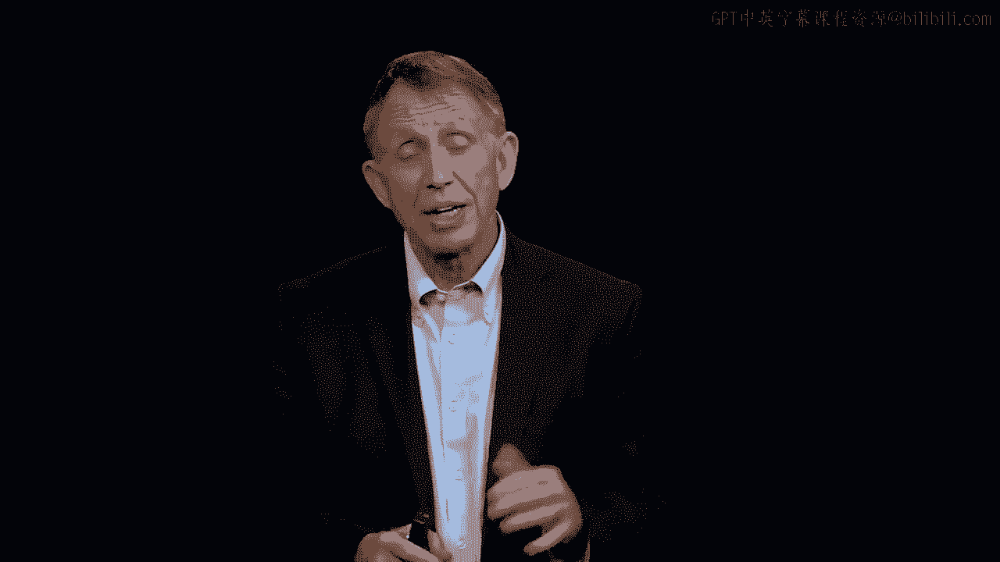

 And now for the final group of people， all part of our question here， how do we build an。

 organization， design it well， and then change it when the world is changing around us as。

 the internet is doing that to the retail brokerage market in spades。 And now appreciates。

 going back to that earlier， eight item set of warnings， what can get in， the way that 14。

990 people don't know about this， and most of them are probably going to。

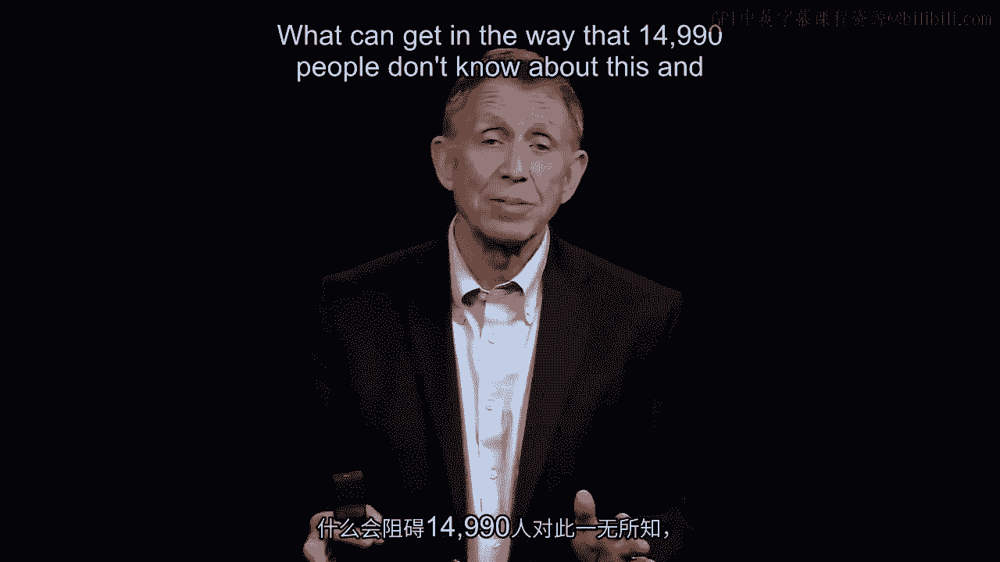

 be skeptical if not outright hostile to it。

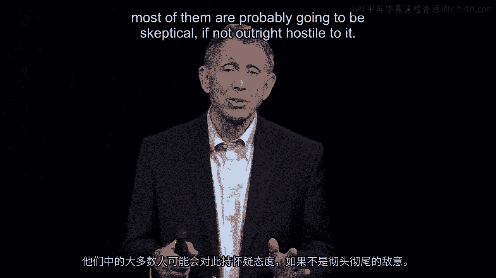

 Why is that？ Just work the logic。 If we cut 70% of our income。

 how are we going to pay people salaries at the end of the month？ Things like cutbacks。

 maybe even storefront closures， the Schwab offices are all over。

 the country。

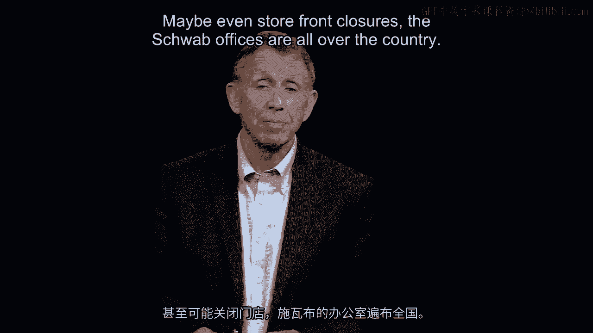

 Maybe people are going to get no bonus， maybe we're going to cut into people's retirement。 And thus。

 even though intellectually it might sound appealing， as people think about the。

 whole mortgage and the family， they may think， they probably do think this better be good。

 otherwise it's going to be a personal catastrophe。

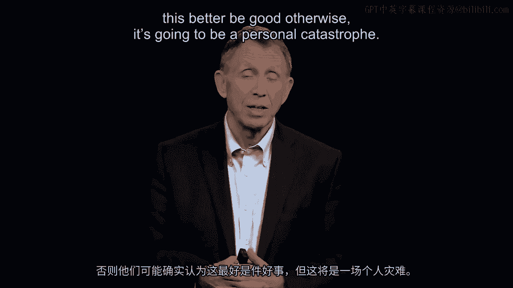

 So David does this， mindful of all the above。 It's right on that earlier chart。

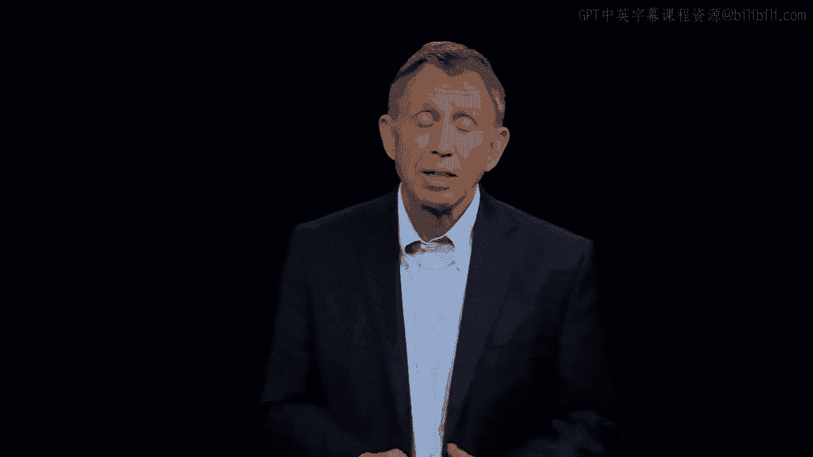

 He arranges for everybody in the top several hundred ranks of the company。

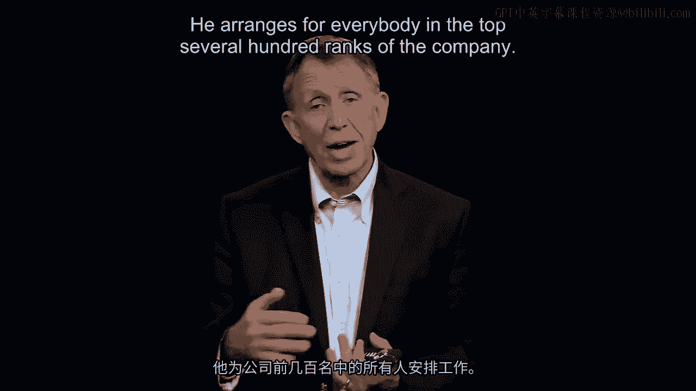

 He's got to be careful because if he publicly announces this or privately， but in a public。

 way through the company， announces this plan， all the competitors are going to get wind。

 of it and they may jump the gun。 They may be announcing cuts before his own cut on January 15th is announced。

 So secrecy， that's something that's another management function here， keeping the secret， critical。

 Thus， on an early San Francisco morning， David asked his top several hundred people to meet。

 him essentially over breakfast at a hotel near the San Francisco airport。 Now San Francisco。

 we all know three hours behind New York， New York Stock Exchange open， big customers are calling。

 I want to buy and sell stock。 So there's some question。

 Why are they in the middle of a trading hour going off to have a breakfast at a hotel？

 Even worse， one of the speakers that David brings on the podium is an historian who's。

 going to tell about the history of San Francisco。 And he begins to say everybody's kind of blinking on this one that the decision to build the。

 Golden Gate Bridge goes back to 1917。

 So 20 years that opens in 1937。 Along the way， there were a lot of people who said it could never be done。

 There were a lot of people whose lives were at risk。 It's a dangerous business。

 But the people who decided to build the bridge pushed through against all those sources of。

 organizational inertia。 The ferry operators， for example， violently opposed building a bridge。

 You can see where they're coming from。

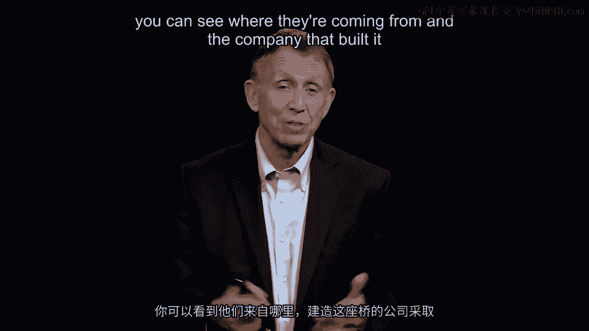

 And the company that built it took special measures to protect the life of construction， workers。

 Okay， so where's this going？ Everybody's thinking。 And David then， Potra himself。

 stands up at the podium and says， look， it took 20 years。

 for that to happen。 Of course， when it did happen。

 it transformed San Francisco from what it was to an icon。

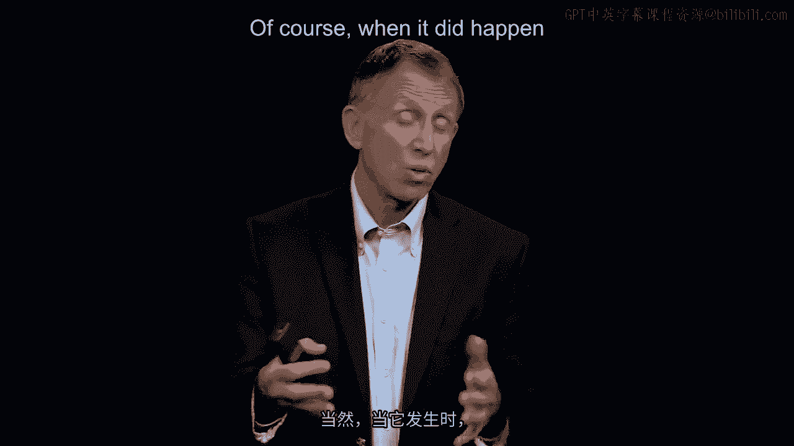

 of American life。 What's across the bridge， Marin County。

 just a huge development that it would have never， prospered like a wood without the bridge。

 The bridge transformed San Francisco， California。 It's an icon of American life。 And by the way。

 almost no lives were lost during the construction。 So we can see where that's going。 He then says。

 I'm here to announce today that on January 15th， this is October 15th， we're。

 going to go full service trading at $29， kind of a gasp out there in the audience。

 And in doing that， we're going to make every effort to avoid layoffs。

 Hence that illusion back to the workers lost on the bridge。 But in doing that。

 we're going to transform the industry before it transforms us。

 Back to the somewhat bland words of this topic， we're going to redesign our architecture。

 before we're forced to do so。 I know there are a lot of forces of inertial resistance to that。

 But he then， two final steps here to get at those。 He asks all the assembled managers， quite senior。

 arrange though cross functionally。 Let's go back to that idea。 People in finance。

 next to people in sales， next to people who are back office， next to。

 people who are information technology。 And he asks each table there to take a few minutes talking privately。

 Everybody's going to have a chance now to talk。 This is how we make organizational change。

 He asks each of the tables for the eight people around them to take about ten minutes and。

 identify the points of resistance that they're going to encounter。 Well。

 of course what's on earth is really interesting。

 Has to be managed。 That's the topic， managing people。 And by the way。

 the other great value of that method to say the obvious here is that in asking。

 people to refer not to their own reasons to fight it， but to those below them， they also。

 have a chance to put in their answers what other people are going to think， their own。

 thinking。 Because David Potrock is chief executive， knowing that a chief executive one time told。

 me that the higher he goes， the better the information gets because nobody wants to bring。

 up resistance or bad news。 This was David's way of understanding from his top people， the top 200。

 Why would they resist？ Equally， importantly， why would people below them push back as well？

 With that then， and I'm going to really kind of bring this to a summary point right here。

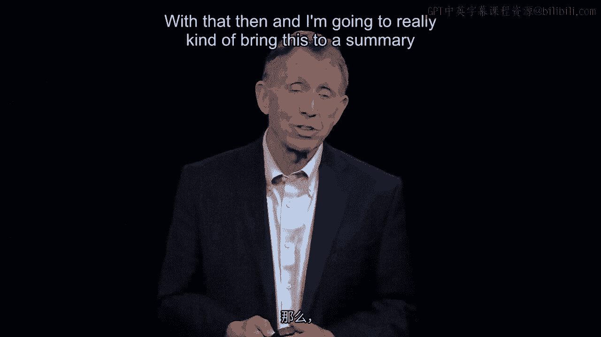

 David says， "Great to thank you for all the input you've heard from our historian。

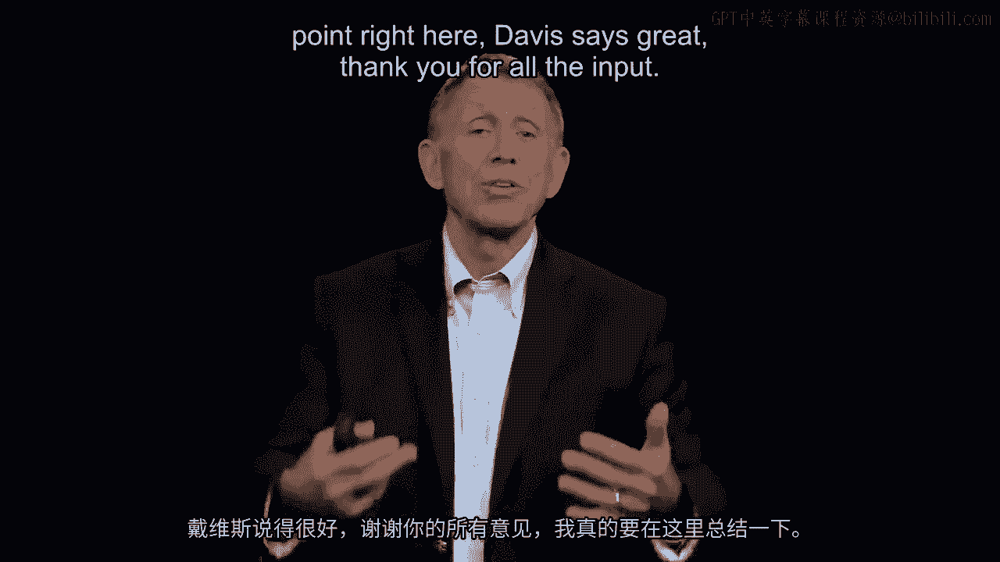

 I now have a bunch of luxury coaches out the door of this hotel and we're going up to the。

 San Francisco side of the Golden Gate Bridge。 There it is， seen from across the Golden Gate。

 Marin County。 They begin at the far end。 They get off the buses。 Everybody。

 David's got this plotted out。 It gets a nice， warm blue jacket。 Unfortunately。

 it turned out to be one of the warmest days ever in October。 But David says then。

 "We're now going to walk from the San Francisco side of the bridge。

 all the way across to the Marin terminus of the bridge。 A few of you have done that。 Most of not。

 I've been out there many times。 I've never paid that walk。 It's a long walk。 Just look at it。

 And then they get up on a hill at the far end and they take the following photograph。

 You see it right there。 Caption as it now is going to hang on office walls all through Schwab is crossing the。

 chasm October 15th。 What's that got to do with new pricing and redoing back office algorithms and how we。

 charge a customer？ Well nothing technically but everything with the fact that we got people who have a head。

 Got to go for that。 And they also have a heart。 It's the way of saying we got to get to the cognitive side of the brain。

 We also have to get to people's emotions。 Is this a big deal？

 Of course it's big。 Just look at this。 We're crossing this chasm。 Epilogue。 January 15th。

 It is a shock， is a well-kept secret。 Pretty much on board。 It made all the changes required。

 And in the days that follow Wall Street， even though it's explained by David what was， going on。

 the stock drops about 25% huge losses。 In the middle of all this I happened to work with David Potrock along the way。

 I called him up and I said， "Hey David， how's this going？ I've read all about this。"， And he said。

 "Well it's going。"， He said， "You should know。 I actually am sleeping like a baby。"。

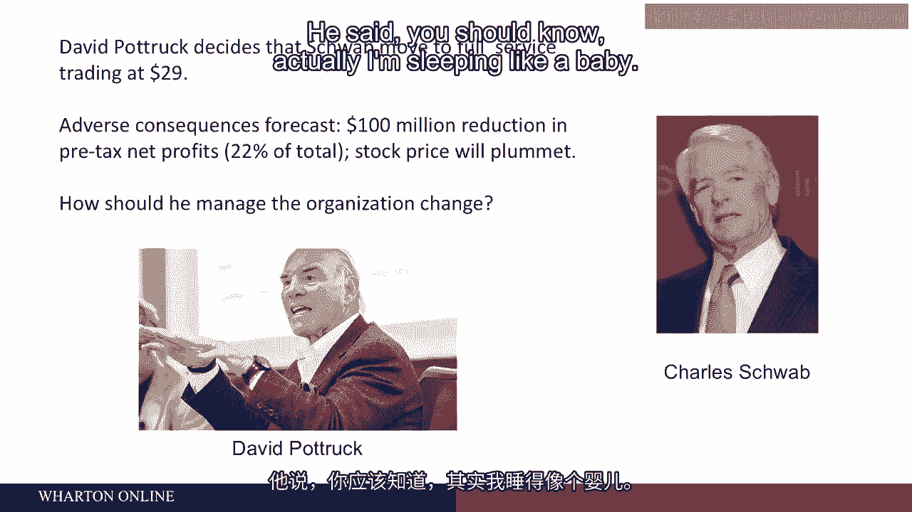

 I said， "Really？"， And he said， "Yeah， I'm actually waking up every two hours and crying。"。

 So it was a tough， very stressful period。

 Go back to our previous topic。 One's a great team， most vital to a group。

 a team to work well or a group of people to。

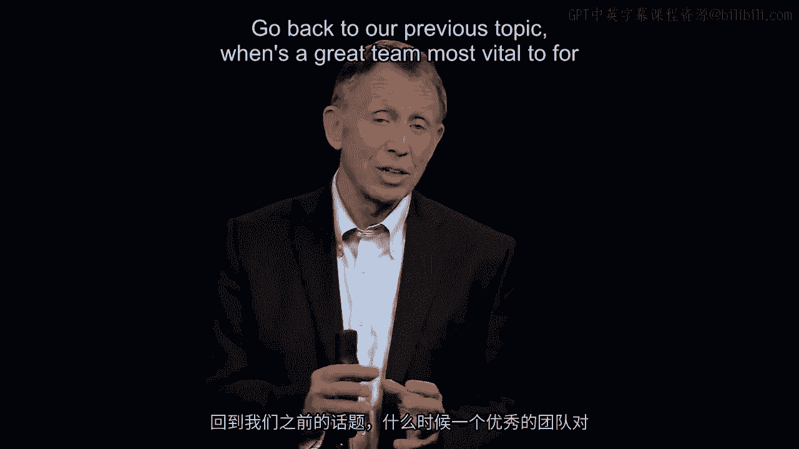

 work well。 During a period of high stress， his team was well built。

 They all had the same jacket。 They knew each other。 And over the next 12 months really。

 with the loss of 70% revenue， it's more than made up。

 for by new customers。 They just came pouring in。

 Pretty hard to resist buying a seat on an airline that's going to do a 70% discounted。

 ticket or in this case sell you a thousand shares of Cisco for 70% less than you could。

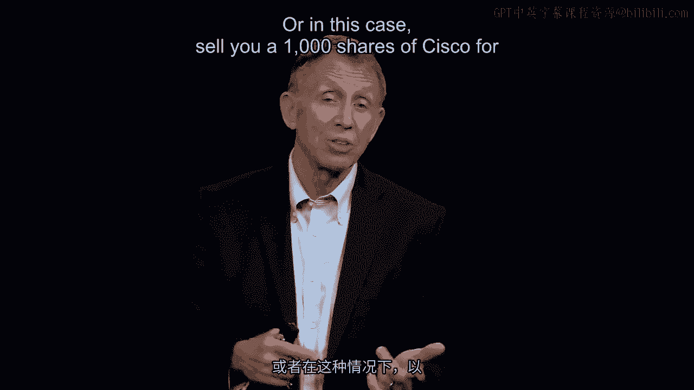

 do it the day before in January 14。 That gets then to a summary。

 more affirmatively taking those eight opening thoughts on what。

 gets in the way。 And here we have a more affirmative model for you。 The kinds of steps。

 this is from John Carter。 In my view， when it comes to managing。

 and we said this at the outset of the course， it really is a matter of judgment and having a dozen or so or a couple dozen working concepts。

 that you apply。 I say all that as an intro into this particular eight step model for leading change。

 Take a look at these。 I recommend you grab a few like a burning platform。 That's what David did。

 He said at this event at the hotel， look， this industry is changing。 E-Trade is coming along。

 If we don't change now， we're going to be out of business。 There's a burning platform。

 The other factors look at number four， getting buy-in， taking the top 200 people across the， bridge。

 all part of the enactment。 But look at the eight points here as guidance for your own judgment。

 That concludes our thinking here on the fourth and final topic of human and social capital。

 managing people at work。 Thank you。 Thank you。 for your attention。 [BLANK_AUDIO]。

