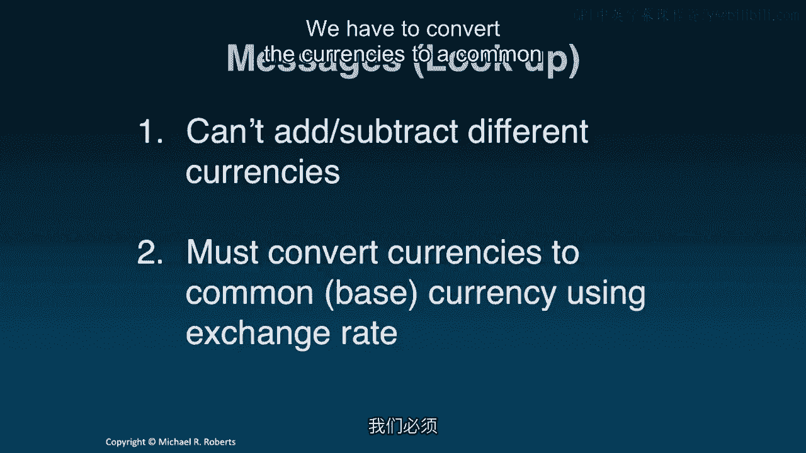
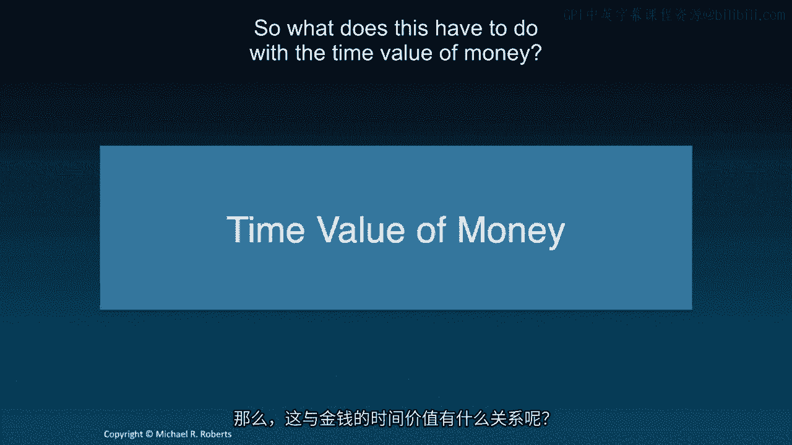
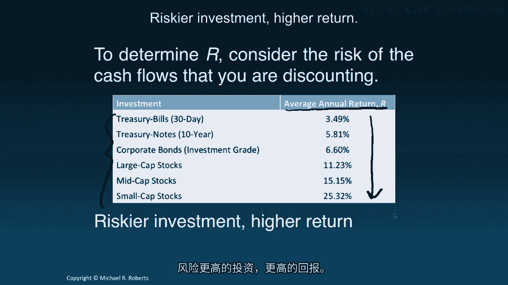
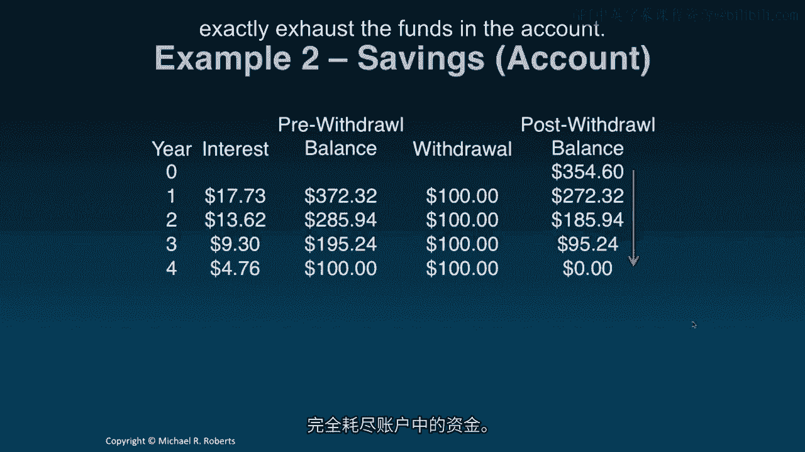

# 沃顿商学院《商务基础》｜Business Foundations Specialization｜（中英字幕） - P102：0_直觉与贴现.zh_en - GPT中英字幕课程资源 - BV1R34y1c74c

 Welcome to Corporate Finance in our first lecture。

 Today we're going to talk about the time value of money。

 We're going to start off with some intuition。 Then I want to introduce the tools associated with the time value of money。

 namely the discount factor and the timeline。 Finally。

 I want to apply those tools to move money back in time via a process called discounting。

 Let's get started。 Hey everybody， welcome to Corporate Finance in our first lecture on the time value of money。

 We're going to start off with some intuition and discounting。 In particular。

 I want to give everybody a good sense of what the time value of money means in a context with which they're already familiar。

 Then I want to introduce some tools and then I want to apply those tools to our first financial problems。

 So some intuition。 Hopefully in a setting with which everybody is already comfortable and familiar with。

 that's foreign currency。

 Imagine I've got 100 euros and 100 dollars。 And I ask the question， "How much money do I have？"。

 Well， we can't answer that， at least not yet， because we can't add euros to dollars。

 What we need to do is what？ We need to convert the euros to dollars to find out how much we have in dollars or convert the dollars to euros to find out how much we have in euros。

 And we do this using an exchange rate。 There's nothing special in this example that there's only two currencies。

 If I had three currencies， euros， dollars and you won。

 I would have to convert two of the currencies into one currency， one base currency。

 whether it's into yuan， dollars or euros using the appropriate exchange rates in order to answer the question。

 "How much money I have？" or in order to add the different currencies。 So what's the message？ Well。

 look， we can't add or subtract different currencies。

 We have to convert the currencies to a common base currency using an exchange rate。

 So what does this have to do with the time value of money？

 Well， the time value of money refers to the fact that money received or paid at different times is like different currencies。

 You can't add it。 Money has a time unit。 What you have to do is you have to convert to a common base unit in order to aggregate it。

 and to do that， we need an exchange rate for time。

 So let's talk about some of the tools that we're going to use to accomplish this task。 So first。

 the timeline， which is exactly what it sounds like。

 I've got a timeline here that lays out different time periods， and these periods could be anything。

 They could be years， they could be months， they could be days， they could be decades。 Typically。

 we refer to time period zero as "today" or "now" or the point at which we're answering the question。

 Underneath that， we lay out our cash flows， denoted by CF。 The subscript denotes the time period。

 and this is nothing more than a visual representation of when money is coming or going。 That's it。

 Getting the habit of placing cash flows on a timeline， when you work in Excel。

 it almost automatically does that for you。 But it's a great tool to emphasize the point that money arrived at different points in time。

 has a different time unit， and cannot be added。 Right？ Don't add money at different points in time。

 Let me say it one more time。 Never add money received at different points in time。

 I put a little asterisk there because some people will say， "Well。

 what if the money arrives very close in time？"， Then it's not such a sin。

 but getting the habit of just not doing it。 I say it multiple times because you'll do it。

 your friends will do it， people in finance do it all the time。 But it's not a good thing to do。

 and you'll see why in just a moment。 What we need is we need an exchange rate for time to convert to a common time unit。

 and that exchange rate is called a discount factor。

 Our discount factor is given by one plus r raised to the power t。 t。

 that's just the number of the time periods into the future， if t is greater than zero or past。

 if t is less than zero， that we want to move the cash flows。 r， like it's its own slide。

 r is the rate of return offered by investment alternatives in the capital markets of equivalent risk。

 That's a mouthful。 r goes by several other names， goes by a discount rate， a hurdle rate。

 an opportunity cost of capital。 The way to think about r is just to ask yourself。

 "What are the risk or how risky are the cash flows that I'm going to be discounting here？"。

 Then think about how that relates to investments in the capital markets。

 What I've done here is I've presented average annual returns to six different investments。

 What do you notice？ You notice that riskier investments， as I move down the columns。

 riskier investments are met with higher returns。 Riskier investment， higher return。

 How do we use the tools？ We're first going to focus on bringing cash flows back in time。

 and when we move cash flows back in time， that's called discounting。

 Here's my timeline that we started out with。 I'm simply illustrating that if I want to convert all of these cash flows from period one forward into time zero units。

 what I would do is I apply my discount factor to each one。

 To move cash flow one back to period zero， I'm going to multiply by one plus r to the minus one because I'm moving it back in time。

 hence it's negative， one period， hence one。 Similarly for cash flows two， three， and four。 Again。

 notice that all of the exponents are negative because we're moving all of these cash flows back in time to today's units。

 Once I've done that， once I've discounted each cash flow back to today。

 I can add all of these numbers。 They're all in the same time units， namely date zero units。

 Let's get rid of this mess。 These values of the future cash flows as of today are called present values。

 Present values of cash flows is the discounted value of the cash flow as of period T。

 or in this case period zero。 And the notation is just that。

 Present value as of period zero of cash flow one。 Present value as of period zero of cash flow two。

 It's just some notation that will be useful as we move throughout the course。 Let's do an example。

 How much money do you have to save today to withdraw $100 at the end of each of the next four years if you can earn 5% per annum？

 The first step in tackling any problem is to just put the cash flows on a timeline。

 Let's get our bearings straight。 The question is how much do I need today？

 So how much do I need today， period zero， if I'm going to withdraw $100 each year over the next four years thereafter？

 Well， the naive thing to do would be to just add these and say $400。

 But we know that's wrong because that's a no-no。 These cash flows or these dollar amounts have different time units。

 We can't add them。 What we need to do is move them back in time today by discounting。

 And since we've assumed a 5% discount rate or a 5% rate of return on our investment， that's our R。

 And you'll notice I'm dividing each one by the discount raised to the appropriate power。

 We can do a little arithmetic。 And now I can add all of these numbers。

 They're all in the same time units to answer the question。 We're going to need $354。60。

 More precisely， we need $354。60 today in an account earning 5% each year so that we can withdraw $100 at the end of each of the next four years。

 Alternatively， the present value of $100 received at the end of the next four years is $354。

60 when the discount rate is 5%。 Now， I know that's just another way of saying what I said in one。

 but getting the habit of different warherds meaning the same thing。

 Finance is just laden with jargon and the sooner you get used to it and the more exposure you have to it。

 the more comfortable you come with it。 With that segue。

 interpretation 3 is today's price for a contract that pays $100 at the end of the next four years is $354。

60 when the discount rate is 5%。 Three different ways to say the same thing。 All right。 Now。

 I want to mention we're assuming that the discount rate R is constant over time。 See。

 when I pull back each cash flow， I discount each one by the same 5%。 That's a common assumption。

 but I want to emphasize it's still an assumption， one we're going to look at when we talk about the term structure of interest rates and yield curves later on。

 But what's going on in the background？ How is this working？

 What's actually happening on a dynamic basis？ Well， time periods zero。

 we're inserting or depositing $354。60。 Then we're going to earn interest at 5% on that money。

 which is going to amount to $17。73%。 $17。73。 And I'm assuming all the activity happens at the end of the period。

 It just makes things a little bit easier conceptually。 There's nothing special about that。

 We can make the period shorter， which we will later on。 I earn my interest， which is the 354。

60 times the 5%。 That's going to give me a pre withdrawal balance of the initial balance plus the interest。

 But notice that's just the present value of that amount。 The present value of this 372。

32 is just our initial withdrawal balance。 That's our 354。60。 I'm going to pull out $100。

 That's going to leave me with 272。32 after the first year。

 And if we continue this process for the next three years， 23。4。

 what we see is we're going to exactly offset or exactly exhaust the funds in the account。

 Okay， so let's summarize what we learned today。 Rule number one。

 never add or subtract cash flows from different time periods。 You'll want to do it， don't do it。

 What we need to do is recognize that money has a time unit。

 And in order to add money at different points in time。

 we need to convert that money to a common base unit using an exchange rate for time called our discount factor。

 We're also going to get in the habit of using a timeline to get our bearing straight。

 A visual representation of when money is moving in or out。

 And we learned about the present value of a cash flow。

 It tells us the value of future cash flow as of some time period， some earlier time period。

 It also tells us the price of a claim to those cash flows。 And what's coming up next。

 we're going to go in the other direction。 Moving cash flows forward， in other words， compounding。

 Thanks for listening and I look forward to seeing you in the next lecture。

