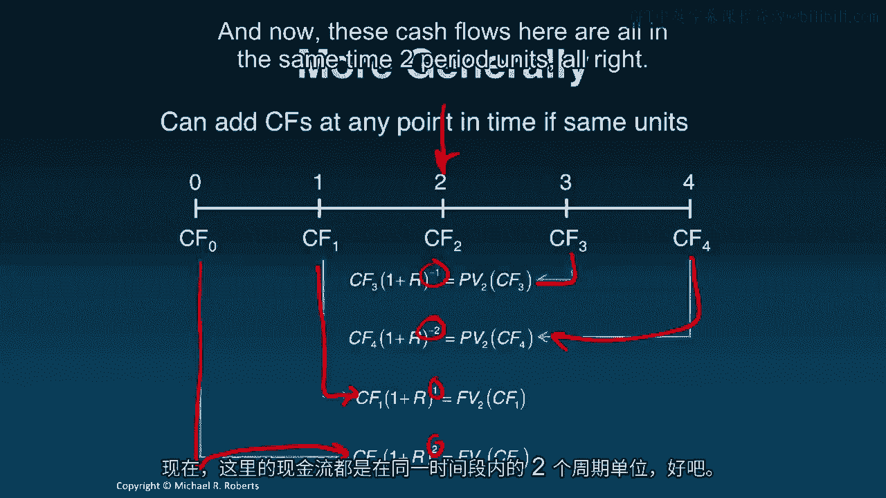

# 沃顿商学院《商务基础》｜Business Foundations Specialization｜（中英字幕） - P103：1_复利.zh_en - GPT中英字幕课程资源 - BV1R34y1c74c

 Welcome back to Corporate Finance。 Last time we introduced the time value of money。

 We started with some intuition， we introduced the tools。

 namely the timeline and the discount factor， and then we showed how to move money back in time via discounting。

 Today， I want to go the other direction。 I want to move money forward in time via a process called compounding。

 Let's get started。 Hey everyone， welcome back to Corporate Finance。

 Today we're going to be talking about compounding。

 but let me start off with a brief recap of what we did in the last lecture。

 Last time we introduced the time value of money， the concept。

 We started off with some intuition and showed that money has a time unit that prevents money arriving at different points in time from being aggregated or added together。

 Then we introduced some tools associated with the time value of money， notably the timeline。

 which is just a visual representation of when money is moving in or out， and the discount factor。

 which was our exchange rate for the time value of money。

 It allowed us to convert the time units on money moving it forward or backward。

 Then we applied those tools to move cash flows back in time via discounting。

 The big lesson was don't add cash flows with different time units ever。

 Today I want to go the other direction and talk about compounding or moving cash flows forward in time。

 Let's get started。 Compounding just refers to moving cash flows forward in time。

 Here's our familiar timeline。 What I'm doing is I'm taking each cash flow， CF-0， 1， 2， and 3。

 moving them forward to period 4 via compounding。 So focusing on cash flow 2。

 I move that forward to period 4 by taking cash flow 2。

 multiplying it by my discount factor raised to the power of 2。

 because I'm moving it 2 periods forward， and it's positive because I'm moving it forward。

 We're generally all of the exponents are positive， again。

 because we're moving all of the cash flows forward in time。

 I can add all of these cash flows now because they're all in the same time units， namely， right？

 I can add all of these cash flows。 They're all in date 4 time units。 Now these cash flows。

 once they've been moved forward， are referred to as future values。 So， again。

 this is just notation like with present values。 This is the future value as of period 4 of cash flow 3。

 the future value as of period 4 of cash flow 2， and likewise for cash flows 1 and 0。

 Let's do an example。 How much money will I have after 3 years if I invest $1。

000 in a savings account paying 3。5% interest per annum？ Well， step 1， put down a cash line。

 Put down a timeline。 Put the cash flows on a timeline。 So， I'm going to invest $1，000 today。

 period 0， and the question's asking how much money will I have in 3 years？ Well。

 all we're going to do is move the cash flow forward in time by compounding。

 I'm going to multiply by 1 plus r， where r is 3。5% in this case。

 and I'm moving the cash flow 3 years forward in time。

 so that's a positive 3 exponent on my discount factor。 If we do the arithmetic， we get that the $1。

000 is worth $1，108。72 or just under $0。72。 And I should also mention that this is just the future value of the $1。

000， in particular it's the future value as of period 3 of the cash flow in period 0， which was $1。

000。 Let's do a second example。 How much money will we have for years from today if we save $1。

000 a year beginning today for the next 3 years， assuming we are in 5% per annum？ Step 1。

 with the cash flows on a timeline。 That's exactly right。

 So we're saving $100 a year beginning today for the next 3 years。

 We're going to earn 5% and I want to know how much I have after 4 years。 Well， to do that。

 we're going to have to move each cash flow forward in time to period 4。 So look at cash flow。

 the cash flow in period 3。 I need to move that forward 1 period。

 so I multiply by 1 plus r raised to the positive power 1。 We're going forward 1 period。

 Cash flow 2 has to go forward 2 periods， so we're going to multiply that by our discount factor raised to the power positive 2。

 And likewise for cash flows arriving in， or the cash flows in period 0 today and 1 year from today。

 If we do the arithmetic， we get these future values of the cash flows， right？ 105， 110， 115， 121。

 We can now add all of these cash flows because they're all in the same time for period 4 time units。

 And if we do that， I get 4。52。564。 So what does this mean？ How do we interpret that？ Well。

 we will have $452。56 at the end of 4 years if we save $100 starting today for the next 3 years and our money earns 5% per annum。

 The future value for years from today of saving $100 starting today for the next 3 years at 5% per annum is $452。

56。 So what's going on here？ What's going on behind the scenes？ Well。

 we're going to deposit $100 today。 That's going to earn 5% interest and give us an additional $5 at the end of year 1。

 So our pre-deposit balance that's pre before our next deposit is just $105。

 which by the way is also equal to the future value one period hence of the $100， right？

 The future value of this $100 one period hence is just the 100 times the 1 plus r to the 1。

 I deposit another $100 and I've got $205 after the first year。

 We continue this process for 4 years and lo and behold， we're left with $452。

56 at the end of the fourth year。 More generally， there's nothing special about moving the cash flows to the end of the timeline or the beginning。

 You can move them anywhere。 Just as long as you're consistent。

 we can pick any point in time such as period 2。 And I can move cash flows 3 and 4 back in time。

 I'm going to buy applying a discount factor raised to a negative value。

 I can move the cash flows today and the cash flow one year from today forward in time by applying a positive exponent to the discount factor。

 And now these cash flows here are all in the same time to period units。

 All right， so let's summarize this up。 We use compounding to move cash flows forward。

 We apply a discount factor with a positive exponent to move them forward in time and that gets us future values。

 So what I want to see you do now is work on the problem set。

 And then coming up next in our next lecture， I want to talk about some useful shortcuts for present value and future value of common streams of cash flows。

 So thanks again for listening and I look forward to seeing you in the next lecture。

