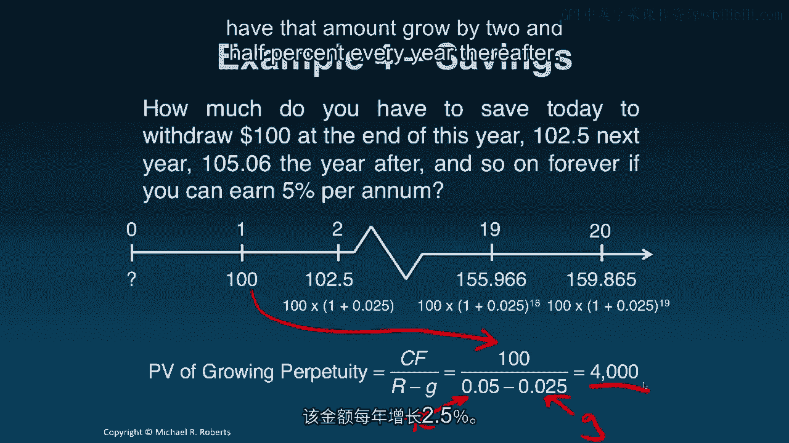

# 沃顿商学院《商务基础》｜Business Foundations Specialization｜（中英字幕） - P104：2_有用的技巧.zh_en - GPT中英字幕课程资源 - BV1R34y1c74c

 Welcome back to Corporate Finance。 Last time we talked about compounding or the。

 process of moving cash flows forward in time。 Today I want to present several。

 useful shortcuts to compute the present value and future value of common streams。

 of cash flows that we see often in practice。 Let's get started。 Hey everybody。

 welcome to our third lecture on the time value of money。 So last time we talked。

 about compounding or the process of moving cash flows forward in time， excuse me。

 to find their future value whereas in our first lecture we moved cash flows。

 back in time via discounting to find their present value。 So what I want to do。

 today is I want to give you some useful shortcuts for computing the present value。

 or the future value of some streams of cash flows that commonly arise in， practice。

 So let's get started。 The first thing I want to talk about is an， annuity。

 An annuity is a finite stream of cash flows of identical magnitude。

 and equal spacing in time and I've highlighted key elements of this， definition。

 So here's a timeline representing an annuity。 First key。

 aspect or feature of an annuity is or are cash flows of identical magnitude。

 These are all of these cash flows are the same number。 So identical， magnitude。

 Secondly this is a finite stream of cash flows。 It ends at some。

 point in time and that might seem like an unnecessary or obvious assumption but。

 you'll see that we'll deal with infinite cash flow streams in a little bit。

 And then the last assumption is that the spacing between the cash flows has to be， equal。

 So it's always a year。 We always get the cash flow after one year， two， months。

 whatever that spacing it is it has to be the same。 And it turns out that。

 this cash flow stream arises in a number of situations in practice。 So。

 insurance companies sell a product called an annuity representing its， cash flow stream。

 Home mortgages are an example of an annuity stream。 Auto leases。

 certain bond payments and amortizing loans are annuities。 So it's actually。

 fairly common in practice。 Now if we wanted to find the present value of。

 these cash flows we could we know how to do that。 Right we can brute force it。

 we can take each cash flow and discount it back to today。 Right so imagine I had a。

 second cash flow。 I had the second cash flow here。 I could take go CF divided by。

 1 plus R squared that would bring it back to today。 I could take this cash flow CF。

 over 1 plus R to the T minus 1 that would bring it and I do that for all the cash。

 flows and then I could add them up here。 That would give me the present value。 But。

 that's a bit burdensome especially when T is big。 So what I'd like to show you is。

 a shortcut or a simple formula to compute the present value of this cash flow。

 stream and here it is。 We take the cash flow CF。 We take divided by the discount。

 rate and multiply it by this term in parentheses here。 Now if I move the R。

 over here I can re-express the present value of the annuity formula as just the。

 annuity cash flow times this term here which is called an annuity factor。 That。

 will give me the present value of this cash flow stream。 One thing to keep in。

 mind though is that in order for this formula to make sense not only do all the。

 features defining an annuity stream have to be true but we're assuming that the。

 first cash flow arrives one period from today。 So for example if my cash flow。

 stream look like this this is an annuity stream of cash flows but this formula is。

 not going to give me the present value of this cash flow stream。 Actually what I。

 would have to do is I could just add CF because this is the present value。 It's， coming today。

 Let's do an example。 How much do I have to save today to withdraw。

 $100 at the end of each of the next 20 years if I can earn 5% per annum？ Well。

 step one is draw a timeline。 I'm trying to figure out how much I have to save。

 today in order to pull out $100 every year over the next 20 years。 Well we know。

 how to do that by brute force。 We can simply discount all of the cash flows。

 back into today's time units and add them up。 More elegant solution that we just。

 learned of course is to apply our present value of annuity formula。 Right the cash， flow is 100 CF。

 The discount rate R is 5% and the time of the cash flows is 20， years。

 Plugging all those numbers into the formula and computing we get the。

 present value of these cash flows is $1，246。22。 That's how much money I have to。

 save today in order to withdraw the $100 every year。 Now let's turn to。

 something called a growing annuity which is as the name suggests just like。

 an annum and witty but for the fact that the cash flows are growing。 So it's a。

 finite stream of cash flows。 Okay evenly spaced through time。 Okay but now the cash。

 flows aren't constant they're growing at a constant rate G。 And this this type of。

 cash flow stream pops up in a number of instances in practice。 Certain income。

 streams for example your work right you might imagine that your work your。

 salary grows at some constant rate G or approximately some constant rate G。

 Certain saving strategies maybe you want to save a certain amount each year but。

 you want that amount to grow with your growing income stream。 In corporate。

 finance certain project revenue and expense streams will often grow at a， near constant growth rate。

 So it's a really useful approximation to many cash， flow streams will come across in practice。

 And like our annuity stream we can， represent the present value of this cash flow stream with a simple formula as。

 follows we take the cash flow as of the first period divided by the discount。

 rate less the growth rate times this factor here。 That will give us the present。

 value of this cash flow stream right here。 Okay。 But remember a critical。

 assumption is that the first cash flow arrives one period from today。 Okay。 Let's， do an example。

 How much do we have to save today to withdraw $100 at the end of， this year？ $102。50 next year $105。

06 the year after and so on for the next 19， years if we can earn 5% per annum。

 Well let's draw a timeline and what we see， is that our first first withdrawal of $100 occurs one year out then 102。

5 and， on and on and on。 What we can discern from this problem is that these cash。

 flows are growing at a constant rate G equal to 2。5% per annum。 So this cash flow。

 stream satisfies all of the requirements needed to use the present value of a。

 growing annuity formula。 So our first cash flow of $100 our discount rate of 5%。

 and here's our growth rate of 2。5%。 That's going to get us a present value of， $1，529。69。

 That's how much we would need to withdraw $100 growing at 2。5%， every year。

 Now let's talk about a perpetuity。 So perpetuity is just like an。

 annuity except the cash flows go on forever。 We get the same amount of money。

 equally spaced in time forever。 So where does this thing come up in practice？

 Well oddly enough it actually does and something called perpetuities or console。

 bonds which exist over in the UK and interestingly enough the formula for this。

 cash flow stream is very simple。 It's just the cash flow divided by the discount， rate CF over R。

 Let's do an example。 How much do you have to save today to。

 withdraw $100 at the end of each year forever if you can earn 5% per annum？

 Well the timeline looks as follows。 $100 every year forever and clearly the。

 brute force method of discounting each cash flow one at a time is never going。

 to work it's just impossible。 So we have to use our formula。 We take the $100。

 divided by the discount rate of 5% and that gives us $2，000。 We need $2，000 to be。

 able to withdraw $100 a year forever assuming that money can earn 5% per annum。

 And intuitively what's going on is once we get out 100 years 200 years。

 whatever the present value of that money is so small it's very close to zero which。

 is why you don't need an infinite amount of money。 And the perpetuity's。

 cousin a growing perpetuity is just that it's an infinite stream of cash flow that。

 grows at a constant rate G and that are evenly spaced out through time。 So here's。

 a visual representation here's our timeline of a growing perpetuity。 What's。

 an example of a growing perpetuity in practice？ Well dividend streams are much。

 like a growing perpetuity。 They're a useful approximation don't take it。

 literally companies don't last forever but we can treat them as such because。

 there is no finite end date to most companies。 Apps in some events such as a。

 bankruptcy or an acquisition or a take over something like that。 So what's the。

 formula for a growing perpetuity？ Well it's just the cash flow that we're going。

 to receive in the first year divided by the discount rate minus the growth rate， of that cash flow。

 Again we're going to have to assume that the first cash flow。

 arrives one year from today to use this formula as well as having all the other。

 requirements being satisfied。 The cash flow is being evenly spaced and then。

 growing at a constant rate。 So let's do a little example now。 How much do you， have to save？

 How much do you have to save today to withdraw $100 at the end of， this year？ 102。5 next year， 105。

06 the year after and so on forever if we can earn， 5% per ann。

 Well let's draw our timeline so we're going to get $100 here in year， one。 102。

5 in year two that's growing at 2。5% as is the 105。06 if I had written it， here。 So our G is 2。5%。

 The first cash flow comes one year from today。 There's， our first cash flow。

 This goes on forever and the spacing is equal so this is a。

 growing perpetuity to which we can apply our growing perpetuity present value， formula。

 So we take the first cash flow $100 divided by the difference between。

 the discount rate and the growth rate to get $4，000。 In other words if we have， $4。

000 today and it's earning 5% interest per annum every year thereafter we can。

 pull out $100 next year and have that amount grow by 2。5% every year thereafter。

 So let's summarize。 We learned a couple of useful shortcuts today。 We talked about。

 an annuity and its present value formula。 We talked about a perpetuity and its。

 present value formula。 We talked about their growing cousins the growing。

 annuity and the growing perpetuity and the present value formula for those guys。

 And while that might seem somewhat esoteric and bland or boring we also。

 discussed some of the applications that you might see in practice these cash flow， streams arising。

 And where these shortcuts are really useful more than just。

 finding the present value or the future value is in finding the cash flow。

 associated with the stream。 So being able to manipulate these formulas is very。

 important and so in the problems you're going to spend some time in real life。

 contacts or at least as close to real life as we can get manipulating these。

 formulas to derive certain aspects of interest whether it's the cash flow or。

 the amount of time or the discount rate or the growth rate。 So tackle the。

 problem set it really brings the material to life but be very careful that applying。

 these formulas takes care。 Don't blindly apply them to any setting because as we。

 discussed certain characteristics of the cash flows have to be met in order to or。

 certain requirements of the formula have to be met in order to use it。 So good luck。

 with the problems。

