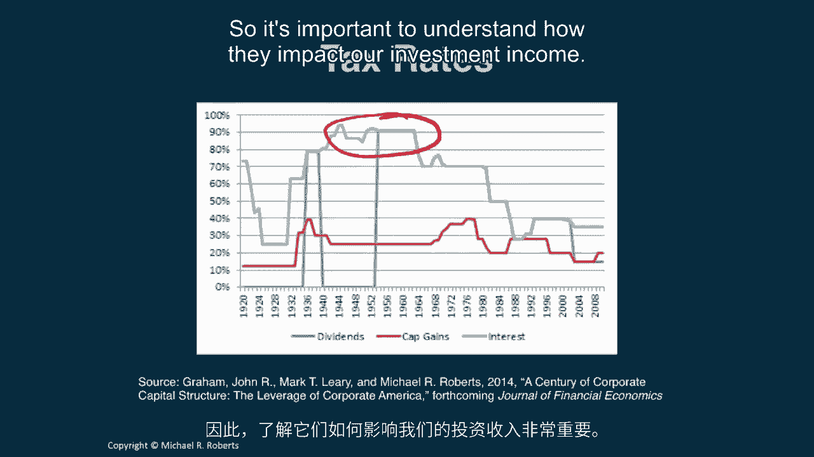
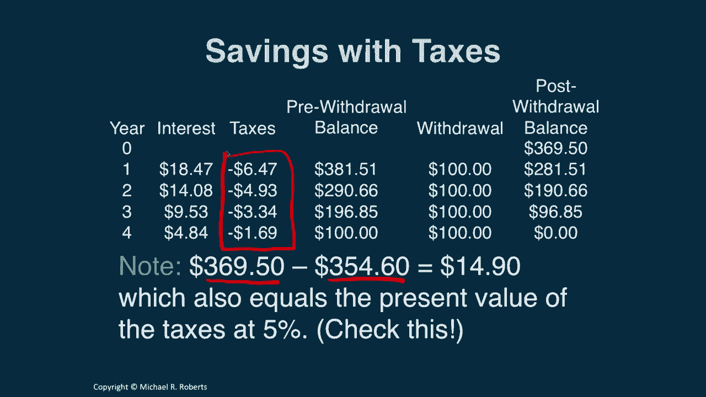

# 沃顿商学院《商务基础》｜Business Foundations Specialization｜（中英字幕） - P105：3_税收.zh_en - GPT中英字幕课程资源 - BV1R34y1c74c

 Welcome back to Corporate Finance。 Last time we talked about some useful shortcuts。

 to compute the present value and future value of cash flow streams that we。

 commonly come across in practice。 Streams like perpetuities and annuities and。

 growing perpetuities and growing annuities。 This time I want to shift。

 gears and talk about taxes and their impact on our dollar returns。 Let's get， started。 Hi everyone。

 welcome back to Corporate Finance。 Last time we talked。

 about several useful shortcuts for computing the present value of cash flow， stream。

 We talked about annuities and growing annuities and。

 perpetuities and growing perpetuities and we also discussed that these cash flow。

 streams were representative of cash flow streams we might find in practice。 What。

 I want to do now is I want to shift gears and talk about taxes。 In particular I。

 want to talk about how taxes impact our discount rate or our cost of capital and。

 ultimately how they impact our dollar returns。 So let's get started。 So I want。

 to start with a little bit of motivation。 I know we don't have a lot of time but。

 it's worth mentioning a few things。 This is a picture of the top statutory tax。

 rate on different sources of income in particular dividends which is the blue， line。

 capital gains which is the red line and interest income which is the green， line。

 I don't want to make too much of this picture but I just want to emphasize a， couple of things。

 First you should see that the tax rates are moving all over， the place。

 There's an enormous amount of variation in taxes over time number one。

 and number two you can see that historically tax rates have gotten， really high。

 Now admittedly it's not clear how to how many people those tax。

 rates of 90 95% actually applied but taxes are substantial and they move， around a lot over time。

 So it's important to understand how they impact our。

 investment income。 So let's do illustrate this by example and I want to。

 revisit an example we looked at in the past in particular in our first lecture， on discounting。

 So the question is how much do you have to save today to。

 withdraw $100 at the end of each of the next four years if you can earn 5%， per annum？

 Well recall the first thing we do is we lay out a timeline and here are， cash flows right。

 We're going to be withdrawing $100 a year over the next。

 four years and the question is asking how much do we need today。 So what we did is。

 we discounted each of each cash flow each of the $100 by the 5% discount rate。

 to get the present value。 So for example we took this first 100， 100 divided by， what？ 1 plus 0。

05 and that got us $95。24 approximately。 And we took the second， cash flow 100 divided by 1 plus 0。

05 squared that's a 2 and that got us the， second cash flow and on and on and then we could add these cash flows because。

 they're all in the same time zero units and that produced our answer of $3。54。60。

 Okay then when we thought about what was going on in the bank account recall。

 right we would insert $354。60 into the account it would it would then earn。

 interest at 5% we'd add that to the previous balance and we'd pull out some。

 money and that would reduce our balance and we would continue that for four。

 years at the end of the four years we would be less left with nothing。 But now。

 consider what happens when we have some taxes。 See now we put our $3。54。60 into the。

 account that earns interest at 5% but now we have to pay taxes on that。

 interest income and I'm gonna assume the tax rate we're facing is 35% which isn't。

 too far up from the top statutory rate currently prevailing。 So that 35% of the。

 1773 is 621 in taxes that's gonna reduce our pre withdrawal balance to， $3。66。

12 then we pull out $100 and then we're left with $2。66。12 at the end of the。

 first year which by the way the $2。66。12 is less than the $2。72。32 because of the， taxes。

 Now if we continue that process we'll get down to zero but only because in。

 the last year we can only pull out $83。06 that's all we have left in that last， year。

 So on net we're $16。94 short the taxes are reducing the funds available。

 for withdrawal we're running out of money early。 So the lesson here is that。

 taxes reduce the return on our investment the dollar return on our。

 investment and one way to account for that is an after tax discount rate I'll。

 call it Rt and that equals our usual discount rate times 1 minus the tax rate。

 So for our example the discount rate R was 5% and the tax rate T was 35% for an。

 after tax discount rate of 3。25%。 Now let's revisit the problem using this， after tax discount rate。

 So now when I discount all of these cash flows back to， today I'm going to use Rt which equals 3。

25% instead of the R which equals 5%。 When we do that when we do the arithmetic and add all these numbers up we get。

 369。50 a number that's bigger than the 354。60 we originally found with the 5%， discount rate。

 Now let's run through the exercise of looking at what happens to， the savings account。

 So now we put in 369。50 that's going to earn interest at 5%。

 we're going to pay taxes on that interest at a rate of 35% which。

 generates a pre-withdrawal balance in the first year of 38151。 We pull out the。

 hundred dollars and then we're left with 281。51。 We continue that process for a。

 few more years and at the end of four years we're left with nothing in the。

 bank account and we've been able to pull out a hundred dollars each year。 So what's。

 the implication？ Well we need to save more to withdraw a hundred dollars per。

 year after taxes right in particular we need to save 369。50 as opposed to the， 354。

60 and it's also interesting to note that the difference in how much we had。

 to save the difference between the 369。50 and the 354。60 which equals 14。90 that。

 equals the present value of the taxes at 5%。 Check this discount these cash。

 flows at 5% and see what the present value is it should be 14。90。 Okay let's。

 summarize and summarize this and bring it back together。 Taxes reduce our dollar， return。

 The after tax return is less than the pre-tax return and it's less by a。

 factor of 1 minus the tax rate that you're facing。 So we can discount by this。

 after tax return to see how much money we're going to have once we've swept out。

 the effect of taxes and given tax rates in the US not to mention most of Europe。

 and many other countries taxes are significant and can have a huge impact。

 on our cash flow streams our savings behavior and ultimately our decision， making。

 So looking ahead I want you to dive into the problems work on the。

 problem set and then we're going to look at inflation and investigate how。

 inflation affects our cash flow stream and our decision making。 So thank you and I。

 I look forward to seeing you in the next class。