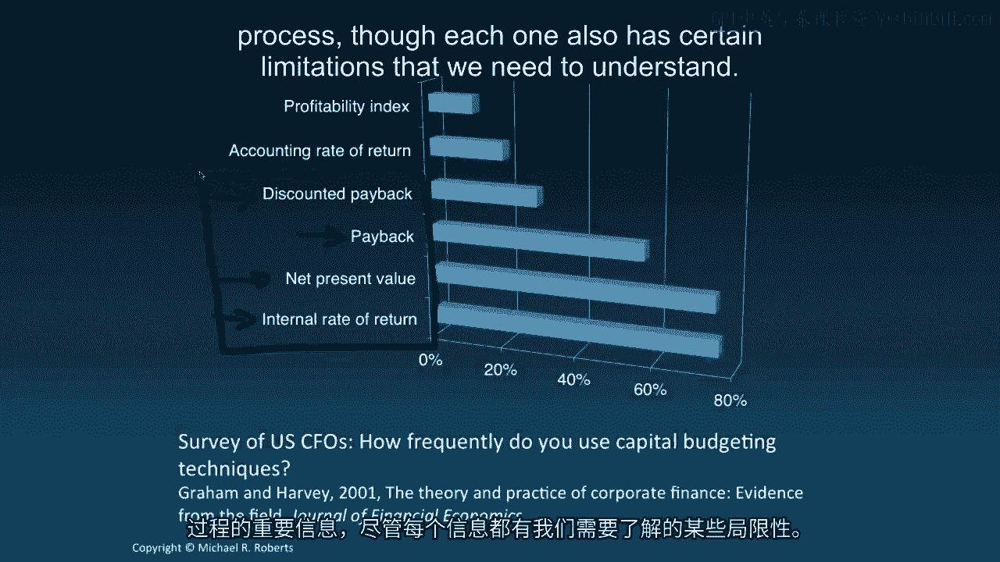
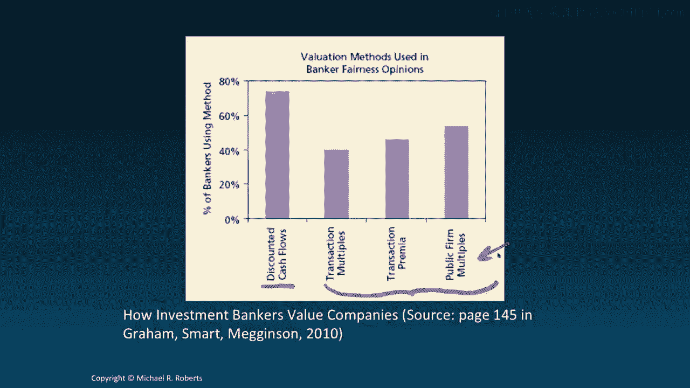
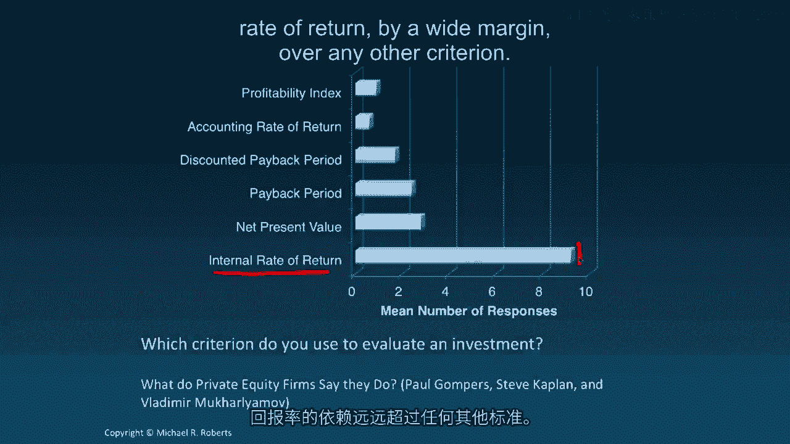

# 沃顿商学院《商务基础》｜Business Foundations Specialization｜（中英字幕） - P109：7_折现现金流决策制定.zh_en - GPT中英字幕课程资源 - BV1R34y1c74c

 Welcome back to Corporate Finance。 This time we're going to turn to a new topic。

 discounted cash flow analysis。 But before doing so， I want to briefly recap our， last topic。

 interest rates。 We started off discussing interest rate quotes and。

 how they differed from the interest rates we use to discount cash flows。 We。

 then discussed how to discount cash flow streams when the cash flows。

 arrived at frequencies other than annual and when the compounding of。

 interest was something other than annual as well。 We closed off the topic by。

 discussing the term structure of interest rates and the yield curve both of。

 which summarized the relationship between interest rates and the term of， the investment。

 Today we turn to discounted cash flow analysis and I want。

 to start the topic off by discussing how firms or people more generally should be， making decisions。

 Let's get started。 Hey everybody， welcome back to Corporate， Finance。

 Today we're going to be shifting gears to a new topic， discounted cash， flow analysis。

 But before doing so， I want to briefly recap our last topic， interest rates。

 So in that topic we started off by introducing the notion of。

 APR and EAR and a periodic discount rate。 The difference being as follows。

 APR is our annual percentage rate or a means to quote interest rates。 Whereas， EAR。

 effective annual rate and the periodic interest rate are actually， discount rates。

 They're economically relevant。 They're what we care about。

 they're what we use to discount cash flows and make decisions。 Then we use。

 those discount rates to value and assess cash flow streams that were no longer。

 arriving on an annual basis and to deal with the compounding of interest on a， non-annual basis。

 Then we closed off the topic with a discussion of the term。

 structure of interest rates which is the relation between the interest rate and。

 the term of the investment or the duration of the investment。 And we discussed， yield curves。

 loosely how to construct them， what the yield means， where it comes。

 from and how to interpret these graphs。 Now we're going to switch over to。

 discounted cash flow analysis and I want to start by motivating the topic and。

 providing a little bit of background by discussing decision making。 So let's get， started。

 Let's start with a question。 How should we make financial decisions？

 Well a reasonable answer might be to undertake those actions that create value。

 value for those affected by the decision， value for the owners of a firm for example。

 But which actions create value？ And well that's a complicated question， a sort of。

 general answer that seems reasonable would be to consider actions in which the。

 benefits exceed the costs。 But here's a little wrinkle。 What if the costs and。

 benefits arrive at different times？ Well actually we're well equipped to deal。

 with that wrinkle because we can compare the present value of the benefits to the。

 present value of the costs。 See because by computing the present value we know。

 that the discount rate R will adjust both for the timing and the risk of the， cash flows。

 So that brings us to our first lesson which is that the NPV。

 decision rule that is NPV which stands for net present value NPV。 The NPV。

 decision rule says that we should accept all projects with a positive NPV and。

 reject all projects with a negative NPV where NPV is nothing more than the。

 difference between the present value of the benefits and the present value of， the costs。

 In other words if the present value of the benefits is big is bigger。

 than the present value of the costs that's a good thing that creates value and we。

 want to undertake that project or make that decision that leads to positive NPV。

 And while this formula right here looks somewhat vague and ambiguous it's。

 actually masking something that we're already very familiar with and that's。

 just discounted cash flows。 NPV is nothing more than discounted cash flows。

 except now instead of cash flow CF I have this F in front of all the cash flows。 So， it's F CF。

 The F simply stands for free。 So these are free cash flows but they're。

 still just cash flows nonetheless。 There's nothing special there。 I'm going to。

 formally define and discuss how to compute free cash flows in our next。

 lecture but for the time being just recognize we're doing nothing new here。

 We're simply taking a stream of cash flows FCF not FCF one through FCF T and。

 we're discounting them back to today by a discount rate R to get a present value。

 a net present value。 That's it。 And so the decision rule just says if the NPV is。

 greater than zero except the project if the NPV is less than zero reject the。

 project sorry reject the project and while that seems fairly easy and straightforward。

 actually implementing it is quite a bit more subtle and we're going to talk about。

 those subtleties as we move along throughout this topic。 So before moving on。

 to some of the mechanics of a DCF analysis I want to talk about decision。

 making in practice briefly because it's useful to motivate it and to understand。

 what people in different areas of both finance and non-financial sectors are。

 doing when they're making decisions。 So the first thing I want to look at is this。

 or show you is this survey evidence from a survey by John Graham and Cam Harvey。

 former colleagues at Duke in which they surveyed CFOs from the Fortune 500 and。

 other domestic US domestic firms and they asked them how frequently do you use。

 capital budgeting different capital budgeting techniques and what you can see。

 is that there actually a variety of responses I've listed six here but the。

 majority or the predominant number of responses point to net present value and。

 internal rate of return as the most popular decision criteria that CFOs use。

 that's followed somewhat closely by the payback rule and to a lesser extent the。

 discounted payback rule and in our in our discussion of DCF well NPV is going to。

 be center stage we're actually going to spend a fair amount of time discussing。

 all of these decision rules because each one actually has important。

 information for the decision-making process though each one also has certain。

 limitations that we need to understand now that's in the non-financial corporate。

 sector if we look at what in vain investment bankers do when they are。

 value in companies in fairness opinions you can see that the large majority of。

 investment bankers are also relying on discounted cash flow analysis you know。

 something akin to NPV but they're also using a host of comparables methods or。

 relying on multiples and while this is going to take us a little bit outside of。

 the scope of our course I might mention if we have some time how we use multiples。

 in in in valuation exercises if not I might post some additional material and。

 finally there's a recent survey by Paul Gomper Steve Kaplan and Vladimir。

 Mukaraliya Mav I hope I'm not butchering that name too poorly but they have a。

 really interesting survey of private equity firms and in which they investigate。

 among among many things which criterion PE investors use to evaluate an。

 investment and what's interesting here is is the vast majority rely on internal。

 rate of return by a wide margin over any other criterion so let's。

 summarize this so we're gonna move through this topic of DCF discounted。

 cash flow emphasizing to a certain extent the NPV rule because that is the。

 optimal rule in terms of always leading you to making the decision that creates。

 value that said I'm gonna take a much more practical perspective to corporate。

 decision-making or decision-making more financial decision-making more broadly。

 and recognize that other rules are still informative they're still useful and so。

 it's not surprising that we see their use by practitioners whether it's PE。

 private equity investors or investment bankers or CFOs they're still。

 informative but the important thing to keep in mind is that these other rules。

 have certain weaknesses that we need we need to understand and we need to。

 recognize the limitations of these rules so that we can use multiple rules in。

 conjunction to come to the best decision so what's next we're gonna dive into。

 how to compute free cash flows are the first stage in understanding how to。

 execute a DCF so I look forward to seeing you in the next lecture thanks so much。

