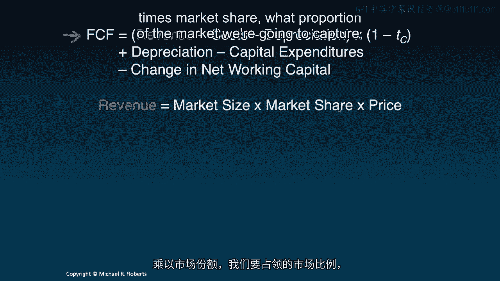
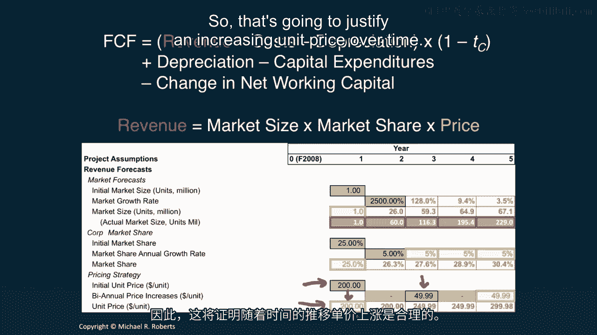
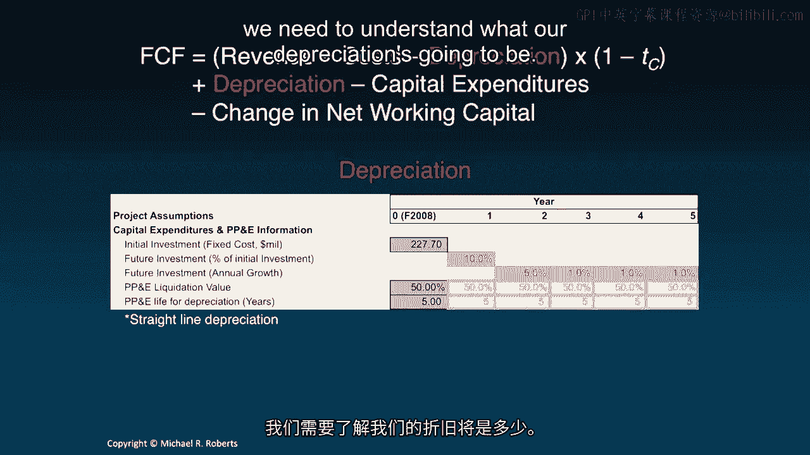
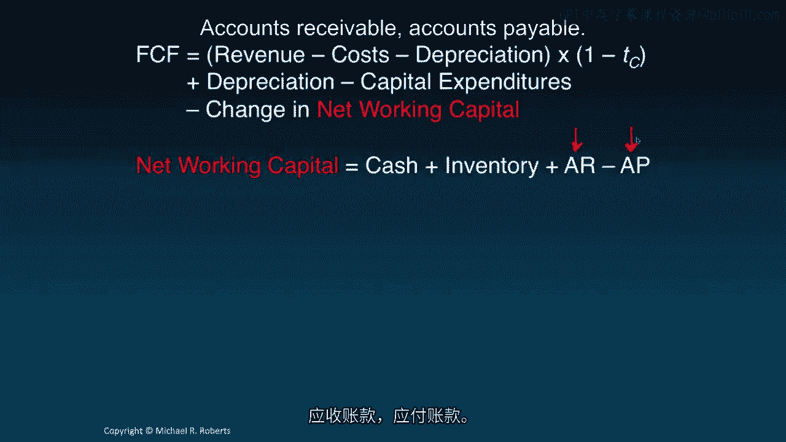
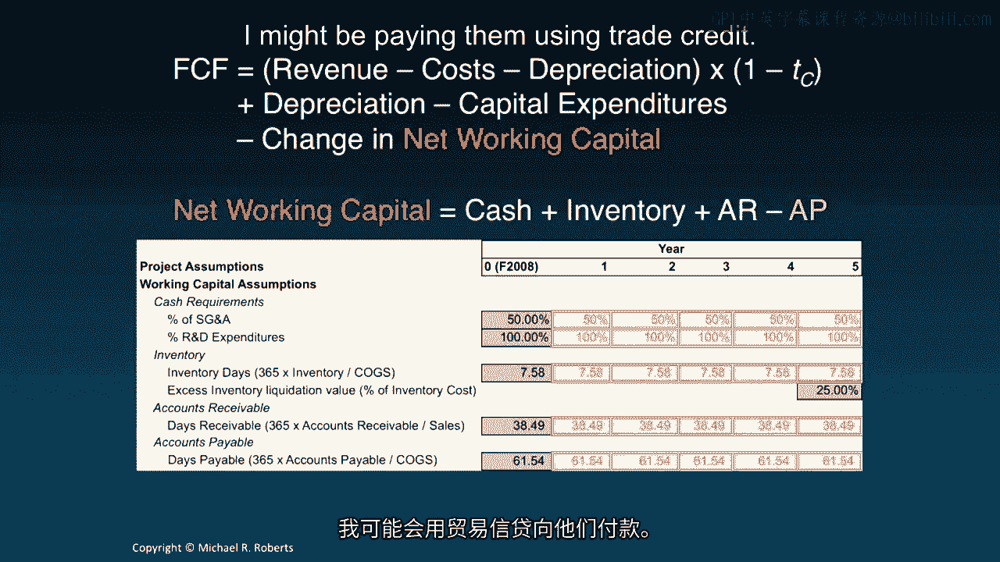
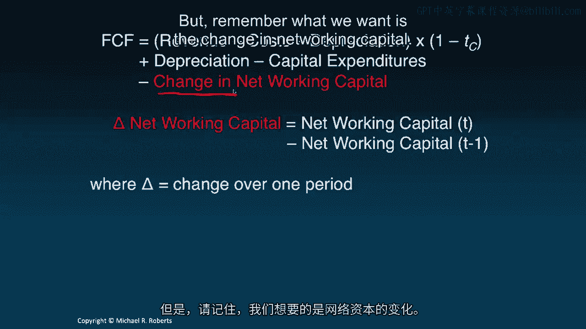
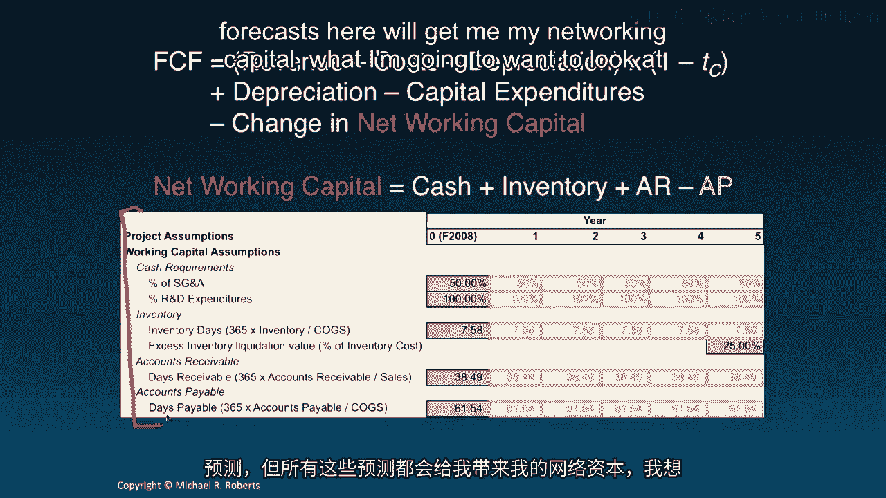
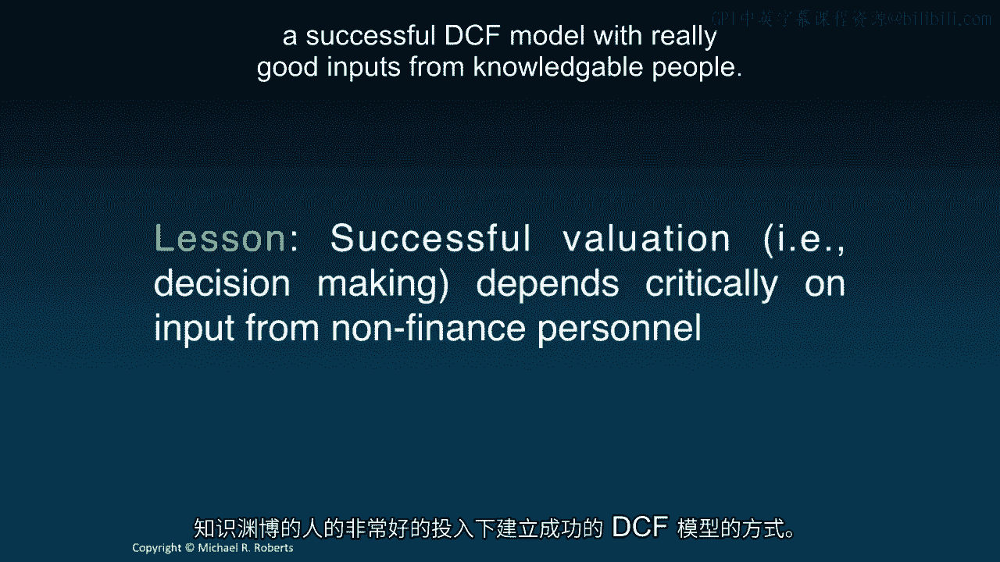

# 沃顿商学院《商务基础》｜Business Foundations Specialization｜（中英字幕） - P111：9_预测驱动因素.zh_en - GPT中英字幕课程资源 - BV1R34y1c74c

 Welcome back to Corporate Finance。

 Last time we introduced Free Cash Flow。 We talked conceptually about how to compute Free Cash Flow。

 Today what I want to do is I want to introduce a capital budgeting application。

 to illustrate discounted cash flow analysis， and in particular what I want to do is emphasize the role of forecast drivers。

 or the assumptions we need to forecast free cash flows out into the future。 Let's get started。

 Hey everybody， welcome back to Corporate Finance， and our third lecture on the DCF topic。

 "Forecast Drivers"。 Let me start with a brief recap of what we talked about in our last lecture。

 which was Free Cash Flow。 In that lecture we talked about what Free Cash Flow is， how to compute it。

 We formalized it， we actually gave it a specific formula。

 We also talked about Free Cash Flow to equity， the levered counterpart to Free Cash Flow。

 or more precisely unlevered Free Cash Flow。 What I want to do in this lecture is talk about forecast drivers。

 or the assumptions required to forecast each component of the Free Cash Flow formula。

 out into the future。 We're going to do it by way of a specific example。 Let's get started。

 Imagine we're a company in say 2008， and we're considering， building and selling a tablet。

 Back in 2008 this was really just the start of the tablet market。

 I've put our Free Cash Flow formula up here to highlight the components that we're going to need。

 Remember， the question is， should we enter this market？ Should we produce and sell this tablet？

 Well to make that decision， what we're going to want to do is a DCF。

 and we're going to want to forecast each component of this Free Cash Flow formula into the future。

 Let's do that。 We're going to start with revenue。 So revenue is market size。

 how big the market is in terms of units。 Times market share。

 what proportion of the market we're going to capture。

 times our price per unit。 So let's look at our forecast here。 So I'll start with the market size。

 Now， I'm going to assume that in the first year the market size is going to be a million units。

 That's going to be the early adopters， the techies。

 the people who are really excited about new technology， and the introduction of new technology。

 So that's going to be one million units in year one。

 but that's then going to grow quickly in subsequent years。 And you might say。

 twenty five hundred percent， that's ridiculous。 And it's an absolutely enormous growth rate for sure。

 But remember， this is the beginning of a new market that we're anticipating will take off in a big way。

 So twenty five hundred percent in the second year followed by one twenty eight。

 nine point four and three point five percent。 Now you might wonder。

 where in the world am I getting these？ Well， I'm getting them from a variety of different sources。

 I'm getting them from my marketing people and my strategy group within the company。

 I'm getting them from industry analysts as well。 So there's a host of different sources of input that go into these numbers。

 but at the end of the day they are just assumptions and I'm going to emphasize that fact later on。

 So I can use these two assumptions about the market to compute a market size in terms of millions of unit。

 just one million in the first year。 That's going to grow by twenty five hundred percent。

 one hundred and twenty eight， nine point four， three point five。

 So that's my forecast for the size of the tablet market。 Now what's interesting。

 what I'm going to show you in this next slide is here is the actual market size for tablets。

 And what you can see， even with a twenty five hundred percent growth rate。

 I was conservative in my estimate。 Twenty six million as opposed to sixteen。

 sixty million in sales in the second year followed by one sixteen， one ninety five， two twenty nine。

 So that sales， sorry， not sales， the actual size of the market。

 So you can see this market took off incredibly rapidly。 Next I want to look at my market share。

 I'm going to assume an initial penetration of twenty five percent。

 followed by annual growth of five percent each year thereafter。

 That's going to allow me to forecast my market share， which I bring down to twenty five percent。

 That's going to grow at five percent， five percent， five percent and five percent。

 So this is just to be clear， twenty five percent times one plus five percent。

 That'll get you to twenty six point three percent and likewise for the subsequent forecasts。

 And finally we have to come up with a pricing strategy。

 I'm going to price our tablet initially in year one at two hundred dollars per unit。

 which I just bring down here。 I'm not going to experience any price change in the second year。

 but then I'm going to increase prices in the third year by just under fifty dollars。

 Now you might wonder what am I thinking consumer electronics prices go down and go down fairly rapidly。

 But what I'm going to do is I'm going to build in some element of versioning here。

 So just like we had the iPad， iPad 2， iPad Air， I plan on doing some R&D， which I'll discuss later。

 that's going to develop new better versions， lighter， more powerful， better screens， etc。

 So that's going to justify an increasing unit price over time。

 Let's move on to costs。 So I'm going to start with cogs or costs of goods sold。

 which I express as a margin here or a percentage of sales。

 And I'm going to assume that's going to run at about eighty point six， six percent。

 A number based on our company's experience working in the computer industry for some time based on estimates from our operations people and insights from other analysts and consultants。

 My SG&A sales general and administrative expenses are going to run at about one percent of my current SG&A or sixty nine point five nine million dollars。

 I'm just making that number up there with me。 So it's going to be sixty nine point five nine million in the first year。

 And I'm going to assume that's actually going to grow by twenty five percent per year。

 Because hopefully a sales in the size of this market grows， I'm going to need more。

 I'm going to have more overhead to keep up with that growth。 Whereas I'm tying cogs。

 which is loosely viewed as a variable cost， I'm tying that forecast to sales。 Now R&D。

 well I'm going to have to spend two hundred million dollars up front in R&D to get this thing up and running。

 And then I'm going to have an additional twenty， so that's this up front R&D。

 then I'm going to have an additional twenty five million every year thereafter to deal with versioning and improvements。

 Now let's turn to our investment needs。 I'm going to assume an up front investment of two hundred twenty seven point seven million dollars to build a plant。

 get any necessary equipment for production。 My first year investment is going to be ten percent of that initial investment。

 and then subsequent years are going to be annual growth of five percent， and then one one and one。

 And you'll see how this rolls out in the next lecture when we actually forecast those free cash flows。

 But these are just the assumptions， we're laying the groundwork here。

 Now at the end of this project， which is five years， right， so I'm going to assume。

 I mean assuming that this is a five year project。 At the end of this project I'm going to have all of this plant property and equipment left over。

 Well let's focus on the plant and equipment。 It's going to be there。

 it's not going to just disappear at the end of the project。

 So I'm going to assume I can do something with it， I could sell it， I could rent it out。

 I could redeploy it for another product。 But I'm going to take a step back from precisely what I do with it。

 and just assume a liquidation value or a valuation for it in which I get fifty cents on the dollar。

 It's just an assumption。 Now for depreciation purposes。

 I'm going to assume that all capital depreciates on a straight line over five years。 That is。

 it's useful economic life is five years， and so each year one-fifth of the capital theoretically disappears。

 Again that's a non-cash expense， it's not costing me anything but it is going to provide a tax shield here that we have to recognize。

 So we need to understand what our depreciation is going to be。

 Now on to networking capital， we call networking capital is cash plus inventory plus accounts receivable minus accounts payable。

 accounts receivable， accounts payable。 Let's go after each component here。

 I'm going to assume this project is going to require a certain amount of cash which might seem a little bit odd。

 but think of it as cash that I need to pay employees and ongoing bills such as utility costs。

 IT expenses， whatever it may be。 And those requirements are going to be defined by 50% of my SG&A and 100% of my anticipated R&D expenditures。

 Let's clear that， there we go。 My inventory forecast is based on inventory days or turnover。

 How long does it take to get inventory in and then out？ I'm going to assume that that's 7。

58 days which by the way is very fast， you have to look to a company like Dell for that kind of turnover。

 And finally I want to recognize that at the end of this I'm going to have some inventory left over which I assume I can get 25 cents on the dollar。

 At that point it's going to be fairly obsolete， I might want to scrap it。

 I might want to sell it on some secondary market。 Sorry about that， some secondary market。

 So I'm going to assume 25 cents on the dollar for that remaining inventory at the end of this project。

 My accounts receivable are based on days receivable or how many days it's going to take until I actually get some money in following a sale because remember a lot of sales are based on credit。

 And likewise my accounts payable are based on days payable which is going to tell me roughly how long it takes for me to pay my suppliers。

 I might be paying them using trade credit。

 So that's our working capital but remember what we want is the change in networking capital。

 So while these forecasts here will get me my networking capital what I'm going to want to look at in free cash flow is the year on year change from year t。

 sorry from your t minus 1 to your t。

 And then the last piece of this puzzle is taxes。 I want the marginal tax rate。

 I want the tax rate on additional dollar of earnings， I'm going to assume that's 25。5%。

 A lot of people will estimate this with an effective tax rate that is looking at the income statement。

 tax expense over pre-tax income。 That's not strictly speaking what we want。

 To get at the marginal tax rate you probably need access to the tax records of the company which are difficult if not impossible to get。

 So a lot of people will also assume a top statutory corporate tax rate of around 35， 36%。 Alright。

 so what we've done is we've gone through， let me just wrap up a little bit here。

 We've gone through and we've produced or made assumptions about every component in our free cash flow formula。

 And all of those assumptions are going to allow us to forecast dollar values into the future。

 But let's take a step back。 This is nonsense。 That's a common look I get from students or practitioners when I discuss this framework because the argument is。

 look， this is impossible to make accurate forecasts in the future。

 It's hard enough to figure out what our company is going to do and how the economy is going to change and how that's going to impact our company。

 A quarter out， much less five years。 And I agree， but I think that's not the point。

 Let me be clear on what I agree。 It's not that this is nonsense。

 but I do agree that it's very difficult， if not impossible， to make accurate forecasts。

 But that's not the point。 That is just not the point of a DCF。

 The point of a DCF is really to focus the discussion and analysis on the relevant issues。

 To get away from decision making based on gut feelings， what the stars look like。

 whether it's a full moon， other ad hoc rules of thumb。

 just referring to nebulous experience and I know best， or I've been at the company for 20 years。

 this is the way it is。 DCF provides a rigorous framework within which we can discuss what really matters for value creation。

 And that's the whole point。 That's what I want to emphasize。

 The goal of a DCF isn't to get one number that we argue is correct。

 The goal of a DCF is actually to provide a host of numbers and a host of sensible and financially correct information from which we can make better decisions。

 And I'm going to emphasize that throughout。 Another lesson I want to emphasize here is that no successful devaluation or DCF can rely solely upon input from financial personnel。

 It's critical that we get input and insights from all aspects of the company or across division lines。

 I mean， think about what we're forecasting。 We're forecasting revenues。

 What's going on with the market？ So we want to talk to our marketing and strategy people。

 We're going to be talking about investments and operations。

 We need to understand what our inventory is going to be from our operations people。

 from line managers， even from lower rank and file employees。

 That's how you build a successful valuation。 That's how you build a successful DCF model with really good inputs from knowledgeable people。

 Alright， let's wrap this thing up。 So today we discussed forecast drivers in the context of a specific example that being a tablet。

 And these are nothing more than the assumptions that we're going to use to forecast the dollar values of each component of our free cash flow formula。

 And again， the goal isn't to get the right answer。

 It's to provide that framework within which we can discuss sensibly and logically the relevant issues for making decisions。

 So in the next lecture， what I want to do is I actually want to use these forecast drivers to forecast the free cash flows。

 the dollar values。 I look forward to seeing you then。

