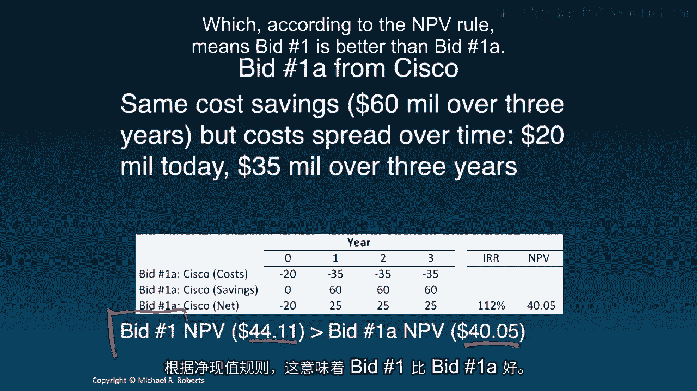
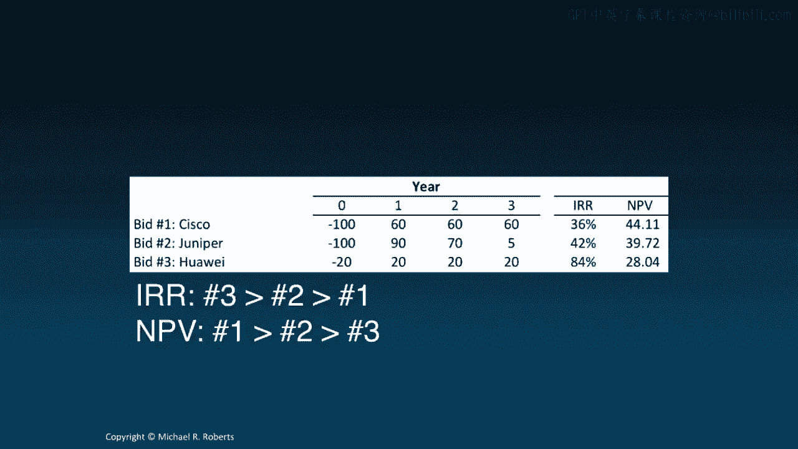
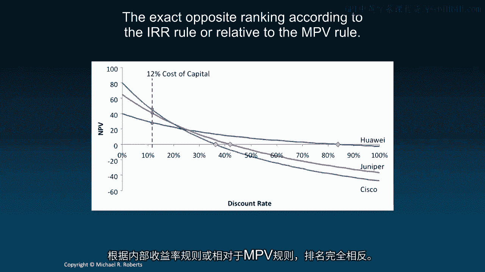
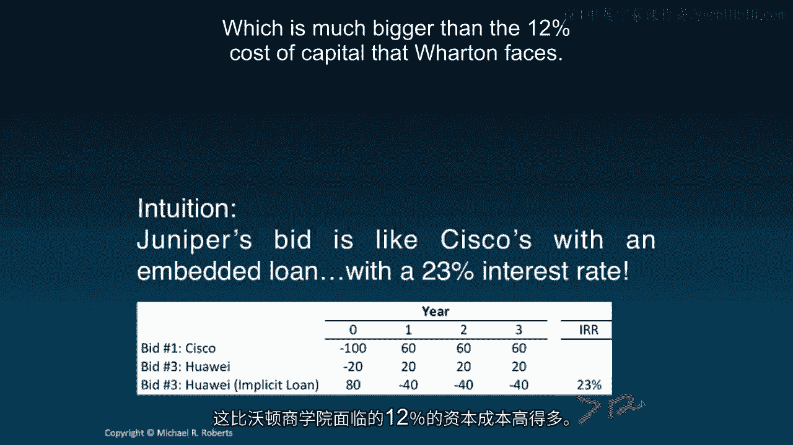

# 沃顿商学院《商务基础》｜Business Foundations Specialization｜（中英字幕） - P115：13_投资回报率.zh_en - GPT中英字幕课程资源 - BV1R34y1c74c

 Welcome back to Corporate Finance。 Today we're going to turn to a new topic return on investment。

 but before doing so， I want to briefly recap our last topic， Discounted Cash Flow Analysis。

 If you'll recall， we started off with a discussion of how firms， or people more generally。

 should be making， decision through different decision criteria。 Then we talked about free cash flow。

 at least from a conceptual standpoint。 We then discussed forecast drivers。

 or the assumptions required to forecast free cash flows into the future。 If you'll remember。

 we did that in the context of a tablet。 We then applied our assumptions， our forecast drivers。

 to our free cash flow formula to get forecasts of free cash flows for our tablet project。

 We then brought our decision criteria back in and applied it to the forecasted free cash flows to come to a decision of whether or not to proceed with our tablet project。

 We closed out the topic with a discussion of sensitivity analysis to investigate just how robust our assumptions and decisions are。

 Today， I want to talk about return on investment。 In particular。

 what I want to discuss is the strengths and weaknesses of the internal rate of return relative to the net present value rule。

 Let's get started。 Hey everybody， welcome back to Corporate Finance。

 Today we're turning to a new topic， return on investment， but before diving in。

 I actually want to spend a little bit of time recapping our last topic。

 discounted cash flow analysis。 What we did in our DCF topic is we began by introducing decision making。

 We showed some evidence， looked at some survey evidence of what people in practice were doing。

 We showed CFOs of non-financial companies， private equity managers， and investment bankers。

 And we showed that they used a number of different criteria， DCF， NPV， IRR， and payback period。

 Then we turned to looking at free cash flow， one of the key components of any DCF。

 And we talked about the components that make up free cash flow and how to aggregate them。

 Then we talked about forecast drivers， where the assumptions necessary to forecast each of the components of free cash flow。

 And we did it in the context of a capital budgeting example of a tablet。

 We then applied our forecast drivers to forecast out each component of free cash flow and aggregate up to get a free cash flow projection。

 We then looked at different decision criteria。 That is。

 we figured out what to do with those cash flows and ultimately what decision to make regarding the tablet。

 Specifically， we looked at NPV， IRR， and payback period。 We talked about their strengths。

 some of their weaknesses。 And then we closed out the topic with a discussion of sensitivity analysis。

 an integral element of any DCF。 Now， I really want to continue on the theme set by DCF and talk about return on an investment and really emphasize IRR versus NPV。

 the two most commonly used decision metrics。 So let's get started。

 So recall that the internal rate of return of an asset is the one discount rate such that the NPV of the assets free cash flow is equal to zero。

 So I have NPV， I have cash flow， we could have free cash flow。

 don't let the convention change you confuse you IRR is much broader than just free cash flow as is cash flow。

 But anyway， IRR is just that one discount rate such that the NPV is equal to zero。

 The IRR decision rule as you might recall says accept all projects for which the IRR is greater than R。

 reject all projects for which the IRR is less than R。

 where R is our hurdle rate or opportunity cost of capital。 And the intuition was simple。

 if it's costing us R% to raise money to fund investment。

 that investment should return something at least as big， if not greater than R， preferably greater。

 Now， I'm going to spend some time here talking about IRR。

 a little bit of motivation here because rates of return are really popular measures used for making decisions。

 Remember back to the survey evidence， internal rate of return was the most popular decision criteria used by CFOs。

 it just edged out NPV。 And likewise for PE firms， private equity firms。

 internal rate of return is by far the dominant decision criterion used for evaluating investments。

 So it's really important to understand this criterion。

 So let's compare it to NPV and let's do it by way of an example， shortly， I should say。 So first。

 the IRR is going to lead to the same decision except to reject as the NPV rule if all negative cash flows proceed all positive cash flows。

 So here's some examples of cash flow sequences， at least the sign of the cash flows where the IRR and NPV rules will coincide。

 So I pay a bunch of money today and then I get nothing but positive cash flows。

 I pay money for the first three years， let me lay it out， I don't like that， let's do this。

 For year one， two and three and then years four， five and on are all positive。

 The key is that the negatives have to come before the positives， negative before positive。

 Then IRR and NPV lead to the same decision。 If that pattern of cash flow signs is violated。

 not only may IRR and NPV rules not coincide， not lead to the same decision。

 but you can get some pretty wacky stuff with IRR from multiple IRRs。

 in which case which one do you choose。 It's not obvious to imaginary IRRs and I mean mathematically imaginary IRRs。

 you'll get an IRR times some number times the square root of negative one。

 which is really hard to convey to a CEO， trust me。

 So let's think about whether or not we can compare projects using IRR。

 Here's where I want to work in the context of a specific example。

 Imagine Wharton wants to upgrade its IT system and overhaul its network infrastructure。

 So it puts out a request for proposals in RFP and incomes a bid from Cisco。

 The Cisco bid we evaluate to generate $60 million in cost savings over three years for an upfront cost cost to Wharton of $100 million。

 Now if our cost of capital， Wharton's cost of capital is 12%， what is our assessment of this bid？

 First things first， write down the cash flows。 Here they are。 We're going to get， right， bid one。

 It's going to cost us $100 million today， then we're going to experience cost savings of $60 million for the next three years。

 We can compute， let's clear this up， we can compute the IRR by solving this equation， right？

 Just set the NPV for the project equal to zero and solve for IRR。 That gets us 36%。 Now。

 because the IRR is greater than the discount rate， our hurdle rate， remember that was 12%。

 and the cash flow signs are proper， that is they follow， right， negatives followed by positives。

 This project looks good。 If we compute the NPV， if we just discount the cash flows。

 future cash flows by the Wharton's cost of capital 12%， we're going to get an NPV of $44。11 million。

 which is greater than zero。 Well， that looks good too。

 So both IRR and NPV point in the same direction。 This looks like a reasonable bid。

 Wharton's going to be better off by accepting it。 But then Cisco comes back and they say。

 "We're going to give you the same cost savings， $60 million over three years。

 but now what we're going to do instead of charging you $100 million up front。

 we're going to spread the costs over time。 $20 million today and then $35 million over three years。

"， So let's try evaluating this bid。 I mean， it sounds somewhat attractive if we can avoid that huge up front bill。

 So， for bid 1A， here are the costs。 It's going to cost us $20 million up front as opposed to $100 million。

 but we're going to have to pay $35 million over the next three years。

 We still get the same cost savings， so the net cash flows for this bid are minus 20， 25， 25 and 25。

 Let's compute the IRR and NPV， IRR first。 Well， the IRR。

 we set the NPV of these cash flows equal to zero， solve for the IRR， and we get， whoa， 112%。

 That's impressive。 That is very impressive。 And we see that the IRR for bid 1A， this bid。

 is 112% is greater， much greater。 I'm going to put much greater than the first bid from Cisco。

 which had an IRR of 36%。 We can also compute the NPV by just discounting by the cost of capital。

 12% -- Wharton's cost of capital。 That gets us an NPV of $40。05 million。 So。

 bid 1 had an NPV of $44。11 million。 Bid 1A has a NPV of $40。05 million。

 which according to the NPV rule means bid 1 is better than bid 1A。

 What's going on here？ NPV says bid 1 is better。 Right？ 44。1 is bigger than the 40。05。

 IRR says bid 1A is better because 112% returns better than 36% return。 What do we do？ Well。

 let's take a closer look。 That's the first thing we do。 And we see， let's look。 Here's bid 1。

 Cisco's costs are $100 million all up front。 For bid 1A -- sorry， Cisco's costs。

 Wharton's costs are $100 million up front。 Bid 1A， Wharton's costs are only $20 million up front。

 but then $35 million every year thereafter。 And so what bid 1A is doing is it's inserting a loan。

 Cisco's lending us money。 In particular， they're lending us $80 million today in exchange for $35 million over the next three years。

 Here's a question。 What's the interest rate on the loan？ We can figure that out。 Right？

 I can figure out what the interest rate on this loan is。 How？ Just compute the IRR。 Right？

 Just compute the IRR。 And if we do that， we see that the interest rate is 15%。 Right？ And again。

 this is just the IRR。 I want to emphasize it。 Let me clean that up。 It doesn't look like -- right？

 If I move this over here， this will be zero。 This will equal -- oops。

 Having trouble equals minus 80。 Right？ Okay。 So that is just the IRR。 It's 15%。

 It's also the yield to maturity， which we've discussed in the past。 Well， is the 15% higher low？

 Is it good or bad？ Well， it's terrible。 Cisco is charging us a higher interest rate than our cost of capital。

 In other words， we can go to the capital markets and raise the money for a loan at 12% as opposed to implicitly borrow from Cisco at 15。

 See， what happened is the IRR increased because the initial investment fell more than the future cash flows。

 Right？ Small payoffs on a really small investment can generate very large returns。

 We're dividing by small numbers here。 Okay。 See， but the NPV rightfully fell because Cisco's lending us money at an interest rate that's greater than our cost of capital。

 So the IRR spiked because we have this smaller upfront investment。 That's very misleading。

 The NPV fell。 It accurately captured the bad loan Cisco was inserting into the deal。

 And so the lesson here is that IRR projects can mislead when we're deciding among projects。

 whereas NPV will not mislead in comparisons。 The larger the NPV， the greater the value。 Now。

 let's briefly talk about a couple of additional bids， just to hammer home the point。

 We also heard from Juniper and Huawei， who had costs and cost savings for us as laid out in this table。

 And how would we rank these bids according to the IRR and NPV？ Well。

 we know how to compute the IRR and NPV。 We just replicate or repeat what we did for Cisco or what we've done in past lectures。

 And you get this set of IRRs and this set of NPVs。

 And what you quickly see is that the IRR ranking is that the Huawei number three bid is bigger than the number two bid from Juniper。

 which is better than the number one bid from Cisco。

 The exact opposite ranking relative to what NPV tells us。 And here's a picture of what's going on。

 I've got the discount rate。 We've seen a picture like this before。

 I've got the discount rate on the horizontal axis and I've got NPV on the vertical axis。

 And each line graphs the relation between NPV as a function of the discount rate。

 So at our cost of capital here， if we go up to each line， we can see the NPVs of each of the bids。

 And quite clearly， the Cisco bid on the green line is better than the Juniper bid on the red line。

 which is better than the Huawei bid， which is on the red line。

 And what we've seen here is that the NPV is the NPV which is the NPV which is on the blue line。

 When we go over here where the lines cross the x-axis， these are the IRRs。 By definition。

 the IRR is the discount rate where the NPV equals zero。 Here are the IRR -- oh， sorry about that。

 Here are the IRRs。 In this case， we see that the IRR for Huawei is much bigger than the IRR for Juniper。

 which is bigger than the IRR for Cisco。 So， the IRR rule， or relative to the NPV rule。

 What's going on？ Well， if you look more closely at the cash flow streams。

 you can see that Huawei is small upfront costs。 That increases the IRR， relatively speaking。

 And Juniper has front-loaded cash flows， which is going to increase the IRR relative to the Cisco bid。

 So one lesson is the IRR does not address differences in scale。

 And there's no better way to emphasize this point than to ask would you rather earn 100% on a $1 investment。

 or 10% on $1 million of investment？ Well， quite clearly the latter。

 you're going to wind up with a lot more money。 Some more intuition。

 Juniper's bid is actually like Cisco's with an embedded loan。

 And you can see that here where Cisco charges $100 million， then you get the cost savings。

 What Huawei is doing is it's giving you an $80 million loan and then charging you $40 every period。

 as opposed to the $35 million that Cisco's 1A bid was charging you。

 And if we ask what the loan is on this interest rate， right？ What the interest rate is on this loan。

 we see it's 23%。 The IRR to this loan is just 23%。

 which is much bigger than the 12% cost of capital that Warden faces。

 Okay， let's summarize this。

 What are the lessons here？ Look， internal rate of return is useful。

 It's a way to convey the attractiveness of a project or an investment in a manner that investors get returns。

 Okay， the problem with the IRR decision rule is that it only works or overlaps with NPV in certain situations。

 when we're not comparing projects and when the cash flow slides are all negative cash flows preceding all positive cash flows。

 So I think the end message here is that use IRR in your project evaluation and your investment analysis。

 your capital budgeting， but be cognizant of the limitation。 No when to use it。

 no when not to use it。 That's what's critical。 So thank you so much for listening and I look forward to seeing you in the next lecture in which we're going to talk about。

 what are we going to talk about？ Oh， the cost of capital。 Bye bye。

