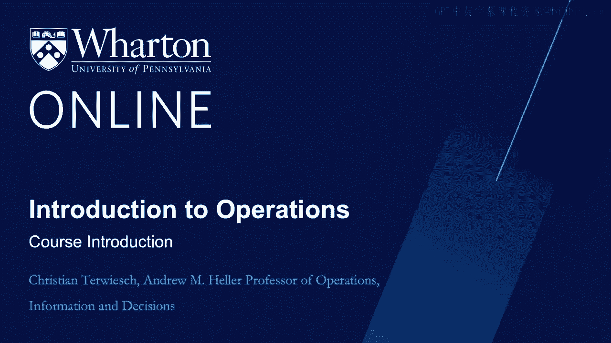
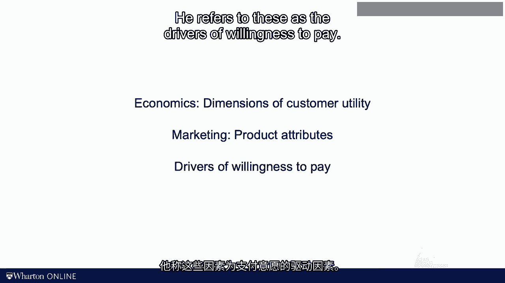

# 沃顿商学院《商务基础》｜Business Foundations Specialization｜（中英字幕） - P116：0_运营概论.zh_en - GPT中英字幕课程资源 - BV1R34y1c74c

 Hi， my name is Christian Tevich。

 I've been the professor of operations management here at the Warren School for over 20 years。

 I also teach classes on operations and innovation at Perman School of Medicine。

 Welcome to my course on operations management。 Before we get into the academic details of this course。

 let me see a word or two about， myself。 As you can sense from my accent， I sound like a German。

 that is because I am a German。 At times I might also come across a little bit like a control freak。

 That is because I am a control freak。 So you might be thinking great。

 I am stuck now with a German control freak teaching me operations management。 Yes。

 that's exactly the deal。 The goal of my course is to help you analyze and improve the way that you or others work。

 Your professional background might be in big companies or in small companies。

 You might want to become a management consultant or you dream of starting your own company。

 Either way， I want to help you reimagine the way that work gets done。 Now you might be saying。

 wait a minute， how can this guy in the video help me improve how， I work？

 I know my work better than anybody。 This is a common concern that I hear about academics and consultants。

 And you know what？ I'm married to your point。 So let me be clear of what this course does and does not do。

 I cannot tell you how to do your work。 Nobody knows your work better than you do。

 But what I can do is teach you some tools about how to analyze what you do and how to， improve it。

 The academic discipline of analyzing and improving work is called operations management。

 Operations comes from the Latin word opus， which means work。

 Operations management is about helping people analyze and improve the way that they work。

 As you and I work together in this course， my job is to provide you with the most important。

 tools of operations management。 We will talk about process maps， flows and bottlenecks。

 We'll talk about waste， variability and inflexibility。

 We'll talk about lean and six-sigma and process improvements and lots of other cool stuff。

 The other thing you might be wondering is what does it mean when it talks about improving， my work？

 Whenever consultants show up， their primary goal surely is to cut costs。 Let me be clear。

 This is not a cost-cutting course。 To see what I mean with improvement。

 let's take a look at an example。 Let's say you and I want to go out and grab a coffee。

 You like a latte， I like a hot chocolate and so we agree to meet in a Starbucks。

 What does it take for Starbucks to make us happy customers？ For us to turn into happy customers。

 a couple of things have to be in place。 First of all。

 we have to get to a Starbucks without too much inconvenience。 Now， for the better or for the worse。

 there are 11，000 of them in the United States。 So location should not be a problem。

 Then we want to order our coffee and get it without too much of a waiting time。

 Let's not talk about price today， I will pay， but clearly price matters to consumers。

 Once we have the cup in our hand， we want to enjoy the consumption of the coffee。

 Starbucks that you offer and order your coffee in a gazillion different ways， so I'm sure。

 we find something that would match your preferences。

 But even when you get your medium latte with skim milk and chocolate dusting， we need a。

 good coffee to begin with。 Good coffee means a good recipe。

 And the employee at Starbucks needs to execute that recipe and process your order correctly。

 so you don't end up with a cup of green tea。 Now let me share a somewhat personal story。

 I've been commuting by bike to Penn for the years I lived here。

 I also have spent 20 years of my life racing on the bike and in the iron run series。 In 2005。

 I went out on a training ride。 For reasons that would never be clear to me。

 the brake cable became loose and got between， the wheels and the fork。

 This is what the fork looked like。 I went head first onto the pavement。

 My helmet protected my skull， but my face was sliding over the pavement。 To state the obvious。

 at that moment I was in need of health care。 But what does good care look like？

 Let's see if our coffee example provides any insight into how we would operationalize。

 the idea of good care。 How about you pause the video for a minute and think about what I needed bleeding on。

 the pavement of Windwood Avenue。 What makes for good care？ Okay， pause now。 Okay， here we go again。

 Here's how I think about my customer needs with some distance， no bleeding and some fake。

 teeth in my mouth。 First， in an accident like this， time is critical。

 And ambulance arrived in minutes and drove me to the Penn Medicine trauma center。

 The trauma center was closed by by ambulance about a 15-minute drive。

 Once we got to the trauma center， I did not have to wait in line， but I was in a trauma。

 baby before I woke up。 Second， the doctors and the care team， there were the specialists I needed。

 At that moment I needed a trauma surgeon， not a urologist or a psychiatrist。 Third。

 the care team was great。 They knew what to do it and they did it。 Well。

 nobody took my orders for lunch that day， but trust me， it was the least of my， worries。

 I have been told later on that they even had free Wi-Fi。 Finally， though。

 my insurance did pay most of the bills， this one day adventure was more。

 expensive than a week in a five-star hotel。 So if we think about what we mean with good care。

 we can think along exactly the same， dimensions as providing good coffee。 In fact。

 I argue that any work that is about delivering a product or service would fit into， this framework。

 But differently， we want to manage an operation so that it provides a customer with the product。

 or services they want。 Depending on who you ask at Wharton。

 different academic disciplines have different words for， this framework。 In economics。

 people refer to the dimensions of a utility function。 In marketing。

 folks think about the product attributes of products or services and those， are driving utility。

 And in strategy， I like the term that my friend and co-author， Nicholas， Igor Koll， uses。

 He refers to these as the drivers of willingness to pay。

 Now you might say that increasing customers' utility and customer happiness or willingness。

 to pay is easy。 We just offer airplane passengers a glass of champagne and more leg space。

 We put bigger batteries into electric cars and we offer free desserts to guests eating。

 out in our restaurants。 As we will discuss in the next video。

 the challenge is to increase the willingness to， pay without increasing the cost of fulfillment。

 So when earlier on I was saying that we improved the way people work， we now get a sense of。

 what improvements look like。 We can either increase the willingness to pay hold in cost constant or we can provide。

 the same willingness to pay at lower fulfillment costs。 For now， remember。

 the goal is to make things better， not necessarily cheaper。 [BLANK_AUDIO]。

