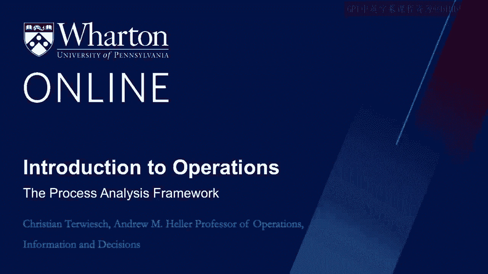
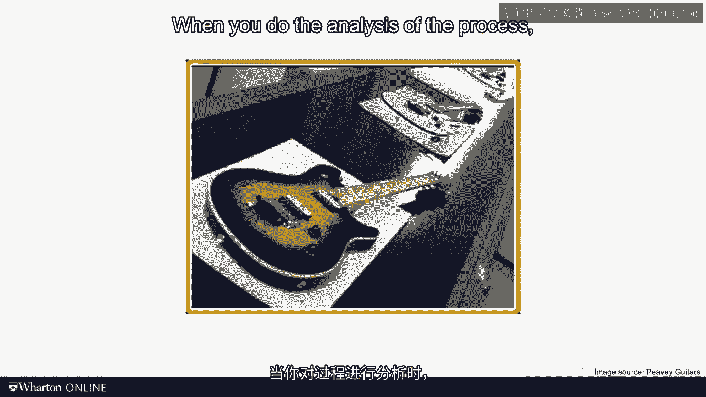
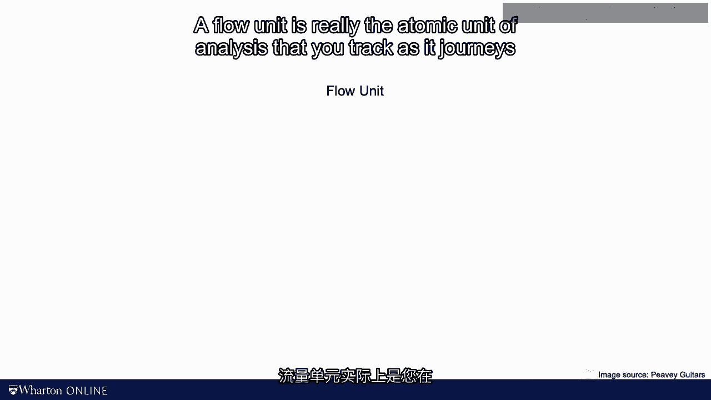
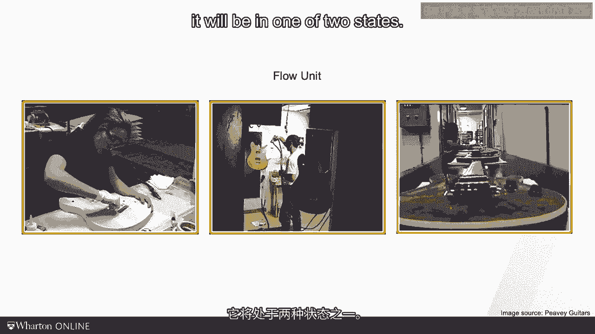
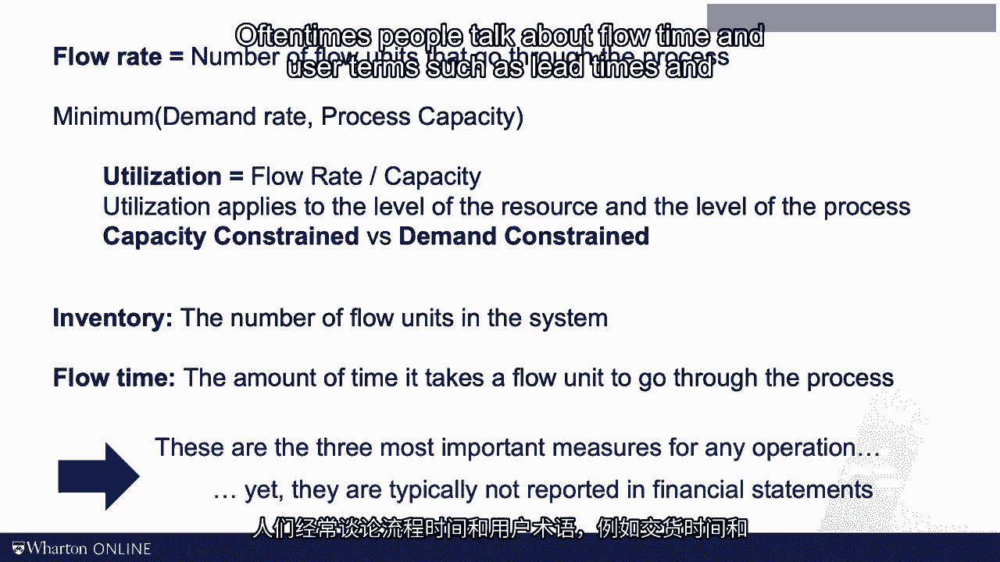

# 沃顿商学院《商务基础》｜Business Foundations Specialization｜（中英字幕） - P119：3_过程分析框架.zh_en - GPT中英字幕课程资源 - BV1R34y1c74c

 Operations management is looking at the way people and machines work。

 Genji Genbutsu is a concept of the famous Toyota production system。 No， I don't speak Japanese。

 but it means go and see for yourself。 The literal Japanese meaning I've been told is real location and real thing。

 but the， message is the same。 In order to understand the problem。

 you have to observe what is happening on site， where。

 the work takes place rather than sitting in an armchair or conference room。 At the 30。

000 foot levels， all companies more or less look the same。

 They create products or services and hopefully I'm able to sell them for more money than。

 it costs them to create those products and services。 But on the ground， at the zero foot level。

 every operation is unique。 Now， there's no point in taking an academic operations management course to learn about。

 the uniqueness of one particular operation。 I owe you tools and frameworks that are generalizable。

 that you can apply to the many settings that， you encounter in your career。 And to be frank。

 I'm not sure I would be any good in teaching you a particular trait other。

 than how to be a business school professor。 So the perspective we will be taking in this course is a compromise between the 30。

000 foot， level of your strategy and the frontline perspective of a specific job。

 Maybe we should call it the 5，000 foot level of view。 At this level。

 I want you to think about the process with which work gets done。

 Process analysis is a framework I want to use in this course to analyze and improve operations。

 Let me elaborate what I mean with this。 Every operation can be thought of as a process。

 In a process， their inputs and their outputs。 These are pictures from a guitar plant that PV a guitar shows on the internet。

 And you can see here there's wood flowing in and guitars flowing out。

 When you do the analysis of the process， you have to pick what I will call a flow unit。

 A flow unit is really the atomic unit of analysis that you track as a journey through the process。

 It's a guitar in a guitar plant。 It's a patient in a hospital。 It's a kind amount of motive plant。

 It might be a ton of oral or a ton of steel in a big refinery or steam。

 And as a flow unit's journey from being an input into being an output， it will be in one。

 of two states。

 It can either be with a resource。 A resource is visualized as a box and what we define in a moment as a process flow diagram。

 A resource adds value。 It helps the flow unit on its journey from being an input to being an output。

 Those might be machines or those might be people。 Most of the time， however。

 the flow unit is just sitting around doing nothing。

 You see this pile of guitars here and the symbol that we use to visualize this is a， triangle。

 It's like a pile of stuff sitting around。 Arrows then capture the flow。

 And so really a process flow diagram is a map。 It's a map of how a flow unit journeys from input to output。

 Now in every resource， the flow unit would have to take some time。

 It might take a doctor 20 minutes to do a primary care examination。

 It would take an assembly line work of 37 seconds to install a review mirror。

 It might take an underwrite and a bang 35 minutes to approval on。

 We call those numbers the processing times。 Now rather than looking at the processing time。

 I can look at one over the processing time， and I call this the capacity。 One over 20 minutes。

 a 20th patient per minute in what a doctor can see in primary care。

 Capacity tells us how many units can work a see per unit of time。

 But let's just assume that you're having one doctor or one machine。

 This generalizes to multiple say M resources and here simply the capacity of those doctors。

 those underwriters those machines together as a resource pool is computed as M divided。

 by the processing time。 Now the chain is only as strong as its weakest length and so somewhere along the journey。

 in this process， there will be one resource that has a lowest capacity。

 We will refer to this resource as the bottleneck。 We will not be able to get more flow through this process than the bottleneck has capacity。

 Again， the step with the lowest capacity is called the bottleneck。

 The lowest capacity is not just the capacity of that bottleneck resource but it's really。

 the capacity of the entire process。 So we say the process capacity is the capacity of the bottleneck。

 With this as a foundation， we can now define the three most important measures in any process。

 They are flow rate， inventory and flow time。 So let me define them one by one。

 Flow rate is oftentimes referred to as throughput。

 I will use flow rate and throughput interchangeably。

 Flow rate captures how many flow units will go through the process per unit of time。

 A hundred patients per day go through the emergency room。

 A thousand cars per shift go through the auto plant。

 Fifty thousand tons of steel per month come out of the steel mill。

 These are throughputs or flow rates。 I like the term flow rate because it reminds us that there is a flow going on。

 Now the flow rate would depend on two things。 The capacity of the process which we just saw was determined by the bottleneck or the。

 demand rate。 It's a smaller of those two。 If you have a process that can make a hundred thousand cars per quarter and you only have。

 demand for seventy thousand cars per quarter， well， you're only selling and making seventy。

 thousand cars。 So once you have the flow rate， you know how much flows through the process or flows through。

 every resource。 Next you can compute the utilization。 Evaluation is flow rate divided by capacity。

 How much am I producing flow rate divided by what I could be producing if I ran out？

 That's capacity。 Again utilization applies to the level of the resource。

 You might say station ten is utilization of seventy five percent on my assembly line right， now。

 Or utilization can apply to the entire process。 You oftentimes see people say in the Wall Street Journal that our plant has a utilization。

 of ninety five percent。 And by definition utilization can never exceed one hundred percent。

 Depending on whether you're constrained by demand or you're constrained by capacity。

 we say the process is demand constrained or capacity constrained。 If you are capacity constrained。

 you're held back by your bottleneck。 If you're demand constrained。

 you're really limited by your marketing。 The quality of your product。

 the demand rate or your sales generation。 Capacity or demand constrained。

 What is the constraint in your business right now？ Well that's flow rate。

 The next measure is inventory。 Inventory is the number of flow units in the system。

 Let me repeat this。 Inventory is the number of flow units in the system。

 I want to do be precise on that because it's different from what inventory is called in。

 the world of accounting。 Let me give you an example。 I work a lot with hospitals and in hospitals。

 Patients will be the flow unit and so the number of flow units in the system is my inventory。

 The number of patients that are currently in the waiting rooms and in the exam rooms。

 are my inventory。 Now you look from an accounting perspective and you look at the balance sheet of the hospital。

 and I promise you you will not see patients as an inventory。

 That's not because I'm right and the accounts are wrong。

 It's just we have different understandings of inventory。

 So again inventory is the number of flow units in the system。 The third measure is flow time。

 This is a measure that I find student oftentimes get most confused with。

 Flow time captures how long will it take the flow unit to go from the beginning of the。

 process to the end of the process。 It includes all work that is done on the flow unit but it also includes all the time the。

 flow unit spans in inventory sitting around doing nothing。

 Again think maybe last time that you went through a hospital process or you applied for， a mortgage。

 Sometimes what you see there most of the time the process takes on the flow unit。

 Most of the flow time it really spans on waiting as opposed to actual work time。

 So flow rate inventory and flow time。 Again in my view these are the most important measures in any process。

 Now you notice that they don't directly appear on financial statements but to state the obvious。

 flow rate times price is your revenue。 The inventory has a huge impact on your working capital productivity and flow time has to。

 do with this inconvenience of time that we talked about in the introduction module in。

 the form of delays。 One more footnote or comment on this slide。

 Oftentimes people talk about flow time and user terms such as lead times and cycle times。

 I don't like these terms because they are used very differently across different industries。

 and we will see that lead times is actually very different from flow times different from。

 cycle time。 So I haven't introduced these concepts not yet。 For now let's just stick with flow time。

 Today we have covered a lot of definitions。 We talked about flow units。

 resources and process flow diagrams。 We talked about inventory， flow rate and flow time。

 We talked about capacity， utilization and the concept of the bottleneck。

 Of those if you ask me to pick my favorite I pick the idea of the bottleneck。

 Every process is only as good as its bottleneck。 It somewhat resembles team time trials and cycling。

 It doesn't matter in the total form team trials when the first rides over the finish line。

 The performance of the team depends on the weaker riders。

 So whenever you want to improve an operation that is capacity constrained your first job。

 is finding the bottleneck。 In the next session we will do some specific calculations to practice these definitions。

 I see you then。 [BLANK_AUDIO]。