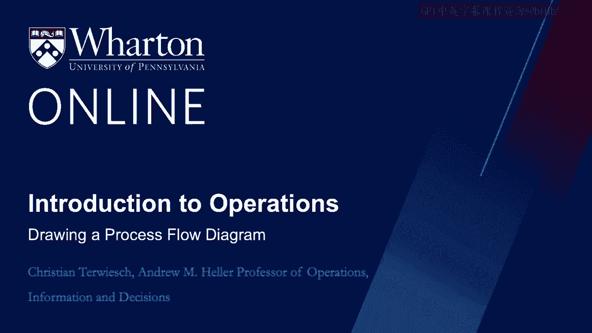
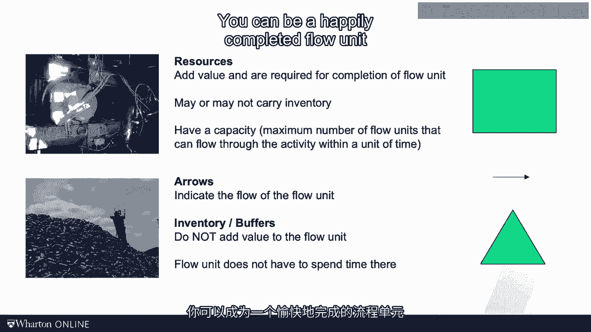
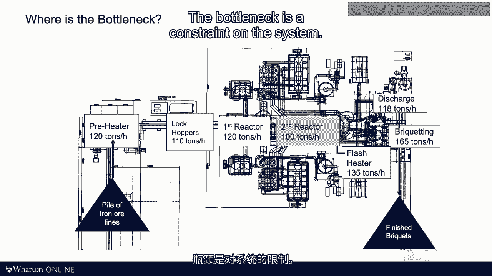

# 沃顿商学院《商务基础》｜Business Foundations Specialization｜（中英字幕） - P120：4_绘制过程流程图.zh_en - GPT中英字幕课程资源 - BV1R34y1c74c

 As we discussed in the last video， the framework that we will use to look at the world in this。

 course is process analysis。 There sounds a little dry and technical， but don't worry。

 this is really not brain surgery。 In this video I want to practice these definitions。

 Though most of my work relates to service operations， a number of years ago I did some。

 work on an iron-on processing plant。 Though the headquarters of the company we worked with was in Cleveland。

 Ohio， the plant itself， was entrinodent。 Here is a brief cut of iron ore produced by the plant。

 Let's see how it is made。 When you're landing entrinodent you actually see the plant from the airplane。

 This is a plant。 It takes iron ore finds as input and it spits out these lovely brickheads as output。

 It looks like a big monster。 The monster is a highly sophisticated plant。

 a real masterpiece of engineering。 The plant is the size of several football fields。

 I spare you the technical details。 Here you see the engineering drawings of the plant。

 It looks a bit like a blueprint when you're building a house。

 You see a number of large machines that will be the resources in all processes。

 Now in this course we look at a plant not as an engineering drawing but as a process flow， diagram。

 Remember in a process flow diagram there are boxes， arrows and triangles。

 This like the brickheading machine shown in this photo capture resources。

 Resources are adding value to the flow unit。 They help advance the flow unit on its journey。

 As we discussed in the last video resources have capacities。

 At any given moment of time some flow units are sitting in these resources。

 For example tons of iron ore will be in the reactors of the plant。 But most of the iron ore。

 the real inventory， sits at the beginning of the plant between。

 resources or at the end of the process。 This is visualized with the triangles。

 Often times we refer to those triangles as buffers。

 The key distinction setting buffers apart from resources is that they do not add value。

 The flow unit does not have to spend time at a buffer and it still can come out as a good， unit。

 You can be a happily completed flow unit and have never spent a minute in a buffer。

 So here is what the process flow diagram looks like。

 What I do here is I overlay the process flow diagram with the engineering drawings。

 You don't have to do this but I thought it would be kind of cool from a pedagogical， perspective。

 So that explains the arrangements of the boxes。 You see the input and the output。

 The pile of iron ore finds are the input and the piles of briquettes are the output。

 And then you see the main processing steps。 Starting with a preheater all the way to the briqueting machine。

 Seven steps， seven boxes。 What we want to do is to find the bottleneck。

 How much can this plan produce？ What is the process capacity？

 To answer these questions we have to find the bottleneck。

 So when looking for the bottleneck we have to look at the resources and their capacity， levels。

 In this example we have the preheater， the lock hoppers， the first reactor， the second， reactor。

 the flesh eater， the discharge and finally that briqueting machine。

 Note that the triangles are inventories and they're not in the race for being the bottleneck。

 We have to look for the resource with the lowest capacity。

 That clearly is the second reactor with the capacity of 100 tons per hour。

 So that is the bottleneck。 And that's the process capacity is 100 tons per hour。

 The chain is only as strong as its weakest link。 To find the flow rate remember the flow rate is the minimum between demand and capacity。

 Assuming there's enough iron ore to be processed and enough demand to sell this stuff our flow。

 rate would be equal to the process capacity at 100 tons per hour。 My father is an engineer。

 my brother is an engineer， I'm not。 And believe me they have reminded me many times。

 But in order to understand and improve an operation even something as complex as an iron。

 ore plant you don't necessarily need an engineering degree。 All these technical details， heaters。

 different types of reactors， heat exchangers， yes somebody， better understands how this stuff works。

 But that somebody doesn't have to be you。 Notice that at the end of the day few of these details actually matter。

 In fact for most business related calculations the single most important number is the capacity。

 at the bottleneck。 This plant produces 100 tons per hour。 That is a crucial information。

 The bottleneck is a constraint on the system。

 And as I said before the bottleneck is really the key concept in this course。

 So when you look at an operation always ask yourself where is the bottleneck。

 See you in the next video。 [BLANK_AUDIO]。